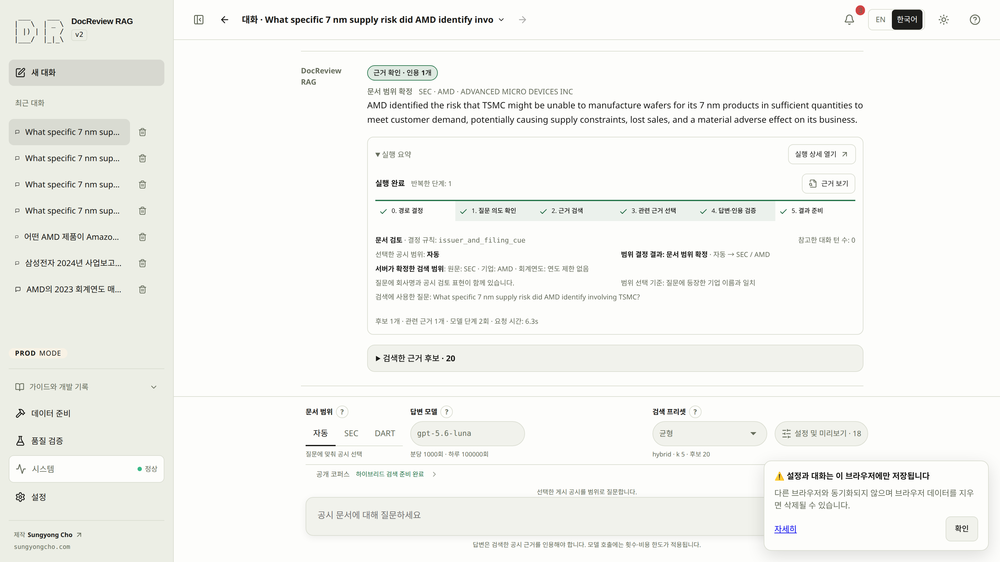

# DocReview RAG

An evidence-first bilingual RAG service for SEC 10-K and Korean DART filings. Answers must cite verified source spans — if the evidence is not in the corpus, the system returns `NOT_IN_DOCS` instead of guessing.

**[Live demo](https://sungyongcho.com/docreview-rag/)** · **[Guides (EN)](https://sungyongcho.com/docreview-rag/docs/en/)** · **[가이드 (KO)](https://sungyongcho.com/docreview-rag/docs/ko/)**



## Stack

| Layer | Tech |
|---|---|
| Retrieval | PostgreSQL + pgvector, `ts_rank_cd` / BM25, RRF fusion, optional cross-encoder rerank, Korean n-gram lexical path |
| LLM workflow | OpenAI role-pinned models, citation validation, per-call cost/token caps, fail-closed grading; local models via Ollama in dev |
| Backend | Python, FastAPI, SSE streaming, MCP stdio agent |
| Frontend | Next.js static export, TypeScript, Build / Measure / System workspaces |
| Evaluation | Golden suites, Recall@k / Hit Rate@k / MRR, cross-lingual parity, ablation matrix, immutable snapshots |
| Deployment | Firebase Hosting + GCP Compute Engine (Caddy → FastAPI → Postgres), Cloudflare Worker routing |

## Highlights

- **Citation-gated answers** — citations resolve to source SHA-256 + half-open character spans; unverifiable output cannot finish as `SUPPORTED`
- **Hybrid retrieval** — exact pgvector search fused with lexical ranking via RRF, with language-aware EN/KO routing
- **Real corpus** — SEC EDGAR 10-K (NVIDIA, AMD, …) and DART annual reports (Samsung Electronics, SK hynix, NAVER) parsed into source-stable chunks
- **Evaluation harness** — golden question sets, quick/matrix runs, cross-lingual parity gates, and snapshot comparison with no provider calls
- **Production guardrails** — per-IP rate limits, per-call cost ceilings, and a UTC daily cost cap; admin APIs are reachable only over an SSH tunnel
- 2,400+ Python tests and 1,000+ frontend tests

## Local Development

Requires [uv](https://docs.astral.sh/uv/) and Docker Compose v2.24.4+ (Node.js 24+ for web work).

```bash
git clone https://github.com/sungyongcho/docreview-rag.git
cd docreview-rag
source ./rag-alias.sh   # registers rag-* helpers in the current shell
rag-dev start          # env template, dependencies, dev stack
```

Open `http://localhost:8000/docreview-rag/`. Full walkthrough: [English](docs/TUTORIAL/en/quickstart-dev.md) · [한국어](docs/TUTORIAL/ko/quickstart-dev.md)

To try the visitor experience with a saved public deployment bundle instead of
preparing DEV data yourself:

```bash
rag-prod start --local --ready --artifacts /path/to/public-bundle
# If local PROD is already running:
rag-prod prepare --local --artifacts /path/to/public-bundle
```

Local PROD uses a separate database volume and reuses saved embeddings without
automatic downloads or paid embedding generation. Bundle validation and search
readiness must pass; starting the web server alone does not prepare data. DEV has no
`--ready`. See bundle selection, read-only checks and recovery limits in the
[English](docs/TUTORIAL/en/cli.md#local-prod-data) · [한국어](docs/TUTORIAL/ko/cli.md#local-prod-data) CLI guide.

## Project Structure

- **`app/`** — ingestion (EDGAR/DART), retrieval, LLM workflow, API, agent/MCP, release guardrails
- **`web/`** — Next.js App Router service (Ask, Build, Measure, System)
- **`data/`** — corpus manifest, golden suites, evaluation artifacts
- **`deploy/`** — GCP/Firebase deployment, Caddy config, Compose files
- **`scripts/`** — `rag-*` helper implementation, schema and ops tooling

## Deployment

```text
sungyongcho.com/docreview-rag/*
        │
Cloudflare Worker (TLS ends here)
        ├─ static UI      → Firebase Hosting
        └─ /api/* (HTTP)  → GCP VM: Caddy (Cloudflare IPs only) → FastAPI → PostgreSQL
```

Public answers run on the rate/cost budget shown in the UI. Corpus changes and evaluation runs happen only in the local operator mode over SSH.

## Documentation

- [User guides](docs/TUTORIAL.md) — paired English/Korean tutorials
- [Compose operations](deploy/docker-compose.md) and [deployment scripts](deploy/gcp/)
- [Archived README](docs/README_archive.md) — the full pre-rename operator manual
