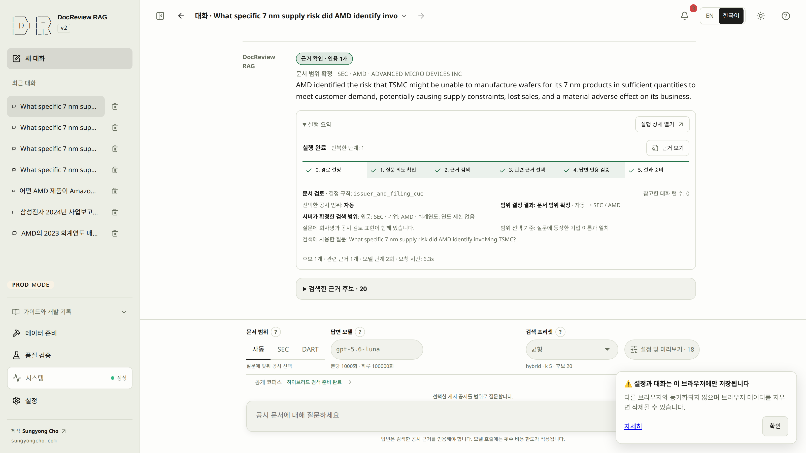

# DocReview RAG

An evidence-first bilingual RAG service for SEC 10-K and Korean DART filings. Answers must cite verified source spans — if the evidence is not in the corpus, the system returns `NOT_IN_DOCS` instead of guessing.

**[Live demo](https://sungyongcho.com/docreview-rag/)** · **[Guides (EN)](https://sungyongcho.com/docreview-rag/docs/en/)** · **[가이드 (KO)](https://sungyongcho.com/docreview-rag/docs/ko/)**



## Stack

| Layer | Tech |
|---|---|
| Retrieval | PostgreSQL + pgvector, `ts_rank_cd` / BM25, RRF fusion, optional cross-encoder rerank, Korean n-gram lexical path |
| LLM workflow | OpenAI role-pinned models, citation validation, per-call cost/token caps, fail-closed grading; local models via Ollama in dev |
| Backend | Python, FastAPI, SSE streaming, MCP stdio agent |
| Frontend | Next.js static export, TypeScript, Build / Measure / System workspaces |
| Evaluation | Golden suites, Recall@k / Hit Rate@k / MRR, cross-lingual parity, ablation matrix, immutable snapshots |
| Deployment | Firebase Hosting + shared Oracle Cloud A1 (Caddy → FastAPI → Postgres), dedicated DocReview Cloudflare Worker; GCP remains an alternative |

## Highlights

- **Citation-gated answers** — citations resolve to source SHA-256 + half-open character spans; unverifiable output cannot finish as `SUPPORTED`
- **Hybrid retrieval** — exact pgvector search fused with lexical ranking via RRF, with language-aware EN/KO routing
- **Real corpus** — SEC EDGAR 10-K (NVIDIA, AMD, …) and DART annual reports (Samsung Electronics, SK hynix, NAVER) parsed into source-stable chunks
- **Evaluation harness** — golden question sets, quick/matrix runs, cross-lingual parity gates, and snapshot comparison with no provider calls
- **Public service guardrails** — browser execution-request limits and server limits shared by Worker egress IP (10/minute, 50/rolling 24 hours), plus per-call cost ceilings and a global UTC daily AI cost cap; prod mode exposes no admin API, and administration runs in local DEV
- 2,156 Python unit tests, 35 isolated PostgreSQL tests and 1,261 frontend tests

## Local Development

Requires [uv](https://docs.astral.sh/uv/) and Docker Compose v2.24.4+ (Node.js 24+ for web work).

```bash
git clone https://github.com/sungyongcho/docreview-rag.git
cd docreview-rag
source ./rag-alias.sh   # registers rag-* helpers in the current shell
rag-dev start          # env template, dependencies, dev stack
```

Open `http://localhost:8000/docreview-rag/`. Full walkthrough: [English](docs/TUTORIAL/en/quickstart-dev.md) · [한국어](docs/TUTORIAL/ko/quickstart-dev.md)

To try the visitor experience with a saved public deployment bundle instead of
preparing DEV data yourself:

```bash
rag-prod start --local --ready --artifacts /path/to/public-bundle
# If local PROD is already running:
rag-prod prepare --local --artifacts /path/to/public-bundle
```

Local PROD uses a separate database volume and reuses saved embeddings without
automatic downloads or paid embedding generation. Bundle validation and search
readiness must pass; starting the web server alone does not prepare data. DEV has no
`--ready`. See bundle selection, read-only checks and recovery limits in the
[English](docs/TUTORIAL/en/cli.md#local-prod-data) · [한국어](docs/TUTORIAL/ko/cli.md#local-prod-data) CLI guide.

## Project Structure

- **`app/`** — ingestion (EDGAR/DART), retrieval, LLM workflow, API, agent/MCP, release guardrails
- **`web/`** — Next.js App Router service (Ask, Build, Measure, System)
- **`data/`** — corpus manifest, golden suites, evaluation artifacts
- **`deploy/`** — Oracle/Firebase/Cloudflare deployment, alternate GCP deployment, Caddy config, Compose files
- **`scripts/`** — `rag-*` helper implementation, schema and ops tooling

## Deployment

```text
sungyongcho.com/docreview-rag/*
        │
DocReview Cloudflare Worker (TLS ends here)
        ├─ static UI      → Firebase Hosting (/docreview-rag prefix retained)
        └─ /api/* (HTTP)  → docreview-api.sungyongcho.com:8880
                              Oracle A1: Caddy → FastAPI → PostgreSQL
```

The Oracle A1 instance has 2 OCPU and 12 GB RAM and is shared with gomoku's minimax
service on port `8080`; DocReview's Caddy uses `8880`. The dedicated
`deploy/cloudflare` Worker owns only `/docreview-rag` and `/docreview-rag/*` routes.
It strips `/docreview-rag/api` before forwarding API traffic and preserves the
static prefix for Firebase. Shared host provisioning remains in gomoku; DocReview
owns its application, Caddy, static site, and Worker deployment.

Before publishing changes, verify the effective attached Oracle security lists,
network security groups, and host firewall against Cloudflare's address ranges,
and confirm the peer address seen by Caddy. A Worker egress IP selects a shared
request allowance; it does not authenticate this Worker's identity. Public answers
run on the separate request and AI cost budgets shown in the UI. Corpus changes
and evaluation runs happen in the local operator environment.

## Documentation

- [User guides](docs/TUTORIAL.md) — paired English/Korean tutorials
- [Compose operations](deploy/docker-compose.md), [Oracle deployment](deploy/oracle/README.md), [DocReview Worker](deploy/cloudflare/README.md), and [alternate GCP deployment](deploy/gcp/)
- [Refactor report, September 2026](docs/refactor-2026-09.md) — what was removed and why, the module map, and how one question flows from the API to the answer ([evidence appendix](docs/refactor-2026-09-evidence.md))
- [Archived README](docs/README_archive.md) — the full pre-rename operator manual
