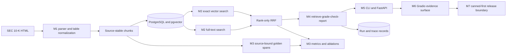

# Architecture

DocReview is organized around an evidence lineage rather than around a chat interface. Raw filing identity enters at ingestion and must survive every later transformation. Retrieval, workflow, and serving layers may add scores or decisions, but they may not reconstruct or weaken the source identity.

## System map

## Evidence contract

Every stored and returned chunk carries:

- a stable document ID and human citation;
- a half-open raw-source span, `[start_char, end_char)`;
- the SHA-256 digest of the source filing;
- a chunk kind (`text` or `table`) and normalized body; and
- a database chunk ID used for ranking and citation allow-listing.

The hash detects source replacement. The span makes the cited region reproducible. The chunk ID connects retrieval ranks, workflow decisions, API projections, and demo evidence cards without parsing answer text.

## Layer boundaries

| Layer | Owns | Does not own |
|---|---|---|
| M1 ingestion | filing structure, table markdown, spans, hashes, atomic upsert | retrieval ranking or answer generation |
| M2 retrieval | embedding boundary, exact vector/lexical candidates, filters, RRF | model judgments or score normalization across engines |
| M3 evaluation | immutable golden spans, metrics, baselines, artifacts, latency budgets | human approval or production model selection |
| M4 workflow | strict provider results, cumulative guards, citation filtering, reports | HTTP transport or database ranking algorithms |
| M5 serving | strict resources, CLI exits, dependency composition, runtime health | duplicate retrieval/workflow logic |
| M6 portfolio | evidence presentation, setup narrative, tradeoffs, demo proof | deployment hardening or inflated quality claims |
| M7 release | canned/runtime policy, bounded single-worker rate limiting, server-secret/cost guards, container proof | distributed abuse protection, account publication, or hosted uptime |

## Request flow

1. M2 embeds a normalized query, executes exact vector search, then executes PostgreSQL full-text search through the same request-owned async session. 2. The two components run sequentially because concurrent use of one SQLAlchemy async session is unsafe. 3. Reciprocal rank fusion combines positions by chunk ID. Native vector and lexical scores never enter a shared numeric scale. 4. M4 keeps whole evidence chunks within the context budget, grades relevance, and checks the answer against only approved chunk IDs. 5. Empty retrieval bypasses model calls. Malformed output, provider refusal, budget exhaustion, and unsupported answers remain typed terminal states. 6. M5 projects the same evidence identity into CLI and HTTP resources. M6 renders that projection without accepting credentials in the browser.

The M5/M6 join is a typed boundary: `RuntimeApiServices.retrieve()` returns a `RetrievalResult`, and `RuntimeDemoService` consumes its immutable `hits` tuple. The integration regression constructs that real domain type, so a test double exposing a fake `results` attribute cannot satisfy the contract. `build_demo()` still defaults to the explicitly labeled canned service; callers must inject runtime services to use the local runtime projection.

## Offline and paid-provider boundary

The repository has two deliberately different claims:

- The deterministic path is repeatable, zero-cost, and covered by ordinary acceptance.
- A live OpenAI path is opt-in and requires explicit authorization, credentials, model access, and a separately reported artifact.

`RuntimeApiServices` defaults to deterministic embeddings and has no LLM provider or provider budget. HTTP review therefore fails closed until both are injected. Credential presence alone cannot turn ordinary tests or the container into a paid review run.

## Evaluation architecture

Golden answers reference raw filing coordinates rather than chunk IDs. That separation allows 500-character and 1200-character chunking arms to be compared against the same answer evidence. The runner builds isolated temporary PostgreSQL tables, measures six strategy/size combinations, records per-case ranks and latency, and leaves populated corpus embeddings unchanged.

The design makes experiment plumbing reproducible, but the recorded deterministic vectors are hashed bags of words. The [evaluation report](eval-report.md) therefore reports low and mixed quality without choosing a production configuration.

## Deliberate tradeoffs

| Decision | Benefit | Cost or limitation |
|---|---|---|
| Exact vector search | deterministic ranking and simple verification | no approximate-index scale evidence |
| Rank-only RRF | avoids combining incompatible raw scores | adds a second query even when lexical contributes nothing |
| Whole-chunk context limits | citations always describe complete stored evidence | potentially drops partially useful text |
| One schema repair | recovers a bounded format mistake | a second failure becomes a refusal, not a guessed fallback |
| Deterministic default | offline tests and zero accidental spend | not representative of semantic embedding quality |
| Canned demo default | immediate portfolio UI with no services or secrets | synthetic evidence; not an integrated corpus result |

## Deployment boundary

M7 adds a canned-first release composition around the M6 presentation. POST-like work has bounded per-client rolling limits in one process; ingestion is read-only by default; optional OpenAI use requires runtime mode, an operator-supplied server secret, and explicit token/cost caps. Security headers wrap both application and early policy responses. Docker Space and Compose assets are built and smoked locally from a temporary clean archive.

This is deployment-ready evidence, not a published service: no external account was mutated, and the in-process limiter does not protect multiple workers or replicas. See [failure-analysis.md](failure-analysis.md), [the M6 tutorial](m6-demo/00-README.md), and [the M7 tutorial](m7-deployment/00-README.md) for operational boundaries and verification.
