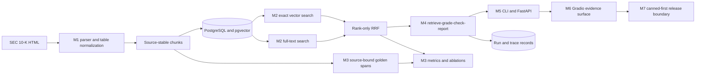

# 아키텍처

DocReview는 채팅 인터페이스가 아니라 증거 계보를 중심으로 구성된다. 원시 공시의 식별 정보는 수집 단계에서 유입되어 이후의 모든 변환에서도 보존되어야 한다. 검색, 워크플로, 서빙 계층은 점수나 판단을 추가할 수 있지만, 소스 식별 정보를 재구성하거나 약화해서는 안 된다.

## 시스템 구성도

## 증거 계약

저장하거나 반환하는 모든 청크에는 다음 정보가 포함된다.

- 안정적인 문서 ID와 사람이 읽을 수 있는 인용;
- 원시 소스의 반개방 구간 `[start_char, end_char)`;
- 원본 공시의 SHA-256 다이제스트;
- 청크 종류(`text` 또는 `table`)와 정규화된 본문;
- 순위 결정과 인용 허용 목록에 사용하는 데이터베이스 청크 ID.

해시는 소스 교체를 감지한다. 구간은 인용 영역을 재현할 수 있게 한다. 청크 ID는 답변 텍스트를 파싱하지 않고도 검색 순위, 워크플로 판단, API 표현, 데모 증거 카드를 연결한다.

## 계층 경계

| 계층 | 담당 범위 | 담당하지 않는 범위 |
|---|---|---|
| M1 수집 | 공시 구조, 표 마크다운, 구간, 해시, 원자적 업서트 | 검색 순위 또는 답변 생성 |
| M2 검색 | 임베딩 경계, 정확한 벡터/어휘 후보, 필터, RRF | 모델 판단 또는 엔진 간 점수 정규화 |
| M3 평가 | 불변 골든 구간, 지표, 기준선, 산출물, 지연 시간 예산 | 사람의 승인 또는 프로덕션 모델 선택 |
| M4 워크플로 | 엄격한 공급자 결과, 누적 가드, 인용 필터링, 보고서 | HTTP 전송 또는 데이터베이스 순위 알고리즘 |
| M5 서빙 | 엄격한 리소스, CLI 종료 코드, 의존성 조합, 런타임 상태 | 검색/워크플로 로직의 중복 구현 |
| M6 포트폴리오 | 증거 표현, 설정 설명, 트레이드오프, 데모 증명 | 배포 강화 또는 과장된 품질 주장 |
| M7 릴리스 | 미리 준비된 모드/런타임 정책, 단일 워커 범위의 제한된 속도 제한, 서버 비밀 값/비용 가드, 컨테이너 증명 | 분산형 악용 방지, 계정 게시 또는 호스팅 가동 시간 |

## 요청 흐름

1. M2는 정규화한 쿼리를 임베딩하고 정확 벡터 검색을 실행한 다음, 같은 요청 소유 비동기 세션으로 PostgreSQL 전문 검색을 실행한다. 2. 하나의 SQLAlchemy 비동기 세션을 동시에 사용하는 것은 안전하지 않으므로 두 구성 요소를 순차적으로 실행한다. 3. 상호 순위 융합은 청크 ID별 순위를 결합한다. 벡터와 어휘 검색의 고유 점수는 절대로 하나의 수치 척도에 넣지 않는다. 4. M4는 컨텍스트 예산 안에서 증거 청크 전체를 유지하고 관련성을 평가한 뒤, 승인된 청크 ID만 기준으로 답변을 검사한다. 5. 검색 결과가 비어 있으면 모델을 호출하지 않는다. 잘못된 출력, 공급자 거부, 예산 소진, 근거 없는 답변은 타입이 지정된 종료 상태로 남는다. 6. M5는 동일한 증거 식별 정보를 CLI와 HTTP 리소스에 투영한다. M6는 브라우저에서 자격 증명을 받지 않고 그 투영을 렌더링한다.

M5/M6 결합부는 타입이 지정된 경계다. `RuntimeApiServices.retrieve()`는 `RetrievalResult`를 반환하고, `RuntimeDemoService`는 그 객체의 불변 `hits` 튜플을 사용한다. 통합 회귀 테스트가 실제 도메인 타입을 생성하므로, 가짜 `results` 속성을 노출하는 테스트 대역은 계약을 충족할 수 없다. `build_demo()`는 여전히 명시적으로 표시된 미리 준비된 서비스를 기본값으로 사용한다. 로컬 런타임 투영을 사용하려면 호출자가 런타임 서비스를 주입해야 한다.

## 오프라인 경로와 유료 공급자의 경계

이 저장소는 의도적으로 서로 다른 두 가지를 주장한다.

- 결정론적 경로는 반복 가능하고 비용이 없으며 일반 승인 검증의 범위에 포함된다.
- 실제 OpenAI 경로는 명시적 동의 방식이며, 명시적인 승인과 자격 증명, 모델 접근 권한, 별도로 보고한 산출물이 필요하다.

`RuntimeApiServices`는 결정론적 임베딩을 기본값으로 사용하며 LLM 공급자나 공급자 예산이 없다. 따라서 두 항목을 모두 주입할 때까지 HTTP 검토는 안전하게 실패한다. 자격 증명이 있다는 이유만으로 일반 테스트나 컨테이너가 유료 검토 실행으로 바뀌지는 않는다.

## 평가 아키텍처

골든 답변은 청크 ID가 아니라 원시 공시 좌표를 참조한다. 이 분리 덕분에 500자 청킹 실험군과 1200자 청킹 실험군을 동일한 답변 증거에 맞춰 비교할 수 있다. 실행기는 격리된 임시 PostgreSQL 테이블을 만들고, 전략/크기 조합 여섯 개를 측정하며, 사례별 순위와 지연 시간을 기록하고, 이미 채운 코퍼스 임베딩은 변경하지 않는다.

이 설계는 실험 연결 구조를 재현할 수 있게 하지만, 기록된 결정론적 벡터는 해시된 단어 모음이다. 따라서 [평가 보고서](eval-report.md)는 프로덕션 구성을 선택하지 않은 채 낮고 일관되지 않은 품질을 보고한다.

## 의도적인 트레이드오프

| 결정 | 이점 | 비용 또는 한계 |
|---|---|---|
| 정확 벡터 검색 | 결정론적 순위와 간단한 검증 | 근사 인덱스의 확장성 증거가 없음 |
| 순위 전용 RRF | 호환되지 않는 원시 점수의 결합을 방지 | 어휘 검색이 아무 기여를 하지 않아도 두 번째 쿼리를 추가 |
| 전체 청크 컨텍스트 제한 | 인용이 항상 저장된 증거 전체를 설명 | 부분적으로 유용한 텍스트를 제외할 수 있음 |
| 한 번의 스키마 복구 | 제한된 형식 오류를 복구 | 두 번째 실패는 추측성 대체 결과가 아니라 거부가 됨 |
| 결정론적 기본값 | 오프라인 테스트와 의도치 않은 지출 방지 | 의미론적 임베딩 품질을 대표하지 않음 |
| 미리 준비된 데모 기본값 | 서비스나 비밀 없이 즉시 제공되는 포트폴리오 UI | 합성 증거이며 통합 코퍼스 결과가 아님 |

## 배포 경계

M7은 M6 표현 계층에 미리 준비된 모드 우선 릴리스 구성을 추가한다. POST 계열 작업에는 단일 프로세스에서 클라이언트별 제한된 이동식 한도를 적용하고, 수집은 기본적으로 읽기 전용이다. 선택적 OpenAI 사용에는 런타임 모드, 운영자가 제공한 서버 비밀, 명시적인 토큰/비용 상한이 필요하다. 보안 헤더는 애플리케이션 응답과 초기 정책 응답을 모두 감싼다. Docker Space와 Compose 자산은 임시 클린 아카이브에서 로컬로 빌드하고 스모크 테스트한다.

이는 배포 준비가 되었다는 증거이지 게시된 서비스가 아니다. 외부 계정은 변경하지 않았고, 프로세스 내부 제한기는 여러 워커나 복제본을 보호하지 못한다. 운영 경계와 검증은 [failure-analysis.md](failure-analysis.md), [M6 튜토리얼](m6-demo/00-README.md), [M7 튜토리얼](m7-deployment/00-README.md)을 참조한다.
