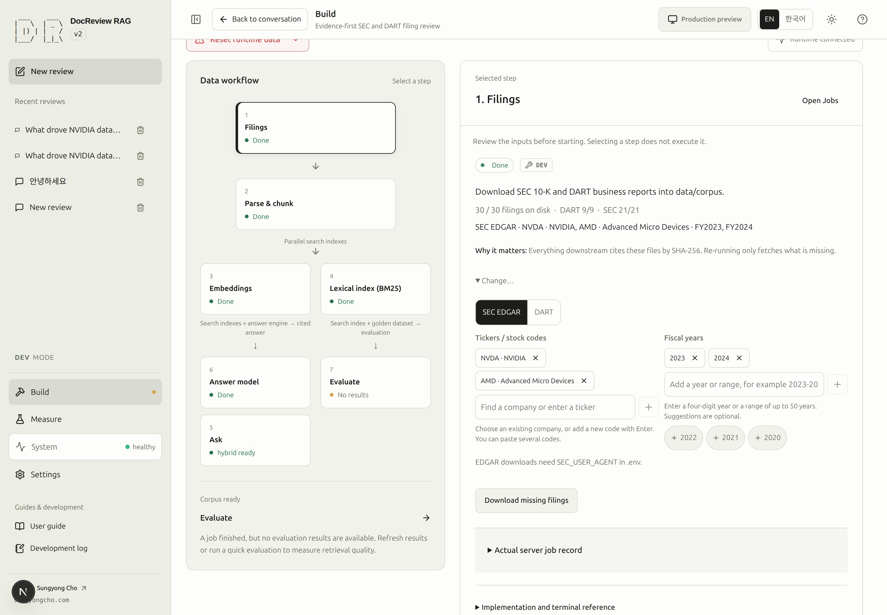

# Acquire SEC and DART filings

## Published portfolio scope

On PROD, this same company/year grid selects the next question's evidence scope. NVIDIA (NVDA) and AMD cover FY2019–2024; Samsung Electronics (005930) and SK hynix (000660) cover FY2022–2024: 18 fixed company/year pairs. Only actually published documents in this target set are selectable. Multiple filings for one pair remain distinct documents.

Selection is stored per conversation and passed as exact `doc_ids`. Select all remains bounded to this portfolio; Clear selection disables questions and search until a filing is selected. SEC/DART tabs temporarily intersect the selection, and Auto restores it. Unavailable saved documents are reported without widening the selection. No download, parsing, embedding or evaluation runs when toggling a year.

The company picker also lets visitors add the four portfolio companies to inspect their target years before publication. Unpublished years are labeled and open DEV preparation help; they never enter searchable document filters or prepared counts.

## Reference acquisition scope

The default draft contains **NVDA and AMD FY2019–2024**, plus **005930 and 000660
FY2022–2024**: exactly eighteen company/year pairs. It does not depend on existing files.
`rag-schema recreate --sample` selects NVDA and AMD FY2023–2024; neither preset downloads automatically.
Choose supported companies from the picker and add fiscal years. Edited selections, including
an empty selection, persist until the reset revision changes.

The company/year matrix shows downloaded, missing and invalid originals separately. Selection
changes describe what to prepare; they do not delete files. **Sync selection** downloads missing
or invalid originals for the selected pairs. Valid originals are reused. Multiple filings in one
year retain their distinct official receipt/accession IDs.

Step 1 manages downloads and current originals. Step 2 starts from the fully downloaded, valid
originals in that selection. Missing, changed or deleted intended sources remain explicit blockers;
parsing never silently drops them. Use **Change selection in Filings** to revise the scope.

### SCREENSHOT NEEDED

<!-- SCREENSHOT NEEDED: feature=company-year-inventory-selector; locale=en; theme=light; capture=32-document-compact-grid-search-year-checkboxes-staged-pairs-and-sync; issue=131; preserve-existing-assets=true -->

**Screenshot pending for the updated controls and resulting state. Existing screenshots are unchanged.**

> [!DEV]
> Downloading filings requires DEV. The public company/year grid selects the question scope; it cannot start server preparation work.

Acquisition downloads original reports and records their identities in the common `manifest.json`. Parsing and database
storage happen later. Check [Documents](documents.md#step-2) first: a report already prepared in this
environment does not need another download.

## 3. Choose companies and years {#step-3}

- **Goal:** define the source reports you intend to prepare.
- **Prerequisites:** [environment checks](environment.md#step-1) complete; know which reports are missing.
- **Screen:** Build → Pipeline → Filings → company/year matrix.
- **Inputs:** choose `NVDA` and `2024`, or `005930` and `2024` for a Korean report. Both sources can be selected together.
  The year is the report's fiscal year, not necessarily its publication year.
- **Primary action:** toggle year chips or company checkboxes; search a company and check years for absent pairs.
- **Visible result:** selected chips are highlighted, and **To be added** lists selected missing years and staged pairs.
- **Completion:** companies and years describe the intended source, with no invalid draft left.
- **Recovery:** correct invalid search text, press Enter, then **Sync selection**. For source
  credentials or unavailable reports, see [acquisition failures](troubleshooting.md).
- **Next:** [download missing sources](#step-4), or [parse existing sources](indexing.md#step-5).

The stable company code and filing identity remain visible. Parsing receives exact selected
document IDs, grouped by the selected company/year scope.

<!-- capture:04-sec-inputs -->

*Historical screenshot of the previous separate company/year inputs. The new matrix still needs a verified capture; this image is not evidence of its layout.*

## 4. Download only missing filings {#step-4}

- **Goal:** make the required original files available for parsing.
- **Prerequisites:** valid selections from step 3 and the [source credentials](#sources).
- **Screen:** Build → Pipeline → Filings, selected-stage execution panel.
- **Inputs:** recheck **To be added**, grouped by SEC/DART. Missing or invalid selected originals are submitted.
  Credential notes appear only for registries with missing selections; the button is disabled when every selected original is valid.
- **Primary action:** **Sync selection**.
- **Visible result:** a queued or running job appears. Open Build → Jobs to read progress and the actual result.
  Preparation status updates automatically when the job finishes; no manual refresh is needed.
- **Completion:** the job succeeds and the sources in the returned processing selection are present.
  A global stage can remain incomplete because other manifest entries still lack sources.
- **Recovery:** inspect the job error and source identity before retrying. A cancelled job differs from a
  failed job or one interrupted by a restart; only supported states offer Retry. See [job diagnosis](troubleshooting.md).
- **Next:** [parse and create chunks](indexing.md#step-5).

SEC and DART share `manifest.json`. The selected source, companies, and fiscal years define the
acquisition scope. The job result supplies a `selection_id` naming the exact acquired sources; use it
for ingestion and embedding preparation. Other catalog entries remain available without joining that
selection. The [one-filing CLI procedure](cli.md#prepare-one-nvidia-filing) uses the same contract.

## Source requirements {#sources}

| Source | Identifier | Required configuration | Typical manifest |
|---|---|---|---|
| SEC EDGAR | Ticker, for example `NVDA` | A real name and reachable email in `SEC_USER_AGENT` | `manifest.json` |
| DART | Six-digit stock code, for example `005930` | Valid `DART_API_KEY` | `manifest.json` |

Keep credentials in local configuration. Do not place them in screenshots, copied request examples,
or Git. Follow [environment setup](environment.md) when configuration must be applied. Reading these
instructions does not start acquisition or a model call.

Downloaded sources are separate from database documents, chunks, embeddings, and published snapshots.
See [the implementation map](architecture.md) for those boundaries.

## Downloaded state and the current selection

Inventory refreshes update disk status without overwriting an edited selection. Use **Select
everything on disk** to adopt the current downloaded set explicitly. **Clear selection** leaves
all files intact. Return from Parse & chunk with **Change selection in Filings**. A clean start uses
`uv run python -m scripts.schema recreate`; `--sample` presets the sample and
`--keep-sources` preserves files. Compare reset scopes in the [CLI guide](cli.md).

## Delete current originals from Filings

In step 1, choose the red **Delete all downloaded originals** button in the company basket.
It targets all registered originals, independently of the selected company/year scope. The preview lists
exact registry, company, fiscal year, filing/document IDs, relative file paths and sizes. It marks
shared or past input files that will be preserved. Nothing is deleted until **Confirm deletion of
originals**. Cancel and **Clear selection** preserve both source bytes and recorded inputs.

Confirmation queues a job; it is not a completed deletion. Read the result in **Jobs**. The preview
expires after five minutes and is single-use. Changed files/catalogs, an expired confirmation or a
service restart require a new preview. Deletion jobs do not offer blind retry. Deleted originals
must be downloaded again before a new parse. Database documents, chunks, embeddings, snapshots
and past job inputs remain available; this action does not cascade into derived data.

### SCREENSHOT NEEDED

<!-- SCREENSHOT NEEDED: feature=source-deletion; state=exact-target-preview-and-queued-result; locale=en; theme=light; issue=200; preserve-existing-assets=true -->

The selected-step heading shows a compact status icon and label. Use the adjacent refresh icon to check status; success changes the icon without adding a text row. Hover over the status for details. The separate system-connection control reports infrastructure health, not job execution. Required recovery commands remain available.

The current stage distinguishes company-directory download, filing lookup, and original-report download. SEC lookup reports each ticker and requested fiscal years; original downloads identify the company and fiscal year in the current-item row. The DART company directory is shared across all companies and has no individual fiscal year.

Current download sizes use B, KB, MB, or GB as appropriate; non-download detail counters show item counts. Download progress includes the current response byte fraction in the overall stage-weighted percentage when its total size is known. SEC originals, the DART company index, and DART originals show download speed in KB/s or MB/s, measured between received progress updates. Speed appears after two samples, resets for a new item or retry, and shows zero after five seconds without a fresh update. Unknown response sizes still allow speed measurement; 100% overall is reserved for successful completion.

Use the company search at the top of Filings. Click the input or its integrated plus button to browse supported companies, or type a company name or code to filter. Choosing a company adds it to the company basket. Each company has one card: use + beside its name to reveal only unselected fiscal years, and × to remove the company and its selected years from the basket without deleting downloaded originals. There is no year search field. Amber year chips are selected but awaiting download; green checks identify downloaded originals. Company scopes remain independent; Sync selection submits the exact chosen pairs.

Parse & chunk shows the selected scope as company cards with compact year chips. Downloaded, missing, and blocked originals have distinct indicators. Unready selected years block parsing; inspect the compact recovery details or return to step 1. Removing a company only changes the selection.

## Current files and preserved inputs

Current originals use `sec/<ticker>/<accession>/primary.html`, or `dart/<stock-code>/<receipt>/primary.xml` with
`original.zip`. Metadata retains the official URL and filename. A repeated download replaces the
same current path and registration. Each filing requires exactly one primary; DART also requires
its matching ZIP. Duplicate registrations and paths outside this layout block acquisition and parsing
until an explicit cleanup or reset. Acquisition never selects, migrates or deletes old copies.
Other catalogs and past jobs keep referenced inputs. New parse jobs pin verified bytes under
`inputs/` before queueing.

Inventory refreshes use file existence, size and modification metadata, rechecking content when a
file changes. Download completion and parse selection still verify the complete bytes. Downloads
publish through temporary files and a filesystem journal; a failed publication restores previous
bytes. An unresolved `.source-transaction` blocks selection, deletion and reset; retry acquisition
to recover a proven transaction. Foreign changes or damaged recovery evidence require inspection.

Clean start resets managed originals, pinned inputs, manifests and the draft together. It preserves
unrelated files and `--keep-sources` preserves the source set. The existing reset journal remains
available when the database or cleanup outcome is uncertain.
