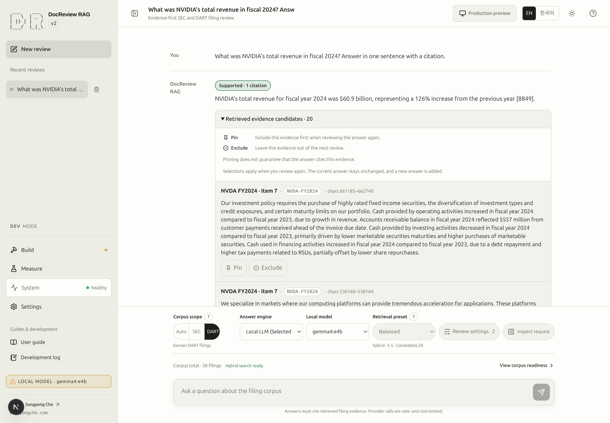

# Ask a question and verify its citations

An answer joins source selection, retrieval, evidence review, and model execution. The result can be a
supported answer, insufficient evidence (`NOT_IN_DOCS`), or an operational failure. Read those outcomes
separately instead of treating every completed request as a successful answer.

## 9. Select an engine and ask the first question {#step-9}

- **Goal:** obtain an answer whose claims can be checked against the intended filing.
- **Prerequisites:** relevant evidence found in [step 8](retrieval.md#step-8), an available answer engine,
  and valid scoped filters. Hybrid requires completed embeddings (Build step 3) and BM25 (Build step 4);
  vector requires completed embeddings, and lexical requires BM25. Pending embeddings block hybrid/vector
  sending; missing BM25 blocks hybrid/lexical sending. The composer names the required step. While its
  preparation job is queued or running, Ask shows waiting and sending stays disabled. Reuse an existing result when you only need to learn the inspection controls.
- **Screen:** New review → controls above the question → Inspect request.
- **Inputs:** choose SEC scope, an available [engine](#engines), Balanced preset, and NVIDIA/FY2024 filters
  when those values are present in the catalog. Inspect the next request before sending.
- **Primary action:** **Send question**, using the example below.
- **Visible result:** actual execution phases arrive from the server, followed by an answer and evidence
  or an explicit failure. With Auto scope, server-confirmed routing appears only when supplied.
- **Completion:** the selected document/year is correct, the cited passages support the claims, and no
  operational failure is reported. `SUPPORTED` is a prompt to inspect evidence, not a substitute for it.
- **Recovery:** distinguish `NOT_IN_DOCS` from a provider failure, node error, or run limit. Open **Run details → Trace**
  and use [runtime diagnosis](runtime.md) and [troubleshooting](troubleshooting.md).
- **Next:** [adjust settings and evidence choices](settings.md#step-10).

```text
What drove NVIDIA's data center revenue growth in FY2024? Cite evidence from the filing.
```

Sending may incur embedding, translation, and answer-model costs. The answer wording is not deterministic.
**Stop request** interrupts an active request. The UI never simulates completed stages or estimates time
remaining. Returning to an earlier phase can make later phases wait again.

The pending assistant message appears directly below your question. Its **Execution summary** shows the live stages, counts, elapsed time and **Stop request** action in that same message. Completion replaces the pending content with the answer or failure while retaining the summary; there is no separate progress card above the composer.

If no evidence meets the relevance threshold, **Verify answer and citations** is marked **Skipped: threshold not met** in a warning tone. A skipped step is different from a failed or cancelled request's unperformed step; the result-preparation stage can still complete. Older records without the reason do not invent a skipped state.

### SCREENSHOT NEEDED
<!-- Feature: live execution summary inside the pending assistant message and NOT_IN_DOCS skipped verification; locale=en; light mode; show the question, pending stages, Stop request and visible composer, plus completed threshold failure. Preserve existing assets. -->

The screenshot below predates this progress placement and is not evidence of the updated behavior.

<!-- capture:15-cited-answer -->



*An existing saved NVIDIA FY2024 answer and its retrieved source evidence are shown. It was not rerun for this guide; candidate count and the single actual citation are distinct, and old evidence selections may be read-only.*

## Choose an answer engine {#engines}

The controls follow **corpus scope → answer engine/local model → retrieval preset → Review settings →
Inspect request**. Mobile keeps scope and engine selection visible. Engine availability and corpus readiness
are separate checks; a displayed model name does not prove it is installed or callable.

> [!DEV]
> Changing the answer engine/model or configuring a local server requires DEV. Normal public questions use the configured release policy and do not need these controls.

OpenAI uses the configured answer policy and a valid local development key. Inspect current model IDs in
[CLI configuration](cli.md#installation-and-configuration); do not change a model or budget just to make
an execution appear quicker.

For Ollama, open **Settings → Local LLM**. Keep a working connection; otherwise select **Default** and use **Run connection diagnostics** to inspect the backend connection and answer-model availability. Choose **Connect** only when you intend to apply that server, then select an installed answer-capable model in the conversation. **Add a server…** is for a named alternate endpoint, not a required setup step.

The [macOS/Linux Ollama guide](ollama.md#connect) explains installation, network access, and recovery. Diagnostics do not generate an answer or load a model. Embedding-only models cannot answer questions; a production preview can intentionally disable local models. See [settings](settings.md#local-server) and [runtime](runtime.md#local-models) for the configuration and measured-state boundaries.

## Inspect scope, evidence, and the request {#inspection}

The scope/preset question-mark controls respond to hover, focus, touch, and Escape. Auto keeps the selected
scope separate from the actual registry, companies, fiscal years, and reason returned by the server.
Before resolution it is unconfirmed; the browser does not invent that decision.

Use **Settings and preview** to edit Filters, Search, Evidence, or Run limits in one independent editor.
Choosing Custom opens its Search section directly. Close the editor before using the separate
**Settings and preview → Preview** icon and short label in the primary control row; it only reads the next request.

Inspect request is a side drawer on wide screens and a full-screen dialog on narrow
screens. It scrolls independently and returns focus when closed. It separates retrieval, filters, engine,
prompt composition, and outgoing payload. Evidence is unresolved before execution; server-applied values
belong to the resulting execution record, when collected.

Expand **Retrieved evidence candidates** to see one collapsed card per candidate, titled by its filing
section: `Item 7 - (Management's Discussion and Analysis)` for EDGAR filings, the division name such as
`II. 사업의 내용` for DART filings, and the bare citation label when no title is known. The header also
carries the document id, a table badge and the character span; open a card to read the excerpt and its
full citation. Five cards show per page. The sticky toolbar always shows the visible range, the pinned and
excluded counts, **Expand all** / **Collapse all** and, beyond one page, arrow buttons with **Previous page** / **Next page** labels and a `1/3` page position.
Pinned cards start open; every other card starts closed. Pin/Exclude sit in each header, so they work on
collapsed cards and across pages. Candidate count and citation count measure different things.
Pin/Exclude choices apply only when you [review again with selected evidence](settings.md#step-10); they
do not rewrite the current answer.

### SCREENSHOT NEEDED

<!-- SCREENSHOT NEEDED: feature=collapsed-titled-paginated-evidence-candidates; locale=en; theme=light; capture=collapsed-cards-with-section-titles-toolbar-and-pager; issue=67; preserve-existing-assets=true -->

**Screenshot pending for the collapsed, section-titled candidate cards with the toolbar and pager. Existing screenshots remain unchanged.**

Click the corpus status line (**Corpus total · N filings**) to inspect preparation and **Back** to return to the retained
draft, profile, messages, and scroll. [Execution performance](runtime.md) explains measured bars, repeated
calls, uncollected fields, and legacy records.

For CPU-only local models, use the optional [CPU starting preset and hardware guidance](ollama.md#cpu-starting-preset). Existing defaults remain unchanged; apply a preset explicitly and inspect the next run’s timings.

### Reading the actual model-call limit

A run has both conversation Run limits and a server provider allowance. The smaller token allowance applies to the call. A provider stop now names input tokens, output tokens or estimated cost with the observed and allowed values; it does not assume every provider budget failure is an input-token failure. The failure action opens Run limits when that setting supplied the smaller ceiling, or System status when the server provider allowance did. Older records without a known source do not guess a settings destination.

For example, an output of `600 / 600` followed by a JSON validation error means the provider could not repair that output within its remaining allowance. Raising the conversation's input budget does not address that output ceiling. Check the applied provider limits and the original validation details before retrying.

A `provider_failure` whose `budget` carries `projected_input_tokens` was refused before the call: the prompt was estimated against the remaining input allowance and nothing was sent or billed. The execution record keeps the projection with zero sent requests and no usage; a repair refused after a first response keeps exactly that one request.

The execution record also retains the effective limits and their source, routing queries, candidate ranks, stage results, provider identity and available timing. Chat-only runs explicitly have no retrieval settings. Historical fields that were never recorded remain absent; a later run cannot reconstruct their measurements.

### Live stage delivery

The review stream preserves each server event through the development proxy.
Its `Cache-Control: no-store, no-transform` response prevents intermediary compression
from buffering small stage events until the model call finishes. A stage appears only
after the server emits it; a slow model call does not hold back earlier completed stages.

### Path decision and conversation follow-ups

Every execution starts with **0. Path decision**, including conversation replies. The
record shows review/chat, the deterministic rule or classifier, the matched rule, and
how many recent turns were considered. Follow-ups such as “What about Samsung?” or
“And 2024?” can continue a filing review. The configured history limit also applies to
routing; setting it to zero sends no previous messages.

Selected scope and server-resolved scope remain separate: Auto can resolve to SEC/NVDA
or DART/005930, while pinned scope constrains the registry. The scope outcome badge
shows resolved, conflict, empty, or no retrieval. Routing queries disclose each registry's
search text. A scope conflict or empty scope stops the request with its reason; when
suggested, use **Switch to Auto and restore question**, then resend from the composer.

Conversation replies show **No retrieval** and skipped retrieval/selection/verification
steps. Model-step totals use recorded model calls, including classification and chat,
while candidates and relevant evidence remain zero.

### SCREENSHOT NEEDED
<!-- Feature: path decision; state: completed context-aware review, chat-only reply, and scope conflict with Auto action; locale: en; evidence: first step, selected/resolved scope, routing queries, skipped phases and actual model calls in light mode. -->

### Explore a stage or open run details

The execution summary stays with its answer. Select a recorded stage, including **Path decision**,
to expand its recorded scope, ranked candidates, kept/rejected evidence, verification or
result. One stage panel is open at a time; select it again to collapse it. Missing historical
fields are listed together under **Not recorded for this run**. A stage with no recorded fields shows one short note.
The open stage has an underline and a bottom marker; hovering or focusing a selectable stage
underlines its title. Waiting and unreached stages are inert. Failed, cancelled, skipped,
completed and currently running stages remain selectable. Enter or Space toggles a focused stage.

Stage details display source badges, company/year chips, measured timings with units and model-call
tables instead of inline JSON. Company names come from the existing live or published document
catalog when the scope panel is first opened; recorded codes and run scope remain unchanged.
Unknown or ambiguous names keep the original code. A lookup failure is stated beside the panel.
**None** means a recorded empty collection; a dash or the consolidated unrecorded-label line means
an absent value. The panel grows inside the message column. Its heading identifies the strip stage
and corresponding server node codes. Repeated node timings share one row with their pass count
and total elapsed time; expand **Recorded passes** to inspect each pass in collection order.
An incomplete duration record does not produce a partial total. Status labels retain their raw codes.
**Ranked candidates (N)** starts closed. Open it for five rows per page, using the same arrow pager
as other recorded tables and evidence cards. Scores use four significant digits with the full value
on hover; citations stay in one chip and document/chunk IDs use code font.
**Open run details** and **Show evidence** (when evidence exists) are beside the execution heading,
even with every stage closed. Opening details from a selected stage opens **Performance** and
highlights its recorded nodes without hiding the other stages or passes.

Use **Run details** for the right-side **Performance**, **Server settings** and **Trace** tabs.
The `Q. <question>` heading and short message ID identify the selected answer. Reopening an
answer restores its last tab. The edge control collapses or expands the panel; Escape, the
close button, or clicking the conversation/composer closes it without discarding the draft.
Help and run details share the right side and never open together. OpenAI calls show available
request/token facts without an empty server-timing disclosure. Ollama timings and placement
appear only when recorded.

### SCREENSHOT NEEDED

<!-- Feature: issues 140/141/157/158 selected execution strip, grouped ordered timing passes, heading actions, highlighted inspector stage, and five-row candidate/evidence pagination; show SEC/DART company names and FY chips, empty versus unrecorded values, timings with units and model table, collapsed ranked candidates and arrow pagers, and raw run-details access; locale=en; light mode; show expanded evidence stage beside the Q. heading and Performance tab, with composer visible. Preserve existing assets. -->

### SCREENSHOT NEEDED
<!-- Feature: Ask blocked on step 3 with pending embeddings, waiting during backfill, blocked on step 4 without BM25, and lexical-only Ask ready with BM25 despite pending embeddings; locale=en; light mode; preserve existing assets. -->


For manifest metadata failures, the strip marks the actual failing stage: stage 0 before a path decision, stage 1 during subsequent scope resolution. DEV provides the cause, file and one recovery action; see [manifest diagnosis](troubleshooting.md#manifest-scope). The original technical detail stays in **Run details → Trace**.

### SCREENSHOT NEEDED
<!-- Feature: failed-answer manifest diagnosis and stage-zero attribution; locale=en; light mode; show localized headline, diagnosis and stages 1-5 not run. -->

A review that finishes or fails while you are on another workspace produces a bell notification linked to its conversation. Opening it marks it read and returns to the original conversation. The existing execution summary remains the place to inspect the failure or result; opening the center does not repeat the request. See the [notification center](runtime.md#notification-center).

### SCREENSHOT NEEDED
<!-- Feature: background review completion/failure notification returning to its original conversation; locale=en; light mode; show the same persisted message and no repeated request. -->

### Inspecting an execution

Use **Open run details** on the right of **Execution summary**; it remains available
when the summary is collapsed. The inspector overlays the conversation and composer
without narrowing them. A light gray backdrop pauses interaction with the covered
content. Close the inspector, click the backdrop, or press Escape to return. Your draft and conversation remain intact.

An unstarted draft is represented by **New chat**, not a recent-conversation row.
Repeated clicks reuse an available empty draft. The conversation appears in the recent
list with its delete action after the first message is sent.
