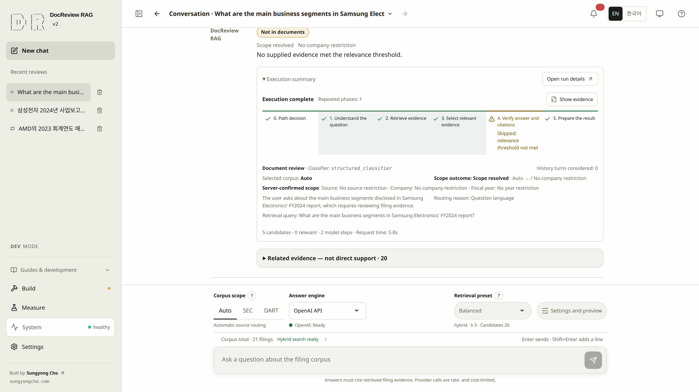
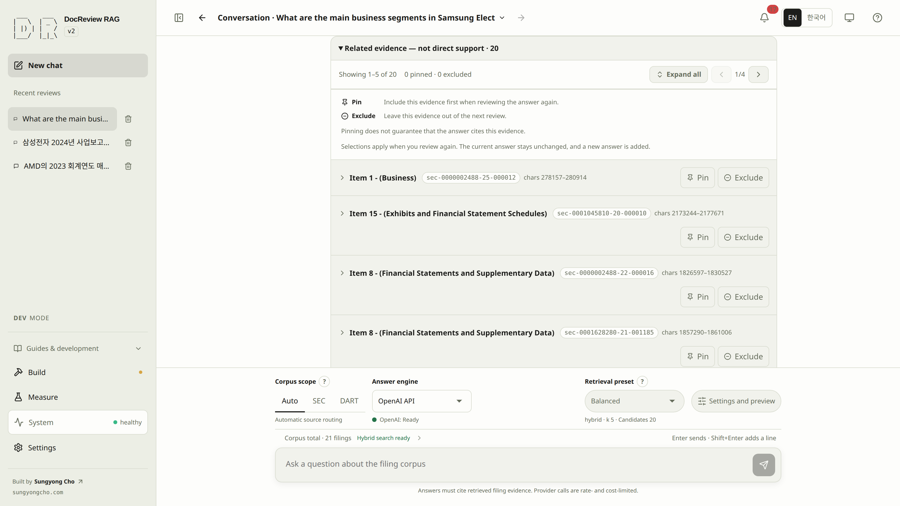
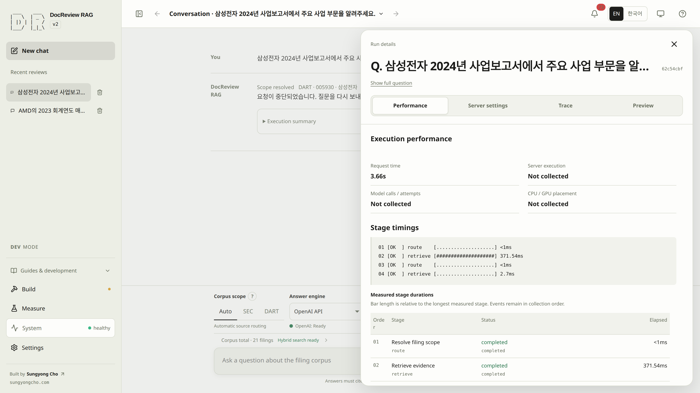

# Ask a question and verify its citations

Ask questions about prepared filings and check each claim against its cited passage. Distinguish **supported answers, insufficient evidence, scope guidance and execution errors**: a finished request is not by itself a verified answer.

> [!GOAL]
> Send one scoped question and verify the answer against the cited filing text.
>
> **Prerequisites** relevant evidence and an available answer engine from step 8 · **Done** a supported answer or an explicitly diagnosed failure

Build selection, conversation settings, next-request preview, and Search trial share the effective published document scope. A sparse selection such as NVDA FY2023 and AMD FY2024 never adds NVDA FY2024 or AMD FY2023. Answers and citations use actual retrieval within the existing public request limits, and returning to an old answer retains its recorded scope.

## Select an engine and ask the first question {#step-9}

Enter sends the question; Shift+Enter inserts a line break. Enter used to confirm an IME composition, such as Korean text, does not send. An **Unsupported request** badge identifies a service-scope stop, distinct from **Not in documents**. Expand **Execution summary** to read the routing explanation and scope facts; **Open run details** remains a separate action.

Stage **0. Path decision** shows three service paths and highlights only the server's recorded choice: document analysis continues to stage 1; service help and unsupported requests end with guidance. These cards explain the decision and are not controls. Stage **1. Understand the question** retains the company, year, and filing-scope details. Missing or historical route data is identified explicitly.

The first screen identifies each example's **SEC** or **DART** source separately from its question language. Both sources include English and Korean examples, with the full question visible. Selecting an example fills and focuses the composer; edit it and send when ready. The example category does not change your selected filing scope. The `NOT_IN_DOCS` badge in the introduction explains a possible outcome, not a completed review.


**Answers follow the language of your question by default.** A Korean question can use English SEC evidence and receive a Korean answer; an English question can use Korean DART evidence and receive an English answer. Only an explicit request for another response language changes this rule. The original question remains the language reference when search wording is rewritten; the interface language does not choose the answer language. Verbatim source quotations stay in their original language.

1. Confirm readiness: [step 8](retrieval.md#step-8) found relevant evidence, an available answer engine, and valid scoped filters. Hybrid requires completed embeddings (Build step 3) and BM25 (Build step 4); vector requires completed embeddings, and lexical requires BM25. Pending embeddings block hybrid/vector sending, and missing BM25 blocks hybrid/lexical sending; the composer names the required step. While its preparation job is queued or running, Ask shows waiting and sending stays disabled. Reuse an existing result when you only need to learn the inspection controls.
2. In **New review**, choose the SEC scope, an available [engine](#engines), the Balanced preset, and NVIDIA/FY2024 filters when those values are present in the catalog.
3. Inspect the next request, then select **Send question** once, using the example below.
4. Follow the actual execution phases as the server sends them; the run ends with an answer and evidence, stage scope or service guidance, or an explicit failure. With Auto scope, server-confirmed routing appears only when supplied.
5. Verify the result: the selected document and year are correct, the cited passages support the claims, and no operational failure is reported. `SUPPORTED` is a prompt to inspect evidence, not a substitute for it.
6. If the run does not support an answer, distinguish a stage scope notice, `NOT_IN_DOCS`, a provider failure, a node error, and a run limit. Open **Run details → Trace** and use [runtime diagnosis](runtime.md) and [troubleshooting](troubleshooting.md).
7. Continue with [settings and evidence choices](settings.md#step-10).

```text
What drove NVIDIA's data center revenue growth in FY2024? Cite evidence from the filing.
```

Sending may incur embedding, translation, and answer-model costs; the answer wording is not deterministic. **Stop request** interrupts an active request. The UI never simulates completed stages or estimates time remaining. Returning to an earlier phase can make later phases wait again.

The pending assistant message appears directly below your question. Its **Execution summary** shows the live stages, counts, elapsed time and **Stop request** action in that same message. Completion replaces the pending content with an answer, a guidance notice, or a failure while retaining the summary; there is no separate progress card above the composer.

A request that stops before retrieval shows scope guidance, not an evidence verdict or a failure — rephrase it as a filing-analysis question or switch to a provided company, year, and scope, then resend. [Path decision](#path-decision) explains those early endings; a recorded classification call can still be billed on an early stop.

If no evidence meets the relevance threshold, **Verify answer and citations** is marked **Skipped: relevance threshold not met** in a warning tone. A skipped step is different from a failed or cancelled request's unperformed step; the result-preparation stage can still complete. Older records without the reason do not invent a skipped state.

<!-- screenshot: live-execution-summary-and-skipped-verification -->



## Choose an answer engine {#engines}

The controls follow **corpus scope → answer engine/local model → retrieval preset → Review settings → Inspect request**. Mobile keeps scope and engine selection visible. Engine availability and corpus readiness are separate checks; a displayed model name does not prove it is installed or callable.

> [!DEV]
> Changing the answer engine/model or configuring a local server runs in DEV mode only. Normal public questions use the configured release policy and do not need these controls.

OpenAI uses the configured answer policy and a valid local development key. Inspect current model IDs in [CLI configuration](cli.md#installation-and-configuration); do not change a model or budget just to make an execution appear quicker.

For Ollama, open **Settings → Local LLM**. Keep a working connection; otherwise select **Default** and use **Run connection diagnostics** to inspect the backend connection and answer-model availability. Choose **Connect** only when you intend to apply that server, then select an installed answer-capable model in the conversation. **Add a server…** is for a named alternate endpoint, not a required setup step.

The [macOS/Linux Ollama guide](ollama.md#connect) explains installation, network access, and recovery. Diagnostics do not generate an answer or load a model. Embedding-only models cannot answer questions; PROD does not support local answer models. See [settings](settings.md#local-server) and [runtime](runtime.md#local-models) for the configuration and measured-state boundaries.

## Inspect scope, evidence, and the request {#inspection}

The scope/preset question-mark controls respond to hover, focus, touch, and Escape. Auto keeps the selected scope separate from the actual registry, companies, fiscal years, and reason returned by the server. Before resolution it is unconfirmed; the browser does not invent that decision.

Open **Settings and preview**, then choose **Filters**, **Search**, **Evidence**, **Run limits**, or **Preview** directly. DEV can edit evidence and budgets; PROD shows those server policies read-only. Search contains preset selection and explanations. Tab changes retain unfinished filter input; closing the drawer discards unfinished text while keeping selected filters.

**Preview** in the same drawer summarizes the next question, engine, selected filters, search values, and evidence/run policy. Its links return to the relevant settings section without sending. Automatic scope resolution and actual evidence remain pending until execution; optional details explain prompt composition and show request JSON. The drawer scrolls independently, fills narrow screens, and returns focus when closed.

Expand **Retrieved evidence candidates** to see one card per candidate, titled by its filing section: `Item 7 - (Management's Discussion and Analysis)` for EDGAR filings, the division name such as `II. 사업의 내용` for DART filings, and the bare citation label when no title is known. The header also carries the document id, a table badge and the character span; open a card to read the excerpt and its full citation. Pin/Exclude sit in each header and apply only when you [review again with selected evidence](settings.md#step-10); they do not rewrite the current answer. Candidate count and citation count measure different things.

<!-- details: evidence-cards | Card paging and selection behavior -->
Five cards show per page. The sticky toolbar always shows the visible range, the pinned and excluded counts, **Expand all** / **Collapse all** and, beyond one page, arrow buttons with **Previous page** / **Next page** labels and a `1/3` page position. Pinned cards start open; every other card starts closed. Pin/Exclude work on collapsed cards and across pages.
<!-- /details -->

<!-- screenshot: collapsed-titled-paginated-evidence-candidates -->



Click the corpus status line (**Corpus total · N filings**) to inspect preparation and **Back** to return to the retained draft, profile, messages, and scroll. [Execution performance](runtime.md) explains measured bars, repeated calls, uncollected fields, and legacy records.

For CPU-only local models, use the optional [CPU starting preset and hardware guidance](ollama.md#cpu-starting-preset). Existing defaults remain unchanged; apply a preset explicitly and inspect the next run's timings.

<!-- heading-alias: reading-the-actual-model-call-limit -->
### Reading the actual model-call limit {#model-call-limits}

A run has both conversation Run limits and a server provider allowance. The smaller token allowance applies to the call. A provider stop now names input tokens, output tokens or estimated cost with the observed and allowed values; it does not assume every provider budget failure is an input-token failure. The failure action opens Run limits when that setting supplied the smaller ceiling, or System status when the server provider allowance did. Older records without a known source do not guess a settings destination.

For example, an output of `600 / 600` followed by a JSON validation error means the provider could not repair that output within its remaining allowance. Raising the conversation's input budget does not address that output ceiling. Check the applied provider limits and the original validation details before retrying.

A `provider_failure` whose `budget` carries `projected_input_tokens` was refused before the call: the prompt was estimated against the remaining input allowance and nothing was sent or billed. The execution record keeps the projection with zero sent requests and no usage; a repair refused after a first response keeps exactly that one request.

The execution record also retains the effective limits and their source, routing queries, candidate ranks, stage results, provider identity and available timing. Chat-only runs explicitly have no retrieval settings. Historical fields that were never recorded remain absent; a later run cannot reconstruct their measurements.

<!-- heading-alias: live-stage-delivery -->
### Live stage delivery {#live-stages}

The review stream preserves each server event through the development proxy. Its `Cache-Control: no-store, no-transform` response prevents intermediary compression from buffering small stage events until the model call finishes. A stage appears only after the server emits it; a slow model call does not hold back earlier completed stages.

<!-- heading-alias: path-decision-and-conversation-follow-ups -->
### Path decision and conversation follow-ups {#path-decision}

Every execution starts with **0. Path decision**, which accepts company/financial filing analysis and limited service guidance. General conversation and role-play such as "Talk to a cat" stop here with a service-scope notice, without a free-form model answer. Rephrase the request as filing analysis and resend. Follow-ups such as "What about Samsung?" or "And 2024?" can continue a filing review; the configured history limit also applies to routing, and setting it to zero sends no previous messages.

**1. Understand the question** checks the requested company, year, and selected scope against the actual provided filing catalog. "SanDisk growth drivers" reaches this stage as a company-analysis question; if SanDisk is absent, it stops with a missing-company notice. An unprovided company is not a wrong question and does not mean the company does not exist; a missing company never broadens the search to all filings, substitutes another company, or triggers an answer from model knowledge. When you receive a notice, switch to a provided company, year, and scope and resend.

<!-- details: routing-record | What the routing record and scope outcome show -->
The record shows the intent, deterministic rule or classifier, matched rule, and how many recent turns were considered.

Selected scope and server-resolved scope remain separate: Auto can resolve to SEC/NVDA or DART/005930, while pinned scope constrains the registry. The scope outcome badge shows resolved, conflict, empty, or no retrieval. Routing queries disclose each registry's search text. A scope conflict or empty scope stops the request with its reason; when suggested, use **Switch to Auto and restore question**, then resend from the composer.

A model can identify a company name in the question, but the server verifies filing availability against the real catalog. A supported alias such as NVIDIA can resolve to the NVDA company in the corpus. Ambiguous companies require clarification; a mixture of available and missing companies names the missing companies before asking for a valid scope. A requested year or selected scope that matches no provided filing also stops before retrieval.

Greetings, thanks, and usage questions receive fixed service guidance at stage 0. Expected stops show their stage and reason, with all subsequent stages **Not performed in this request**, including citation verification and result preparation. They are distinct from technical failures such as an unavailable catalog or classifier timeout. DEV and PROD use the same policy. Historical conversation replies retain their original recorded behavior; model-step totals always use actual recorded calls.
<!-- /details -->

### SCREENSHOT NEEDED
<!-- Capture early scope stops: stage 0 unsupported role-play and stage 1 missing-company SanDisk question, English locale, light mode. Show localized guidance and all downstream stages not performed. -->

<!-- screenshot: routing-unsupported -->

<!-- screenshot: routing-missing-company -->

<!-- heading-alias: explore-a-stage-or-open-run-details -->
### Explore a stage or open run details {#stage-details}

The execution summary stays with its answer. Select a recorded stage, including **Path decision**, to expand its recorded scope, ranked candidates, kept/rejected evidence, verification or result. One stage panel is open at a time; select it again to collapse it. The open stage has an underline and a bottom marker; hovering or focusing a selectable stage underlines its title, and Enter or Space toggles it. Waiting and unreached stages are inert; failed, cancelled, skipped, completed and currently running stages remain selectable. Missing historical fields are listed together under **Not recorded for this run**; a stage with no recorded fields shows one short note.

Stage details display source badges, company/year chips, measured timings with units and model-call tables instead of inline JSON. The panel grows inside the message column, and its heading identifies the strip stage and corresponding server node codes. **Open run details** and **Show evidence** (when evidence exists) are beside the execution heading, even with every stage closed. Opening details from a selected stage opens **Performance** and highlights its recorded nodes without hiding the other stages or passes.

<!-- details: stage-panel | Reading values inside a stage panel -->
Company names come from the existing live or published document catalog when the scope panel is first opened; recorded codes and run scope remain unchanged. Unknown or ambiguous names keep the original code, and a lookup failure is stated beside the panel. **None** means a recorded empty collection; a dash or the consolidated unrecorded-label line means an absent value.

Repeated node timings share one row with their pass count and total elapsed time; expand **Recorded passes** to inspect each pass in collection order. An incomplete duration record does not produce a partial total. Status labels retain their raw codes. **Ranked candidates (N)** starts closed; open it for five rows per page, using the same arrow pager as other recorded tables and evidence cards. Scores use four significant digits with the full value on hover; citations stay in one chip and document/chunk IDs use code font.

OpenAI calls show available request/token facts without an empty server-timing disclosure. Ollama timings and placement appear only when recorded.
<!-- /details -->

Use **Run details** for the right-side **Performance**, **Server settings** and **Trace** tabs. The `Q.` heading with the selected question and the short message ID identify the answer. Reopening an answer restores its last tab. The edge control collapses or expands the panel; Escape, the close button, or clicking the conversation/composer closes it without discarding the draft. Help and run details share the right side and never open together.

<!-- screenshot: selected-stage-details-and-run-details -->



For manifest metadata failures, the strip marks the actual failing stage: stage 0 before a path decision, stage 1 during subsequent scope resolution. DEV provides the cause, file and one recovery action; see [manifest diagnosis](troubleshooting.md#manifest-scope). The original technical detail stays in **Run details → Trace**.

A review that finishes or fails while you are on another workspace produces a bell notification linked to its conversation. Opening it marks it read and returns to the original conversation. The existing execution summary remains the place to inspect the failure or result; opening the center does not repeat the request. See the [notification center](runtime.md#notification-center).

<!-- heading-alias: inspecting-an-execution -->
### Inspecting an execution {#inspector}

Use **Open run details** on the right of **Execution summary**; it remains available when the summary is collapsed. The inspector overlays the conversation and composer without narrowing them. A light gray backdrop pauses interaction with the covered content. Close the inspector, click the backdrop, or press Escape to return. Your draft and conversation remain intact.

An unstarted draft is represented by **New chat**, not a recent-conversation row. Repeated clicks reuse an available empty draft. The conversation appears in the recent list with its delete action after the first message is sent.
