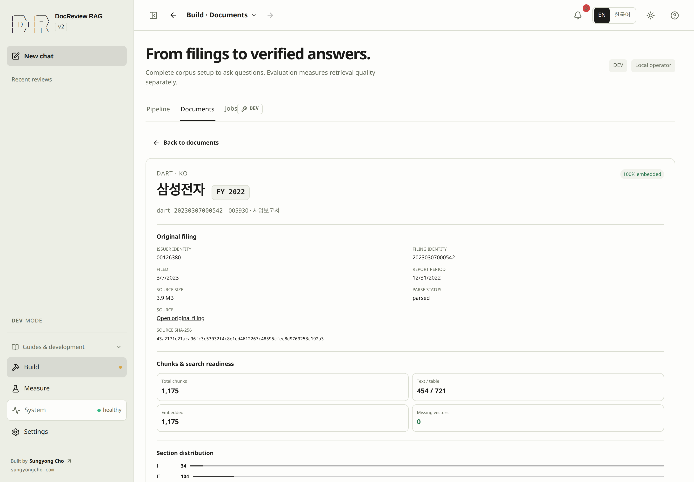

# Documents and corpus readiness

## Portfolio document inventory

The PROD inventory uses the same fixed published portfolio set as Filings. Open a document to inspect real chunk text and citations. A missing publication does not mean its DEV source was deleted. Publishing the prepared target documents is a separate operator action.

Use Documents to connect a company and fiscal year to a specific original filing,
its stored chunks, and its indexing state. The list and details answer different
questions: the list finds a filing; the details establish what has actually been
prepared for that source.

## 2. Inspect the existing corpus {#step-2}

> [!GOAL]
> Identify work you can reuse and the first preparation step that is still missing.
>
> **Prerequisites** [Environment verification](environment.md#step-1) · **Done** the intended source and its missing preparation are identified, or the catalog is confirmed empty.

Open sidebar **Build → Documents**, or select the Documents tab in Build if you arrived from a conversation's corpus status line. Search for a document ID, issuer, or stock code that belongs to the filing you want to inspect; `sec-0001045810-24-000029` is an example document ID, not a record guaranteed to exist. Company and Fiscal year narrow the catalog using available values, so leave them unrestricted if you are still exploring what is present. Existing documents are useful but not required: a confirmed empty catalog is a valid starting state.

1. Select a matching document row or its document name. The list starts at full width before selection and does not preselect the first filing.
2. Read the details: original filing identity, source link when available, chunk counts, embedding identities, snapshot membership, and related work. The detail header makes the company name and **FY** badge prominent, with the stable document ID, issuer code, and form underneath; if a company name is unavailable, the identifier remains visible and the interface does not invent a name.
3. Check the missing preparation in the table below. A positive embedding count is not enough: inspect the recorded embedding identity, and check BM25 in Pipeline even when the document's embedding coverage is complete.
4. If no document exists, wait for loading to finish and confirm the empty state after clearing filters. Proceed to acquisition instead of selecting an unrelated record. No matches can mean active filters, no ingested data, or no published data in public mode, so follow [visibility](#visibility) and remove the relevant filter chips; a load error is not an empty catalog, so use **Retry** or **Retry filters** and follow [Troubleshooting](troubleshooting.md) if it persists.

*Use the detail panel to confirm the filing identity and the stored chunk and embedding counts, then continue with the preparation step named below.*

| Inspect | What it tells you | Next missing work |
|---|---|---|
| Company, fiscal year, source and filing identity | Whether this is the intended original report. | Correct the search or [choose acquisition inputs](acquisition.md#step-3). |
| Total chunks and source-cited previews | Whether parsed, citable content is stored. | [Parse and chunk](indexing.md#step-5) if chunks are missing. |
| Embedded, missing vectors, and embedding identities | How much has vectors and which provider/model/dimensions produced them. | [Verify embeddings](indexing.md#step-6) against the current configuration. |
| Pipeline lexical readiness | Whether the BM25 preparation path is ready. | [Inspect BM25](indexing.md#step-7). |
| Snapshot membership | Which recorded snapshots include this document. | [Read snapshot visibility and reuse](snapshots.md). |

The detail panel's **Next step** opens the relevant Pipeline stage, and **Open Jobs** shows related preparation records. Opening either view does not start the operation. Other companies and years do not need to be deleted to complete this check.

Choose [source, companies, and years in step 3](acquisition.md#step-3) next. When those originals already exist, skip the matching download and continue with the first missing [indexing](indexing.md) step; if both retrieval paths are prepared, continue to [step 8: retrieval](retrieval.md#step-8).

## Search and filters {#filters}

The primary toolbar contains Search, Company, Fiscal year, and **Filters**. Expand
Filters for Registry, Language, Form, Parse status, Embedding, Snapshot membership,
grouping, and sorting. These controls filter the catalog; they are not acquisition inputs.

Applied filters appear as removable chips. Remove one chip to widen that condition,
or use **Reset filters** to clear the current filtering. A selected document excluded
by a later filter is identified explicitly; clear filters or select another document.
Do not interpret the exclusion message as deletion of the original document.

Company labels use the available source metadata. Codes remain the actual request
and filter values; a missing or conflicting company name can leave only the code.
Fiscal year describes the report's fiscal period, which need not match the calendar
year in its filing date. Read the report period and filing date in details.

## Lists, details, and returning to work {#navigation}

When the actual content area reaches 1100 px, selecting a document opens a split view.
The list starts at 360 px and can be resized from 320 to 600 px while leaving at least
560 px for details. Drag the separator, or focus it and use arrow keys; Shift makes
larger changes, Home and End select the available limits, and double-click resets it.
Documents and Jobs remember their widths independently.

On narrower screens, details replace the list. **Back to documents** returns with
the search, filters, selection, and list scroll retained. Tab changes and navigation
between workspaces keep the relevant state during the session. When returning to a
conversation after a readiness check, use the explicit **Back** action.

Preparation-related errors offer **Inspect this step** to open the relevant pipeline stage. Inspect the prerequisite and any terminal work there, then return and refresh Documents. Following the link does not ingest, embed, rebuild an index, or mark a failed request complete.

## Development and public visibility {#visibility}

> [!DEV]
> Unpublished filings and administrator metadata are visible only in DEV. Public lists and details follow ready, published snapshot membership.

The development catalog can show documents that have not been published. The public
catalog is restricted to documents belonging to ready, public snapshots; its counts,
company options, and document details use that public boundary.

An empty public catalog therefore does not establish that the operator's database is
empty. A private or unready snapshot does not make its documents public. Public users
cannot use document preparation actions or inspect unpublished source metadata through
the catalog. Read [Snapshots](snapshots.md) before interpreting snapshot membership as
public availability.

System and Pipeline summaries can describe a broader corpus than the currently
filtered list. Read the summary's scope label before comparing its count to your SEC,
DART, company, or year selection.
