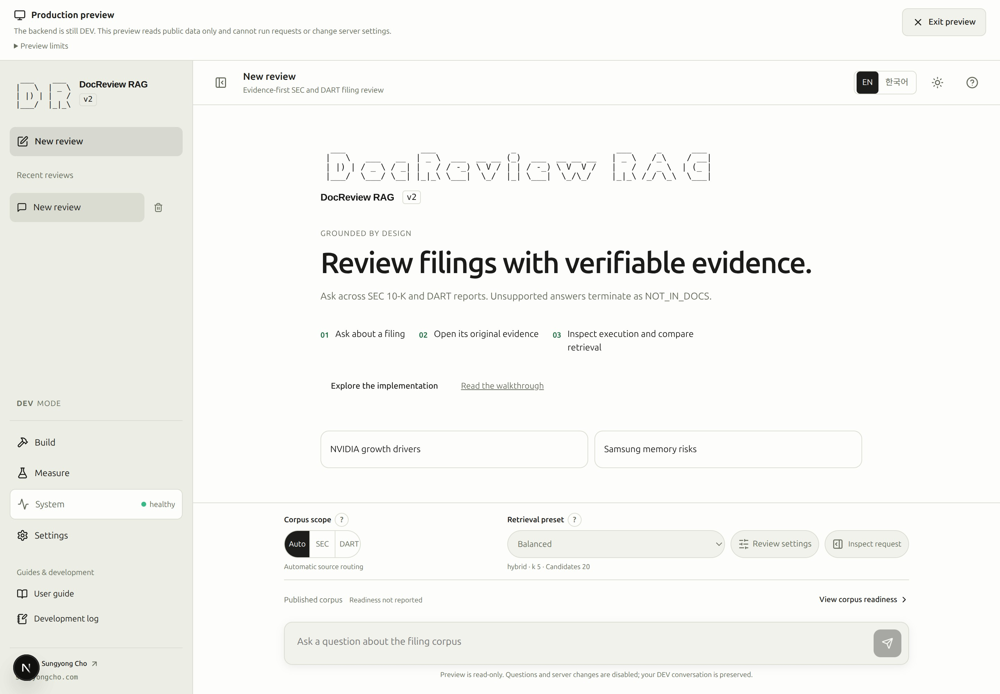

# Environment setup

## Recover a blocked preparation step

Build shows database schema status separately from source storage permissions. A schema mismatch does not mean `data/` is unwritable. Use **Check schema** to reload its reported state. When **Run in terminal** appears, copy its command, run it from this checkout, then return to the same step and select **Check updated status**. An unchanged blocker remains visible; clicking the button alone does not repair it.

```bash
uv run python -m scripts.schema check
```

Normal Compose startup now prepares an empty database automatically after DB health succeeds.
The image entrypoint inspects an existing database without schema changes and refuses to launch
the API on drift. This applies to dev, prod preview and the deployment Compose using this image.
The web container may still open while the API is blocked; inspect `rag-dev logs --tail 80 app`
for the schema diagnosis and local `check`/`recover` commands. Database-free canned images skip
the gate. Source acquisition and indexing remain separate prerequisites.

If you started only the DB, you can still prepare an empty local database manually:

```bash
uv run python -m scripts.schema prepare
```

Existing incompatible databases are preserved and preparation refuses to change them. Rebuilding images or restarting services does not repair an incompatible database layout. Select a compatible or empty local database before indexing. If you deliberately choose to discard the local DEV database, use the separately confirmed `scripts.schema recreate` path in the CLI guide; it is never automatic. Service and actual storage-permission blockers display their own terminal command and expected result.

An error links to the relevant pipeline step through **Inspect this step**, or to setup guidance for a database/schema blocker. Follow that destination for the current diagnosis and terminal instructions; other error panels keep only the cause and navigation link.

### SCREENSHOT NEEDED

<!-- SCREENSHOT NEEDED: feature=schema-and-terminal-handoff-recheck; locale=en; theme=light; capture=blocked-and-resolved-states; issue=17; preserve-existing-assets=true -->

**Screenshot pending for the updated controls and resulting state. Existing screenshots are unchanged.**


Start by separating four questions: can the browser reach the API, can the API use the
database, is the schema compatible, and does this environment permit the operation?
Corpus readiness and answer-model availability are additional checks, not substitutes
for those connections.

## Before opening the service {#prerequisites}

> [!DEV]
> Installing dependencies, configuring credentials, and starting this local stack are operator setup tasks. Reading the deployed application does not require these changes.

For a first installation, follow [installation and configuration](cli.md#installation-and-configuration)
and [initial schema setup](cli.md#initial-schema-setup). Reuse an existing compatible
database. Keep credentials in the local configuration described there; they are not
inputs to this documentation page.

From the repository root, register this checkout's commands and start development:

```bash
source ./rag_alias.sh
rag-dev up --build -d
```

Use this startup command when preparing the environment. If the same development
stack is already running, open it and inspect its status instead of restarting it.
`rag-help` lists the registered commands. Executing `./rag_alias.sh` displays setup
instructions; sourcing it registers commands in the current Bash or Zsh shell.

Open [the local service](http://localhost:8000/docreview-rag-agent/). If you configured
a different `APP_PORT`, use that port. The normal entry is the service on port 8000,
not a separate development-server tab on port 3000.

## 1. Open and verify the environment {#step-1}

**Goal:** establish that the current environment is ready for document inspection and
the preparation operations you intend to use.

**Prerequisites:** complete the setup above, or reuse a running service with a compatible
database. No document acquisition, embedding, or answer request is needed for this check.

**Screen path:** sidebar **System → System status**. The page heading is **Runtime readiness**.
Read the mode indicator; use the development environment for the preparation tutorial.
Public mode can expose fewer controls because it has different permissions.

**Inputs and meaning:** this is a read-only check; no question or company selection is
required. Confirm that the service address is the intended environment. A different
API/database address can refer to different data even when the interface looks familiar.

**Primary action:** click **Refresh** once and wait for **Checking…** to finish.

**What visibly changes:** the status facts refresh. Read the API condition shown in the
System navigation or connection warning, then inspect the Database and Schema facts.
Corpus counts and model policy describe separate aspects of the same environment.

| Fact | What to verify | What it does not prove |
|---|---|---|
| API condition | The service responds instead of remaining unavailable or checking. | That documents or model calls are ready. |
| Database | Connected to the intended database. | That the schema is compatible. |
| Schema | No missing-table or schema-drift condition. | That the catalog contains any documents. |
| Mode and permissions | Development preparation controls are available when needed. | That a public instance permits administrator writes. |
| Corpus | Counts and readiness are collected, including honest empty or partial states. | That all displayed vectors were produced by the intended model. |
| Model availability | The selected engine is available, or its missing prerequisite is explained. | That a model request has succeeded or that an answer will be supported. |

<!-- capture:01-system-status -->


*System status separates actual API/database/schema health, corpus readiness and model availability. This development corpus contains 30 filings; no preparation was rerun.*

### SCREENSHOT NEEDED

<!-- SCREENSHOT NEEDED: feature=system-status-dev-badges; locale=en; theme=light; capture=system-status-tab-showing-dev-badges-on-local-model-policy-and-local-runtime-panels; issue=79; preserve-existing-assets=true -->

**Screenshot pending for the DEV badges on the Local model policy and Local runtime panels. Existing screenshots remain unchanged.**

**Completion criteria:** the API responds, the DB is connected, and the schema is usable.
You know whether this environment allows document preparation. An empty corpus does not
invalidate those checks; identifying existing data is the next step. Unknown fields
remain unresolved and should not be counted as passed.

**Common failure and recovery:** if the page opens but API checks fail, inspect
`rag-dev ps` and `rag-dev logs --tail=80 app`. Follow [Troubleshooting](troubleshooting.md)
for the recorded symptom, apply the relevant fix, and repeat Refresh. For a fresh DB,
use the linked schema setup. A schema-drift error is not a reason to delete an existing DB.

**Next:** open [step 2: inspect existing documents](documents.md#step-2).

## Keep the environment and work separate {#environment-boundaries}

Ollama is optional for local answers and is installed separately from this DocReview stack. In **Settings → Local LLM**, select **Default** and use **Run connection diagnostics** before making connection changes. Use **Add a server…** only for a different endpoint. The [macOS/Linux setup guide](ollama.md) covers installation and backend access; `rag-ollama-check` performs read-only diagnostics. A missing answer model does not by itself mean the API, database, or schema is broken.

The development stack supports source reload and live documentation updates. API
restarts can interrupt queued work; check Jobs before deciding that an interrupted
operation needs a retry. [Runtime](runtime.md) explains job and execution states.

> [!DEV]
> Production preview is a DEV-only inspection tool. It leaves the backend in DEV and does not grant production operator permissions.

In a running DEV environment, **Production preview** in the top bar opens the visitor interface while the backend remains DEV. It is read-only: question execution and server changes are disabled. Finish the current request and close dialogs before opening it. **Exit preview** returns to the retained DEV conversation, selections, and scroll position. The preview uses separate temporary browser state, so inspecting it does not overwrite your DEV conversations.

<!-- capture:28-production-preview -->



*The isolated public-interface preview is explicitly labeled as using a DEV backend. It has no private conversation history and disables question execution and server changes; Exit preview returns to retained DEV work.*

Open **Preview limits** to distinguish this interface check from a production-image check. The preview reuses the public interface in the development bundle; actual production permissions and build-time exclusions still require verification in the production image.

`rag-prod` opens a local public preview with different permissions; it does not publish
the site. A working local-model connection in development does not make Local LLM
available in public mode. See [CLI environment commands](cli.md#development-and-local-prod-preview)
for deliberate mode changes, and [Settings](settings.md) for saved connection settings.

Do not use a destructive reset to make a readiness indicator turn green. Refresh reads
state; it does not repair, ingest, index, or call an answer model.
