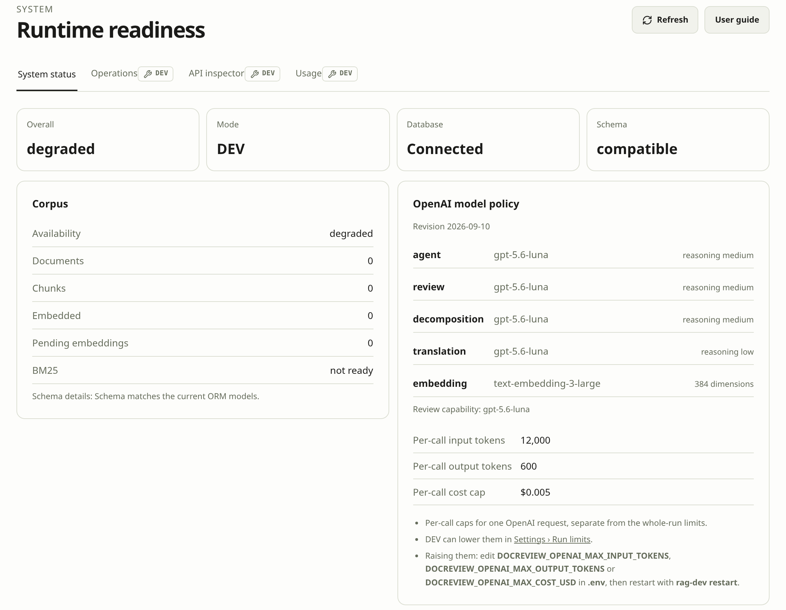

# Environment setup {#environment-setup}

Cloned the repository and unsure what to do? Run `source ./rag-alias.sh`, then
`rag-dev start`. Use `rag-prod reset environment --local --all-modes` only for a separately confirmed checkout cleanup;
`rag-dev reset data --local` resets ORM data/sources while preserving configuration and volumes.
All commands accept `--verbose` (`-vv`); see [CLI setup/reset](cli.md).

This page is for people who clone DocReview RAG from GitHub and run it locally from scratch. Follow Part 1 below to reach a running service and open Build. If you only want to try an existing instance, use [Quick Start](quickstart.md).

## Part 1: Setup {#qs-setup}

### Prerequisites {#prerequisites}

Use Bash or Zsh with uv and Docker Engine / Compose 2.24.4+. Node and npm run in the
web container; this path does not require their installation on the host.

```bash
git clone https://github.com/sungyongcho/docreview-rag.git
cd docreview-rag
source ./rag-alias.sh
rag-help
rag-dev start
```

`source` is the one-command install and activation path:

- **Y** saves startup registration and restarts the login shell; its banner reminds you to type `rag-help`.
- **N** loads the commands for this session only.
- Running `source` again reports `[already installed]` or `[update required]` by comparing the version and registered definitions.

The Helper is included in the clone. `rag-alias update` refreshes it when the checkout changes. Use `source` for shell registration.
See [helper installation and updates](cli.md#register-commands-and-open-help) for moved paths and the optional default-No login-shell offer after executed installation.
The first run creates `.env` only if absent. Edit it locally and rerun `rag-dev start`:

```dotenv
SEC_USER_AGENT=Your Real Name your-real-contact@example.com
DART_API_KEY=<your-own-dart-key>
OPENAI_API_KEY_LOCAL=<your-own-openai-development-key>
EMBEDDING_PROVIDER=openai
EMBEDDING_MODEL=text-embedding-3-large
```

Replace every placeholder. DEV reads only `OPENAI_API_KEY_LOCAL`; production reads
only `OPENAI_API_KEY_PROD`. Never paste keys into this page or capture them in screenshots.
The repository uses 384 embedding dimensions. Deterministic embeddings do not satisfy
this tutorial. Downloading filings needs valid SEC contact details and a DART key;
generating embeddings incurs OpenAI usage. The first-run command does neither.

The command creates a schema only in an empty database, preserves a compatible
existing database, and reports schema drift without resetting it. Fix missing tools
or configuration and rerun the same command; do not use `rag-dev reset data --local` to repair
installation. Open the printed URL, normally `http://localhost:8000/docreview-rag/`.

The setup command reports five stages — prerequisites, local configuration, project
service state/startup, schema preparation, and DEV server readiness — and identifies
`db`, `app`, and `web` as stopped, starting, unhealthy, or running. A running container
without a health check is not proof of server readiness; existing healthy services
are reported before Compose reconciles the development configuration.

<!-- details: setup-failure-recovery | What the command offers when configuration or startup fails -->

If configuration blocks progress, each key shows its `.env` line, shell value and effective
source, with credentials hidden. Choose `[f]` to ignore failing exports for this invocation,
`[e]` to save the two public embedding settings, or edit the named file and choose `[r]` to resume
at the same step. `[q]` cancels. The parent shell is unchanged; use the printed `unset KEY` there
for future invocations. For startup/readiness failures, existing read-only diagnostics run and
the command offers one confirmed, volume-preserving down/build/start recovery.

<!-- /details -->

## Open and verify the environment {#step-1}

> [!GOAL]
> Establish that the current environment is ready for document inspection and the preparation operations you intend to use.
>
> **Prerequisites** [Part 1: Setup](#qs-setup) or a running service with a compatible database · **Done** the API responds, the DB is connected, and the schema is usable.

Open sidebar **System → System status**; the page heading is **Runtime readiness**. Use the development environment for the preparation tutorial: read the mode indicator, because public mode can expose fewer controls with different permissions.

This is a read-only check that makes no document acquisition, embedding, or answer request, so no question or company selection is required. Confirm that the service address is the intended environment — a different API or database address can point at different data even when the interface looks familiar. Corpus counts are shown on both builds; only whether the corpus is writable is withheld.

1. Select **Refresh** once and wait for **Checking…** to finish. The status facts refresh, and the API condition appears in the System navigation or connection warning.
2. Inspect the Database and Schema facts. Corpus counts and model policy describe separate aspects of the same environment.
3. Confirm completion: the API responds, the DB is connected, and the schema is usable. You now know whether this environment allows document preparation; an empty corpus does not invalidate those checks, and identifying existing data is the next step. Unknown fields remain unresolved and should not be counted as passed.
4. If the page opens but API checks fail, inspect `rag-dev status` and `rag-dev logs --tail=80 app`, follow [Troubleshooting](troubleshooting.md) for the recorded symptom, apply the relevant fix, and repeat Refresh. For a fresh DB, use the linked schema setup; a schema-drift error is not a reason to delete an existing DB.

| Fact | What to verify | What it does not prove |
|---|---|---|
| API condition | The service responds instead of remaining unavailable or checking. | That documents or model calls are ready. |
| Database | Connected to the intended database. | That the schema is compatible. |
| Schema | No missing-table or schema-drift condition. | That the catalog contains any documents. |
| Mode and permissions | Development preparation controls are available when needed. | That a public instance permits administrator writes. |
| Corpus | Counts and readiness are collected, including honest empty or partial states. | That all displayed vectors were produced by the intended model. |
| Model availability | The selected engine is available, or its missing prerequisite is explained. | That a model request has succeeded or that an answer will be supported. |

<!-- screenshot: runtime-readiness-status -->



*1. Runtime readiness · 2. next action*

Open Build and continue with the developer preparation guide below.

## Open Build and continue {#open-build}

Open the printed application URL and select **Build → Pipeline**. Confirm that you can inspect the preparation graph and the selected step. Opening Build does not download a filing or run a model.

**Service ready is not data ready.** Continue with [Quick Start for DEV MODE](quickstart-dev.md#qs-web-1): choose CLI or Web to verify the environment, acquire the two example reports, parse and chunk them, prepare embeddings and BM25, and check readiness before asking. Reuse completed work. The existing [twelve-step learning path](overview.md#learning-path) then covers questions, settings, and evaluation.

## Recover a blocked preparation step {#schema-recovery}

Build shows database schema status separately from source storage permissions. A schema mismatch does not mean `data/` is unwritable. Use **Check schema** to reload its reported state. When **Run in terminal** appears, copy its command, run it from this checkout, then return to the same step and select **Check updated status**. An unchanged blocker remains visible; clicking the button alone does not repair it.

```bash
uv run python -m scripts.schema check
```

Normal Compose startup now prepares an empty database automatically after DB health succeeds.
The image entrypoint inspects an existing database without schema changes and refuses to launch
the API on drift. This applies to DEV, local PROD mode and the deployment Compose using this image.
The web container may still open while the API is blocked; inspect `rag-dev logs --tail 80 app`
for the schema diagnosis and local `check`/`recover` commands. Database-free canned images skip
the gate. Source acquisition and indexing remain separate prerequisites.

If you started only the DB, you can still prepare an empty local database manually:

```bash
uv run python -m scripts.schema prepare
```

Existing incompatible databases are preserved and preparation refuses to change them. Rebuilding images or restarting services does not repair an incompatible database layout. Select a compatible or empty local database before indexing. If you deliberately choose to discard the local DEV database, use the separately confirmed `scripts.schema recreate` path in the CLI guide; it is never automatic. Service and actual storage-permission blockers display their own terminal command and expected result.

### Local container file ownership {#local-container-file-ownership}

Local Compose keeps the image's non-root UID 10001 and uses `HOST_GID` as the app's primary group
(default 1000; `rag-dev` supplies the invoking host group). The host's `data/` directory must permit
that group to write: for direct Compose on a host whose primary group is not 1000, set `HOST_GID` to
`id -g`. After changing this local Compose policy, recreate the app with `rag-dev start` — an existing
container does not acquire a new primary group or command merely from a source reload. See
[reset recovery](cli.md).

<!-- details: container-file-ownership | Permission, umask, and repair details -->

API startup applies `umask 0002` after
the unchanged database initialization gate. New source/download and evaluation directories are
group-writable; saved local-model settings are mode 0640, readable by the host group. The existing
image user and deployment Compose remain unchanged; this is a local bind-mount sharing policy.

Earlier container-owned files keep their existing
permissions: the reset preview prints the exact elevated repair for blocked source paths. If an old
`data/local-settings` or `data/eval_runs` path also needs host access, ask its owner to apply the same
scoped ACL repair to that directory. No ownership/ACL change is automatic.

<!-- /details -->

An error links to the relevant pipeline step through **Inspect this step**, or to setup guidance for a database/schema blocker. Follow that destination for the current diagnosis and terminal instructions; other error panels keep only the cause and navigation link.

For incompatible schemas, run `.venv/bin/python -m scripts.schema check`;
Quickstart ignores an external `DATABASE_URL` and uses the local `DB_PORT`. Safe target-selection
recovery is tracked in [#25](https://github.com/sungyongcho/docreview-rag/issues/25).
Do not reset your database to resolve this setup stop.

## Keep the environment and work separate {#environment-boundaries}

Ollama is optional for local answers and is installed separately from this DocReview stack. In **Settings → Local LLM**, select **Default** and use **Run connection diagnostics** before making connection changes. Use **Add a server…** only for a different endpoint. The [macOS/Linux setup guide](ollama.md) covers installation and backend access; `rag-dev doctor` performs read-only diagnostics. A missing answer model does not by itself mean the API, database, or schema is broken.

The development stack supports source reload and live documentation updates. API
restarts can interrupt queued work; check Jobs before deciding that an interrupted
operation needs a retry. [Runtime](runtime.md) explains job and execution states.

This release supports DEV and PROD as separate runtime modes. The embedded **Production preview** inside DEV is deferred to [issue #211](https://github.com/sungyongcho/docreview-rag/issues/211) and is not available in this release.

`rag-prod start` starts standalone local PROD mode with public permissions; it does not publish
the site. A working local-model connection in development does not make Local LLM
available in public mode. See [CLI environment commands](cli.md#development-and-local-prod-preview)
for deliberate mode changes, and [Settings](settings.md) for saved connection settings.

For a prepared local portfolio, use
`rag-prod start --local --ready --artifacts /path/to/public-bundle`. If PROD is
already running, use `rag-prod prepare --local --artifacts /path/to/public-bundle`;
add `--check` to inspect without changing data. These commands restore saved public
data and embeddings, not an answer model. They do not download sources or generate
paid embeddings automatically. PROD's `prod_pg_data` volume and
`data/local-prod/{corpus,eval-runs,runtime}` files are separate from DEV storage;
switching modes preserves each database and does not copy conversations between them.
See [bundle selection and validation](cli.md#local-prod-data). An empty local PROD
database correctly reports that documents need preparation; do not reset DEV to fix it.

Do not use a destructive reset to make a readiness indicator turn green. Refresh reads
state; it does not repair, ingest, index, or call an answer model.

## Production deployment {#production-deployment}

Everything above runs on your machine. The public origin is a separate Oracle
Cloud A1 instance with 2 OCPU and 12 GB RAM, shared with gomoku's minimax service.
DocReview uses Caddy on host port `8880`; minimax keeps `8080`. Firebase Hosting
serves the static export. Deployment ownership is separated through the dedicated
DocReview Worker in `deploy/cloudflare`; the steps below describe the cutover and
subsequent deployment, not evidence that either has completed. Oracle scripts live
in `deploy/oracle/`, and Firebase deployment in `scripts/deploy/firebase.sh`.
The `deploy/gcp/` path remains a supported alternative. None runs as part of this
local tutorial.

```text
visitor ──HTTPS──> sungyongcho.com/docreview-rag/*
                          │  DocReview Worker (docreview-router)
            ┌─────────────┴──────────────┐
   /docreview-rag/*        /docreview-rag/api/*
            │                              │  plain HTTP
            ▼                              ▼
   Firebase Hosting             docreview-api.sungyongcho.com:8880
   static Next export           Oracle A1, shared with minimax :8080
   preserve /docreview-rag       firewall: tcp:8880 from Cloudflare IPv4 only
                                  host 8880 → Caddy :80
                                    allow-list + X-DocReview-Public: true
                                      └─> FastAPI ──> pgvector Postgres
                                  no operator API; administer in local DEV
```

TLS ends at Cloudflare. The dedicated Worker owns only
`sungyongcho.com/docreview-rag` and `sungyongcho.com/docreview-rag/*`. It preserves
the static prefix on Firebase and strips `/docreview-rag/api` before forwarding
API requests over HTTP to the Oracle origin. The existing origin DNS record must
point to that instance; the deployment does not modify DNS. Shared Oracle host
provisioning remains in gomoku, while DocReview owns its app, Caddy, static site,
and Worker. Caddy proxies only public paths and adds `X-DocReview-Public: true`;
it must stay in front of every externally reachable API port. Production exposes
no operator API; administration runs in the local DEV environment.

### Request-limit boundary {#public-request-boundary}

Caddy overwrites `X-Forwarded-For` with its directly connected peer, `{remote_host}`.
It removes `CF-Connecting-IP`, `CF-Connecting-IPv6`, `CF-Pseudo-IPv4`, `True-Client-IP`,
`X-Real-IP`, and `Forwarded` before proxying to Python. No `trusted_proxies` rule
restores the visitor's original address. On the intended route, the peer is a Worker
egress IP, so visitors using that egress share the server request allowance. This IP
does not authenticate this site's Worker or identify a visitor.

Caddy also caps `POST /retrieve`, `/review`, and `/review/stream` bodies at 256 KiB,
including trailing-slash paths; oversized bodies return `413`. The browser presents
a size warning even when that proxy response is not JSON. The server then enforces
its request limit before body parsing and reserves AI cost separately at each
provider call. Keep the existing SQLite ledger file and persistent volume when
updating; replacing them would lose recorded usage.

Deployment is a separate operation. Before deploying this policy, verify the peer
address that the actual Caddy instance sees and the Cloudflare-only firewall path.
Inspect the security lists actually attached to the Oracle subnet, every attached
network security group, and the host firewall against the intended Cloudflare
address ranges; a detached security list proves nothing about access. Hold
deployment if those premises differ. An isolated Caddy test is local evidence,
not verification of the production route. No visitor-specific Cloudflare rate rule
is assumed. The shared request-limit policy is independent of transferring the
DocReview routes from gomoku to a dedicated Worker. Removing forwarded visitor-IP
headers reduces their delivery to Python; it does not establish service-wide GDPR
exemption or compliance.

### Order of operations {#production-order}

1. Configure this repository's `.env` with `DEPLOY_ORACLE_HOST`,
   `DEPLOY_ORACLE_SSH_USER`, and optional `DEPLOY_ORACLE_SSH_KEY` or
   `DEPLOY_ORACLE_SSH_CONFIG`. Keep non-secret host and origin configuration here.
   SSH, SCP, and rsync require a verified known-hosts entry and use strict host-key
   checking; the optional SSH config applies to all three transports.
   Use the existing production-key source for backend deployment and externally
   provided `CLOUDFLARE_ACCOUNT_ID` / `CLOUDFLARE_API_TOKEN` for Worker deployment;
   do not copy tokens merely to move routing ownership.
2. Check the firewall and observed-Caddy-peer prerequisites above.
   `bash deploy/oracle/deploy_backend.sh update` builds in an isolated remote
   `mktemp` context without `rsync --delete` against shared files, then updates
   the app and Caddy together. A first installation instead requires the validated
   public artifact bundle and `DEPLOY_POSTGRES_PASSWORD`; use `first-install`
   only for empty persistent storage. Both use the shared Compose contract in
   `deploy/gcp/docker-compose.deploy.yml`.
   Build contexts remain under `DEPLOY_ORACLE_BUILD_DIR` for separately authorized
   cleanup. The running Caddy container validates configuration before the app
   update and reloads it afterward; failed staging and rollback records remain
   available for recovery.
3. `bash deploy/oracle/print_origin.sh` prints the dedicated Worker's origin
   overrides. The intended API origin is
   `http://docreview-api.sungyongcho.com:8880`; the static origin stays on Firebase.
   Verify the existing DNS record if the instance address changes.
4. From the repository root, install with `npm --prefix deploy/cloudflare ci`, then
   run `npm --prefix deploy/cloudflare test` and
   `npm --prefix deploy/cloudflare run deploy:dry-run -- --bootstrap`.
   For the initial cutover only,
   `npm --prefix deploy/cloudflare run deploy -- --bootstrap` creates the Worker
   without routes or workers.dev/preview URLs. Then transfer the existing IDs of
   only the two DocReview routes from the shared gomoku Worker to
   `docreview-router`, preserving all other routes. Do not bootstrap again after
   the transfer: it would remove the dedicated Worker's routes. Verify the
   transfer, then use `npm --prefix deploy/cloudflare run deploy:dry-run` and
   `npm --prefix deploy/cloudflare run deploy` for subsequent releases.
5. `FIREBASE_PROJECT_ID=<project-id> scripts/deploy/firebase.sh` builds and
   publishes the visitor bundle, explicitly selecting the public mode and API
   prefix. Verify origin health, static routing, API routing, and SSE afterward.

`bash deploy/oracle/deploy_backend.sh rollback` restores the previous app image
and Caddy configuration as a pair. Update and rollback preserve PostgreSQL,
corpus, evaluations, and the existing SQLite request/cost ledger. They do not
rerun host provisioning or restore the database. A local pass or successful
deployment command does not prove live cost protection.

For a separately selected GCP target, retain `deploy/gcp/deploy_all.sh` for its
setup/VM/image/backend stages and `deploy/gcp/print_origin.sh` for the origin.
That path uses an e2-medium VM and Artifact Registry rather than an Oracle-local
build; it does not change the dedicated Worker's route ownership or Firebase's
static prefix.

### Monthly cost {#production-cost}

| Component | Detail | Cost boundary |
|---|---|---|
| Oracle A1 | Shared 2 OCPU / 12 GB instance; minimax and DocReview keep separate ports | Target the account's allocated Always Free resources; verify actual compute, storage, and network entitlement |
| Firebase Hosting | Existing static-export site | Stay within the configured plan's allowance |
| Cloudflare Worker | Dedicated DocReview router | Stay within the configured plan's allowance |
| OpenAI | Capped per UTC day by `DOCREVIEW_PUBLIC_DAILY_COST_USD` (`0.30` in the deployment compose file) | ≤ $0.30/day |

The shared host also runs minimax, so leave resources for both services. Building
the application on the A1 instance can temporarily compete with live traffic.
Check measured resource use and the account's billing state instead of treating
this target configuration as a guarantee of zero infrastructure cost.
