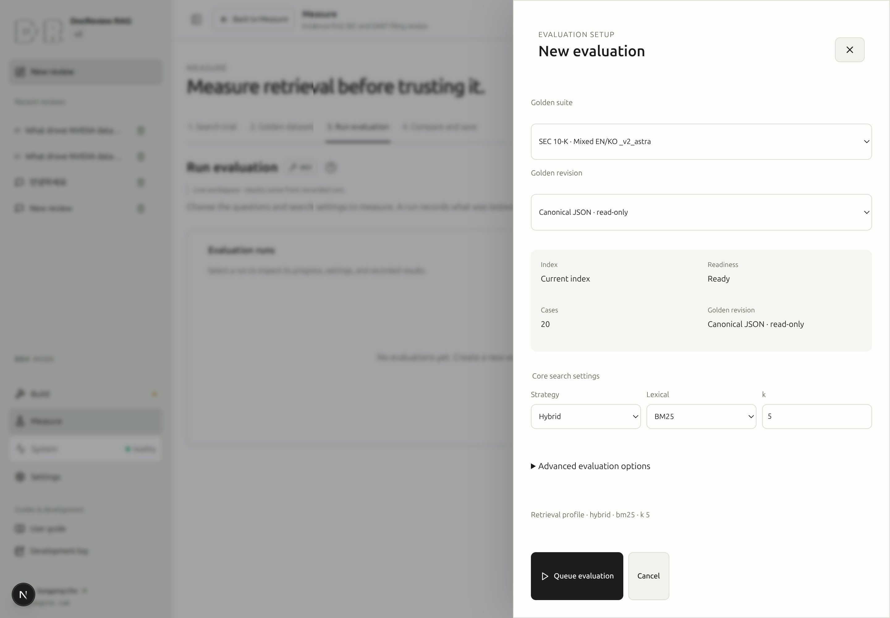
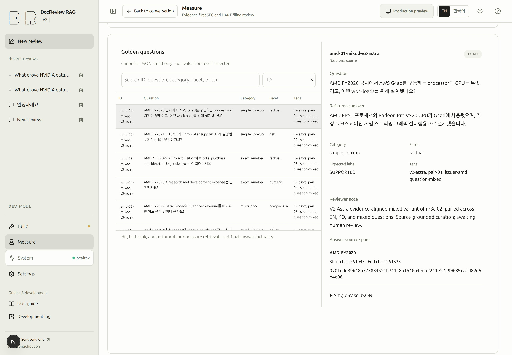

# Evaluate retrieval against known evidence

## Public exploration and recorded evidence

Saved snapshots use a responsive card grid in DEV and PROD. Each card shows a short title, search settings and evidence hit rate; only DEV shows a visibility badge. Full titles, dataset files, document counts, timestamps and all metrics remain in the detail drawer. Select a card to open the existing right-side drawer with full metadata and configuration. Close with X, Escape or the backdrop; DEV actions remain available only in DEV.

The question comparison reuses the dataset table: ID, question, BM25 baseline rank, ts_rank_cd candidate rank, and improvement/regression. Ranks are positions in the top 5; a dash means no relevant source was found. Select an ID to open the published reference answer and expected source spans in the read-only question detail view.

In PROD, the result-comparison form follows the DEV layout with gray, fixed dataset, baseline, and candidate example selections. **Explore an example** reads two published real evaluations (BM25 and ts_rank_cd, k=5, identical DART Korean dataset and corpus) and their searchable question-level differences. It never reruns retrieval or a model. Real published snapshots remain in the separate snapshot view.

The run list contains a compact recorded-result summary: evidence hit rate, MRR, mean search latency, and evaluated question count. Expand **Recorded configuration** for all parameters and metrics; select question IDs below to inspect individual results. These are retrieval measurements, not final-answer accuracy.

PROD retains the evaluation workflow layout. Published dataset questions and expected source spans, recorded run settings, and case scores can be searched, sorted and paged. Only the exact published dataset version is shown; unavailable evidence is not replaced by today's editable file.

Open **Explore evaluation settings** in the same side drawer layout as DEV. Dataset metadata and core search settings appear first; Quick/Matrix, chunk targets and tuning parameters are under **Advanced evaluation options**. The body scrolls independently above the fixed Cancel and locked evaluation actions. The request preview is not submitted. Saving this exploration uses browser storage only and never changes recorded scores. Queueing evaluations, editing datasets, and creating snapshots keep their DEV badges and remain locked.

> [!DEV]
> Evaluation execution and dataset editing run in DEV only. Visitors can explore settings and read published questions, recorded evaluations and comparisons.

An evaluation asks whether the search system can find the evidence specified by a golden dataset. It records a dataset, retrieval configuration, progress, and results. It does not require a generated answer first, and its retrieval scores do not certify the factual accuracy of an answer model.

## 11. Run a retrieval evaluation {#step-11}

**Goal:** obtain one recorded retrieval result whose dataset and search conditions you understand.

**Prerequisites:** a local development environment with evaluation permission, a working index, and the source filings required by your chosen suite. A corpus containing only one tutorial filing is insufficient for a suite covering several companies. Reuse a matching existing result if the required evaluation was already completed.

**Screen path:** **Measure → 2. Golden dataset**, then **3. Run evaluation → New evaluation**.

| Input | What to verify |
|---|---|
| Golden suite | The company coverage and question language match what you intend to measure. |
| Dataset file | Select a `.json` file. Bundled files carry `(Built-in)`; user files appear by filename. |
| Core search settings | Strategy, lexical ranker, and `k` identify the experiment. |
| Advanced evaluation options → Run mode | Start with **Quick · current index**. It measures the current prepared index. |

Select and read a question in Golden dataset, including its source spans. Open New evaluation and verify readiness and case count. **Primary action:** click **Queue evaluation** once. Query embedding and configured search components may incur provider costs.

**Visible result:** the setup closes and a queued job appears in Evaluation runs. Select its row to inspect request settings and actual progress. A successful run exposes Result details, recorded configuration, metrics, and case ranks. No result means no measured scores yet.

Selecting an evaluation opens its focused details. While the list is intentionally hidden, this is a detail view, not an empty-history state. Return to the runs list to inspect other jobs.

**Completion:** the selected run succeeded, the result ID and dataset are correct, and you inspected at least one hit/miss against its source evidence. Do not treat a successful job from another suite as the result of this setup.

**Common failure:** Sources unavailable or Corpus not ready. Read the named source error, then return to [Documents](documents.md) and [Indexing](indexing.md). For a failed or interrupted job, use [evaluation recovery](troubleshooting.md#evaluation) before retrying.

**Next:** [12. Compare results and save a snapshot](snapshots.md#step-12).

### SCREENSHOT NEEDED

<!-- SCREENSHOT NEEDED: feature=focused-evaluation-detail; locale=en; theme=light; capture=selected-evaluation-with-result-details-and-back-to-list-without-empty-history-message; issue=21; preserve-existing-assets=true -->

**Screenshot pending for the focused evaluation detail and return-to-list state. Existing screenshots remain unchanged.**

<!-- capture:11-evaluation-inputs -->

*New evaluation setup uses the real mixed-language canonical suite: 20 cases and a ready current index. Hybrid/BM25/k=5 is visible; Queue evaluation was not pressed.*

## Golden-set identity and readiness

Select one JSON filename in Golden, new evaluation setup, or the pipeline. Bundled files carry `(Built-in)` and are read-only. Source, question language, review status, and execution readiness remain separate; source checks do not imply human approval.

The read-only preparation check matches required official filing identities, verifies source SHA-256 and answer intervals, and binds answer document IDs to the current acquisition IDs. It does not create `sec-evaluation` or `dart-evaluation` selections, change reference answers, or download missing files. Missing-original links open source preparation. Source details show company names and fiscal years.

Quick evaluations require chunks for each exact evidence-source version and the selected search indexes. Matrix evaluations require a compatible database, writable source storage, and verified originals; they build isolated indexes themselves. Submission repeats the same check before creating a job, and execution checks again after waiting for its turn. Unready input returns `evaluation_not_ready` rather than registering a job destined to fail.

Results record golden-set identity and review provenance separately from search scope. Quick search uses the current index for the suite's registry and corpus language. Matrix search uses a temporary explicit selection of all registered originals in that registry; temporary references do not modify the acquisition manifest. Changing corpus scope can change the validity of absent-evidence cases, which remain review candidates.

## Choose among seven suites {#suites}

Suite IDs are stable dataset identifiers. The `_v2_astra` suffix does not rename the product or imply that Astra is the model used to run an evaluation.

| Suite ID | Questions | Filing corpus |
|---|---|---|
| `sec-en` | English | English SEC filings |
| `sec-ko` | Korean | English SEC filings |
| `dart-en` | English | Korean DART filings |
| `dart-ko` | Korean | Korean DART filings |
| `sec-en_v2_astra` | English | English SEC filings |
| `sec-ko_v2_astra` | Korean | English SEC filings |
| `sec-mixed_v2_astra` | Mixed English/Korean | English SEC filings |

The three additional SEC suites each contain 20 curated questions. Check the displayed curation and approval status; an automatically curated dataset is not evidence of human approval. When comparing question languages, inspect company, fiscal-year, and scope clues as well as the source spans. Shared evidence alone does not make two questions equivalent.

The same suite catalog is used by Golden, new evaluation setup, and the New evaluation defaults controls. Saved defaults choose the starting suite for later work; they do not change existing results.

## Source JSON and editable drafts {#golden}

The filename and small source/language summary sit directly under the selector. **View source JSON** opens the selected file's data; user files include their metadata and cases.

**Create draft**, beside the selector, creates a named `.json` file by copying the selection or starting empty. The trash icon beside **View source JSON** deletes the selected user file after a **Yes / No** confirmation; built-in suites cannot be deleted. **Add question** opens a new editable question. Use **Save draft**, then **Check format and sources**. There is no separate JSON publication step, and bundled files cannot be overwritten.

All active dataset files live in `data/golden/`. User files use a `docreview-golden-set` envelope with `suite_id`, `registry`, `question_language`, timestamps, `checked_sha256`, and `cases`. Files survive database resets and `rag-start-fresh`; DB draft rows are not the source of truth.

Selecting a question opens a wide editor in the same area. The header keeps the file name, the completion state, **Delete draft** and **Save draft** visible while the fields scroll. **Question list** restores the previous search, sort, and scroll position. Unsaved navigation offers **Save draft and leave**, **Discard changes and leave**, or **Keep editing**.

Start with the question and choose whether original documents can answer it. Evidence-backed questions need a reference answer and source evidence before evaluation. **Select evidence from documents** searches documents and paged chunks; selecting a chunk records its exact document ID, SHA-256, and character interval. Unparsed documents link to preparation. Switching to no evidence asks before clearing an existing answer or source spans.

**Save draft** accepts incomplete questions. **Delete draft** asks **Yes / No** and removes only that question; the list shows an inline **Incomplete** flag beside each ID and a per-row delete action for editable drafts. Completion is separate from **Check format and sources** and human review. Any incomplete question blocks evaluation of the whole dataset. Type errors appear beside the affected field; a conflicting file update preserves your input and offers reload. Classification, multilingual tags, and review notes are optional sections; raw JSON and manual source entry are advanced tools.

Bundled filenames display a gray, noninteractive lock: create a draft to edit. New evaluation parameters are grouped into candidates/fusion, BM25, and reranking/language. Small information icons explain their purpose on hover or keyboard focus.

### SCREENSHOT NEEDED
<!-- Capture DEV, English: wide question editor with answerability unselected, fixed save bar, and source chunk picker; also show a narrow viewport. -->

<!-- capture:10-golden-question -->

*The mixed-language SEC suite is selected with an actual canonical question open. Canonical JSON is read-only; viewing a source question is separate from creating or editing a draft.*

## Modes, results, and interpretation {#metrics}

Quick uses the current index. **Matrix · isolated corpus** tests configured chunk targets and retrieval combinations in an isolated corpus; it can involve substantially more preparation and work. Inspect its scope and provider costs before using it as a comparison experiment.

| Result | How to read it |
|---|---|
| Hit / miss | Whether the selected result found relevant evidence within its returned set. |
| First relevant rank | Where the first relevant hit appears; lower is better. |
| Reciprocal rank / MRR | Rank-sensitive retrieval quality, giving more credit to an early relevant result. |
| Recall@k / hit rate | Coverage within the stated cutoff and evaluated cases. Compare like-for-like conditions. |
| Latency | Recorded search time; judge it alongside quality and the effective configuration. |

Follow per-case changes rather than only the aggregate score. **Use selected set** applies a selected result's search settings to the conversation; it does not generate a new answer. [Snapshots](snapshots.md) explain how to preserve and compare the result with its search data.

## Workflow and management tabs

The four workflow steps are Search trial, Golden dataset, Run evaluation, and Compare & snapshots. Manage contains Presets. Save future dataset and mode defaults explicitly inside New evaluation; snapshot comparison starts with no selected pair.

### SCREENSHOT NEEDED
<!-- Feature: Measure workflow and Manage groups, active presets and page help; locale=en; theme=light; widths=1440,720; show numbered chips, divider, caption and DEV badge. Preserve existing assets. -->

## Find runs by dataset file

Dataset selection, evaluation history, and comparisons share JSON filenames. New results
record the filename and dataset content hash used by that execution. Historical filenames
are resolved only from an explicit catalog identity; missing names are shown as unavailable.
The dataset card displays source, question language, and question count beneath the filename.

Evaluation history supports dataset, status, and text filters plus newest, oldest, filename,
and duration sorting. Comparing from a result preselects its dataset and baseline. Select
that dataset first when opening comparison directly; only its completed results are offered.
Each choice shows recorded settings and execution time, including each matrix arm's actual
configuration. A dataset change clears both choices and the previous comparison. Different
content hashes are reported and cannot be compared as the same question set. With fewer than
two completed evaluations, the screen links back to the dataset's runs.

Internal result IDs remain in URLs and recorded configuration, not primary labels. Opening
another result still follows its exact ID. A question table only shows scores matching the
selected dataset's recorded content hash.

### SCREENSHOT NEEDED
<!-- Capture DEV, English: dataset-filtered run history and file-first comparison with two matching results; show filenames/settings/times without result-number labels. -->

In **New evaluation**, use **Save as evaluation defaults** to remember only the selected dataset and run mode. **Reset evaluation defaults** resets future defaults without changing this form. Neither action starts a job or changes chat presets.

Answerability determines the internal verdict: evidence-backed questions use `SUPPORTED`; absent-evidence questions use `NOT_IN_DOCS` with no source spans. Incomplete authoring data stays saveable, but strict validation is required for preparation, job registration, and execution.
