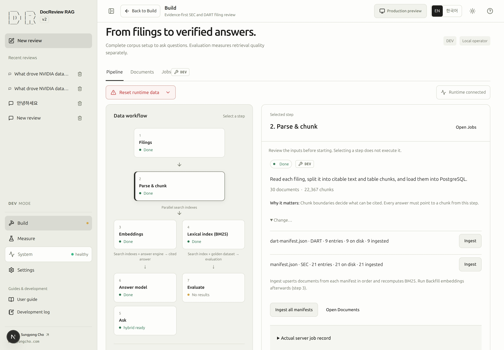
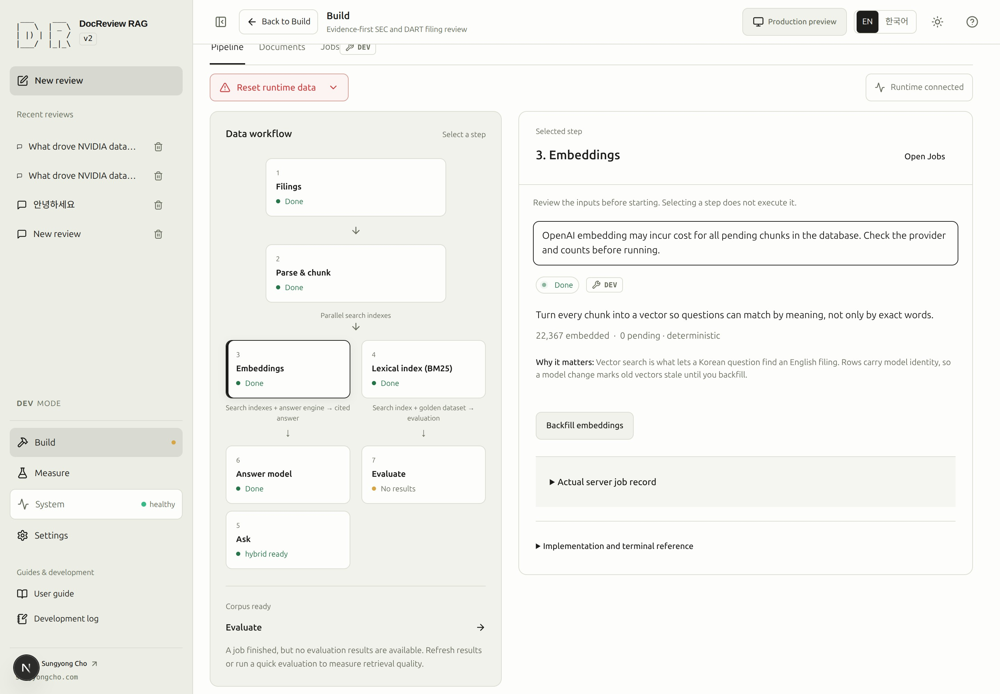
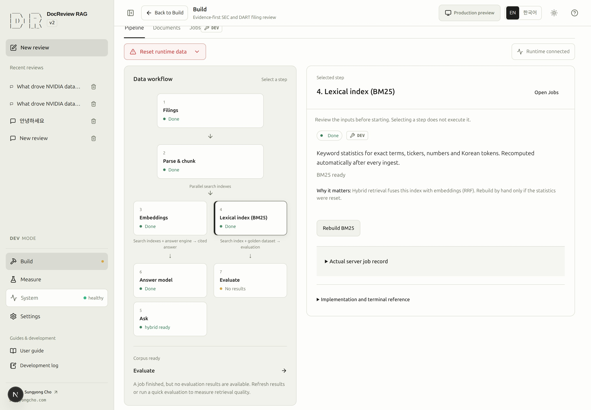

# Turn sources into searchable evidence

## Return from terminal preparation

When a prerequisite needs terminal work, the selected preparation step displays its diagnosis, terminal instructions, a copyable command and the expected result. Complete that command in this checkout, return to the same step, and click **Check updated status**. Continue only when the reported prerequisite has actually changed; the refresh button does not execute setup or fabricate completion.

Schema checking is read-only. Empty-schema preparation preserves existing databases and refuses incompatible schemas. Unarchived historical jobs remain visible in the unified Jobs view; an old ingestion request without a selection ID cannot be retried. Start a new ingestion from a current manifest selection instead.

The terminal panel is compact and collapsible. It opens for a prerequisite blocking the selected step. Source acquisition can remain available while indexing needs schema recovery; open setup checks to inspect that separate condition. Company and year suggestions open directly below their input and may temporarily cover hints or quick-add controls.

Every pipeline stage can be inspected: Filings, Parse & chunk, Embeddings, BM25, Ask, Answer model, and Evaluate. The diagnosis distinguishes ready to run, already complete, blocked, running/queued, and unknown/checking. Missing sources lead to Filings; missing chunks lead to Parse & chunk; missing indexes or answer configuration lead to their own stage. An unknown response is not success. **Go to prerequisite step** opens the relevant step without starting it; use that step’s compact terminal panel and recheck when needed.

### SCREENSHOT NEEDED

<!-- SCREENSHOT NEEDED: feature=schema-and-terminal-handoff-recheck; locale=en; theme=light; capture=blocked-and-resolved-states; issue=17; preserve-existing-assets=true -->

**Screenshot pending for the updated controls and resulting state. Existing screenshots are unchanged.**

> [!DEV]
> Ingestion, embedding backfill, and BM25 rebuilds require DEV. Reading an existing readiness indicator does not perform those operations.

Parsing creates documents and citable chunks. Embeddings support semantic matching; BM25 supplies
lexical statistics. The two index paths can be prepared independently after chunking. A green connection
indicator is not proof that either index matches the current corpus.

## 5. Parse and create chunks {#step-5}

- **Goal:** store the explicitly selected reports as searchable, traceable chunks.
- **Prerequisites:** compatible DB/schema and every required source file from [acquisition](acquisition.md#step-4).
- **Screen:** Build → Pipeline → Parse & chunk → Selected documents.
- **Inputs:** review the compact SEC/DART → company → year summary carried over from Filings. The header counts documents, ready/missing sources, companies and fiscal years. Use the visible **Change selection in Filings** button or remove a year directly; both steps share the same selection.
- **Primary action:** **Parse & chunk selected sources** once for the entire current selection.
- **Visible result:** the action bar replaces the primary button with shared job progress and **Cancel** when supported. **Open Documents** and **View all jobs** remain available; Documents shows the ingested report.
- **Completion:** the job succeeds, the expected document identity is present, and its chunk count is positive.
- **Recovery:** inspect missing-file or schema errors in Jobs. Correct that prerequisite before retrying;
  do not erase the database to resolve an unknown cause. See [troubleshooting](troubleshooting.md).
- **Next:** [prepare embeddings](#step-6), or skip it when the current embedding identity is already ready.

Each Ingest action processes only its explicit selection. The common catalog remains intact.
The operation stores source-linked structures and chunks. It leaves embeddings and BM25 to Build
steps 3 and 4; changing chunks invalidates existing BM25 statistics. Work already completed by CLI against this same DB should be reused.

<!-- capture:05-manifest-ingest -->

*Parse & chunk lists common-manifest selections with source and ingestion counts. Each selection has its own Ingest action.*

## 6. Prepare embeddings {#step-6}

- **Goal:** prepare vectors produced by the intended embedding model.
- **Prerequisites:** chunks exist; the selected embedding provider is configured and available.
- **Screen:** Build → Pipeline → Embeddings.
- **Inputs:** inspect provider, model identity, dimensions, prepared count, and pending count.
  The tutorial's semantic path uses the configured OpenAI embeddings; deterministic test vectors do not
  establish semantic quality. Check the current policy in [CLI configuration](cli.md#installation-and-configuration).
- **Primary action:** **Backfill embeddings**, only when needed and after accepting its stated scope and cost.
- **Visible result:** Jobs reports the backfill; refresh readiness after it finishes.
- **Completion:** embeddings match the active provider/model identity and the pending count is zero.
- **Recovery:** a provider failure, incompatible identity, or a connection failure needs its own diagnosis.
  Check [runtime evidence](runtime.md) and [troubleshooting](troubleshooting.md) before trying again.
- **Next:** [verify BM25](#step-7).

Backfill covers missing or mismatched embeddings throughout the database. The acquisition company/year
selection does not limit this operation to that report. OpenAI backfill can incur cost. Do not run it just
to reproduce a screenshot or to make an already-ready stage green again.

<!-- capture:06-embeddings -->

*The actual development index reports deterministic embeddings and zero pending chunks. This is not evidence of OpenAI embedding readiness or semantic quality. The database-wide cost notice and explicit backfill action remain visible.*

The orange traffic-cone duration note below the cost notice is always visible in Build step 3, before, during, and after a run, for every provider. It is informational: clicking or using the keyboard does not activate it.

> Embedding a fresh clone, an enlarged corpus or an empty index can take a long time.

### SCREENSHOT NEEDED
<!-- Embedding duration note: Build step 3 selected, English locale, light mode, before a run and while running. Show the orange cone badge below the cost notice with the full three-case wording, unchanged status/DEV pills, and wrapped text inside a narrow card. The retained capture above predates this badge. -->

## 7. Prepare BM25 {#step-7}

- **Goal:** make keyword retrieval statistics agree with the current chunks.
- **Prerequisites:** chunks exist. Embeddings and an answer model are not required for this preparation.
- **Screen:** Build → Pipeline → Lexical index (BM25).
- **Inputs:** inspect the current statistics and readiness state; there is no company selection for this rebuild.
- **Primary action:** **Compute BM25** for the first computation, or **Recompute BM25** when a previous
  computation is recorded. Run it after each parse/chunk operation; manual recompute remains available when ready.
- **Visible result:** the job completes and the BM25 readiness indicator updates.
- **Completion:** the explicit BM25 job succeeds and BM25 is ready for the current corpus.
- **Recovery:** inspect database/schema errors and the job result; see [troubleshooting](troubleshooting.md).
- **Next:** [test retrieval](retrieval.md#step-8).

BM25 rebuilding does not call an answer model or OpenAI. Hybrid retrieval needs both its configured lanes;
read the readiness description to distinguish hybrid availability from vector-only availability.
Retrieval evaluation depends on an index and evaluation dataset, not on generating an answer first.

<!-- capture:07-bm25 -->

*BM25 is already ready for the current corpus. The rebuild action is available but was not executed.*

## Continuing the Filings selection

The compact summary shows each company/year once; raw document IDs are in chip details rather
than primary labels. Large selections collapse to eight companies per registry with **Show all
companies**. Click a year to remove it from both steps. Missing sources explain why parsing is
disabled and must be downloaded in Filings first. The primary button carries the ready-document
count; Documents is secondary and Jobs is a tertiary action. **Advanced** is a styled disclosure
for manual manifest selections, without repeating the default count. Its individual Ingest actions
remain available independently of the default draft.

The primary action records one immutable manifest/selection reference for exactly the selected downloaded documents. Jobs and retries retain that reference even if you later change the draft. Missing files or unrequested company/year pairs are never silently dropped. **Advanced** retains existing manifest rows and per-selection **Ingest** controls; use it for a separately named selection. The historical screenshot above represents the Advanced controls, not the default selection flow.

### SCREENSHOT NEEDED
<!-- Feature: issue 127 step 2 compact 32-document SEC/DART company/year summary, header totals and change-selection button, primary count badge, missing-source explanation, running shared progress with Cancel, collapsed Advanced; locale=en; light mode; preserve existing assets. -->

## Job progress and evaluation queue {#job-progress}

The step card and running badge show reported overall job progress. The execution panel shows the
overall bar and current-stage bar separately, with their elapsed times. Overall completion uses stage
weights, not an estimate of time remaining, and reaches 100%
only on success. Single-unit schema, document-storage and BM25 stages show an indeterminate bar while
running. Current-item counts appear only when the server reports them; legacy jobs do not invent overall progress.

Quick evaluation can wait behind queued or running corpus preparation when every missing index has
its preparation job queued. A toast names the work it waits for; the Jobs record retains the waiting
message. Submitting the same active evaluation shows an existing-queue notice and **Open Jobs**.
Database, schema, write-access and missing-index blockers remain visible next to the disabled action.
A missing BM25 index requires step 4; queueing an evaluation never computes it automatically.

### SCREENSHOT NEEDED
<!-- Feature: explicit BM25 Compute/Recompute after ingest, overall plus current-stage progress with an indeterminate schema stage, and evaluation waiting/duplicate notices; locale=en; light mode; preserve existing assets. -->

Existing screenshots above predate the separate BM25 step and the new progress display.
