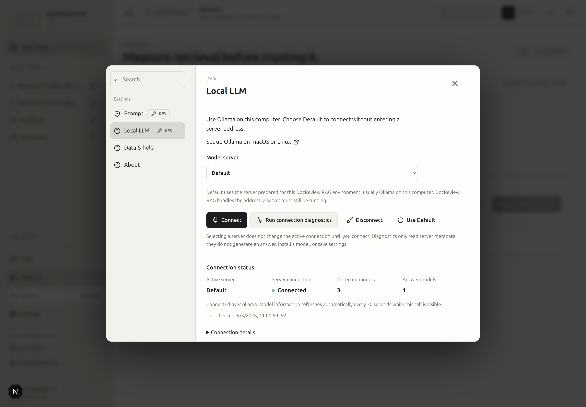
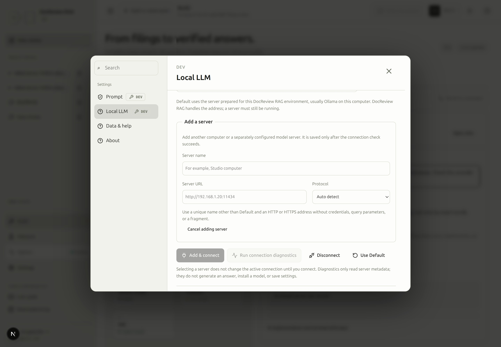
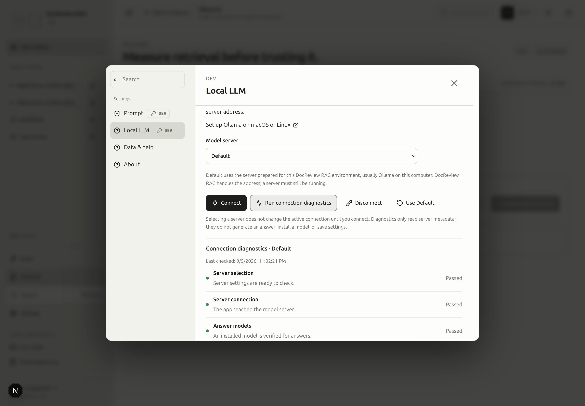

# Set up Ollama on macOS and Linux

> [!DEV]
> Connecting and configuring a local answer server in DocReview requires DEV. Installation and service commands are performed by the owner of that computer.

Use this guide when **Settings → Local LLM** cannot find an answer model, or when you want to connect a separately installed Ollama server. Finish [environment setup](environment.md#step-1) first. A prepared DocReview corpus can be reused; installing Ollama does not rebuild documents or embeddings.

The commands below are for you to run deliberately. Reading this page or opening the guide does not install software, download models, change services, or send a question to a model.

## Prepare an installed model

Use **Prepare model** in the pipeline answer-model card or **Settings → Local LLM**. The button loads the selected installed Ollama answer model without downloading a model or sending a question. It reports success only after the server confirms the model is loaded. Loading uses RAM/VRAM and can fail if memory is insufficient. The request keeps the model loaded for five minutes; it may unload after inactivity. Connection diagnostics remain read-only. OpenAI-compatible endpoints do not expose this Ollama-specific action.

## Check what already exists {#check}

Run these on the computer that should host Ollama:

```bash
command -v ollama
curl --fail --silent --show-error --max-time 5 http://127.0.0.1:11434/api/tags
```

An HTTP response containing a `models` array confirms the local API responded. An empty array means no models were listed; it does not mean the server is down. If this succeeds, skip installation and continue with [model selection](#models). The standard API port is **11434**. [Ollama API introduction](https://docs.ollama.com/api/introduction), [List models](https://docs.ollama.com/api/tags).

## Install and start on macOS {#macos}

The current official requirements are macOS 14 or newer. Download the installer from the [official macOS instructions](https://docs.ollama.com/macos), open the DMG, move Ollama to Applications, and open the app. Follow its prompt to make the CLI available if needed.

```bash
open -a Ollama
ollama --version
```

Repeat the [API check](#check). When the app already serves port 11434, do not also start `ollama serve`: a second process cannot own the same listening address. For a failed app start, inspect the recent server log:

```bash
tail -n 80 ~/.ollama/logs/server.log
```

The log location is documented in [Ollama troubleshooting](https://docs.ollama.com/troubleshooting). A Mac model name or processor family alone does not establish where a particular run executed.

## Install and start on Linux {#linux}

If `ollama` is absent, the [official Linux installation](https://docs.ollama.com/linux) uses this installer. It installs software and may require administrator privileges:

```bash
curl -fsSL https://ollama.com/install.sh | sh
```

Inspect a systemd installation first:

```bash
systemctl status ollama --no-pager
```

If the installed service is stopped and you want it running, start it explicitly:

```bash
sudo systemctl start ollama
```

For an installation without a systemd service, start `ollama serve` in a terminal and leave that terminal open. Use one server process. Repeat the [API check](#check) from another terminal. The official page covers manual installation when the installer does not suit your machine.

```bash
ollama serve
```

Read recent service logs without changing anything:

```bash
journalctl -u ollama -n 80 --no-pager
```

For a foreground server, read the terminal where it runs. [Ollama troubleshooting](https://docs.ollama.com/troubleshooting).

## Let the DocReview backend reach the server {#network}

The browser talks to the DocReview backend; that backend connects to Ollama. A successful host-terminal check therefore does not prove that the backend container can reach the same server.

| DocReview backend location | Default server address seen by DocReview |
| --- | --- |
| Native process on the Ollama computer | `http://127.0.0.1:11434` |
| Repository Docker development stack, Ollama on its host | `http://host.docker.internal:11434` |
| A different computer or a custom server | Use **Add a server…** with the address reachable from that backend |

Keep **Default** selected; DocReview resolves the address for this environment. Addresses appear only under **Connection details** for diagnostics. The repository Docker configuration supplies the host-gateway mapping; inside a container, `127.0.0.1` refers to that container. Add a server only for an intentional alternate endpoint; enter its origin without `/api` or `/v1` when using Ollama auto detection.

Ollama normally listens only on host loopback. If backend diagnostics show that the container cannot reach it, a different listening address may be necessary. The following examples listen on **all interfaces**, so use them only with a trusted network boundary that restricts access to the intended clients. Do not expose this unauthenticated local API directly to the Internet. [Ollama server configuration](https://docs.ollama.com/faq), [API authentication](https://docs.ollama.com/api/authentication).

### macOS app listening address {#macos-bind}

After checking that no Ollama work is active, set the app environment, then quit and reopen the Ollama app:

```bash
launchctl setenv OLLAMA_HOST 0.0.0.0:11434
```

Changing an environment variable in an unrelated terminal does not reconfigure an already running macOS app. [Official macOS environment procedure](https://docs.ollama.com/faq#setting-environment-variables-on-mac).

### Linux systemd listening address {#linux-bind}

Open the service override and add the setting under `[Service]`, preserving any existing entries:

```bash
sudo systemctl edit ollama.service
```

```ini
[Service]
Environment="OLLAMA_HOST=0.0.0.0:11434"
```

After checking that no Ollama work is active, apply the override explicitly:

```bash
sudo systemctl daemon-reload
sudo systemctl restart ollama.service
```

For a foreground server, stop that server deliberately before starting it with `OLLAMA_HOST=0.0.0.0:11434 ollama serve`. Run the host API check and DocReview diagnostics again afterward. [Official Linux environment procedure](https://docs.ollama.com/faq#setting-environment-variables-on-linux).

## Install or inspect an answer model {#models}

List installed models first:

```bash
ollama ls
```

Reuse a suitable installed answer model. If none exists, choose a local chat/completion model and exact tag from the [official model library](https://ollama.com/library), checking its license and storage needs. Download only after making that choice:

```bash
# Replace this with the exact model tag you chose.
ollama pull 'MODEL_TAG_FROM_LIBRARY'
```

`pull` downloads model files; it does not run a test question. It can use substantial network traffic and disk space. A cloud model entry is not evidence that its weights are installed locally. [Ollama CLI reference](https://docs.ollama.com/cli).

Inspect an installed model without generating text:

```bash
# Replace this with an exact name from ollama ls.
ollama show 'MODEL_NAME_FROM_LIST'
ollama ps
```

| Information | What it means |
| --- | --- |
| Installed size | Model file size reported by the server; not RAM needed for a run |
| Parameters and quantization | Model metadata, when supplied |
| Maximum context | Model metadata limit; not the context currently allocated to a run |
| Loaded context | Current runtime allocation, only when the loaded-model API reports it |
| Answer capability | Whether the server reports a capability DocReview accepts for answers |
| Not loaded | Normal standby for an installed model; it does not imply failure |

`/api/show` supplies model details; `/api/ps` reports currently loaded models. DocReview's current model list does not collect the maximum or loaded context values: inspect those through Ollama's own tools. Missing fields remain unknown. A larger context allocation generally needs more memory; this guide does not change your selected model, context, or budgets. See [model details](https://docs.ollama.com/api-reference/show-model-details), [loaded models](https://docs.ollama.com/api/ps), and [context length](https://docs.ollama.com/context-length).

### Supported local configurations {#configurations}

DocReview sends every local call with hidden reasoning disabled (`think: false`): a thinking model such as gemma4 otherwise spends the whole output allowance on reasoning and returns an empty structured answer. The Ollama window (`num_ctx`) is the configured input plus output allowance and stays identical for all calls of one run, because Ollama reloads the model whenever the requested window changes (10–12 s per call on a CPU host). Grade rationales are bounded to one sentence. Measured on 2026-09-07 with Ollama 0.30.7, `gemma4:e4b` (8B, Q4_K_M, 9.6 GB) on a Ryzen 7 8845HS without a GPU, five graded chunks, evidence up to 12,000 characters:

| Placement | Prompt evaluation | Generation | Reference question | Recommended settings |
| --- | --- | --- | --- | --- |
| CPU only (`size_vram` 0) | 80–95 tokens/s for an uncached 2.5k-token grade prompt (about 30 s); a repeated prompt prefix is served from cache | about 10 tokens/s (12–14 in isolation) | 36–103 s end to end: grade 19–68 s, verification 17–35 s; the first call after a restart adds a 10–20 s model load | The measured warm-model runs fit 120 s; 300 s leaves more room for a cold load, without guaranteeing completion. Keep `LOCAL_LLM_MAX_OUTPUT_TOKENS` at 600 (grade needs 150–300, verification 140–160). In this measured case, 8,000 evidence characters reduced prompt evaluation with the same outcome. Keep k at the tested value of 5; larger candidate sets were not verified on this CPU. Set `LOCAL_LLM_TIMEOUT_S=300`. |
| GPU or mixed | not measured | not measured | not measured | Start from the CPU settings and lower the wall clock once measured |

Before these changes the same question failed after 77–144 s at the grade step with `output_tokens: used=600 limit=600` and an invalid JSON body: the 600 tokens were hidden reasoning. The `ollama run MODEL ""` preload in the README loads the model with Ollama's default 4,096-token window; DocReview's first call reloads it at the configured window, which is expected. A prompt projected above the remaining input allowance is refused before the call (see [run limits](runtime.md#limits)).

## Connect in DocReview {#connect}

Open **Settings → Local LLM** and use the server selector. **Default** obtains its address from the current DocReview environment. **Add a server…** reveals a server name, alternate address, and protocol. The name is a label that helps you recognize this endpoint later.

<!-- capture:13-local-model -->



*Default resolves the configured local Ollama endpoint without an address field. Actual connection health, three installed models and one answer-capable model are distinguished; addresses remain in Connection details.*

Select **Run connection diagnostics** first. Its title identifies the candidate being checked; the active connection remains unchanged. Check the backend-to-server result and answer-model status, and open **Connection details** to inspect the active/default addresses. Use **Connect** for an existing choice or **Add & connect** for a new server only when you intend to apply it. A failed probe or save keeps the prior working configuration. Connecting an answer server does not change the embedding provider.

<!-- capture:25-add-server -->



*Add a server reveals name, URL and protocol fields. This unsubmitted draft keeps Add & connect disabled while the existing Default connection remains active.*

**Disconnect** disables local answers. **Use Default** checks the startup server before switching and keeps added servers. If that check or save fails, the current working connection remains active.

Return to the conversation and select the installed model in the answer-engine control. A connection check does not submit your draft question. Continue with [answers](answers.md#engines) and [request settings](settings.md#step-10) when you are ready to ask a question.

The **Next step for local answers** card appears at the top of Local LLM settings, including when you open it from Build step 6. **Choose or use a model in conversation** closes settings, returns to the current conversation and focuses the answer-engine selector. Choose **Local LLM**, then an installed answer model. Your existing question stays a draft until you send it.

A reachable server and installed answer models do not establish that a model is loaded or measured. The card names the conversation engine, local model and load state separately. If the saved model disappeared, select an available model; if the server is unreachable or no answer model exists, use the recovery guide or connection diagnostics. First actual use may load a model. After the request, readiness refreshes; Build follows the conversation's local model and shows CPU/GPU placement and recent speed only when reported. Unknown or stale measurements remain unknown. With OpenAI ready and the local model unloaded, the answer stage remains usable and explicitly says that only OpenAI is ready.

### SCREENSHOT NEEDED
<!-- Local LLM next-action flow: real connected/unloaded state, conversation selection, and Build after actual use; English light mode at 360px, 768px and desktop. Capture current observed metadata and compact navigation controls without synthesizing readiness. -->

## Run read-only diagnostics {#diagnostics}

After [registering the project commands](cli.md#register-commands-and-open-help), run:

```bash
rag-ollama-check
rag-ollama-check --web-url http://localhost:8000
rag-ollama-check --details
rag-ollama-check --setup
```

The first command uses the configured web address. Set `--web-url` only when using another frontend address; it is not an Ollama URL. `--details` exposes additional host/container and listener evidence. `--setup` prints manual setup instructions. The diagnostics do not install Ollama, change settings, download or load a model, or generate an answer.

Read failures by layer rather than repeating installation:

| Symptom | Evidence to check | Recovery and verification |
| --- | --- | --- |
| Host API does not respond | App/service state and server logs | Start the intended server, then repeat `/api/tags` |
| Host works; backend fails | Backend result, listening address, host gateway, firewall | Correct the reachable address or approved bind settings; rerun diagnostics |
| Backend works; no answer models | Installed list and reported capabilities | Choose/install a suitable model, then refresh discovery |
| Installed but not loaded | Installed model present; loaded list empty | Standby is normal; no extra warm-up is required |
| Connection is disabled in production | Runtime mode and permission diagnosis | Use the development environment; do not bypass public permissions |
| Connection save fails | The save error and prior active configuration | Keep the working setting, resolve the reported cause, then retry explicitly |
| Answer fails after connection succeeds | Run trace and the recorded failure type | Follow [execution troubleshooting](troubleshooting.md#execution); reachability is not an answer-quality test |

For logs and measured execution, continue with [runtime](runtime.md#local-models). The [CLI reference](cli.md#diagnose-local-model-connectivity) owns the full diagnostic-command details.

Unlike `rag-ollama-check`, `.venv/bin/python -m scripts.diagnostics.local_grade --api-url http://127.0.0.1:8001` loads and runs the model: it builds the workflow's grade prompt from `/retrieve`, calls Ollama with the structured-output schema across thinking on/off and output ceilings, and reports prompt tokens, tokens per second, hidden-reasoning length and JSON validity. Run it only against an isolated stack; it refuses to run in production mode. The [supported configurations](#configurations) table comes from it.

<!-- capture:24-connection-diagnostics -->



*A real read-only Default connection check passed server selection, connectivity and answer-model availability. No settings, models or services were changed.*


### Optional CPU starting preset {#cpu-starting-preset}

Tune input/output tokens and evidence size to the selected model and available hardware. Application defaults remain **60,000 input tokens, 4,000 output tokens and 120 seconds** for the whole run. In **Settings and preview → Advanced → Run limits**, explicitly choose **Local CPU starting point** to apply **24,000 input tokens, 2,000 output tokens, 300 seconds, 6 steps and 8,000 evidence characters** to the current conversation. Opening settings alone changes nothing; saving new-conversation defaults is a separate action.

This is an optional starting point, not a completion guarantee. The inspected Ryzen 7 8845HS host has 8 cores/16 threads and about 45 GiB usable memory. A bounded 128-token `gemma4:e4b` CPU check measured **10.3 tokens/s for generation only**; it did not demonstrate a successful filing answer. Prompt processing, retrieval, model loading and repeated calls also consume time. Compare the next real run's recorded timings before adjusting again.

Whole-run budgets accumulate across calls. Server defaults still cap each local call at **12,000 input / 600 output tokens**; raising a conversation budget does not raise those ceilings. Ollama `num_ctx` is the allocated context window, normally derived from provider input plus output allowances, not the cumulative run budget. See [editable local settings](#editable-options).

### Slow CPU warning before sending {#cpu-warning}

With a local Ollama model selected, the composer shows **Slow local CPU model** when the currently loaded model is CPU-only and a run measured generation below **15 tokens/s** in the last **15 minutes**. This advisory threshold covers the measured 10–14 tokens/s CPU configuration above; it does not predict the total run time. Speed is total `eval_count` divided by total `eval_duration_ms` in seconds for that model's calls, excluding load and prompt-processing time.

The inline notice shows the measured speed and current output/time ceilings; its actions open the settings editor. Recommendations reserve 30% over estimated generation time; they extend the wall clock up to 600 seconds and reduce the output ceiling if needed. Retrieval and prompt processing add time, and actual provider ceilings may be lower, so this is not a completion guarantee. The warning’s **Review recommended limits in settings** button opens **Advanced → Run limits** without changing values or sending. Review the before/after values there and press **Apply recommended limits** explicitly. **Evidence** opens its editor and offers the fixed CPU starting point of **8,000 characters** when the current limit is higher. Applying it does not lead to another reduction suggestion. At or below that value, the editor explains that no further reduction is suggested; manual adjustment remains available. Changes affect only this conversation and never send the question or save defaults automatically. Sending with unchanged values remains available. **Run limits** and **Evidence** open the corresponding Advanced section.

The first run after a backend restart or server change has no measurement and produces no speed warning. Samples stay in the active backend's memory, belong to one server and model digest, and disappear when too old, the model changes/unloads, or placement/timing is unavailable. GPU and mixed placement do not trigger this CPU warning. No benchmark or model load is started to obtain a sample; readiness refreshes after a local run and during normal polling.

### SCREENSHOT NEEDED
<!-- Feature: slow CPU composer warning with measured speed and Run limits/Evidence actions; locale=en; theme=light; state=selected loaded CPU Ollama model below 15 tok/s with a recent real measurement; preserve existing assets. -->

## Which local Ollama settings can I change? {#editable-options}

| Setting | Where it is controlled in DocReview |
| --- | --- |
| Retrieval presets, filters, evidence size and whole-run budgets | Settings and preview; also applies when the answer engine is Local LLM |
| Server address, protocol and available model | Settings → Local LLM and the conversation model selector |
| Local provider input/output ceilings | Server configuration: `LOCAL_LLM_MAX_INPUT_TOKENS` (default 12000) and `LOCAL_LLM_MAX_OUTPUT_TOKENS` (default 600); these are separate from the conversation's whole-run ceilings |
| Local HTTP timeout | Server configuration: `LOCAL_LLM_TIMEOUT_S`; changing the conversation wall clock does not increase this HTTP timeout |
| Ollama `num_predict` | Sent from the effective provider output allowance; raising the conversation limit does not bypass the provider ceiling |
| Ollama `num_ctx` | Sent explicitly using the configured context window, normally local provider input + output ceilings; kept stable across calls in a run |
| `temperature` / `think` | Currently sent as `0` / `false` by DocReview; there are no UI controls for these options |

For server settings, edit the named non-secret configuration values in the environment used to start the backend, then recreate/restart that backend with the updated environment. Do not assume a new browser setting or an `ollama run /set` session changes DocReview API calls. Check **Run details → Server settings** after a real request for the configured and effective budgets. Ollama supports additional generation options, but exposing new options in DocReview requires a separate API/UI change. See the official [chat API](https://docs.ollama.com/api/chat) and [context-window FAQ](https://docs.ollama.com/faq).
