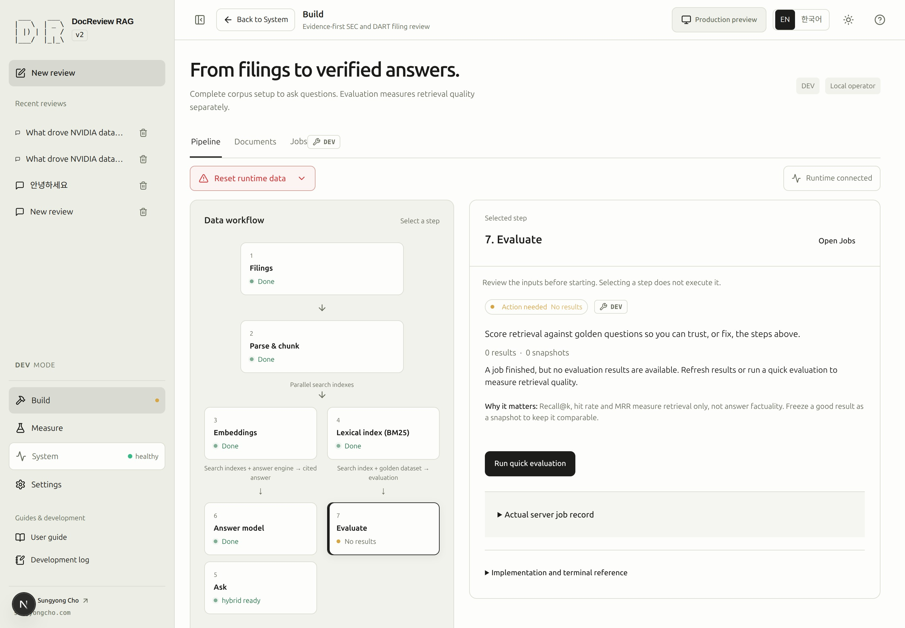
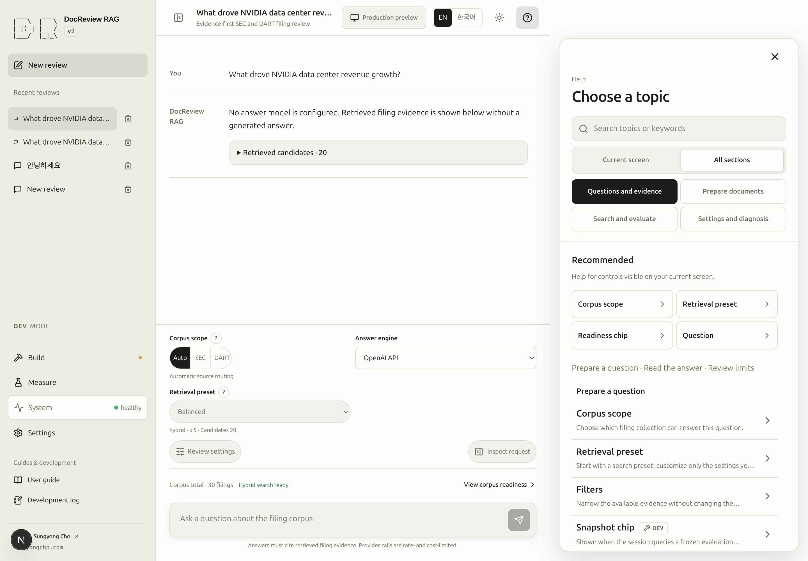
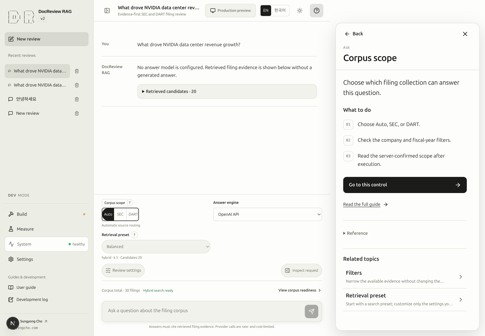
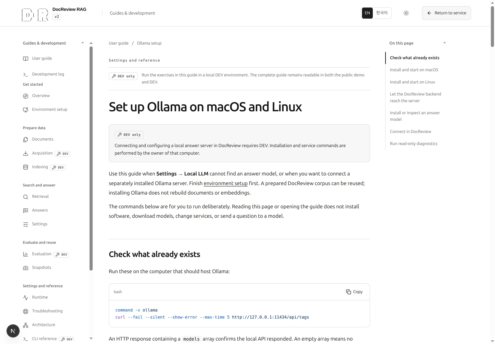

# DocReview RAG guide

To try the running app quickly, open [Quick Start](quickstart.md). If you cloned the repository and are setting up locally from zero, start with [Environment setup](environment.md#qs-setup).

All manual pages are available in both DEV and production; the DEV badge only marks where an operation can be executed.

DocReview RAG v2 helps you read SEC and DART filings through retrieved evidence,
source citations, and measurable retrieval evaluations. Begin with a small question
and one identifiable filing. A finished answer is useful only when its cited source
supports what it says.

These guides follow the actual interface. They separate source acquisition, parsing,
index preparation, retrieval, answering, and evaluation so that you can reuse work
already completed in the same environment.

## Where to start {#start}

| What you have | Where to begin | What to reuse |
|---|---|---|
| An existing local corpus | Inspect [Documents](documents.md#step-2); use [Quick Start — DEV ONLY](quickstart-dev.md) for missing preparation. | Downloaded originals, parsed chunks, compatible embeddings, and a ready BM25 index. |
| A fresh clone or empty local database | Complete [Environment setup](environment.md#qs-setup), then [Quick Start — DEV ONLY](quickstart-dev.md). | Existing source files when their identity and manifest scope match. |
| Access to a running public instance | Follow [Quick Start](quickstart.md) to ask a question, inspect evidence, and browse published documents and [snapshots](snapshots.md). | Only the publicly available corpus; administrator preparation actions require a development environment. |

Do not infer an empty database from a filtered list with no matches, or from a public
catalog with no published documents. [Document visibility](documents.md#visibility)
explains these different states. Unknown readiness is not confirmed readiness.

CLI and Web operations share results only when they use the same database, source
directory, and effective configuration. Inspect the completed result before starting
another download, ingest, index build, or model call. A CLI operation can be absent
from Jobs because it did not use the Web queue.

### SCREENSHOT NEEDED
<!-- Feature: guide entry routing and portfolio navigation; locale=en; light mode; Overview shows the two reader paths and navigation begins Overview, Environment setup, Quick Start, Quick Start — DEV ONLY, with the wrench only on the last entry. Preserve existing assets. -->

## Twelve-step learning path {#learning-path}

This is the full local learning path. Its step numbers stay in procedure order even though the navigation groups usage before preparation. Begin with [Part 1: Setup](environment.md#qs-setup); for Part 2, use the [DEV preparation guide](quickstart-dev.md) and the usage pages. On later visits, skip completed work.

<!-- tutorial-steps -->

Embeddings and BM25 are parallel preparation paths. The numbered sequence makes them
easy to inspect separately; BM25 does not require an answer first. Retrieval evaluation
requires a suitable search index and evaluation dataset, **not a generated answer**.
You can go from prepared retrieval directly to step 11.

## Find the right workspace {#workspaces}

> [!DEV]
> Corpus preparation, dataset editing, live evaluations, and local-model configuration require DEV. Public document reading and published-snapshot browsing remain available.

| Workspace | Use it for |
|---|---|
| Conversation | Questions, answer-engine selection, request inspection, citations, and execution history. |
| Build → Pipeline | Preparation dependencies and the selected stage's inputs and action. Selecting a node does not execute it. |
| Build → Documents | Source identity, search filters, chunks, stored embedding identities, and related work. |
| Build → Jobs | Queued work, progress, results, errors, and supported follow-up actions. |
| Measure | Search trials, evaluation datasets, evaluation runs, and snapshot comparisons. |
| System → System status | API availability, DB/schema, corpus readiness, and model availability as separate facts. |

When you open **View corpus readiness** from a conversation, use **Back**
to return to your question and retained state. See [Settings](settings.md) for request
controls and [Runtime](runtime.md) for interpreting measured execution.

<!-- capture:02-pipeline -->

*Pipeline combines the dependency graph with the selected step. Embeddings and BM25 are parallel preparation paths; evaluation needs an index and dataset, not a generated answer.*

## Use Help and the documentation {#help}

**Help** has a home view and a topic detail view. Home starts with **Recommended** topics for visible controls. Four group filters—**Questions and evidence**, **Prepare documents**, **Search and evaluate**, and **Settings and diagnosis**—filter topic rows in place. Subgroup headings organize those rows; click a topic once to open its detail.

<!-- capture:21-context-help -->

*Help opens directly to recommended controls and four inline task filters. Topic rows are reachable from this home screen without intermediate category pages or floating number badges.*

Each detail begins with a short summary and three **What to do** steps. Expand **Reference** for the full explanation, or use **Read the full guide** to open the related document in a new tab. **Back** returns directly to home and restores its search, group, scope, and scroll position. Selecting a topic outlines its control when visible; the home view does not place numbered markers across the app.

<!-- capture:26-help-topic -->

*A topic opens in one click with a short meaning, three steps, an explicit control link, and optional reference material. Back returns directly to the preserved Help home; only the selected visible control is highlighted.*

**Search help** accepts Korean or English regardless of the displayed language. **Current screen / All sections** changes the search scope; title matches rank above body matches. Search runs locally without a model call. **Go to this control** focuses the visible control, while an offscreen topic offers navigation to its owning screen or editor section. Opening help or following that navigation does not execute the described operation or change its settings. Close an active dialog before using Help.

The documentation menu groups the guides; previous and next links follow the learning
path. The language switch keeps the current document. Code-card copy buttons copy
the original code, and wide tables can scroll horizontally. Existing source text,
questions, answers, model names, and raw logs keep their original language.

<!-- capture:29-documentation-menu -->

*The documentation menu uses one registry for 15 focused guides, grouped navigation and distinct semantic icons. The Ollama guide provides separate macOS/Linux setup and read-only connection diagnostics.*

For a failure, begin with [Troubleshooting](troubleshooting.md): identify the symptom,
read the recorded evidence, apply the relevant remedy, and verify the result. For
implementation context, use [Architecture](architecture.md). Detailed commands and
their environment belong in the [CLI reference](cli.md).

Continue with [Quick Start](quickstart.md) to try the app, or [Environment setup](environment.md#qs-setup) to run a fresh clone.

### Back, forward and shared locations

The header places **Back** and **Forward** around the current workspace, tab and conversation
title. Both arrows remain visible and are disabled at the ends of the recorded history.
Click the title to open **Navigation history**, then choose an earlier or later entry.
Arrow keys, Home/End and Enter operate the list; Escape or an outside click closes it.
On narrow screens the list opens as a bottom sheet.

App arrows and browser back/forward use the same history. A new navigation after going back
clears forward entries. Returning restores the retained controls, conversation draft, focus
and scroll; unsaved evaluation questions still require confirmation before leaving.

The URL records the view, tab, selected Build stage or evaluation result, and local conversation
ID. Reloading restores that location. A conversation ID absent from this browser falls back
to its most recent saved conversation. Message text and drafts are never placed in the URL.
Locale/theme parameters, the application base path and tutorial links remain intact.

### SCREENSHOT NEEDED

<!-- Feature: bidirectional header navigation and history list; locale=en; light mode; show Back/current location/Forward with the current list entry marked, including narrow-screen sheet. Preserve existing assets. -->

## Browser storage {#browser-storage}

PROD keeps conversations, defaults, filters, presets, language/theme and help preferences in this browser and origin only. They are not synced and may disappear when site data or a private session is cleared. Use **Settings → Data & help → Browser storage** to inspect usage and export/import a backup before clearing. The first-visit ⚠️ notice links to the [complete inventory, recovery and clearing guide](settings.md#browser-storage). DEV and its memory-only production preview retain their existing behavior.
