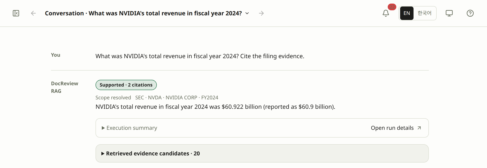

# DocReview RAG guide

Ask about SEC and DART filings, verify original evidence, and compare search results. Try the public service without installing anything locally.

## What would you like to try? {#start}

<!-- guide-features -->

- **[Ask about a company](quickstart.md#qs-app-2)**

  Choose a filing, ask a question, and inspect the answer and execution summary.

  [Open conversation →](/docreview-rag/?view=review)

  [Quick Start](quickstart.md)

- **[Check an answer's sources](answers.md#inspection)**

  Open a cited passage to verify the claim, company, and year.

  [Browse filings →](/docreview-rag/?view=build&tab=documents)

  [Inspect answers](answers.md) · [Document guide](documents.md)

- **[Compare search results](snapshots.md#comparison)**

  Compare published snapshots to see which evidence search found or missed.

  [Open comparisons →](/docreview-rag/?view=measure&tab=compare)

  [Snapshot guide](snapshots.md) · [Understand retrieval](retrieval.md)

## Working on your own machine? {#local-start}

Read all 17 guides in either mode. DEV badges mark tasks that need a development environment. Choose your starting point below.

<!-- guide-local-paths -->

- **[Start from a fresh clone](environment.md#qs-setup)**

  Set up the environment and prepare two filings with [Quick Start for DEV MODE](quickstart-dev.md).

- **[Continue with existing data](documents.md#step-2)**

  Check sources, chunks, compatible embeddings, and BM25; run only the missing [preparation step](quickstart-dev.md).

The public corpus has 18 filings: NVIDIA and AMD FY2019–FY2024, plus Samsung Electronics and SK hynix FY2022–FY2024. Fresh DEV installations lack this corpus; their default selection only describes work to prepare.

An empty list does not mean an empty database. Check filters and [document visibility](documents.md#visibility) before rebuilding.

CLI and Web share results with the same database, source directory, and configuration. The corpus helper submits Build jobs; tools outside the queue may have no Jobs entry. Check existing results before downloads, ingestion, indexing, or paid calls.

## The full workflow, in three stages {#learning-path}

These 12 steps follow the preparation and review order. Open a step for prerequisites and expected results; skip completed work. To try the public service, start with the tasks above.

<!-- tutorial-steps -->

Chunks feed two indexes: embeddings and BM25. Hybrid search needs both; vector search needs compatible embeddings, and lexical search needs BM25. With a dataset of expected evidence, you can evaluate retrieval before generating answers.

## Find the right workspace {#workspaces}

| Workspace | Task and result |
|---|---|
| Conversation | Ask, follow the run, and verify answers through citations and retrieved candidates. |
| Build → Pipeline | Check dependencies and run missing stages in DEV. Selecting a node only opens its screen. |
| Build → Documents | Inspect filing details, chunks, and embedding coverage. |
| Build → Jobs | Check progress, completion, and errors; explicitly retry work when needed. |
| Measure | Run retrieval and evaluation in DEV; compare published snapshots in PROD. |
| System → System status | Check API, database, schema, corpus, and model status to locate a problem. |

Corpus preparation, dataset editing, live evaluation, and local-model setup require DEV. Public visitors can read eligible documents and published snapshots and use the configured OpenAI answer service within its allowance. [Settings](settings.md) explains request choices; [Runtime](runtime.md) explains what the execution records establish.

## Use Help and the documentation {#help}

1. Open **Help** when you need the meaning of a visible control. Recommended topics reflect the current screen; search accepts Korean and English and can cover the current screen or all sections.
2. Open a topic to read its summary and **What to do** steps. **Go to this control** focuses the control or takes you to its screen. This navigation does not execute its action.
3. Choose **Read the full guide** when you need the complete task, its prerequisites, or the meaning of its result. **Back** in Help restores the previous search, filter, and scroll position.

The documentation menu preserves the 17-guide reading path. Previous/next links continue that path, and changing language keeps the same document. Code cards copy the original command, and wide tables scroll horizontally. Source text, questions, answers, model names, and logs retain their original language.

For a failure, use [Troubleshooting](troubleshooting.md) to connect the recorded symptom to a specific check. For implementation context, read [Architecture](architecture.md). Use the [CLI reference](cli.md) when a task requires a terminal.

<!-- heading-alias: back-forward-and-shared-locations -->
### Back, forward and shared locations {#navigation}

Use the header's **Back** and **Forward** arrows to return between the conversation and an inspection screen. Click the current location to choose an entry in **Navigation history**; arrow keys, Home/End, Enter, and Escape operate the list. On a narrow screen it opens as a bottom sheet.

App navigation and browser history share the same sequence. Returning restores retained controls, conversation drafts, focus, and scroll. A new navigation after going back replaces the forward path; leaving unsaved evaluation questions still requires confirmation.

The URL identifies the workspace, tab, selected preparation stage or evaluation result, and local conversation. Reload restores that location. A conversation missing from this browser falls back to its most recent saved conversation. Message text and drafts are never included in the URL.

<!-- screenshot: manual-navigation-and-task-return -->

*1. Restored question and answer · 2. Preserved conversation context*

## Browser storage {#browser-storage}

PROD stores conversations, defaults, filters, presets, language/theme, and Help preferences in this browser and origin. They are not synchronized. Before clearing site data, open **Settings → Data & help → Browser storage** and export a backup. The [storage guide](settings.md#browser-storage) explains the inventory, import, and clearing scopes. DEV retains its own storage behavior.

<!-- heading-alias: public-openai-allowance -->
## Public OpenAI allowance {#allowance}

In PROD only, the answer-model caption shows **Remaining · Minute 7/10 · Day 32/50**, using current server values rather than a browser estimate. It refreshes after a request, when you return to the tab, and every 30 seconds while the conversation view is visible. During a request it waits for the next usage update; a failed lookup shows that remaining usage is unavailable. The counts are shared by IP and do not override the shared cost budget. DEV and canned demonstrations do not query or display this public usage indicator.

The public policy allows 10 requests per minute and 50 per rolling 24 hours per IP, with a shared $0.10 allowance per UTC day and a $0.005 ceiling per model call. The configured text model is `gpt-5.6-luna`; semantic search uses `text-embedding-3-large` at 384 dimensions. **Limits & availability** reports the server's current availability, not an account invoice or a promised number of answers.

Answer calls and query embeddings reserve allowance immediately before the OpenAI call. Keyword-only retrieval and saved-result reads do not use it. IP windows expire with time; the shared day resets at UTC midnight. The reservation ledger at `data/runtime/public-ai-limits.sqlite3` survives application restarts on the same persistent volume. It coordinates processes on one host, not multiple independent hosts. [Environment setup](environment.md#production-deployment) describes that deployment boundary.
