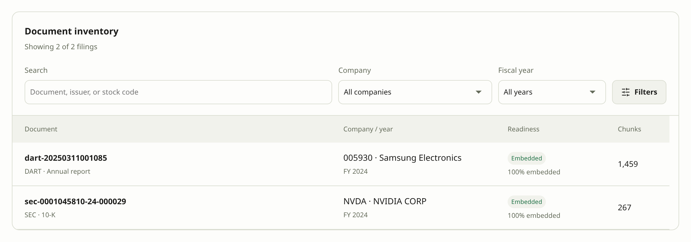

# Quick Start for DEV MODE {#quick-start-for-dev-mode}

This guide prepares filings and search indexes in a running local DEV instance. First complete [Environment setup](environment.md#qs-setup). No downloaded filings, database rows, chunks or embeddings are assumed; a tracked manifest alone does not mean a source is on disk.

**If the service is not running yet**

Run these commands from the cloned repository.

```bash
source ./rag-alias.sh
rag-dev start
```

Choose CLI or Web for the same seven preparation steps. Switching tabs does not execute work. Service readiness and data readiness are separate; reuse anything already complete in the same environment.

Add `--verbose` or `-vv` to any command for detailed output. See the [CLI guide](cli.md) for the complete command reference.

<!-- details: local-prod-preview | Try prepared public data in PROD -->

DEV intentionally has no `--ready`: this guide lets you perform each preparation step yourself. To explore prepared data directly, use the separate local PROD database. Replace `/path/to/public-bundle` below with the actual path to your saved public bundle.

**Start PROD and prepare its data**

```bash
rag-prod start --local --ready --artifacts /path/to/public-bundle
```

**If PROD is already running**

```bash
rag-prod prepare --local --artifacts /path/to/public-bundle
```

[Local PROD preparation](cli.md#local-prod-data) reuses saved vectors without automatic downloads or paid embedding generation.

<!-- /details -->

<!-- details: startup-reset-reference | Reset command reference — not needed for ordinary startup -->

Use these commands only when a reset is intended. Read the deletion scope and confirmation before proceeding.

**Clean up a separately confirmed checkout's runtime environment**

```bash
rag-prod reset environment --local --all-modes
```

**Reset ORM data and sources while preserving configuration and volumes**

```bash
rag-dev reset data --local
```

See the [CLI reset guide](cli.md) for the exact scope and recovery conditions.

<!-- /details -->

<!-- quickstart-cli -->

## CLI {#qs-cli}

Run the commands from the cloned repository, confirm prompted operations, and wait for each job before continuing. If a job fails, inspect the error in Jobs or `rag-dev corpus status`, correct credentials, missing sources, or provider configuration, then retry. See [troubleshooting](troubleshooting.md).

### 1. Verify the empty environment {#qs-cli-1}

```bash
rag-dev corpus inspect
rag-dev corpus readiness
```

The API responds, the database is connected, the schema is compatible, and writable is true. A genuinely empty test database has zero documents and chunks.

### 2. Download NVIDIA SEC FY2024 {#qs-cli-2}

```bash
rag-dev corpus acquire_edgar --identifier NVDA --year 2024
rag-dev corpus status
```

One NVIDIA FY2024 report is available. The job reports `manifest.json` and selection `sec-08b5f645cc174083`, which identifies exactly this report.

### 3. Download Samsung DART FY2024 {#qs-cli-3}

```bash
rag-dev corpus acquire_dart --identifier 005930 --year 2024
rag-dev corpus status
```

One Samsung FY2024 report is available. The job reports `manifest.json` and selection `dart-1a4f24de25a92617`. Fiscal year 2024 normally refers to an annual report filed in 2025.

<!-- details: default-selection-scope | What an ordinary fresh start selects -->

Ordinary fresh start selects NVIDIA and AMD FY2019–FY2024 plus Samsung Electronics and SK hynix FY2022–FY2024 (18 exact company/year pairs). Selection includes pending downloads and is independent of the source inventory. Explicit choices, including clearing the selection, survive reload until the next server reset. The company picker accepts only the tested catalog (NVDA, AMD, INTC, MU, 005930, 000660, 035420); the four default companies are not the entire supported catalog.

<!-- /details -->

### 4. Parse, chunk, and store both reports {#qs-cli-4}

```bash
rag-dev corpus inspect
rag-dev corpus ingest_manifest --manifest manifest.json --selection sec-08b5f645cc174083 --expected-documents 1
rag-dev corpus status
rag-dev corpus ingest_manifest --manifest manifest.json --selection dart-1a4f24de25a92617 --expected-documents 1
rag-dev corpus status
```

Both selected sources ingest successfully. The database contains the two target reports with nonzero chunk counts. Inspect a chunk and its source identity rather than expecting a fixed chunk total.

### 5. Generate OpenAI embeddings {#qs-cli-5}

```bash
rag-dev corpus inspect
rag-dev corpus backfill_embeddings
rag-dev corpus status
```

Job succeeded; pending_embeddings is zero; both reports have embeddings produced by the configured OpenAI model. Matching dimensions alone do not prove matching model identity.

### 6. Build the BM25 index {#qs-cli-6}

```bash
rag-dev corpus rebuild_bm25
rag-dev corpus status
```

Job succeeded, progress is complete, and bm25_ready is true. A successful download or embedding job alone does not establish BM25 readiness.

### 7. Confirm readiness before asking {#qs-cli-7}

```bash
rag-dev corpus inspect
rag-dev corpus readiness
```

Data and index preparation are complete. Model configuration is present, but an answer call and answer quality have not been tested.

<!-- quickstart-web -->

## Web {#qs-web}

Use the screens, confirm prompted operations, and wait for each job before continuing. If a job fails, inspect the error in Jobs or `rag-dev corpus status`, correct credentials, missing sources, or provider configuration, then retry. See [troubleshooting](troubleshooting.md).

### 1. Verify the empty environment {#qs-web-1}

Open **System → System status** and click **Refresh**. Confirm DEV, database connection, compatible schema, and OpenAI embedding configuration. An empty corpus is expected.

The API responds, the database is connected, the schema is compatible, and writable is true. A genuinely empty test database has zero documents and chunks.

### 2. Download NVIDIA SEC FY2024 {#qs-web-2}

Open **Build → Pipeline → Filings** and use **Clear selection** to limit this exercise. In **Search/add company or year**, search for `NVDA`, choose NVIDIA, then check `2024`. An on-disk pair enters the selection immediately; a missing pair appears under **To be added**. Confirm that only the intended pair is pending, choose **Sync selection**, and wait for success in **Build → Jobs**.

One NVIDIA FY2024 report is available. The job reports `manifest.json` and selection `sec-08b5f645cc174083`, which identifies exactly this report.

### 3. Download Samsung DART FY2024 {#qs-web-3}

Return to **Filings** and keep the downloaded NVIDIA pair selected. Use **Change company**, then **Search/add company or year** to choose `005930` and check `2024`. Confirm **To be added** lists only the missing Samsung pair, choose **Sync selection**, and wait for its DART job in **Jobs**. Ready pairs remain selected without another download.

DART first downloads its issuer-code index. This endpoint can be slow: watch the byte progress in Jobs and do not submit another download while it is running.

One Samsung FY2024 report is available. The job reports `manifest.json` and selection `dart-1a4f24de25a92617`. Fiscal year 2024 normally refers to an annual report filed in 2025.

<!-- details: default-selection-scope-web | What an ordinary fresh start selects -->

Ordinary fresh start selects NVIDIA and AMD FY2019–FY2024 plus Samsung Electronics and SK hynix FY2022–FY2024 (18 exact company/year pairs). Selection includes pending downloads and is independent of the source inventory. Explicit choices, including clearing the selection, survive reload until the next server reset. The company picker accepts only the tested catalog (NVDA, AMD, INTC, MU, 005930, 000660, 035420); the four default companies are not the entire supported catalog.

<!-- /details -->

### 4. Parse, chunk, and store both reports {#qs-web-4}

After each download completes, preparation state refreshes automatically. Open **Parse & chunk**, confirm that both intended downloaded reports appear under **Selected documents**, and choose **Parse & chunk selected sources** once. Wait for the ingest job to succeed. You can clear and reselect downloaded years directly in this step; the choices remain visible. Only filings acquired in step 1 enter this flow. Equivalent duplicate primary artifacts are resolved by their verified bytes; conflicting originals block parsing with an actionable manifest message.

The catalog can describe other reports. The selected document and source counts determine completion for this exercise.

Both selected sources ingest successfully. The database contains the two target reports with nonzero chunk counts. Inspect a chunk and its source identity rather than expecting a fixed chunk total.

### 5. Generate OpenAI embeddings {#qs-web-5}

Choose **Embeddings**. Verify the OpenAI provider and pending chunk count. Review the cost notice, then run the embedding action. Follow **Jobs** until success; the call covers all pending chunks in this database.

Job succeeded; pending_embeddings is zero; both reports have embeddings produced by the configured OpenAI model. Matching dimensions alone do not prove matching model identity.

### 6. Build the BM25 index {#qs-web-6}

Choose **BM25** and run its build action. Wait for success in **Jobs**. This indexes the parsed text; it does not generate an answer.

Job succeeded, progress is complete, and bm25_ready is true. A successful download or embedding job alone does not establish BM25 readiness.

### 7. Confirm readiness before asking {#qs-web-7}

Open **System status** and **Build → Documents**. Verify both reports have chunks, embedding coverage is complete, and BM25 is ready. Confirm the OpenAI answer engine is configured. Do not submit a question yet.

Data and index preparation are complete. Model configuration is present, but an answer call and answer quality have not been tested.

<!-- screenshot: web-readiness-before-first-question -->



*1. Prepared filings · 2. Embedding coverage · 3. Index readiness*

<!-- quickstart-end -->

## Ready for the next tutorial {#qs-next}

[Next: test retrieval and inspect evidence](retrieval.md#step-8)

No question or answer was executed in Quick Start. After inspecting retrieval evidence, continue to [the first answer](answers.md#step-9).

Parsing stores documents and chunks; it does not compute BM25. In Build step 4, use **Compute BM25**
for the first run or **Recompute BM25** after a recorded run. Complete this explicit job after chunk
changes before asking with Balanced/hybrid. Hybrid also requires zero pending embeddings.
