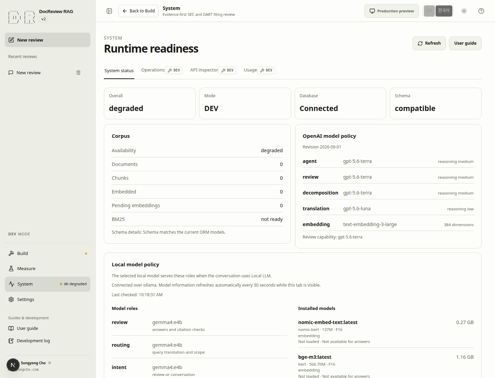
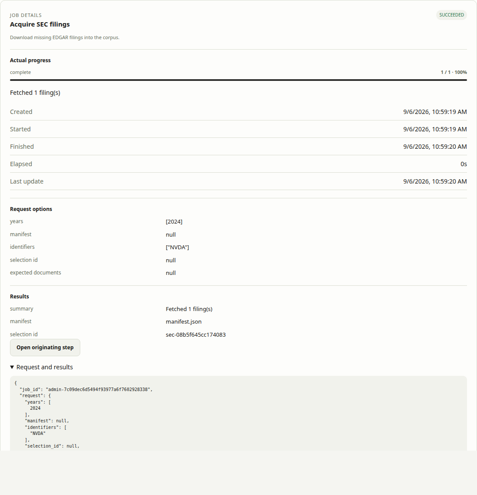
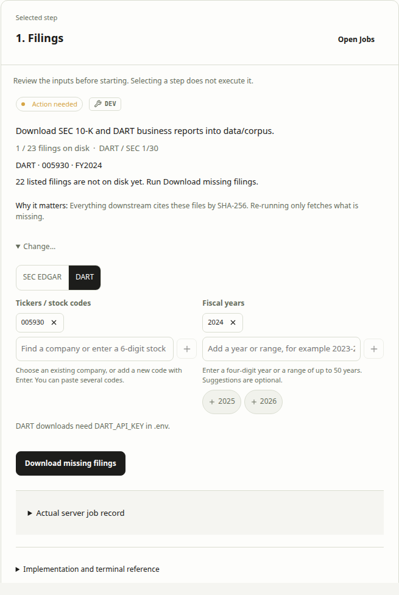
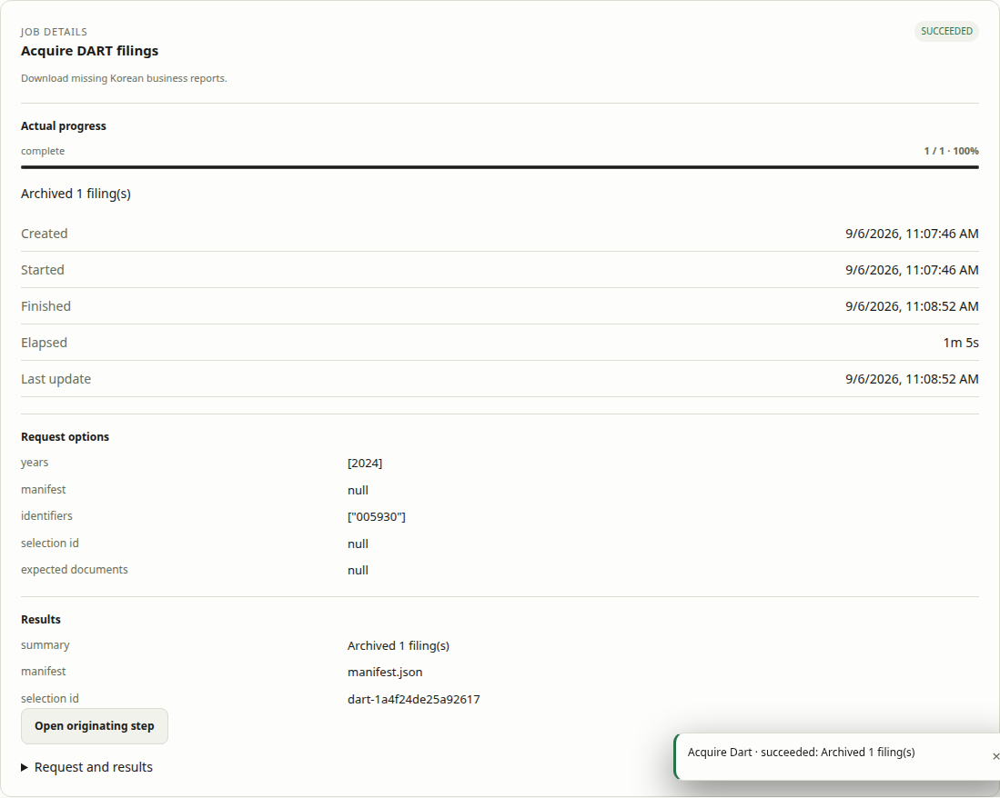
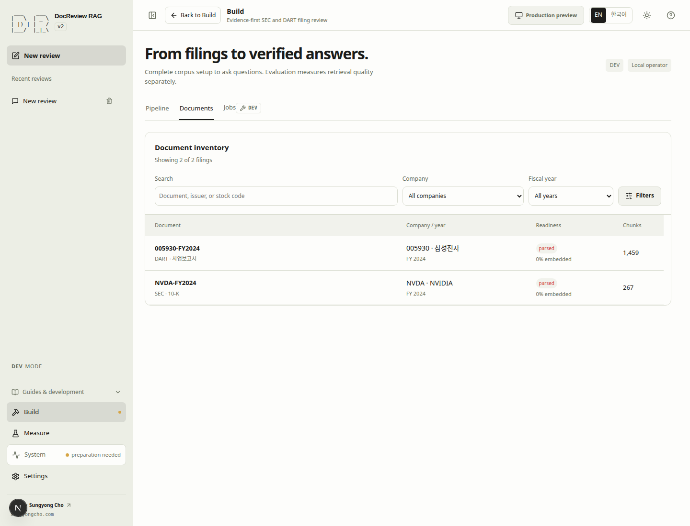
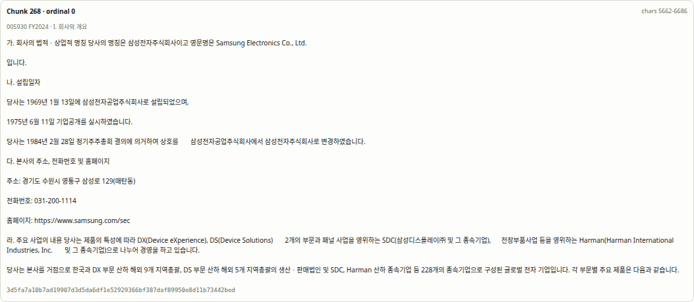
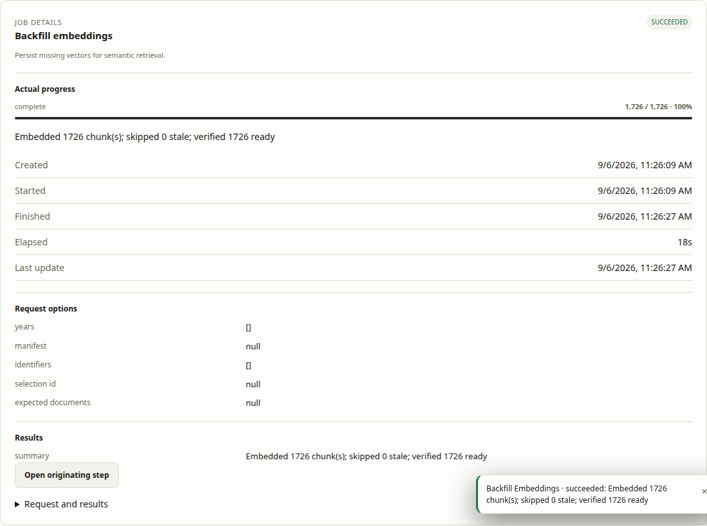
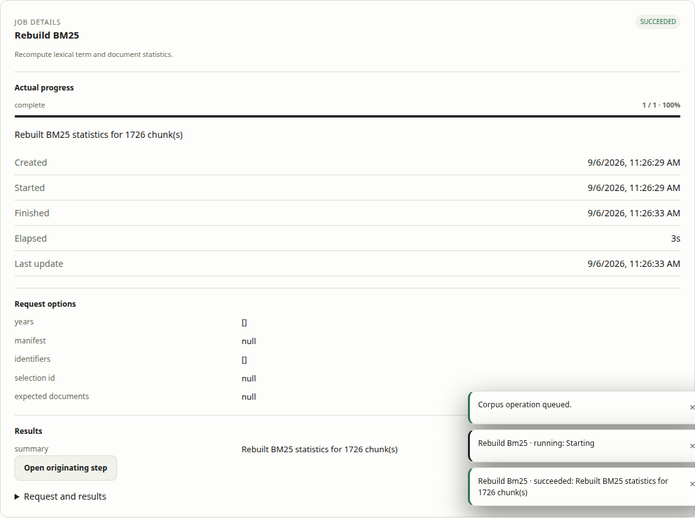
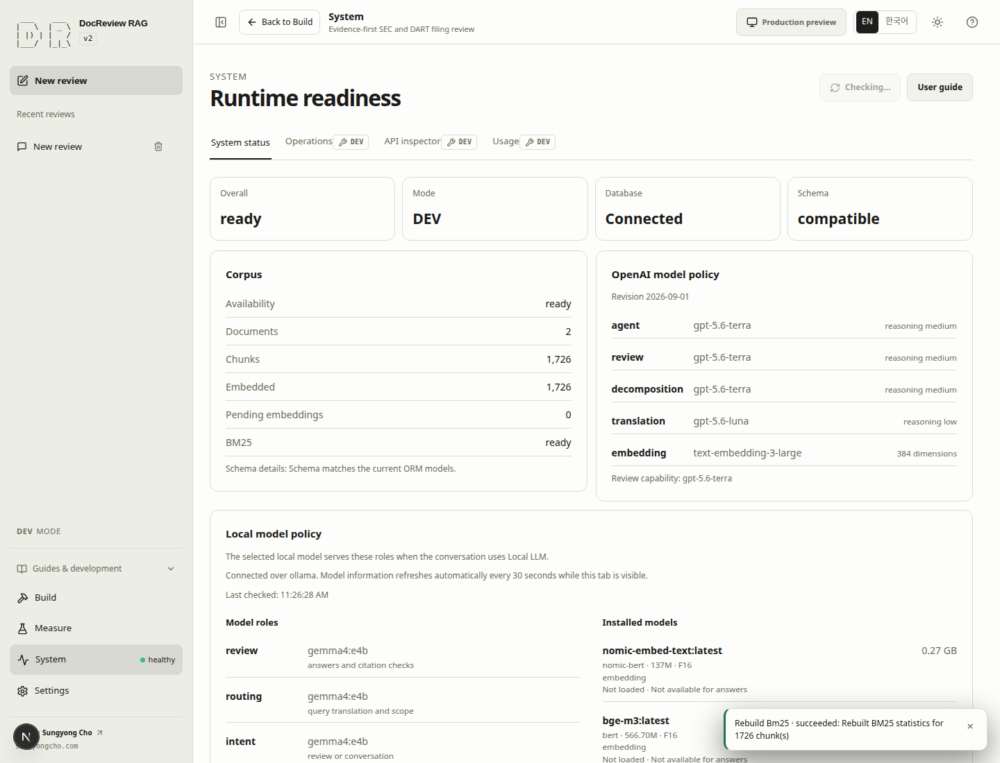
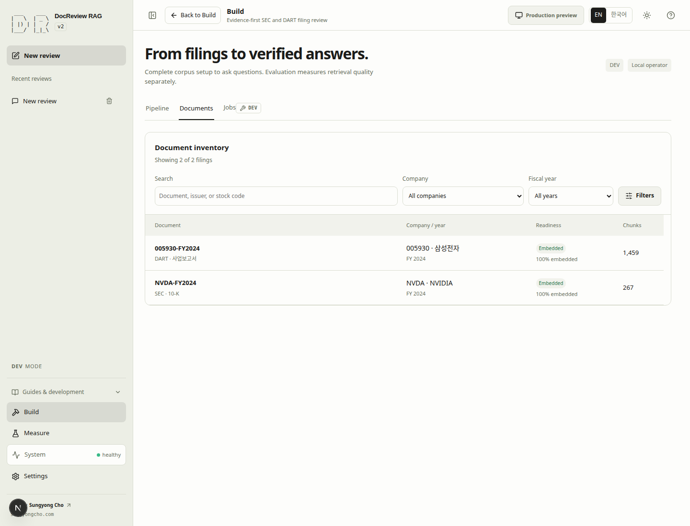

# Quick Start

Prepare a fresh clone for its first search. No raw SEC/DART files, database rows,
chunks, embeddings, or private configuration are assumed to exist. Git includes
a common corpus manifest and parsing profiles; a manifest entry does not mean its source
file has been downloaded.

## Common setup {#qs-setup}

Use Bash or Zsh with uv and Docker Engine / Compose 2.24.4+. Node and npm run in the
web container; this path does not require their installation on the host.

```bash
git clone https://github.com/sungyongcho/docreview-rag-agent.git
cd docreview-rag-agent
./rag_alias.sh
source ./rag_alias.sh
rag-help
rag-quickstart
```

Choose Y to install the helper startup registration; N leaves it unchanged. Then source the file as shown to use the commands immediately without restarting your shell.

The Helper is included in the clone. `source` registers this terminal; see
[permanent shell registration](cli.md) for an optional startup entry.
The first run creates `.env` only if absent. Edit it locally and rerun `rag-quickstart`:

```dotenv
SEC_USER_AGENT=Your Real Name your-real-contact@example.org
DART_API_KEY=<your-own-dart-key>
OPENAI_API_KEY_LOCAL=<your-own-openai-development-key>
EMBEDDING_PROVIDER=openai
EMBEDDING_MODEL=text-embedding-3-large
```

Replace every placeholder. DEV reads only `OPENAI_API_KEY_LOCAL`; production reads
only `OPENAI_API_KEY_PROD`. Never paste keys into this page or capture them in screenshots.
The repository uses 384 embedding dimensions. Deterministic embeddings do not satisfy
this tutorial. Downloading filings needs valid SEC contact details and a DART key;
generating embeddings incurs OpenAI usage. The first-run command does neither.

The command creates a schema only in an empty database, preserves a compatible
existing database, and reports schema drift without resetting it. Fix missing tools
or configuration and rerun the same command; do not use `rag-fresh-start` to repair
installation. Open the printed URL, normally `http://localhost:8000/docreview-rag-agent/`.

**Service ready is not data ready.** The following two interfaces perform the same
seven steps. Choose one; switching tabs does not start any operation. The web path
requires your DEV instance, even if you are reading this guide on a public deployment.

The setup command reports five stages: prerequisites, local configuration, project
service state/startup, schema preparation, and DEV server readiness. It identifies
`db`, `app`, and `web` as stopped, starting, unhealthy, or running; a running container
without a health check is not proof of server readiness. Existing healthy services
are reported before Compose reconciles the development configuration.

If configuration blocks progress, edit the printed `.env` path and correct or unset
conflicting shell exports, then rerun `rag-quickstart` (or `bash scripts/stack/quickstart.sh`).
That invocation has not started services; any existing services remain unchanged.
For startup failures, use `rag-dev ps -a` and `rag-dev logs --tail 50` before retrying.
For incompatible schemas, run `.venv/bin/python -m scripts.schema check`;
Quickstart uses the local `DB_PORT`, not an external `DATABASE_URL`. Safe target-selection
recovery is tracked in [#25](https://github.com/sungyongcho/docreview-rag-agent/issues/25).
Do not reset your database to resolve this setup stop.

After readiness succeeds, open the printed application or language-specific tutorial
URL. Choose CLI or Web below and begin with step 1, then acquire the two reports.

<!-- quickstart-cli -->

## CLI {#qs-cli}

### 1. Verify the empty environment {#qs-cli-1}

Run from the cloned repository. Confirm prompted operations and wait for each job before the next command.

```bash
rag-corpus inspect
rag-corpus readiness
```

**Complete when:** API responds; database is connected; schema is compatible; writable is true. A genuinely empty test database has zero documents and chunks.

**If blocked:** inspect the job error in Jobs or `rag-corpus status`; correct credentials, missing sources, or provider configuration before retrying. See [troubleshooting](troubleshooting.md).

### 2. Download NVIDIA SEC FY2024 {#qs-cli-2}

Run from the cloned repository. Confirm prompted operations and wait for each job before the next command.

```bash
rag-corpus acquire_edgar --identifier NVDA --year 2024
rag-corpus status
```

**Complete when:** One NVIDIA FY2024 report is available. The job reports `manifest.json` and selection `sec-08b5f645cc174083`, which identifies exactly this report.

**If blocked:** inspect the job error in Jobs or `rag-corpus status`; correct credentials, missing sources, or provider configuration before retrying. See [troubleshooting](troubleshooting.md).

### 3. Download Samsung DART FY2024 {#qs-cli-3}

Run from the cloned repository. Confirm prompted operations and wait for each job before the next command.

```bash
rag-corpus acquire_dart --identifier 005930 --year 2024
rag-corpus status
```

**Complete when:** One Samsung FY2024 report is available. The job reports `manifest.json` and selection `dart-1a4f24de25a92617`. Fiscal year 2024 normally refers to an annual report filed in 2025.

**If blocked:** inspect the job error in Jobs or `rag-corpus status`; correct credentials, missing sources, or provider configuration before retrying. See [troubleshooting](troubleshooting.md).

### 4. Parse, chunk, and store both reports {#qs-cli-4}

Run from the cloned repository. Confirm prompted operations and wait for each job before the next command.

```bash
rag-corpus inspect
rag-corpus ingest_manifest --manifest manifest.json --selection sec-08b5f645cc174083 --expected-documents 1
rag-corpus status
rag-corpus ingest_manifest --manifest manifest.json --selection dart-1a4f24de25a92617 --expected-documents 1
rag-corpus status
```

**Complete when:** Both selected sources ingest successfully. The database contains the two target reports with nonzero chunk counts. Inspect a chunk and its source identity rather than expecting a fixed chunk total.

**If blocked:** inspect the job error in Jobs or `rag-corpus status`; correct credentials, missing sources, or provider configuration before retrying. See [troubleshooting](troubleshooting.md).

### 5. Generate OpenAI embeddings {#qs-cli-5}

Run from the cloned repository. Confirm prompted operations and wait for each job before the next command.

```bash
rag-corpus inspect
rag-corpus backfill_embeddings
rag-corpus status
```

**Complete when:** Job succeeded; pending_embeddings is zero; both reports have embeddings produced by the configured OpenAI model. Matching dimensions alone do not prove matching model identity.

**If blocked:** inspect the job error in Jobs or `rag-corpus status`; correct credentials, missing sources, or provider configuration before retrying. See [troubleshooting](troubleshooting.md).

### 6. Build the BM25 index {#qs-cli-6}

Run from the cloned repository. Confirm prompted operations and wait for each job before the next command.

```bash
rag-corpus rebuild_bm25
rag-corpus status
```

**Complete when:** Job succeeded, progress is complete, and bm25_ready is true. A successful download or embedding job alone does not establish BM25 readiness.

**If blocked:** inspect the job error in Jobs or `rag-corpus status`; correct credentials, missing sources, or provider configuration before retrying. See [troubleshooting](troubleshooting.md).

### 7. Confirm readiness before asking {#qs-cli-7}

Run from the cloned repository. Confirm prompted operations and wait for each job before the next command.

```bash
rag-corpus inspect
rag-corpus readiness
```

**Complete when:** Data and index preparation are complete. Model configuration is present, but an answer call and answer quality have not been tested.

**If blocked:** inspect the job error in Jobs or `rag-corpus status`; correct credentials, missing sources, or provider configuration before retrying. See [troubleshooting](troubleshooting.md).

<!-- quickstart-web -->

## Web {#qs-web}

### 1. Verify the empty environment {#qs-web-1}

Open **System → System status** and click **Refresh**. Confirm DEV, database connection, compatible schema, and OpenAI embedding configuration. An empty corpus is expected.

<!-- capture:quickstart-01-en -->



*A fresh DEV environment with a compatible schema and zero documents/chunks.*

**Complete when:** API responds; database is connected; schema is compatible; writable is true. A genuinely empty test database has zero documents and chunks.

**If blocked:** inspect the job error in Jobs or `rag-corpus status`; correct credentials, missing sources, or provider configuration before retrying. See [troubleshooting](troubleshooting.md).

### 2. Download NVIDIA SEC FY2024 {#qs-web-2}

Open **Build → Pipeline → Filings → Change…**. Choose **SEC EDGAR**, leave only `NVDA` and `2024`, then click **Download missing filings**. Open **Build → Jobs** and wait for success.

<!-- capture:quickstart-02-en -->



*The real NVDA FY2024 acquisition completed and recorded its source selection.*

**Complete when:** One NVIDIA FY2024 report is available. The job reports `manifest.json` and selection `sec-08b5f645cc174083`, which identifies exactly this report.

**If blocked:** inspect the job error in Jobs or `rag-corpus status`; correct credentials, missing sources, or provider configuration before retrying. See [troubleshooting](troubleshooting.md).

### 3. Download Samsung DART FY2024 {#qs-web-3}

Return to **Filings → Change…**, choose **DART**, leave only `005930` and `2024`, and click **Download missing filings**. Wait for the DART job to succeed in **Jobs**.

DART first downloads its issuer-code index. This endpoint can be slow: watch the byte progress in Jobs and do not submit another download while it is running.

<!-- capture:quickstart-03-en -->



*Samsung 005930 and fiscal year 2024 selected before acquisition.*



*Samsung FY2024 acquisition succeeded and recorded its source selection.*

**Complete when:** One Samsung FY2024 report is available. The job reports `manifest.json` and selection `dart-1a4f24de25a92617`. Fiscal year 2024 normally refers to an annual report filed in 2025.

**If blocked:** inspect the job error in Jobs or `rag-corpus status`; correct credentials, missing sources, or provider configuration before retrying. See [troubleshooting](troubleshooting.md).

### 4. Parse, chunk, and store both reports {#qs-web-4}

After each download completes, preparation state refreshes automatically. Choose the parsing/indexing stage and find the two selections under `manifest.json`: `sec-08b5f645cc174083` for NVIDIA and `dart-1a4f24de25a92617` for Samsung. Confirm each contains one document with its source present, then run each selection's ingest action and wait for success.

The catalog can describe other reports. The selected document and source counts determine completion for this exercise.

<!-- capture:quickstart-04-en -->



*Both reports are parsed and retain their source identities; embeddings are not yet generated.*



*A real Samsung chunk retains its original text, source character offsets, and SHA-256.*

**Complete when:** Both selected sources ingest successfully. The database contains the two target reports with nonzero chunk counts. Inspect a chunk and its source identity rather than expecting a fixed chunk total.

**If blocked:** inspect the job error in Jobs or `rag-corpus status`; correct credentials, missing sources, or provider configuration before retrying. See [troubleshooting](troubleshooting.md).

### 5. Generate OpenAI embeddings {#qs-web-5}

Choose **Embeddings**. Verify the OpenAI provider and pending chunk count. Review the cost notice, then run the embedding action. Follow **Jobs** until success; the call covers all pending chunks in this database.

<!-- capture:quickstart-05-en -->



**Complete when:** Job succeeded; pending_embeddings is zero; both reports have embeddings produced by the configured OpenAI model. Matching dimensions alone do not prove matching model identity.

**If blocked:** inspect the job error in Jobs or `rag-corpus status`; correct credentials, missing sources, or provider configuration before retrying. See [troubleshooting](troubleshooting.md).

### 6. Build the BM25 index {#qs-web-6}

Choose **BM25** and run its build action. Wait for success in **Jobs**. This indexes the parsed text; it does not generate an answer.

<!-- capture:quickstart-06-en -->



*The real BM25 rebuild succeeded for all parsed chunks from both reports. This index is independent of embedding generation.*

**Complete when:** Job succeeded, progress is complete, and bm25_ready is true. A successful download or embedding job alone does not establish BM25 readiness.

**If blocked:** inspect the job error in Jobs or `rag-corpus status`; correct credentials, missing sources, or provider configuration before retrying. See [troubleshooting](troubleshooting.md).

### 7. Confirm readiness before asking {#qs-web-7}

Open **System status** and **Build → Documents**. Verify both reports have chunks, embedding coverage is complete, and BM25 is ready. Confirm the OpenAI answer engine is configured. Do not submit a question yet.

<!-- capture:quickstart-07-en -->





**Complete when:** Data and index preparation are complete. Model configuration is present, but an answer call and answer quality have not been tested.

**If blocked:** inspect the job error in Jobs or `rag-corpus status`; correct credentials, missing sources, or provider configuration before retrying. See [troubleshooting](troubleshooting.md).

<!-- quickstart-end -->

## Ready for the next tutorial {#qs-next}

[Next: test retrieval and inspect evidence](retrieval.md#step-8)

No question or answer was executed in Quick Start. After inspecting retrieval evidence, continue to [the first answer](answers.md#step-9).
