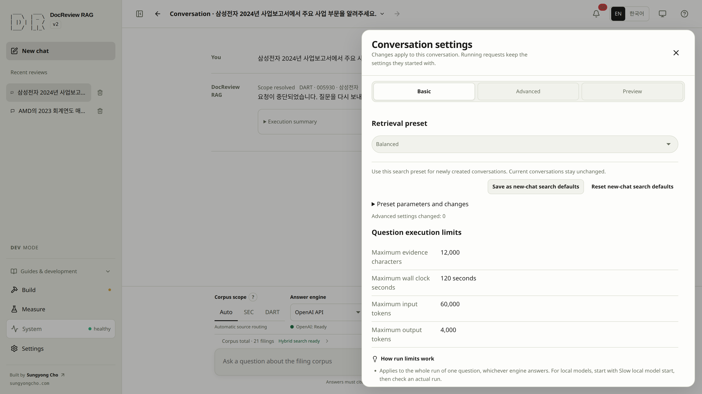

# Inspect retrieval before trusting an answer

Search trial runs one real query against the prepared index and shows every returned passage with its
component ranks and source identity. Retrieval does not establish that an answer is correct; read a
promising excerpt against the original report before choosing a retrieval profile.

## 8. Test retrieval and read the source {#step-8}

> [!GOAL]
> Test the prepared indexes against a real question and read the ranked passages that will support an answer.
>
> **Prerequisites** prepared chunks and the intended retrieval lane ready · **Done** a relevant passage whose original text addresses the question

> [!DEV]
> Search trial runs on the public build through the public `/retrieve` endpoint with a custom retrieval profile bounded by the server (`k` ≤ 10, `candidate_k` ≤ 50, `max_context_chars` ≤ 12000). Answer previews run in DEV mode only; normal public conversation requests follow their own release policy.

1. Open **Measure → Search trial** and confirm that the report has chunks and the selected retrieval lanes are ready; complete [index preparation](indexing.md) as needed.
2. Enter the question below and choose Hybrid, BM25, `k=5`, and no reranker for the initial inspection.
3. Choose **Preview retrieval**. The previously full-width input workspace gains actual results after execution; component rankings, document IDs, excerpts, and final ranks explain the selected passages.
4. Inspect a relevant passage and its original source. Check the company, fiscal year, and whether the text actually addresses the question; a high score alone is insufficient.
5. If results are empty or irrelevant, verify document readiness and scope before changing the question or retrieval profile, using [search troubleshooting](troubleshooting.md) and [settings](settings.md).
6. Continue to [ask the first question](answers.md#step-9), or go directly to [retrieval evaluation](evaluation.md#step-11).

```text
What drove NVIDIA data center revenue growth in fiscal 2024?
```

OpenAI query embeddings can incur cost even when corpus embeddings are ready. **Preview review** is a
separate answer operation with provider usage and a recorded run. Do not invoke it just to inspect
retrieval. Preview retrieval does not persist an evaluation result or alter a conversation profile.


Example: `NVIDIA fiscal 2024 revenue` returns five NVIDIA FY2024 passages in the prepared corpus. Each result retains its source offsets and SHA-256. This is retrieval only; no answer is generated.

## Read the ranking information {#rankings}

| Evidence | How to use it |
|---|---|
| Document and fiscal year | Verify the intended report, including fiscal versus calendar year. |
| Excerpt and source | Read the passage in context; confirm numbers and qualifications. |
| Component ranks | See which configured search lanes found the passage. |
| Final rank | Inspect the fused or reranked ordering, rather than comparing raw scores across lanes. |
| Missing results | Investigate scope, available indexes, and actual text; do not invent a metric. |

The CLI can additionally constrain a search with `--doc-id`; Search trial has no equivalent input.
Differences in scope or other documents in the database can therefore change ranking. See the
[CLI retrieval commands](cli.md#embedding-and-retrieval) for a focused terminal inspection.

For repeated quality measurement, use [evaluation](evaluation.md). The playground is an exploratory
request; an evaluation applies known source labels across a chosen dataset.
