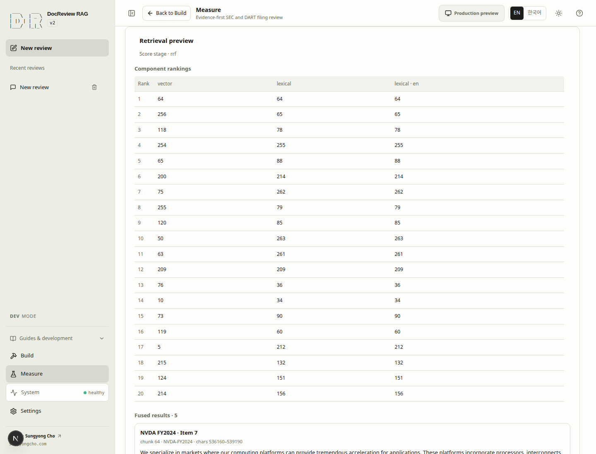

# Inspect retrieval before trusting an answer

Retrieval returns candidate passages, rankings, and source identity. It does not establish that an answer
is correct. Read a promising excerpt against the original report before choosing a retrieval profile.

## 8. Test retrieval and read the source {#step-8}

> [!DEV]
> Live Search trial and its answer preview require the local operator build. The public version links to published snapshots; normal public conversation requests follow their own release policy.

- **Goal:** check that the prepared index finds evidence relevant to a concrete question.
- **Prerequisites:** the report has chunks and the selected retrieval lanes are ready;
  complete [index preparation](indexing.md) as needed.
- **Screen:** Measure → Search trial.
- **Inputs:** enter the question below; choose Hybrid, BM25, `k=5`, and no reranker for the initial inspection.
- **Primary action:** **Preview retrieval**.
- **Visible result:** the previously full-width input workspace gains actual results after execution.
  Component rankings, document IDs, excerpts, and final ranks explain the selected passages.
- **Completion:** inspect a relevant passage and its original source; check company, fiscal year, and whether
  the text actually addresses the question. A high score alone is insufficient.
- **Recovery:** if results are empty or irrelevant, verify document readiness and scope before changing the
  question or retrieval profile. Use [search troubleshooting](troubleshooting.md) and [settings](settings.md).
- **Next:** [ask the first question](answers.md#step-9), or go directly to [retrieval evaluation](evaluation.md#step-11).

```text
What drove NVIDIA data center revenue growth in fiscal 2024?
```

OpenAI query embeddings can incur cost even when corpus embeddings are ready. **Preview review** is a
separate answer operation with provider usage and a recorded run. Do not invoke it just to inspect
retrieval. Preview retrieval does not persist an evaluation result or alter a conversation profile.

<!-- capture:09-retrieval-inputs -->


*Search trial shows a real, unexecuted NVIDIA FY2024 query with Hybrid, BM25 and k=5. Retrieval and answer preview remain separate explicit actions.*


Example: `NVIDIA fiscal 2024 revenue` returns five NVIDIA FY2024 passages in the prepared corpus. Each result retains its source offsets and SHA-256. This is retrieval only; no answer is generated.



## Read the ranking information {#rankings}

| Evidence | How to use it |
|---|---|
| Document and fiscal year | Verify the intended report, including fiscal versus calendar year. |
| Excerpt and source | Read the passage in context; confirm numbers and qualifications. |
| Component ranks | See which configured search lanes found the passage. |
| Final rank | Inspect the fused or reranked ordering, rather than comparing raw scores across lanes. |
| Missing results | Investigate scope, available indexes, and actual text; do not invent a metric. |

The CLI can additionally constrain a search with `--doc-id`; Search trial has no equivalent input.
Differences in scope or other documents in the database can therefore change ranking. See the
[CLI retrieval commands](cli.md#embedding-and-retrieval) for a focused terminal inspection.

For repeated quality measurement, use [evaluation](evaluation.md). The playground is an exploratory
request; an evaluation applies known source labels across a chosen dataset.
