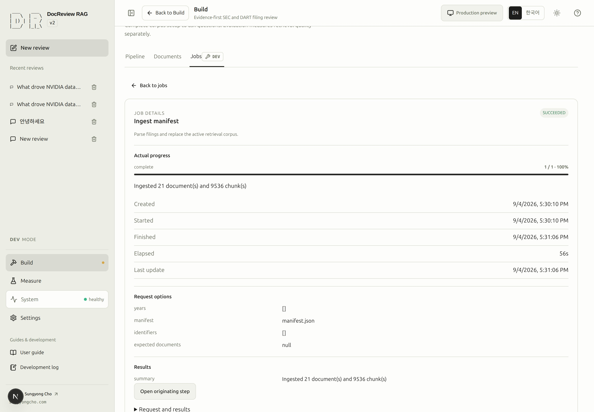
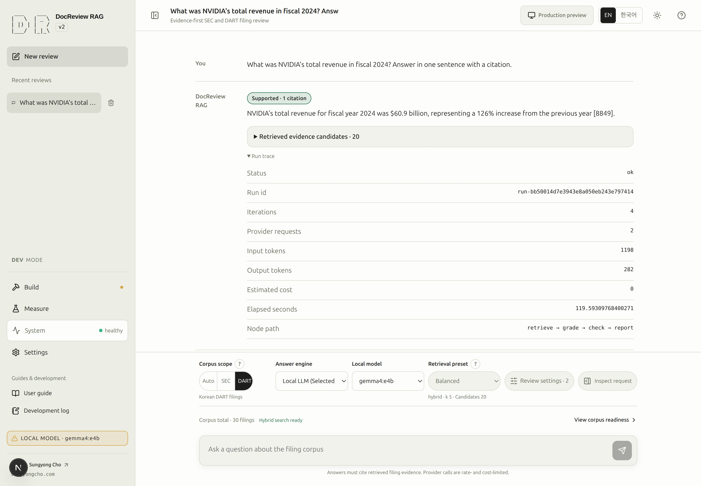
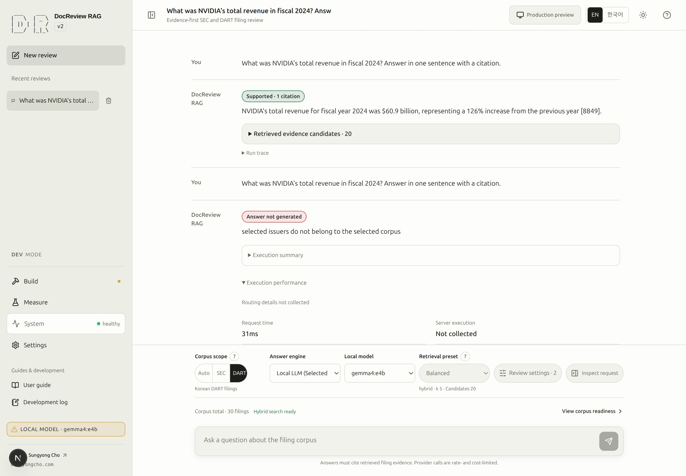
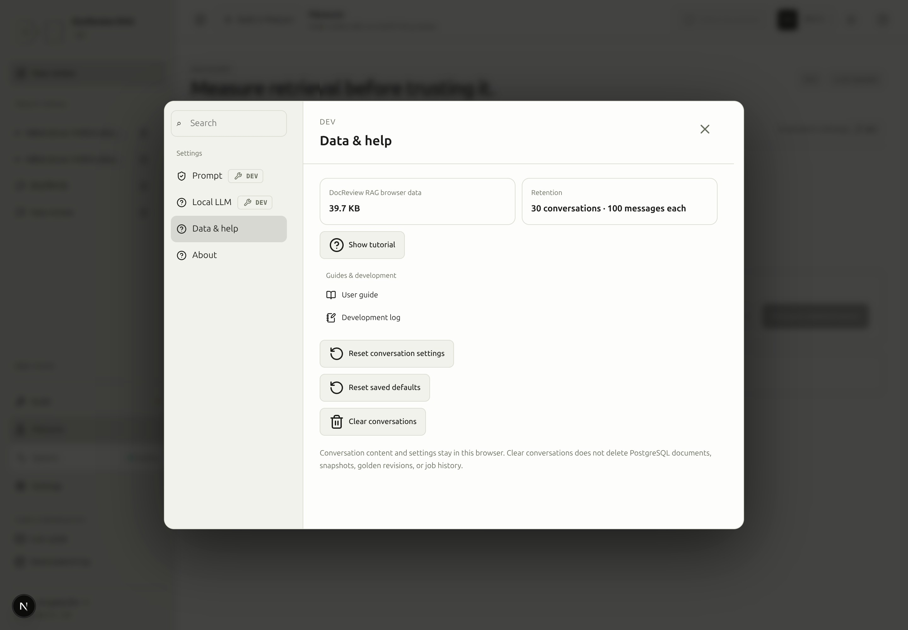

# Read runtime state and measured execution

Three different views answer different questions: **System → System status** checks service prerequisites; **Build → Jobs** follows background work; a conversation's **Execution summary**, **Execution performance**, and **Run trace** explain an individual review. A healthy API does not establish ready vectors, a working answer model, or a successful evaluation.

## Status and job lifecycle {#states}

> [!DEV]
> Starting, cancelling, and retrying corpus or evaluation jobs requires DEV. Reading a public review result is not an administrator job action.

| State | Meaning and next action |
|---|---|
| `queued` | Accepted and waiting. Inspect queue position and request scope. |
| `running` | Actual work is executing. Read current progress; cancel only when supported. |
| `succeeded` | The operation finished successfully. Verify the resulting documents, index, or evaluation result. |
| `failed` | The operation failed. Inspect its error and completed work before retrying. |
| `cancelled` | Cancellation ended the job. It is distinct from a failure and has no automatic retry action. |
| `interrupted` | An application restart cut the job short. It does not resume automatically. |

Failed and interrupted jobs offer **Retry as new job** when the server supports it. Retry creates new work; it does not prove that earlier partial work will be skipped. Review the scope, especially before embedding costs. CLI work performed directly against the same database appears in corpus state but need not have a web job record.

Green completion marks require confirmed readiness or completion. A pulse/spinner indicates actual execution, red indicates failure, amber identifies a missing prerequisite, and neutral means unknown or uncollected. Reduced-motion preferences stop repetitive animation without removing the status text.

<!-- capture:08-jobs -->



*An existing successful SEC manifest ingestion job is selected. Its actual target, progress and result are shown; this is historical work, not a job started for the guide.*

## Execution summary and real timing {#timings}

Open a completed or failed answer's **Execution summary** for the stages actually reached. Auto scope preserves the user's Auto choice while separately showing the registry, companies, years, and reason reported by the server. Before routing resolves, the interface waits; it does not infer a confirmed decision from the question in the browser.

<!-- capture:16-run-trace -->



*The saved successful run records its original ID, four iterations, two provider requests, token counts and about 119.6 seconds elapsed. These are historical recorded values, not a new measurement.*

Open **Run details → Performance** beside the answer. **Execution performance** separates request time measured by the browser from server execution time. Its ASCII bars scale to the longest measured stage in that result. They are elapsed-duration comparisons, not progress percentages or estimated completion times. Stage and model-call rows remain in recorded order, including repeated stages and retries.

| Measurement | Interpretation |
|---|---|
| `Not collected` | No usable measurement was recorded. It is not zero and not one attempt. |
| `0ms` | A measured zero duration. |
| `<1ms` | A positive duration below one millisecond. |
| Calls / attempts | Calls and provider attempts when collected; retries may make them different. |
| Loading / input processing / generation | Separate local-provider timings when that provider returned them. |
| Tokens per second | Calculated only when generated-token count and generation duration exist. |

The accessible table supplies exact values beside the visual bars. Original node IDs, model names, and logs stay intact even when the surrounding labels are translated. CPU/GPU placement remains uncollected unless supported by actual evidence; a long duration alone does not establish a hardware bottleneck. Older saved runs can lack telemetry without being corrupt.

<!-- capture:20-routing-performance -->



*This existing failed request collected 31ms of browser request time but no server routing, stage timings, model calls or CPU/GPU placement. The interface explicitly shows uncollected data instead of inventing measurements.*

## Run limits versus provider limits {#limits}

> [!DEV]
> Changing run budgets requires DEV. Recorded failure fields and collected timings can still be read wherever the result is available.

The default conversation budget is 6 iterations, 60,000 input tokens, 4,000 output tokens, and **120 wall-clock seconds**. These are cumulative run limits across model calls and retries. Inspect the submitted profile because existing conversations can have different values.

The failure field tells you what to change:

- `budget_exceeded`: read `resource`, `limit`, `observed`, and `blocked_node`.
- `provider_failure`: read `status`, `attempts`, `details`, and `node`.
- `node_error`: read `error_type`, `message`, and `node`.

Adjust a run budget under **Review settings → Run limits**. Prompt/evidence size is under **Review settings → Evidence**; it is a separate control. A provider timeout or authentication error is not fixed by raising the run token limit. Public request-rate and monetary allowances are another boundary, shown under System's limits. See [execution troubleshooting](troubleshooting.md#execution).

**Run details → Trace** exposes the recorded run ID and failure fields. For API inspection, the resources are `GET /runs/{run_id}` and `GET /runs/{run_id}/traces`; there is no run-list route. Opt-in stream stage telemetry uses `X-DocReview-Telemetry: stages`. Existing clients without that header retain the default event contract.

## Local-model facts {#local-models}

> [!DEV]
> Local-server configuration and model selection controls require DEV. Public requests use the release configuration; they do not expose local-server controls.

**System → System status** distinguishes role configuration from installed models. The **Local model policy** and **Local runtime** panels carry a **DEV** badge because they exist only in a development runtime. **Settings → Local LLM** offers **Default**, saved servers, and **Add a server…**. Use **Run connection diagnostics** to inspect a candidate before explicitly connecting, then choose the answer engine and discovered model in the conversation. Saving a connection does not switch the engine automatically.

If replacement discovery or saving fails, the working connection is preserved. Resolve the reported endpoint or model-capability error before trying again. A server responding to health checks can still fail an actual generation request. Changing the answer engine also does not replace the embedding identity already stored in the corpus.

Installed, loaded, and answer-capable are separate facts. An installed model can be unloaded during normal standby; an unavailable inventory is unconfirmed, not a count of zero. DocReview only displays metadata actually returned by the server. It does not collect maximum/loaded context values or infer execution hardware from a model name. The [Ollama guide](ollama.md#models) explains independent model inspection. `rag-ollama-check` provides read-only connection diagnostics; [CLI reference](cli.md#diagnose-local-model-connectivity) defines its options.

## Local operations {#operations}

> [!DEV]
> The Operations tab appears only when the local operator started by `scripts/run_local.sh` is configured for this build. Visitors never see it.

**System → Operations** lists the registered local commands as cards grouped by category. **Inspect** reads state (Git status), **Verify** runs lint, tests, typecheck and the production build without changing files, and **Service** starts or stops PostgreSQL and the app or prepares an empty schema. Inside a group read-only commands come first and commands that ask for confirmation come last, each marked with a **Confirmation required** badge in its header. The **All · Inspect · Verify · Service** filter above the cards narrows the view and is remembered per browser. **Run** starts one command at a time; **Latest run** streams its output and offers **Cancel** while it is running.

### SCREENSHOT NEEDED

<!-- SCREENSHOT NEEDED: feature=operations-category-groups-and-filter; locale=en; theme=light; capture=operations-tab-grouped-cards-with-verify-filter-selected-and-confirmation-required-badge; issue=81; preserve-existing-assets=true -->

**Screenshot pending for the grouped Operations cards with the category filter and the confirmation badge. Existing screenshots remain unchanged.**

## Stop and continue later {#resume}

> [!DEV]
> The commands below stop and start the operator’s local stack. Visitors should simply use the deployed application rather than manage its services.

Normal shutdown preserves the database volume and files:

```bash
rag-dev down
```

In a later terminal, from the repository root:

```bash
source ./rag_alias.sh
rag-dev up -d
```

Reuse services that are already running. Refresh System, inspect Documents and Jobs, then return to the saved conversation. Do not repeat download, ingestion, embedding, or evaluation when the required result is already present. Inspect interrupted jobs explicitly before retrying; they are not resumed automatically.

Saved conversations and their profiles remain in that browser. In-page workspace navigation preserves open editors, selections, and scroll; an unfinished question draft is not a promise of persistence across a page reload or browser-data deletion. Ordinary shutdown does not require [runtime reset](troubleshooting.md#reset).

<!-- capture:14-browser-data -->



*Data & help separates browser conversations and preference resets from server documents and job history. No cleanup or reset action was executed.*

**Production preview** does not switch the running backend to production or submit a review. Its header identifies the DEV backend and read-only scope. Use **Exit preview** to resume your retained DEV workspace. A preview of the interface does not create execution timings or prove the production image’s permissions; inspect real run records and the final image separately. See [environment boundaries](environment.md#environment-boundaries).

## Recorded provider usage

Open **System → Usage** in DEV to inspect recorded review calls and embedding backfills. Groups identify the provider, local/external execution and the credential slot name; no credential value is exposed. Each group contains model/role rows and request, token and cost subtotals. Header totals sum the same rows. The latest review-run footer stays available. Historical traces are classified from their recorded API URL; their credential slot remains **unknown** instead of being guessed from the current configuration.

New review records include gate and routing calls as well as answer, grading and checking. The recorder uses complete per-call evidence when available and falls back to older trace records without counting the same call twice. OpenAI embedding backfills record the actual response token count and the pinned estimated price for every API batch before vector validation/storage. A later failed or cancelled job retains earlier usage. The direct CLI backfill path also records terminal, archived `embedding_usage` ledger entries; these entries are accounting evidence and cannot be executed or retried. Archiving history preserves usage, while explicitly deleting its ledger removes that accounting evidence.

Local embedding token counts are tokenizer estimates, shown separately from provider-reported input; local API cost is zero. A response without token or cost evidence is explicitly marked **Not reported** or **Incomplete estimate**, never presented as free external usage. Numeric totals exclude unavailable amounts. Counts represent observed SDK requests; hidden SDK/network retries and query-only embeddings outside a backfill are not reconstructed. This is local accounting, not a provider billing statement. No model call is started by opening the page.

After an explicitly requested backfill, revisit Usage and find its embedding model, provider/slot and role. If persistence fails after a provider response, the job fails instead of silently claiming complete accounting; inspect that error before retrying because a repeated call may cost money. Usage metadata lives in the existing Run request-context and OperatorJob result JSONB fields, so this feature requires no schema reset or new ORM columns.

### SCREENSHOT NEEDED
<!-- Feature: provider and credential usage groups with review/embedding roles, reported versus estimated inputs, local zero cost and incomplete external estimates; locale=en; theme=light; preserve all existing screenshot assets. -->
