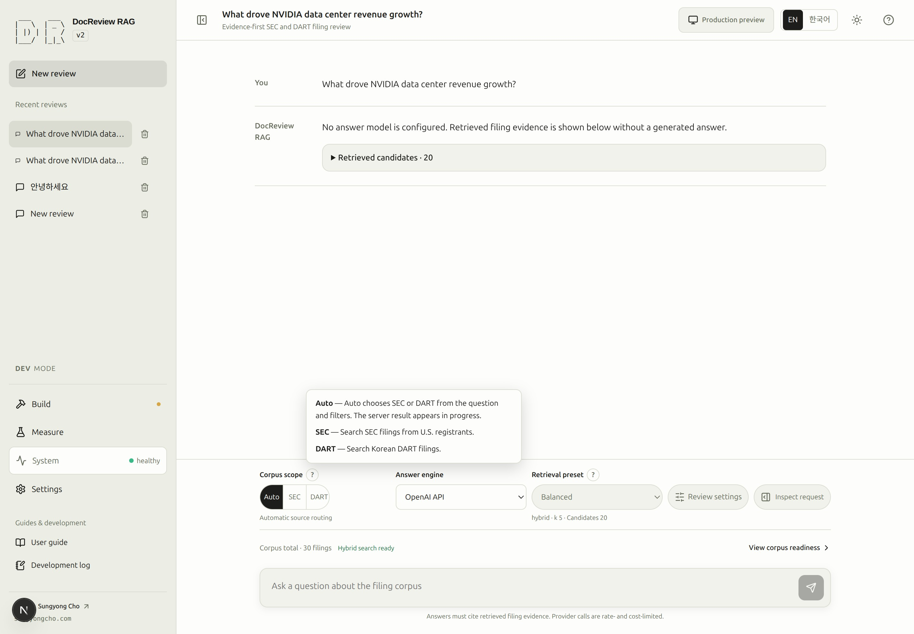
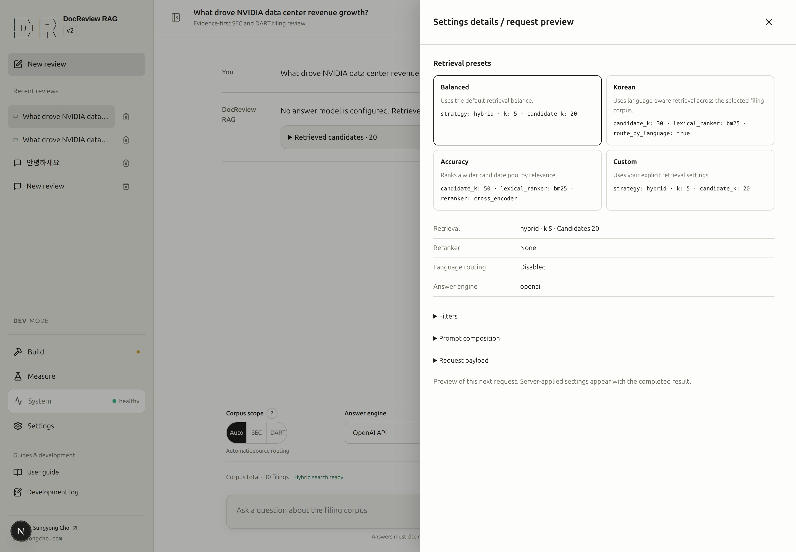
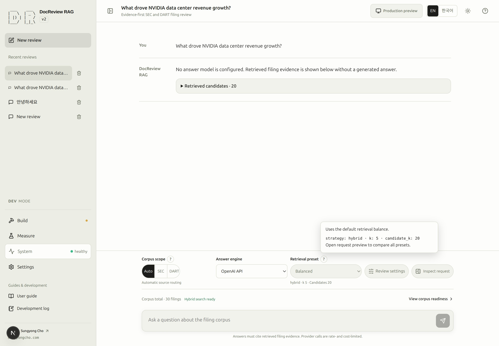
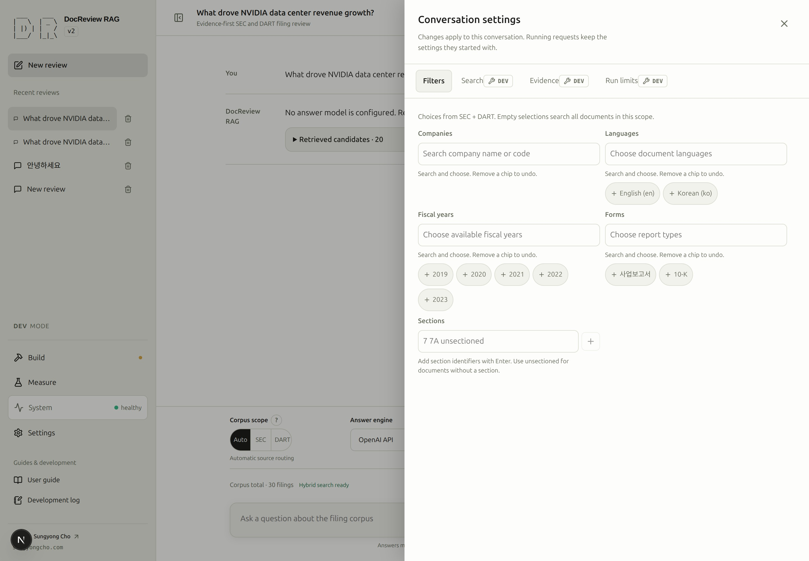

# Settings for the next request

Conversation settings determine where to search, how to rank evidence, and how much work a review may do. They belong to the active conversation. Changing a control does not rewrite an existing answer or change the settings already submitted with a running request.

The primary composer row follows **Corpus scope → answer engine/local model → retrieval preset → Settings and preview**. The last action opens one drawer with **Basic**, **Advanced** (DEV) and **Preview** views. Switching views preserves configured values. The secondary row shows corpus readiness for the whole catalog, not the selected SEC/DART subset.

<!-- capture:18-scope-presets -->

*Corpus-scope help explains Auto, SEC and DART beside the actual controls. Scope selection and the server-confirmed routing result are distinct.*

## 10. Adjust filters, presets, and evidence choices {#step-10}

**Goal:** prepare one deliberate settings change and understand when it takes effect.

**Prerequisites:** an existing conversation and the documents needed for its question. A saved answer is useful for inspecting evidence choices; a new answer is not required merely to change settings.

**Screen path:** conversation → **Retrieval preset** above the question. Open **Settings and preview → Basic** for document filters and the current limits summary.

| Input | Meaning for this exercise |
|---|---|
| Corpus scope | Choose SEC for an SEC question, DART for a DART question, or Auto for server routing. |
| Companies / Fiscal years | Select actual available entries, such as NVDA and 2024 when those filings exist. Empty selections leave that field unrestricted. |
| Retrieval preset | Select Accuracy to inspect a wider candidate pool and reranking. This is a setting to evaluate, not a promise of a better answer. |

**Primary action:** choose **Accuracy**, then open **Settings and preview → Preview** to inspect the next question’s settings. Existing answers and in-flight requests retain their submitted values.

**Visible result:** the selected preset changes; its explanation includes `candidate_k: 50` and `reranker: cross_encoder`. The question and earlier answer stay unchanged. The inspector describes the next request; evidence remains unresolved until execution.

**Completion:** you can identify the intended corpus, selected filters, engine, and preset, with no invalid draft left in Filters. If an answer has selectable evidence, inspect the Pin/Exclude meanings below without rerunning unless you intend another model call.

**Common failure:** a typed company is not in the selected corpus, or an old selection becomes incompatible after changing scope. Keep the visible warning, correct the input or deliberately remove the selection, then check the inspector again. See [filter recovery](troubleshooting.md#retrieval).

**Next:** [11. Evaluate retrieval](evaluation.md#step-11). Evaluation can also be started directly after index preparation; it does not depend on generating an answer.

### SCREENSHOT NEEDED

<!-- Settings and preview: Basic, Advanced and Preview tabs; light mode; en; show preserved values and integrated navigation. Existing asset below is historical. -->

<!-- capture:19-request-inspector -->

*Historical capture of the previous separate inspector/settings layout. Use the Basic / Advanced / Preview flow described above.*

## Presets and effective values {#presets}

> [!DEV]
> Custom retrieval editing requires DEV. The permitted Balanced, Korean, and Accuracy presets remain available in the public interface.

The following values come from the current preset definitions. All three built-in presets use hybrid retrieval and return `k=5` results.

| Preset | Candidates | Lexical ranking | Reranker | Language routing |
|---|---:|---|---|---|
| Balanced | 20 | `ts_rank_cd` | None | Off |
| Korean | 30 | BM25 | None | On |
| Accuracy | 50 | BM25 | Cross encoder | Off |
| Custom | Your saved values | Your saved values | Your saved values | Your saved values |

Balanced provides the default starting point. Korean enables language-aware retrieval without forcing the corpus scope to DART. Accuracy reranks a larger pool. In DEV, **Manage presets…** opens **Measure → Retrieval presets**. Expand a built-in row and choose **Copy and edit**, or save the current search settings. Named presets are stored in this browser and appear in the composer selector. Saving or editing a preset does not change existing conversations; selecting it copies only retrieval values. Custom remains the label for unsaved values. Advanced search settings remain editable in the conversation drawer.

<!-- capture:30-preset-help -->

*The preset explanation describes the selected Balanced definition beside the actual control. Effective preset differences can also be compared in Settings and preview → Preview; opening help does not run a review.*

`k` is the returned result count; `candidate_k` is the candidate count used before final selection. RRF combines component ranks. BM25 parameters affect lexical scoring. A reranker changes ordering, not the underlying filing text. Use [retrieval inspection](retrieval.md) to assess the change before attributing a quality improvement to it.

## Scoped filters and unfinished input {#filters}

**Settings and preview** opens a right-side drawer on desktop and a full-screen dialog on mobile. **Basic** shows preset selection, document filters, limits and the count of settings differing from defaults. **Advanced** exposes the existing search/evidence/run-limit sections and additional instructions, plus an explicit defaults reset. **Preview** shows the next question, readable policy values and expandable request JSON. The execution-details panel also has a **Preview** tab; its **Server settings** tab continues to describe the selected historical run. Public mode hides Advanced and local preset management. Keyboard focus stays inside the settings dialog and Escape returns it to the opener.

### SCREENSHOT NEEDED

<!-- Settings and preview: Basic, Advanced and Preview tabs; light mode; en; show preserved values and integrated navigation. Existing asset below is historical. -->

<!-- capture:27-review-settings -->

*Historical capture of the previous separate inspector/settings layout. Use the Basic / Advanced / Preview flow described above.*

Company, language, form, and fiscal-year choices come from the complete catalog available within the selected scope. The application does not construct these lists from the first page of documents. Public choices come from the public catalog.

Choose values as removable chips. Incompatible saved selections stay visible until you remove them. Invalid typed drafts block Send while the filter editor is open. Switching editor tabs or closing the editor discards unfinished text, as its notice explains; committed selections remain. Workspace navigation and Back preserve committed settings and the question; close the editor before using background controls.

The scope and preset **?** controls support hover, focus, touch and Escape. **View corpus readiness** opens Build; use **Back** to return to the draft. Preview uses the settings drawer’s scrolling and focus behavior. Invalid committed advanced values remain visible as an error and block sending even after closing the drawer.

## Pin, Exclude, and reviewing again {#evidence}

- **Pin** includes the evidence first in the next evidence review. It does not guarantee that the answer will cite it.
- **Exclude** omits the evidence from that next review's evidence set.
- Selecting either action only updates the selection and its count. It does not change the displayed answer.
- **Review again with selected evidence** submits a new review and adds a new result. It may incur provider costs.

Click a selected Pin or Exclude again to deselect it. Both buttons sit in each card header, so they work while a card is collapsed and the selection survives paging; pinned cards open by default when the list renders. A chunk cannot be pinned and excluded at the same time. Retrieved candidate count and actual citation count describe different things. Older saved results without a usable selection token explain why their selection buttons are disabled; retrieve a fresh result if you need to change evidence.

## Evidence size and execution limits {#budgets}

> [!DEV]
> Editing Search, Evidence, and Run limits requires DEV. Public users can still use permitted scope, preset, and filter choices.

Under **Settings and preview → Advanced → Evidence**, history turns and maximum evidence characters control prompt content; overfetch and the per-document hit cap control evidence selection. Under **Run limits**, iterations, input/output tokens, and wall-clock seconds limit the whole run. The default wall clock is 120 seconds, not a token budget. See [runtime limits](runtime.md#limits) before changing a value to address a failure.

## Defaults and permissions {#defaults}

> [!DEV]
> Saving experiment defaults and editing the prompt policy require DEV. Browser language and permitted conversation choices remain separate.

**Measure → Evaluation settings** saves experiment defaults and the retrieval preset for new conversations. Existing conversations and recorded results keep their settings. Global **Settings → Prompt** applies to the current conversation's prompt policy; local-server connection settings are managed separately under **Local LLM**.

Public mode exposes permitted scope, preset, and filter choices but locks development-only editing and local-model configuration. A saved development profile that is incompatible with the current deployment is reported explicitly; it is not silently rewritten into a different experiment.

## Local server selection {#local-server}

> [!DEV]
> Adding, connecting, disconnecting, or diagnosing a local model server requires DEV. This guide stays readable in the public manual.

In **Settings → Local LLM**, **Default** uses the address prepared for the current DocReview environment. Selecting a server alone does not change the active connection. **Run connection diagnostics** checks the selected candidate without saving settings, downloading/loading models, or generating answers. Inspect the named diagnostic result and checked time; active settings remain in **Connection status**.

Use **Connect** to apply an existing choice. **Add a server…** asks for a name, reachable URL, and protocol; **Add & connect** saves the new entry only after a successful check. Failed connection or save attempts preserve the previous working configuration. **Use Default** checks the default endpoint before switching and retains your added servers. **Disconnect** explicitly disables local answers.

The [Ollama setup guide](ollama.md) opens in a new tab from this screen. It covers macOS/Linux installation, Docker access, model preparation, and read-only `rag-ollama-check` diagnostics. Connecting a server does not change the conversation's engine or the corpus embedding provider.

## Inspect usage after changing providers

**System → Usage** groups recorded model/role rows by provider, local/external execution and credential slot name. A key value is never shown. Historical slots stay unknown; provider identity follows the recorded call, not today's settings. Reported tokens, tokenizer estimates and missing usage are distinguished, with matching subtotals. Local API cost is zero. See [recorded provider usage](runtime.md#recorded-provider-usage) for backfill coverage, failure accounting and the limits of these local estimates. Opening Usage does not call a model or reset data.

### SCREENSHOT NEEDED
<!-- Feature: provider and credential usage groups after a settings change; locale=en; theme=light; show role and reported/estimated usage distinction; preserve existing assets. -->

### Saved execution defaults

Open **Settings → Prompt → New-conversation limits and evidence** to edit and explicitly save the default budget and evidence size. System status shows a summary and a link to this editor. Existing conversations keep their own values and Basic shows their differences from saved defaults. **Restore setting defaults** in the conversation copies the saved search/prompt/evidence/limits while preserving document filters. The defaults editor’s **Restore limit defaults** prepares the original application values; save them explicitly to use them for future conversations.

### SCREENSHOT NEEDED
<!-- Default limits editor and System status summary; en; light mode; show saved values and a conversation override. Preserve existing assets. -->

Company, language, fiscal-year, form and section fields support both typed search and a visible dropdown button. Section suggestions come from the actual scoped corpus; manual section identifiers remain supported. Preset previews use full-width expandable rows, and JSON retains its code-block background and monospace formatting.

## Browser storage {#browser-storage}

On the real deployed **PROD** screen, conversations and user preferences are saved in this browser's `localStorage`, per origin (scheme, host and port). They are not synchronized to another browser or device. Clearing browser/site data removes them. Review requests still send the question and applicable settings to the API for processing; there is no server-side user-settings store.

The inventory includes conversations and their filters, evidence/run-limit overrides and prompt text; the active conversation; new-conversation profile/prompt/run-limit defaults; named retrieval presets when available; experiment defaults; language and theme; onboarding, help and storage-notice dismissal; desktop job notifications; Operations filters; and document/job pane widths. A saved value does not unlock a control that the current server permissions prohibit. Conversation retention remains 30 conversations with 100 messages each.

Open **Settings → Data & help → Browser storage** to see the estimated total and **Storage by key**. The warning begins at a conservative 4 MiB estimate; the actual shared origin quota depends on the browser and other site data. **Export browser settings** downloads one versioned JSON file, including conversations and prompt text: keep it private. **Import browser settings** validates the whole file first, then asks before replacing this browser's DocReview data. Finish any running request first. Unrelated website keys are preserved.

Use **Clear conversations** to clear only conversations, **Reset saved defaults** for defaults, or the browser's site-data controls to remove all local data. These actions do not delete the server's filing corpus or PostgreSQL records. Before clearing or switching browsers, export and verify a backup.

Valid old records migrate once in PROD. Unreadable or future records are retained in a recovery entry in the export, with a notice and safe defaults. Quota or private-mode failures keep changes usable in the current tab and report that they are not durably saved: export before closing. Private browsing may discard its data when the session ends.

The first PROD visit displays **⚠️ Settings and conversations are saved only in this browser**. **Got it** remembers dismissal. The ⚠️ button in **Data & help → Browser storage** reopens it; **Learn more** opens this section. DEV keeps its existing writes; its **Production preview** still uses isolated memory and cannot persist changes to the deployed browser store.

### SCREENSHOT NEEDED
<!-- Feature: PROD browser-storage notice, Data & help per-key usage, export/import confirmation and reminder; locale=en; light mode; show real deployed state. Preserve existing assets. -->
