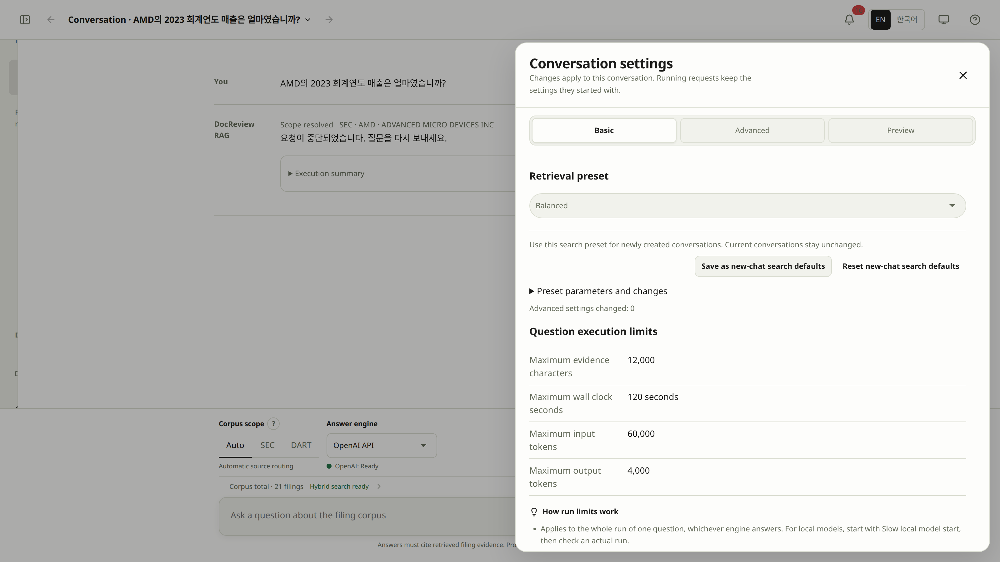
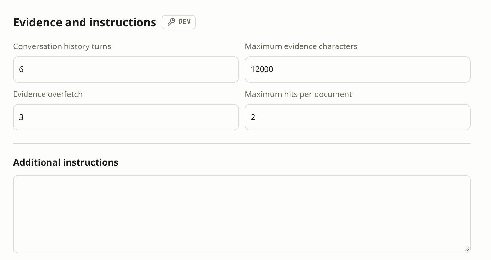
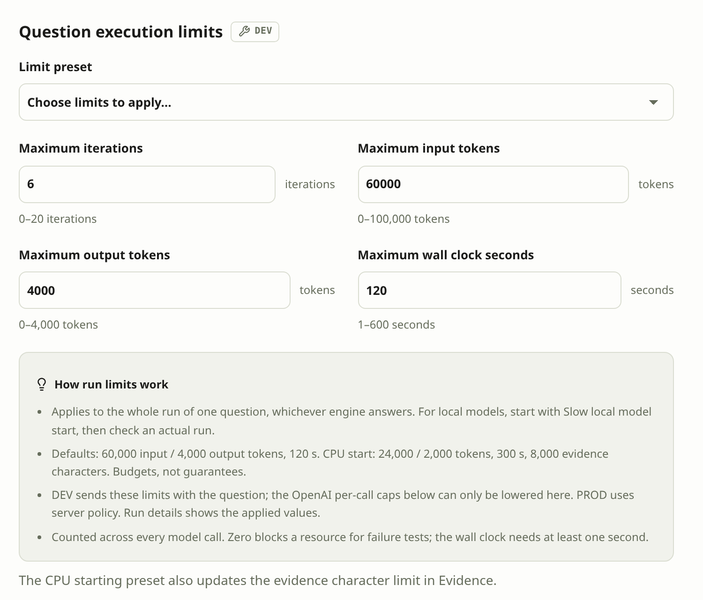
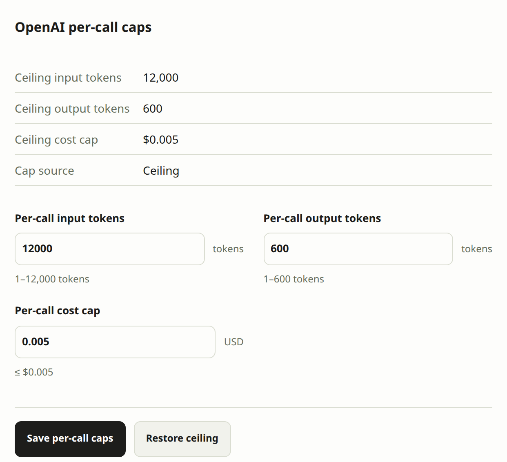
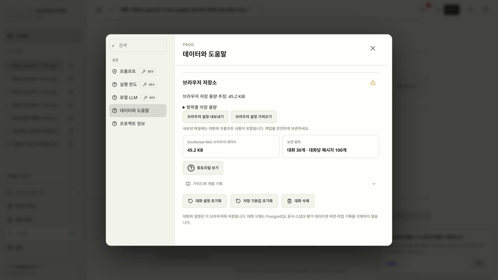

# Settings for the next request

Conversation settings determine where to search, how to rank evidence, and how much work a review may do. They belong to the active conversation. Changing a control does not rewrite an existing answer or change the settings already submitted with a running request.

On your first visit, the interface uses Korean only when your browser's primary language is Korean; otherwise it uses English. Selecting EN or 한국어 saves your choice in this browser for later visits. An explicitly Korean or English guide link opens in that language.

The primary composer row follows **Corpus scope → answer engine/local model → retrieval preset → Settings and preview**. The drawer opens directly to **Filters**, with **Search**, **Evidence**, **Run limits**, and **Preview** alongside it. The same sections remain available in DEV and PROD; editing permissions differ. The secondary row describes readiness for the whole catalog, not the selected SEC/DART subset.

## Adjust filters, presets, and evidence choices {#step-10}

On narrow screens the composer controls wrap into aligned groups. Beside the sidebar's mode indicator, **Build** shows a six-character source identifier. Hover over or focus the **DocReview RAG** name to see **Last updated**, including the fixed build date, AM/PM time and your browser's regional timezone, such as `Europe/Paris`. Select the build identifier to open **Settings → About**, where the full source identifier, seconds and UTC timestamp are available. These are build facts, not a live clock, visit time or release version. App and manual use the same product mark and name layout.

> [!GOAL]
> Change one retrieval setting deliberately and understand which request it affects.
>
> **Prerequisites** an existing conversation and the documents for its question · **Done** the next request shows the intended filters, preset, and limits while earlier answers stay unchanged

A saved answer helps inspect evidence choices, but changing settings does not require a new answer.

1. Select **Retrieval preset** above the question, or open **Settings and preview → Filters** to narrow the documents. Use **Search** for preset selection and parameter explanations.
2. Choose the intended corpus, companies, and fiscal years, then select a retrieval preset according to the table's meanings.

| Input | Meaning for this exercise |
|---|---|
| Corpus scope | Choose SEC for an SEC question, DART for a DART question, or Auto for server routing. |
| Companies / Fiscal years | Select actual available entries, such as NVDA and 2024 when those filings exist. Empty selections leave that field unrestricted. |
| Retrieval preset | Select Accuracy to inspect a wider candidate pool and reranking. This is a setting to evaluate, not a promise of a better answer. |

3. Choose **Accuracy**, then open **Settings and preview → Preview** to inspect the next question's settings. Existing answers and in-flight requests retain their submitted values.
4. Confirm **Candidates** is 50 and **Reranker** is `cross_encoder`. The question and earlier answer stay unchanged. Preview summarizes the next request; actual evidence is selected after sending.

The scope help explains Auto, SEC and DART beside the actual controls, and the scope selection stays distinct from the server-confirmed routing result.

You can identify the intended corpus, selected filters, engine, and preset, with no invalid draft left in Filters. If an answer has selectable evidence, inspect the Pin/Exclude meanings below without rerunning unless you intend another model call.

If a typed company is not in the selected corpus, or an old selection becomes incompatible after changing scope, keep the visible warning, correct the input or deliberately remove the selection, then check the inspector again. See [filter recovery](troubleshooting.md#retrieval).

Evaluation can also be started directly after index preparation; it does not depend on generating an answer. Continue with [11. Evaluate retrieval](evaluation.md#step-11).

<!-- screenshot: settings-and-preview-drawer -->

The image below shows the earlier drawer layout and is awaiting replacement with the Search section.

## Presets and effective values {#presets}

> [!DEV]
> Saving presets as server files runs in DEV mode only. The public build keeps the Balanced, Korean, and Accuracy presets, allows custom retrieval values within the server's bounds (`k` ≤ 10, `candidate_k` ≤ 50, `max_context_chars` ≤ 12000), and saves custom presets in this browser.

Preset parameters show their names, purpose, current values and differences from Balanced. The canonical preset files remain unchanged, and a setting that is not used by the selected strategy is identified explicitly. Wider candidate pools and reranking may cost more time; Accuracy is a configuration name, not an accuracy guarantee.

The following values come from the current preset definitions. All three built-in presets use hybrid retrieval and return `k=5` results.

| Preset | Candidates | Lexical ranking | Reranker | Language routing |
|---|---:|---|---|---|
| Balanced | 20 | `ts_rank_cd` | None | Off |
| Korean | 30 | BM25 | None | On |
| Accuracy | 50 | BM25 | Cross encoder | Off |
| Custom | Your saved values | Your saved values | Your saved values | Your saved values |

Balanced provides the default starting point. Korean enables language-aware retrieval without forcing the corpus scope to DART. Accuracy reranks a larger pool. In DEV, **Manage presets…** opens **Measure → Retrieval presets**. Expand a built-in row and choose **Copy and edit**, or save the current search settings. In DEV, named presets are stored as JSON files in `data/presets/` and appear in the composer selector; PROD management stores them in the browser. Saving or editing a preset does not change existing conversations; selecting it copies only retrieval values. Custom remains the label for unsaved values.

In **Settings and preview → Search**, inspect the current parameter cards or expand **Compare retrieval presets** to read the alternatives. DEV also provides direct custom editing. The **?** help describes the selected definition beside the control without running a review. **Preview** summarizes only the selected configuration.

`k` is the returned result count; `candidate_k` is the candidate count used before final selection. RRF combines component ranks. BM25 parameters affect lexical scoring. A reranker changes ordering, not the underlying filing text. Use [retrieval inspection](retrieval.md) to assess the change before attributing a quality improvement to it.

<!-- heading-alias: retrieval-preset-files-and-json-editing -->
### Retrieval preset files and JSON editing {#preset-files}

Open **Measure → Retrieval presets**. DEV uses `data/presets/<id>.json`, next to other runtime data and included in the existing Compose data mount. The three shipped files (`balanced`, `korean`, `accuracy`) are the canonical source for both server and web; copy them to edit. Custom preset files are ignored by Git. A visible selector shares a lightweight version refresh every three seconds; the server scans metadata, debounces changes and rereads only changed files. A corrupt file appears with its filename and error while valid presets remain usable. Fix the file to restore it without restarting.

Use **Save current search as a preset** or **Register new preset** (Balanced defaults). The same editor supports a name, description, search fields, and a **JSON** view with inline validation and **Copy JSON**. Import one JSON file to edit a new copy; export a saved row with **Export preset JSON**. Each saved row offers explicit selection, copy, edit and confirmed deletion. Saving or deleting does not change existing conversations. Selection remains subject to the current server's custom-retrieval permission.

PROD stores presets through the versioned browser settings module; it exposes no file API. Browser settings export/import includes these presets.

## Scoped filters and unfinished input {#filters}

**Settings and preview** opens a right-side drawer on desktop and a full-screen dialog on mobile. Choose a section directly; each opens at the top, and tab changes retain your input. Escape closes the drawer and returns focus to its opener.

| Section | What to do |
|---|---|
| **Filters** | Select companies, document languages, years, forms, and sections. |
| **Search** | Choose a preset and inspect its parameters; DEV also exposes custom fields and new-chat search defaults. |
| **Evidence** | DEV edits evidence selection, history, and additional instructions. PROD shows the server policy read-only. |
| **Run limits** | DEV edits the question budget. PROD shows server budgets and per-call ceilings read-only. |
| **Preview** | Read the next question and selected settings; use its links to return to the relevant section. |

Preview contains the question, selected constraints, effective search values, and DEV-requested or PROD-server policy. Automatic company/year resolution and retrieved evidence are not known until sending. Prompt composition and request JSON are optional details. Preview neither edits settings nor sends a question. The execution-details panel's **Preview** also describes the next request; **Server settings** describes the selected historical run.

### SCREENSHOT NEEDED
<!-- Capture next-request-preview in PROD, English locale, light mode: an existing unsent question, the selected scope and preset, and loaded server policy. Open Preview without sending or changing settings. -->
<!-- screenshot: next-request-preview -->

Company, language, form, and fiscal-year choices come from the complete catalog available within the selected scope. The application does not construct these lists from the first page of documents. Public choices come from the public catalog.

Choose values as removable chips. Incompatible saved selections stay visible until you remove them. Invalid or unfinished input blocks Send while the drawer is open, including on other tabs. Switching tabs retains that text; Preview warns that only committed filters are included. Closing the drawer discards unfinished text and keeps committed selections. Workspace navigation and Back preserve committed settings and the question; close the drawer before using background controls.

The scope and preset **?** controls support hover, focus, touch and Escape. The corpus status line above the input opens Build; use **Back** to return to the draft. Preview uses the settings drawer's scrolling and focus behavior. Invalid committed advanced values remain visible as an error and block sending even after closing the drawer.

Company, language, fiscal-year, form and section fields support both typed search and a visible dropdown button. Section suggestions come from the actual scoped corpus; manual section identifiers remain supported. Preset previews use full-width expandable rows, and JSON retains its code-block background and monospace formatting.

## Pin, Exclude, and reviewing again {#evidence}

- **Pin** includes the evidence first in the next evidence review. It does not guarantee that the answer will cite it.
- **Exclude** omits the evidence from that next review's evidence set.
- Selecting either action only updates the selection and its count. It does not change the displayed answer.
- **Review again with selected evidence** submits a new review and adds a new result. It may incur provider costs.

Click a selected Pin or Exclude again to deselect it. Both buttons sit in each card header, so they work while a card is collapsed and the selection survives paging; pinned cards open by default when the list renders. A chunk cannot be pinned and excluded at the same time. Retrieved candidate count and actual citation count describe different things. Older saved results without a usable selection token explain why their selection buttons are disabled; retrieve a fresh result if you need to change evidence.

## Evidence size and execution limits {#budgets}

> [!DEV]
> Editing Search, Evidence, and Run limits in the conversation drawer runs in DEV mode only. Public users can still use permitted scope, preset, and filter choices, plus custom presets within the server's public bounds.

Question execution limits are separate from search presets. PROD reads actual server-owned question budgets and per-model-call ceilings; browser defaults are not presented as applied policy when that read fails. DEV retains its local-model guidance.

Under **Settings and preview → Evidence**, history turns and maximum evidence characters control prompt content; overfetch and the per-document hit cap control evidence selection. Additional instructions are edited here too. **Run limits** contains iterations, input/output tokens, and wall-clock seconds for the whole question, with either OpenAI or a local answer engine. Evidence size has one editor, in Evidence; applying the CPU starting preset updates both evidence size and the budget. The default 120 seconds is a time limit, not a token budget. See [runtime limits](runtime.md#limits) before changing a value to address a failure.

For CPU-only local models, use the optional [CPU starting preset and hardware guidance](ollama.md#cpu-starting-preset). Existing defaults remain unchanged; apply a preset explicitly and inspect the next run's timings.

<!-- screenshot: conversation-evidence-policy -->

*1. Evidence policy and history · 2. Additional instructions in this section*

<!-- screenshot: conversation-run-limits -->

*1. Budget for the whole question · 2. Starting preset also changes evidence size*

### OpenAI per-call caps {#openai-call-caps}

Each OpenAI call is also capped by the server. In `.env`, `DOCREVIEW_OPENAI_MAX_INPUT_TOKENS` (default 12,000), `DOCREVIEW_OPENAI_MAX_OUTPUT_TOKENS` (default 600) and `DOCREVIEW_OPENAI_MAX_COST_USD` (default 0.005) form the **ceiling**. A run limit above the ceiling does not raise it; the smaller value applies to every call. **System → System status** shows the caps in force under **OpenAI model policy**, and **Settings → Run limits** repeats them under **OpenAI per-call caps**.

In DEV the editor saves lower working values on the server in `data/local-settings/openai-limits.json`; **Restore ceiling** deletes that file. The web cannot raise a cap above the ceiling: change the `.env` keys and restart with `rag-dev compose down` / `rag-dev compose up`. Public PROD always uses the ceiling and never reads the file.

<!-- screenshot: openai-per-call-caps-editor -->

*1. Per-call token limits · 2. Per-call cost ceiling*

## Defaults and permissions {#defaults}

> [!DEV]
> Saving experiment defaults and editing the prompt policy run in DEV mode only. **Settings → Prompt** and **Settings → Run limits** stay listed on the public build as read-only pages: the guard text and final prompt preview are visible, while **Additional operator instructions** and the save buttons are locked with a bubble that says the control runs in DEV mode only and links to the source repository. Browser language and permitted conversation choices remain separate.

**Measure → Evaluation settings** saves experiment defaults and the retrieval preset for new conversations. Existing conversations and recorded results keep their settings. Global **Settings → Prompt** applies to the current conversation's prompt policy; local-server connection settings are managed separately under **Local LLM**.

Public mode exposes permitted scope, preset, and filter choices and the read-only Prompt and Run limits pages, but locks DEV-only editing and local-model configuration. A saved development profile that is incompatible with the current deployment is reported explicitly; it is not silently rewritten into a different experiment.

<!-- heading-alias: saved-execution-defaults -->
### Saved execution defaults {#saved-defaults}

Open **Settings → Run limits** to edit and explicitly save the default budget and evidence size. System status links to this editor. Existing conversations keep their own values; the DEV conversation drawer's footer shows the count of differences from saved defaults. **Restore setting defaults** copies the saved search/prompt/evidence/limits while preserving document filters. The defaults editor's **Restore limit defaults** prepares the original application values; save them explicitly for future conversations.

The defaults editor and **Conversation settings → Run limits** share the budget fields, starting preset, and guidance. The global defaults editor also includes evidence size; the conversation edits it in **Evidence**. Fields use two columns on desktop and one at 720 px or below. Save feedback stays beside the save/restore actions. Composer default-limit links and System status open **Settings → Run limits**; CPU recommendations open the current conversation override.

<!-- heading-alias: default-search-settings-for-new-chats -->
### Default search settings for new chats {#new-chat-defaults}

In DEV, **Conversation settings → Search** provides **Save as new-chat search defaults** and **Reset new-chat search defaults**. These affect only the search preset of subsequently created conversations. Existing conversations, prompts, filters, and run-limit defaults are preserved. Evaluation defaults live in New evaluation; snapshot comparison selections are not global defaults.

Confirmations for draft changes, settings resets, backup imports, and operator commands appear inside the app. Cancel or Escape preserves the current state; Continue performs the requested action. Browser-controlled tab-close warnings and notification permission requests remain native.

## Local server selection {#local-server}

> [!DEV]
> Adding, connecting, disconnecting, or diagnosing a local model server runs in DEV mode only. This guide stays readable in the public manual.

In **Settings → Local LLM**, **Default** uses the address prepared for the current DocReview environment. Selecting a server alone does not change the active connection. **Run connection diagnostics** checks the selected candidate without saving settings, downloading/loading models, or generating answers. Inspect the named diagnostic result and checked time; active settings remain in **Connection status**.

Use **Connect** to apply an existing choice. **Add a server…** asks for a name, reachable URL, and protocol; **Add & connect** saves the new entry only after a successful check. Failed connection or save attempts preserve the previous working configuration. **Use Default** checks the default endpoint before switching and retains your added servers. **Disconnect** explicitly disables local answers.

The [Ollama setup guide](ollama.md) opens in a new tab from this screen. It covers macOS/Linux installation, Docker access, model preparation, and read-only `rag-dev doctor` diagnostics. Connecting a server does not change the conversation's engine or the corpus embedding provider.

<!-- heading-alias: inspect-usage-after-changing-providers -->
## Inspect usage after changing providers {#provider-usage}

**System → Usage** groups recorded model/role rows by provider, local/external execution and credential slot name. A key value is never shown. Historical slots stay unknown; provider identity follows the recorded call, not today's settings. Reported tokens, tokenizer estimates and missing usage are distinguished, with matching subtotals. Local API cost is zero. See [recorded provider usage](runtime.md#provider-usage) for backfill coverage, failure accounting and the limits of these local estimates. Opening Usage does not call a model or reset data.

## Browser storage {#browser-storage}

On the real deployed **PROD** screen, conversations and user preferences are saved in this browser's `localStorage`, per origin (scheme, host and port). They are not synchronized to another browser or device. Clearing browser/site data removes them. Review requests still send the question and applicable settings to the API for processing; there is no server-side user-settings store.

Open **Settings → Data & help → Browser storage** to see the estimated total and **Storage by key**. The warning begins at a conservative 4 MiB estimate; the actual shared origin quota depends on the browser and other site data. **Export browser settings** downloads one versioned JSON file, including conversations and prompt text: keep it private. **Import browser settings** validates the whole file first, then asks before replacing this browser's DocReview data. Finish any running request first. Unrelated website keys are preserved.

Use **Clear conversations** to clear only conversations, **Reset saved defaults** for defaults, or the browser's site-data controls to remove all local data. These actions do not delete the server's filing corpus or PostgreSQL records. Before clearing or switching browsers, export and verify a backup.

<!-- details: storage-inventory | What is stored, and migration edge cases -->
The inventory includes conversations and their filters, evidence/run-limit overrides and prompt text; the active conversation; new-conversation profile/prompt/run-limit defaults; named retrieval presets when available; experiment defaults; language and theme; onboarding, help and storage-notice dismissal; desktop job notifications; Operations filters; and document/job pane widths. A saved value does not unlock a control that the current server permissions prohibit. Conversation retention remains 30 conversations with 100 messages each.

Valid old records migrate once in PROD. Unreadable or future records are retained in a recovery entry in the export, with a notice and safe defaults. Quota or private-mode failures keep changes usable in the current tab and report that they are not durably saved: export before closing. Private browsing may discard its data when the session ends.
<!-- /details -->

The first PROD visit displays **⚠️ Settings and conversations are saved only in this browser**. **Got it** remembers dismissal. The ⚠️ button in **Data & help → Browser storage** reopens it; **Learn more** opens this section. DEV keeps its existing storage behavior.

<!-- screenshot: prod-browser-storage-and-backup -->

