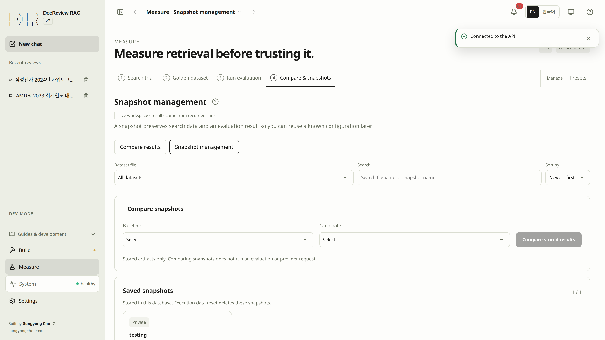
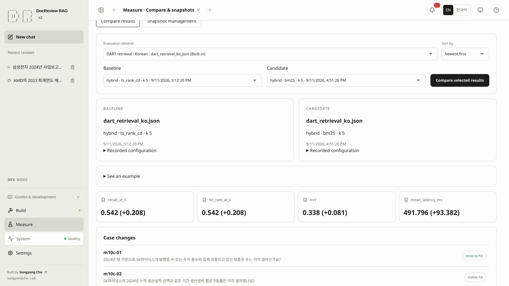

# Compare results and preserve search data

An evaluation result records measured outcomes and settings. A snapshot preserves search data together with a selected evaluation result so that a known setup can be reused and compared without running anything again. Work through find, details, compare, apply, and publish; [saving a new snapshot](#step-12) is a conditional step for when no existing snapshot fits.

| Task | Where |
|---|---|
| Find a saved snapshot | [Snapshot management](#management) filter, search, and sort |
| Read what it recorded | [Snapshot details](#snapshot-details) drawer |
| Compare two stored snapshots | [Compare stored results](#comparison) and the case changes |
| Keep a new result for reuse | [Save a snapshot](#step-12) when nothing existing fits |
| Query the frozen search state | [Apply it](#save) without sending a question |
| Share it with visitors | [Publish or hide](#visibility) |
| Explore without your own data | [Public example](#public-comparisons) |

<!-- heading-alias: snapshot-management -->
## Find a saved snapshot {#management}

Open **Measure → 4. Compare & snapshots → Snapshot management**. **Compare results** and **Snapshot management** stay separate: comparing evaluation results does not require a snapshot. Visitors see the same list as **Published snapshots**, including details and stored-result comparison, without the DEV apply and visibility actions.

1. Narrow **Saved snapshots** by **Dataset file**, or **Search** a filename or snapshot name; **Sort by** newest, oldest, name, or filename.
2. Read each card's label, retrieval settings, and evidence hit rate; DEV cards also carry a public/private badge.
3. Select a card to open its **Snapshot details** drawer on the right.

A `0 / N` counter with "No snapshots match these filters" means filters hid every entry — clear the search or file filter. "No saved snapshots are available" means none exist yet. The screen has no per-snapshot delete or rename action; snapshots are stored in this database and an execution data reset deletes them.

<!-- screenshot: snapshot-management-list -->

### Snapshot details {#snapshot-details}

The drawer is where you check what a snapshot recorded and act on it.

| Read | What it confirms |
|---|---|
| Label and badge | The snapshot name and its public/private visibility. |
| Dataset file and retrieval profile | The questions and recorded search settings behind the scores. |
| **View source evaluation** | Opens the exact recorded result, with a readable link label instead of a numeric ID. DEV only. |
| Documents and Created | Covered document count and creation time. |
| Stored metrics | The recorded outcome values. |
| Recorded configuration | Corpus fingerprint, raw retrieval profile, and evaluation config — the identity to check before trusting a comparison. |

| Action | Effect |
|---|---|
| **Use for review** | Applies the stored search configuration and selects the snapshot without sending a question. Enabled only for a ready snapshot; DEV only. |
| **Publish** / **Hide** | Changes visibility as an explicit separate action; DEV only. See [public visibility](#visibility). |

Close the drawer with X, Close, Escape, or the backdrop.

<!-- details: management-filters | Filters, identity, and retention -->
Snapshot management reuses the same dataset filenames as evaluation history. A result has at most one snapshot: once saved, its result page shows **View saved snapshot**, and saving the same result again returns the existing snapshot without renaming or republishing it. Internal identifiers stay inside the recorded configuration. Golden dataset files follow a separate preservation policy.
<!-- /details -->

### SCREENSHOT NEEDED
<!-- Capture the snapshot details drawer in DEV: an existing ready snapshot open with its visibility badge, stored metrics, recorded configuration, source-evaluation link, and the Use for review / Publish controls, English locale, light mode. Do not apply, publish, or hide. -->

<!-- screenshot: snapshot-detail-panel -->

## Compare stored results and read the conditions {#comparison}

In **Snapshot management**, choose a baseline and a candidate under **Compare snapshots**, then **Compare stored results**. Comparing two stored snapshots reads existing artifacts; it does not run retrieval, an evaluation, or a model. Identical comparisons are reused in the page, case lists are paged, and public artifact reads and comparison responses have size limits that report an explicit error when exceeded. Pick two different snapshots — selecting the same one twice leaves the button disabled with an inline hint.

The **Snapshot comparison** panel shows a **Directly comparable** or **Limited comparison** badge and any warning before the metric table. Direct comparability checks the suite and golden identity; matching labels alone do not establish a controlled experiment, so inspect corpus, embedding identity, retrieval settings, and `k` before attributing a difference to one setting. Each metric row gives baseline, candidate, and change; in a limited comparison, unavailable deltas show `n/a`.

<!-- details: compatibility-reference | What to inspect before attributing a difference -->
| Inspect | Why it matters |
|---|---|
| Suite and golden revision/hash | Different questions or source spans change what the scores measure. |
| Corpus identity and document count | A larger or changed evidence collection may explain better coverage. |
| Embedding provider/model/dimensions | Vector identities determine which search configuration the data supports. |
| Strategy, `k`, candidates, reranker | More returned evidence or work can change both quality and latency. |
| Case-level changes | An aggregate gain can conceal important regressions. |

The **See an example** fold under the result-comparison picker is explicitly illustrative, not a recorded result.
<!-- /details -->

### Common cases and rank deltas {#case-changes}

The common-cases list shows each shared question with both sides' question text and first relevant rank (or `miss`), its transition, and a rank delta. **miss to hit** is an improvement and **hit to miss** a regression; stable hit and stable miss mean the hit status stayed the same, although a hit's rank can change. Rank delta is candidate rank minus baseline rank, shown only when the snapshots are directly comparable and both ranks exist — moving from rank 5 to rank 2 reads −3 because earlier is better. No common cases means there is no shared case-level basis to inspect.

Result comparison in **Compare results** follows the same reading for two evaluation results and requires two different results from the same dataset.

### SCREENSHOT NEEDED
<!-- Capture the snapshot comparison panel in DEV: two existing compatible saved snapshots compared with Compare stored results, showing the comparability badge, metric deltas, and common-case changes, English locale, light mode. Do not run an evaluation or change visibility. -->

<!-- screenshot: snapshot-comparison-results -->

## Compare results and save a suitable snapshot {#step-12}

> [!GOAL]
> Compare two evaluation results and save a labeled snapshot for later reuse.
>
> **Prerequisites** at least one successful **Quick · current index** result on the current corpus · **Done** a saved snapshot with a recognizable label and recorded compatibility

> [!DEV]
> Comparing private evaluation results and saving new snapshots runs in DEV mode only. Comparing snapshots already published for visitors remains a separate public feature.

Reach for this step only when a new snapshot is needed — applying or comparing an existing one skips it. Choose a result using its evidence and experiment conditions. You need at least one successful **Quick · current index** result whose source corpus still matches the current index. Comparison requires two different results; if only one exists, inspect it and keep the comparison honestly unavailable, with no fabricated metrics. Do not queue another paid evaluation merely to fill the screen.

1. Open **Measure → 4. Compare & snapshots → Compare results** and select a baseline and a candidate. Read the metadata before **Compare selected results**:

| Input | Meaning |
|---|---|
| Baseline | The result you want to improve on. |
| Candidate | A different result to assess against the baseline. |
| Dataset and revision | Identify the questions and ground truth behind the scores. |
| Snapshot label | A recognizable name, such as `SEC hybrid k5 baseline`. The label does not establish compatibility. |

2. Inspect changed cases and latency alongside metrics.
3. Return to **3. Run evaluation**, select the suitable result, and open **Result details**.
4. Enter the snapshot label and click **Save result as snapshot**. Saving does not publish the snapshot.

Saving binds the result to the current document, chunk, vector, and lexical-index data. The server checks that the evaluation's recorded source fingerprint matches the current index, so only live-index quick evaluations qualify; where a golden revision is linked, it must be published and match the evaluation's golden hash. A creation notice confirms the private snapshot, and the result page then shows **View saved snapshot**; a repeat save returns the same snapshot unchanged. Find it by label in [snapshot management](#management).

The saved identity should match the intended result and the snapshot should appear in **Saved snapshots**, with its comparison limits understood. If the source corpus changed after evaluation, or a matrix result cannot become a queryable current-index snapshot, read the error; select a matching quick result or deliberately evaluate the desired current corpus. See [evaluation and snapshot recovery](troubleshooting.md#evaluation).

Continue with [stop and continue later](runtime.md#resume), or return to [Answers](answers.md) and inspect the applied snapshot before another request.

<!-- screenshot: comparison-workspace-and-snapshot-save -->

## Apply a snapshot and return to the current corpus {#save}

**Use selected set** in Result details applies a result's search settings. **Use for review** on a saved snapshot applies the stored search configuration and selects the snapshot, so the session queries the frozen snapshot data instead of the live corpus; it stays disabled until the snapshot is ready. Both prepare a conversation — neither executes a review nor sends a question.

Check the next request in the request inspector, and deliberately clear the snapshot chip when returning to the current corpus. A snapshot is not a full backup of the application, browser conversations, or credentials; keep the original sources and normal backups for your own retention needs.

## Private storage and public visibility {#visibility}

> [!DEV]
> Publish and Hide change snapshot visibility and run in DEV mode only. Reading an already published snapshot or its eligible documents does not change visibility.

Every saved snapshot starts private. **Publish** and **Hide** are separate explicit actions in the snapshot details drawer: publishing lets visitors read the ready snapshot and its eligible document catalog, while hiding removes that snapshot from the public list. Inspect the scope before changing visibility — you do not need to publish a snapshot to complete local evaluation, save an experiment, or read its results.

<!-- details: public-membership | What published membership controls -->
Public document lists, facets, counts, and details follow ready, published membership and matching source identity. A document may remain public through another published snapshot even after one snapshot is hidden. Company metadata must follow the same visibility boundary. A populated development corpus with no published snapshots can correctly show an empty public catalog.
<!-- /details -->

<!-- heading-alias: interactive-public-comparisons -->
## Interactive public comparisons {#public-comparisons}

Public visitors read published snapshots and compare their stored records — still without running retrieval, an evaluation, or a model. **Explore an example** explicitly opens the existing two-of-three versus three-of-three teaching scenario. Reverse the baseline, search questions and expand rank changes using the same comparison surface. This illustrative data is not a measured evaluation and does not change when experiment parameters change. Failed or missing real results never switch to examples automatically.
