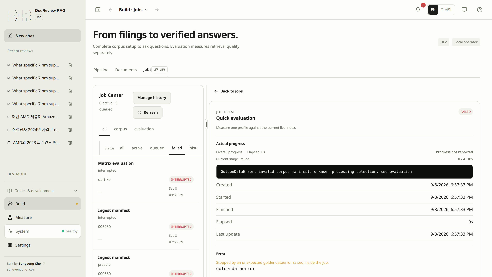
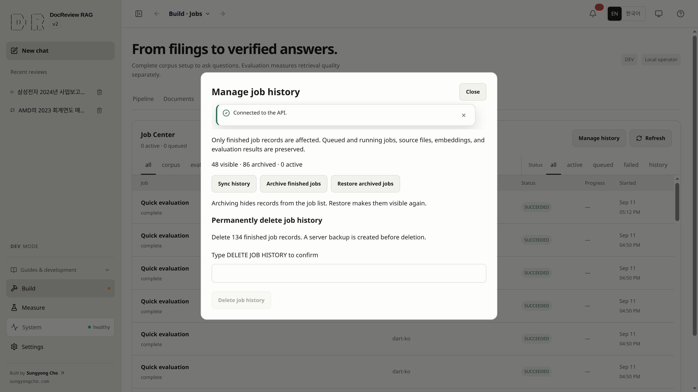
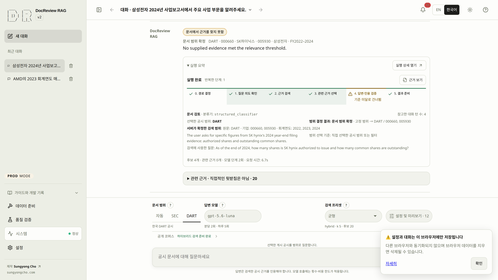

# Troubleshoot from the recorded failure

Start with the exact screen, operation, and error. Separate the observed symptom from a confirmed cause; if the cause is unknown, retain that uncertainty.

Check the smallest relevant state, make the corresponding correction, and verify the original action again. Resetting the runtime is not a general remedy for a failed request.

## Manifest scope metadata is unavailable {#manifest-scope}

A `query_scope_unavailable` failure before the path decision belongs to **0. Path decision**; stages 1–5 remain unrun. A failure while resolving scope after the decision belongs to stage 1. In DEV, the existing failed-answer card shows the specific missing-file, invalid-JSON, invalid-manifest, alias-conflict or permission cause, the manifest path, and one **Open Documents** or **Open Jobs** action. A recent acquisition job is context, not proof that it caused the failure; if it is queued/running, wait for completion before retrying.

Inspect the named file and run `rag-schema check` / `rag-corpus status`. Correct that input, then submit the question again; an unsuccessful lazy load is not cached and an API restart is unnecessary. Acquisition publishes manifests atomically, so readers see a complete committed file. **Run details → Trace** retains the original sanitized exception text. Production shows only the localized headline and a generic retry hint.


## The page, API, or database is unavailable {#connection}

> [!DEV]
> Restoring local services or diagnosing an incompatible schema is an operator action in the development environment. Public users may inspect the displayed connection error.

Open **System → System status**, or read the terminal logs when the page cannot load.

```bash
rag-dev ps
rag-dev logs --tail=80 web
rag-dev logs --tail=80 app
```

| Symptom | Evidence and cause | Remedy | Verification |
|---|---|---|---|
| Page does not load | Correct APP_PORT and the process/container listening on it; web logs. A failed page alone does not prove a DB problem. | Open the configured address and restore the failed web service. | The application and documentation load. |
| API down | Health response and app logs. | Fix the reported application connection or startup error. | Refresh System; API health succeeds. |
| Database disconnected | DB status and connection error. | Restore the intended database connection. Keep existing data. | System reports connected, then separately check schema. |
| `schema_drift` | The stored schema differs from current models. | Keep this database intact and select an empty isolated or compatible database. | Schema is compatible and the original operation works. |
| Operation disabled | DEV/PROD mode and server capabilities. | Use the permitted local development environment for operator work. | The specific required capability is available. |

For a demonstrated schema mismatch, retain the reported table and column details. Startup stops
before changing an incompatible database. Preserve that database and use an empty isolated or
compatible database for this checkout, then verify the original operation.

[Environment setup](environment.md) and the [CLI reference](cli.md) describe safe startup and schema checks.

## Filters or retrieved evidence do not match the question {#retrieval}

Check the conversation scope and Filters, then **Build → Documents**, then **Measure → 1. Search trial**.

| Symptom | Evidence and cause | Remedy | Verification |
|---|---|---|---|
| Send disabled while typing a filter | Highlighted draft, scope choices, and unavailable chips. | Correct the draft or explicitly remove an incompatible selection. | No invalid input remains and the request inspector shows the intended filters. |
| Filter choices cannot load | The panel's request error and Retry control. | Restore the catalog request and retry. Preserve selected values while diagnosing. | Available companies, years, forms, and languages load for that scope. |
| Expected filing absent | Company/year filters, source identity, and public membership. | Correct the query; prepare missing data only if needed. For public mode, check publication rather than assuming ingestion failed. | The document appears in the appropriate catalog. |
| Embeddings pending or stale | Provider/model/dimensions, stored identity, and pending count. | Correct the configuration, then deliberately backfill the required scope. This can incur costs. | Current identities match and pending counts resolve. |
| BM25 unavailable | Pipeline's lexical readiness and job results. | Rebuild missing or invalidated BM25 statistics. | The job succeeds and BM25 is ready. |
| `NOT_IN_DOCS` | Actual routing, candidates, and source passages. | Ask a question supported by the corpus or correct its scope. | Retrieved evidence supports the intended question; unsupported claims remain unasserted. |

An empty public catalog can be correct even with a populated development DB. [Snapshot visibility](snapshots.md#visibility) defines that boundary. A displayed global filing count also does not establish the size of your selected SEC/DART subset.

## A review failed or is taking longer than expected {#execution}

Open the answer's **Run trace** and **Execution performance**. Preserve the run ID, original node names, and exact failure fields.

| Failure | Evidence | Correction to consider | Verification |
|---|---|---|---|
| `budget_exceeded` | `resource`, `limit`, `observed`, `blocked_node` | Adjust the specific cumulative limit under Review settings → Run limits when appropriate. | A deliberate new run stays within the intended limit. |
| `provider_failure` | `status`, `attempts`, `details`, `node` | Fix the reported authentication, endpoint, provider limit, timeout, or output-format problem. | The affected provider call succeeds; no unrelated setting was changed. |
| `provider_failure` with `budget.projected_input_tokens` | The prompt was estimated above the remaining input allowance and never sent. | Lower Review settings → Evidence max context, or raise the input limit named by `budget_source`. | The rerun sends the call and records actual usage. |
| `node_error` | `error_type`, `message`, `node` | Inspect the named non-model stage and correct its concrete cause. | That stage completes on a new attempt. |
| Missing timing | Uncollected fields or an older saved record. | Keep the missing-data state. Use measurements from a suitable real run when available. | Claims about timing match collected evidence. |

The default wall clock is **120 seconds for the whole run**, not per model call and not a token budget. Evidence size is a separate setting. Raising a token limit cannot repair a failed connection. Do not infer CPU/GPU placement or a model-specific bottleneck from elapsed time alone.

For a local server, inspect **Settings → Local LLM** and the selected answer-capable model. Failed replacement discovery or saving preserves the working connection. Use [runtime guidance](runtime.md#local-models) and CLI diagnostics to determine whether the backend can reach the server. Repeating a review may incur embedding or answer costs even when the answer engine is local.

## Evaluation, drafts, or snapshots are blocked {#evaluation}

Use **Measure → 2. Golden dataset / 3. Run evaluation / 4. Compare & snapshots**, plus **Build → Jobs**.

| Symptom | Evidence and cause | Remedy | Verification |
|---|---|---|---|
| Sources unavailable | Suite source error and required manifest entries. | Prepare the named sources and index before evaluating that suite. | Source readiness succeeds and the intended evaluation can be queued. |
| Draft cannot save or validate | Named question, reference answer, hash, or character-bound field. | Correct the reported field in the editable draft; save before validation. | Validation succeeds for the intended revision. |
| Navigation asks to discard | Unsaved question changes. | Cancel to retain them, or explicitly discard when intended. | The draft and Back destination remain correct. |
| Job interrupted | A restart ended active work. | Inspect completed state, then use supported Retry as new job if needed. | The new job has its own status and expected result. |
| No comparison | Fewer than two distinct results or no selected compatible pair. | Select suitable recorded results; leave unavailable comparisons empty. | Metadata and actual metrics appear for the selected pair. |
| Snapshot save rejected | Matrix/legacy result lacks live-index identity, source fingerprint changed, or golden identity mismatches. | Select a matching quick result; if necessary, intentionally evaluate the desired current corpus. | The snapshot is created against the intended result and appears in Saved snapshots. |

See [dataset editing](evaluation.md#golden) and [comparison conditions](snapshots.md#comparison). Do not use a displayed illustrative example as evidence that an evaluation ran.

## Manage job history {#job-history}

Open **Manage history** in Jobs. **Sync history** reads the server again; it does not replay jobs. **Archive finished jobs** hides terminal records from the normal list, and **Restore archived jobs** makes them visible again. These actions preserve queued/running jobs, source files, embeddings, and evaluation results.

**Delete job history** permanently removes both visible and archived terminal job records only. Review the displayed count and type `DELETE JOB HISTORY`. The server must first create a private backup of the complete records; a backup failure leaves the records intact. Download the backup through **Download job history backup** after success. If the eligible count changed, sync and review again. Restoring an archive does not reimport a deleted backup, and no action automatically reruns a job.


## Runtime reset: inspect eligibility before deletion {#reset}

> [!DEV]
> Runtime reset, its eligibility checks, and recovery controls require DEV and the local operator. The public interface cannot delete runtime data.

In **Build → Pipeline**, the upper-left red **Reset runtime data** button opens a modal dialog; opening or closing the dialog does not reset data. **Check reset availability** performs read-only checks and shows checking, available/blocked state, and **Last checked**. Eligibility covers relevant runtime-file permissions, active database jobs, and active application requests, as deletion preview does.

When blocked, read **Reset diagnosis**, the blocking code, file and parent details, and manual remediation. A permission diagnosis identifies the actual operator UID/GID and file/directory ownership and modes. A file writable by the application may still be inaccessible to a different host operator. The check does not change ownership, permissions, or ACLs.

Resolve only the stated cause with the owner's approval, then check again. If running source differs from the checked-in fix, a source reload may be required. Operator restart is a separate action: first verify no work or reset is active, then reload only the intended operator while preserving the development service and database. A blocked reset does not prevent unrelated application work.

If deletion is truly intended, **Wipe everything** opens **Delete all runtime data?** and a preview of exact targets. Read the irreversible-action warning: there is no automatic backup or undo. **Cancel** closes the dialog without deletion. Type the displayed phrase exactly, currently `WIPE <project-name>`, before the final **Permanently clear this runtime** action. Do not substitute bare `WIPE` when the preview includes the project name.

The reset covers runtime DB records, downloaded filings, generated evaluation artifacts, and saved connections. Code, credentials, `.env`, tutorial assets, and manifest/golden/profile sources are preserved as listed in the preview. Only after server success does **Clear browser data and start again** clear this application's browser state.

On failure or interruption, read completed stages and recovery instructions before another action; some data may already be gone. Release a reset hold only through the documented recovery action after inspecting the recorded state. Normal shutdown and restarting with retained data use [runtime resume](runtime.md#resume), not reset.

## Transient status failures

A failed liveness check receives a 20-second grace period, measured from the start
of the first failing check; confirmation occurs on the next retry. Checks retry every
3 seconds, with separate 5-second timeouts for health and readiness. During the grace
window the shell retains its last known state and shows a non-blocking waiting notice.
A running/queued job is identified in that notice; recovery removes it.

If `/health` succeeds but `/ready` fails, the API is reachable: the shell keeps waiting
instead of claiming an outage, checks liveness every 3 seconds and retries readiness
at most once per 10 seconds. Browser offline events trigger an immediate probe rather than assuming a loopback
API is down; the same grace period applies to actual failures. Routine polling does not change an already healthy `kind` to
checking or disable Send. No mutation is retried by this mechanism.

While a local command runs, **System → Operations** polls the operator every second (every
five seconds in a hidden tab). Failed polls back off to 2, 4, 8 and then 10 seconds; after
three consecutive failures one persistent waiting notice replaces per-failure error toasts,
and the next successful poll removes it. A manual **Refresh** still reports its own error.
See [Local operations](runtime.md#operations).

`/ready` itself is cheap to poll: the server reuses its schema and count reading for up to
2 seconds, and for up to 10 seconds while a corpus or evaluation job holds or awaits the
execution turn, then measures again as soon as the job ends. A schema change made outside
the application can therefore show up to that many seconds late; every write path checks
the schema afresh. `python -m scripts.diagnostics.readiness --base-url http://127.0.0.1:8001 --ingest tutorial`
records `/health` and `/ready` latency before, during and after one ingest job against an
isolated stack.

The job board behind **Build → Jobs** and the top-bar job counter polls every second while
work runs, every five seconds when idle and every fifteen seconds in a hidden tab. A failed
poll keeps the last board on screen, marks it with a "may be out of date" status line in the
Job Center and retries after 2, 4, 8 and then 10 seconds without raising a toast; a manual
**Refresh** still reports its own error. Administrator reads such as the corpus snapshot,
document filters, evaluation runs and snapshots time out after 15 seconds with "The request
timed out"; writes are never timed out or retried. **Build → Pipeline** refreshes its four
reads independently, keeps the last known state for any read that fails and shows an inline
notice for it, and raises a toast only when you pressed Refresh yourself.

## Connection state and notifications {#connection-feedback}

API connection checking is a status, not an environment. DEV/PROD badges appear only when the server has reported that environment; an unconfirmed first load does not invent a third mode. During connection checking or delayed retries, Build uses neutral unconfirmed states and disables execution. Previously green readiness is not proof of a current connection. After recovery, readiness returns only from confirmed API/index state; public demonstration data remains explicitly labelled.

Connection delay appears in a compact in-flow status row with **Retry connection**, rather than a persistent floating toast over the question. Save and job feedback use reserved notification space under the workspace header, or inside the active settings dialog/run inspector. Feedback does not cover input or buttons. At narrow/keyboard-reduced heights the rail scrolls within a bounded height; long messages can be expanded deliberately.

Repeated identical keyed events keep one notice without restarting its timer. Hover, keyboard focus and explicit expansion pause dismissal until all reading interactions end. Close a notice with its dismiss button; persistent warnings remain until dismissed or resolved. Backend retries and job delivery rules are unchanged.


