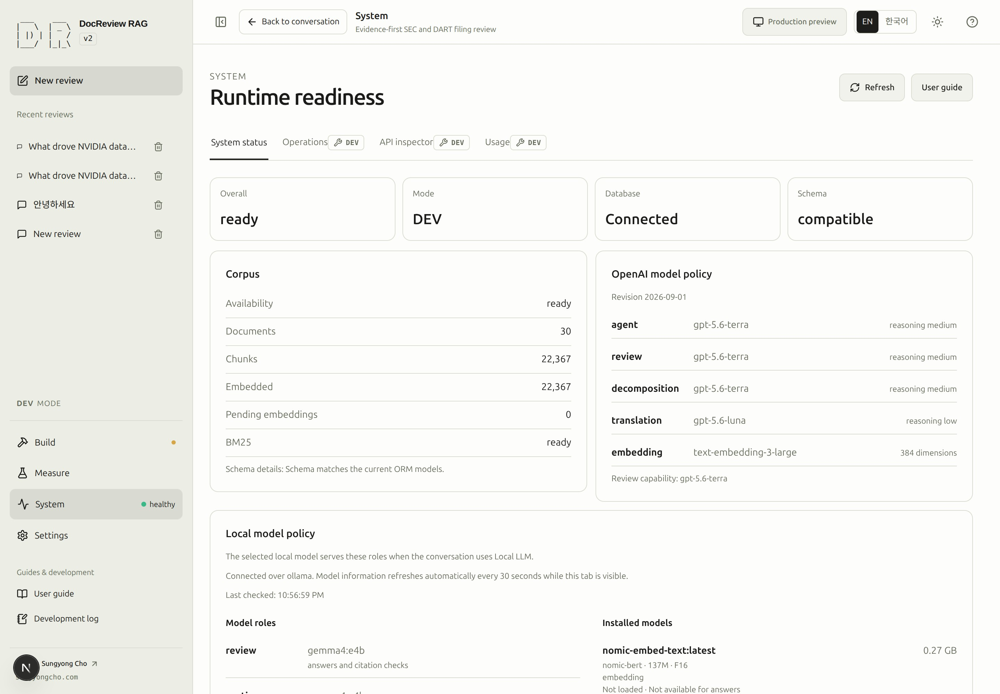
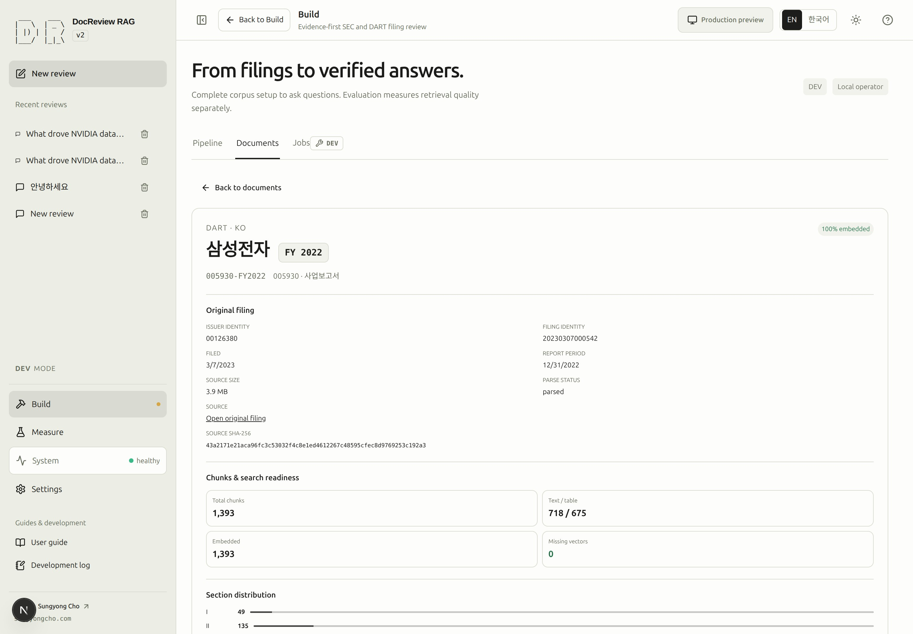
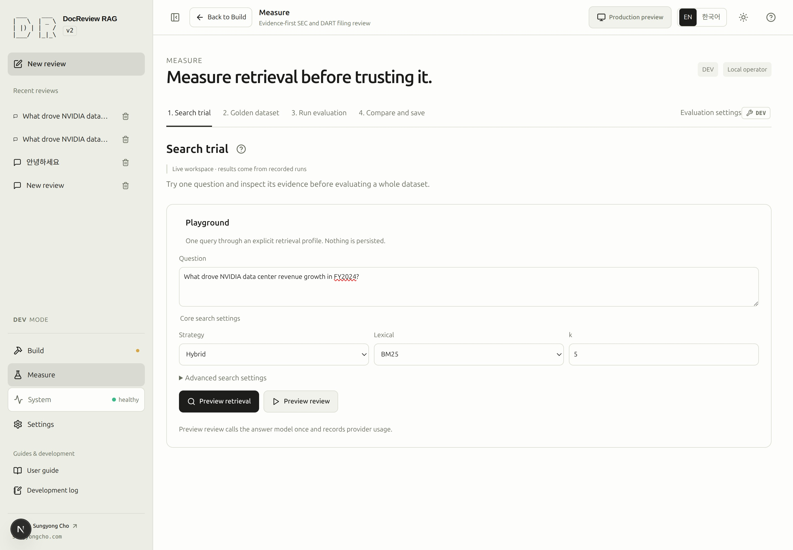
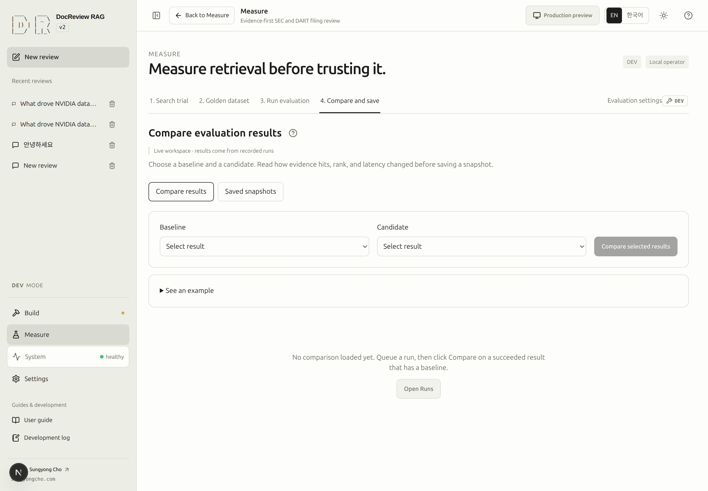
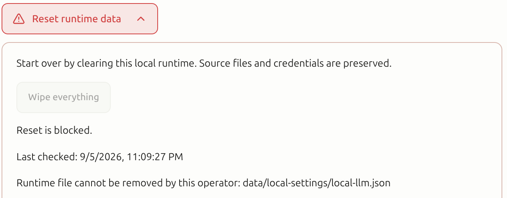

# From your first filing to a cited answer

**Legacy walkthrough.** This page preserves the earlier nine-step sequence for existing links. Follow the [current twelve-step guide](overview.md#learning-path) for current navigation and setup. Refreshed figures show actual saved or unexecuted states; this walkthrough was not run again for the screenshots.

Prepare NVIDIA filings, inspect retrieved evidence, and verify your first answer against the original report.
This preserves the earlier local development sequence; use the focused guides for current control labels and navigation.
The ASCII text logo identifies this interface as v2.

Data and runtime state prepared with `rag-dev` are also visible in the dashboard connected to that environment.
Check completed work in the dashboard and continue from there; do not repeat ingestion or embedding just to
switch between the terminal and the UI. Downloading source files and ingesting them into the DB are separate steps.

The default path uses **OpenAI embeddings and answers**. Downloads and ingestion do not call OpenAI.
Embedding, questions, and evaluations can incur charges. The screenshots were captured from the actual
local service on 2026-09-05. Both language editions share these Korean-interface images; click an image
on the website to open it at full size. The capture environment reuses 30 existing filings and prior runs,
so its counts differ from a fresh database. Its embedding provider is `deterministic`: a Done badge in
these images does not establish OpenAI readiness or semantic-search quality. Follow the OpenAI setup
and each **Screen check** in this guide.

Use the 한국어 / EN switch to change interface and documentation language. Stored questions, answers,
filings, and raw logs are not translated or rewritten. Code-card copy buttons copy the original code without
language labels or decorative prompts.

## 1. Open the development environment

**Purpose:** start with working tools, keys, and a local database.

For a first installation, complete [installation and configuration](cli.md#installation-and-configuration)
and [initial schema setup](cli.md#initial-schema-setup). Only these prerequisites require the terminal;
source acquisition and ingestion happen in the screens below. Keep and reuse an existing compatible database.

After [loading the project commands](cli.md#register-commands-and-open-help), start the services:

```bash
rag-dev up --build -d
```

Open [DocReview RAG](http://localhost:8000/docreview-rag-agent/). If `APP_PORT` differs, adjust the URL.
You do not need a separate port 3000 page. Reuse services that are already running.

**On screen:** confirm DEV mode, then open System → System status. Check API, DB, schema, and OpenAI
availability. Move to Build → Pipeline.

The pipeline combines a dependency graph and the selected step’s execution panel. The compact runtime
summary expands to show connection and schema details. Selecting a node opens its inputs, actions, and real job events;
it does not execute anything. Both embedding and BM25 readiness feed hybrid retrieval. When an index is
incomplete, check which retrieval lanes are available. Evaluation also requires a golden dataset. Graph
readiness is separate from the execution progress of an individual question. Server job events and terminal
CLI references are explicitly separate. Completed steps have a gently blinking green indicator; failed
steps use red. Reduced-motion preferences disable the animation. Color does not replace the status text.

**Screen check:** DEV mode and healthy API/DB connectivity, without schema errors. Connectivity does not
mean the corpus or embeddings are ready.

**Completion:** continue when the services and schema are ready. Otherwise use [diagnostics](cli.md#troubleshooting).

<!-- capture:01-system-status -->



*System status separates actual API/database/schema health, corpus readiness and model availability. This development corpus contains 30 filings; no preparation was rerun.*

<!-- capture:02-pipeline -->


*Pipeline combines the dependency graph with the selected step. Embeddings and BM25 are parallel preparation paths; evaluation needs an index and dataset, not a generated answer.*

## 2. Check existing data

**Purpose:** reuse completed preparation and run only missing work.

**On screen:** refresh the pipeline. Read document/chunk counts, embedding provider, pending embeddings,
and BM25 readiness. Open Documents and look for `NVDA-FY2024`, the fiscal year ending January 28, 2024.

Documents and Jobs start with the full list. Select a row to inspect its details. When the content area
is narrower than 1100 px, details replace the list; use Back to documents or Back to jobs to return with
filters, selection, and list scroll position preserved. On wide screens, drag the divider or focus it and
use arrow keys (Shift for larger steps); double-click to restore the default. The list starts at 360 px,
can resize within 320–600 px while retaining at least 560 px for details, and remembers the chosen width.
Company labels pair actual codes with names from the manifests. Public Documents contains only published snapshot documents.

**Screen check:** verify document identity and a nonzero chunk count. Other issuers or years do not need to
be deleted. If the source, document, and current OpenAI embeddings are ready, skip the corresponding steps.
An embedding count alone does not verify the producing model identity.

**Completion:** identify the remaining work. CLI ingestion into the same DB appears here, even though a
CLI operation may not appear in Jobs because it did not use the web queue.

<!-- capture:03-document -->



*A real Samsung Electronics filing highlights its supplied company name and FY 2022. The document ID, issuer code, source, and 1,393 chunks remain available below.*

## 3. Download NVIDIA filings

**Purpose:** obtain actual SEC source files. This does not ingest them into the database.

**On screen:** select Filings. Its execution panel shows the expanded Change… inputs; enter:

| Input | Value |
|---|---|
| Registry | SEC EDGAR |
| Tickers / stock codes | `NVDA` |
| Fiscal years | `2024` |

Search an existing company by code or name and select it, or type a new ticker and press Enter. DART
accepts six-digit stock codes. Fiscal years become removable chips; you can enter a single year or
an ascending range such as `2023-2025`. For this exercise, keep only NVDA and 2024.

Run **Download missing filings**, inspect the task in Jobs, and wait for `succeeded`.
Preparation status updates automatically when the job finishes.
A real SEC contact in `.env` is required.

**Scope:** source, company, and fiscal-year inputs define the acquisition scope inside the common
`manifest.json`. The result reports a `selection_id` for the acquired sources. Use that exact selection
for the next stages. The [one-filing CLI example](cli.md#prepare-one-nvidia-filing) uses the same workflow.

**Screen check:** job success, downloaded filing count, and source readiness. The global Filings stage can
remain incomplete when other companies in the main manifest have missing sources.

**Completion:** every source in the processing selection you will ingest must exist. CLI acquisition performs the
same source-preparation step; database storage happens next.

<!-- capture:04-sec-inputs -->


*Valid SEC company and fiscal-year chips with the Download missing filings action. Existing NVDA/AMD and FY2023/FY2024 inputs are shown; no download was started. Used for steps 3 and 4.*

## 4. Ingest the source into documents and chunks

**Purpose:** parse the downloaded report, create citable chunks, and persist them.

**Before starting:** verify development services and schema, then read the acquisition result's
`selection_id`. Reuse it with `manifest.json`; no copied catalog or extraction script is needed.
The [one-filing CLI procedure](cli.md#prepare-one-nvidia-filing) accepts the same selection.

**On screen:** select Parse & chunk, choose `manifest.json` and the returned selection, and check its
source and document counts before **Ingest**. Preparation status updates automatically after the job
finishes. Wait for success, then open Documents.

**Screen check:** `NVDA-FY2024` and a positive chunk count. The operation's document count refers to its
selection; existing documents remain in the database.

**Completion:** proceed to embedding. Ingestion also recalculates BM25, but it does not fill OpenAI vectors.
The `app.cli ingest --manifest …` command performs this storage step too; do not repeat a completed CLI ingest.

<!-- capture:05-manifest-ingest -->


*Parse & chunk lists the actual DART and SEC manifests with source and ingestion counts. Each row has its own Ingest action; no ingestion was started.*

<!-- capture:08-jobs -->


*An existing successful SEC manifest ingestion job is selected. Its actual target, progress and result are shown; this is historical work, not a job started for the guide.*

## 5. Prepare embeddings and BM25

**Purpose:** enable semantic and lexical retrieval.

**Paid operation:** configure `EMBEDDING_PROVIDER=openai` and a valid development key. The current model
is `text-embedding-3-large` at 384 dimensions. Inspect provider and pending counts before running.
Check `manifest.json` and the explicit selection before backfilling its missing or mismatched embeddings.
Reuse current embeddings instead of running backfill twice.

**On screen:** select Embeddings and run **Backfill embeddings** for that selection. Wait for Jobs to
succeed and verify the automatically updated pending count for the selected sources. Next inspect
Lexical index (BM25). Reuse ready statistics; only run **Rebuild BM25** if they are missing or
invalidated. Its completion also updates preparation status automatically. BM25 rebuilding does not call OpenAI.

**Screen check:** current provider, ready embedding count, pending zero, and BM25 ready. These are readiness
checks, not proof that an evaluation has been completed.

**Completion:** proceed to retrieval inspection. The CLI `retrieve --provider openai --embed-missing …`
also backfills but then performs a query; the web backfill button only prepares embeddings.

<!-- capture:06-embeddings -->


*The actual development index reports deterministic embeddings and zero pending chunks. This is not evidence of OpenAI embedding readiness or semantic quality. The recorded cost notice and explicit backfill action remain visible.*

<!-- capture:07-bm25 -->


*BM25 is already ready for the current corpus. The rebuild action is available but was not executed.*

## 6. Read evidence before generating an answer

**Purpose:** confirm that relevant evidence is retrieved.

**On screen:** open Measure → Search trial and enter:

```text
What drove NVIDIA data center revenue growth in fiscal 2024?
```

Choose Hybrid, BM25, `k=5`, and no reranker. Run **Preview retrieval**. OpenAI query embeddings can incur
cost. This does not require rebuilding the corpus.

**Screen check:** examine component rankings, document IDs, excerpts, and final ranks. Read whether the
retrieved NVIDIA text actually addresses the growth drivers.

**Completion:** move to the conversation when relevant evidence is present. Preview review is a separate
answer-model call; do not click it merely to inspect retrieval.

The CLI retrieval command also returns evidence, but Search trial has no equivalent input to `--doc-id`.
Its profile and any other documents in the DB can therefore produce different ranks and results.

<!-- capture:09-retrieval-inputs -->



*Search trial shows a real, unexecuted NVIDIA FY2024 query with Hybrid, BM25 and k=5. Retrieval and answer preview remain separate explicit actions.*

## 7. Configure and ask your first question

**Purpose:** obtain an answer with verifiable source citations.

**On screen:** open a new conversation. Above the input, choose OpenAI as the answer engine and set the
corpus/filters to SEC and NVIDIA FY2024. The current OpenAI answer model is `gpt-5.6-terra`. Send:

```text
What drove NVIDIA's data center revenue growth in FY2024? Cite evidence from the filing.
```

Before sending, use **Review settings** for Filters, Search, Evidence, and Run limits. Close that editor, then open the separate **Inspect request** icon and label in the primary row. It opens a right-side drawer on desktop and
a full-screen dialog on mobile. Compare Balanced, Korean, Accuracy, and Custom presets there. The displayed differences come from the effective retrieval settings. Inspect the
filters, prompt composition, and request payload; retrieved evidence is only selected after execution begins.
This is a preview of the next request. The completed result records server-applied settings when available.
The ? controls beside corpus scope and presets work with hover, keyboard focus, or touch. Selecting
Custom opens **Review settings → Search**. Conversation filters offer actual companies, languages, report types,
and fiscal years within the selected SEC/DART scope; an empty selection leaves that field unrestricted.
With Auto, wait for **Server-confirmed scope** in execution progress to see the actual registry, company
codes, and years chosen by the server. Until that event arrives, the scope remains unconfirmed.

**Sending can incur embedding, translation, and answer-model costs.** Wait for the request to finish.
The exact answer wording is not deterministic.

**Screen check:** open citation cards and inspect document identity, fiscal year, and original excerpts.
Do not rely on the `SUPPORTED` badge alone. Verify that the evidence supports the asserted growth drivers.
Open **Execution summary** to follow five phases:

| Phase | What it checks |
|---|---|
| 1. Understand the question | Determine intent and filing scope. |
| 2. Retrieve evidence | Fetch candidate evidence from the prepared corpus. |
| 3. Select relevant evidence | Evaluate whether candidates support the question. |
| 4. Verify answer and citations | Check claims and citations against the sources. |
| 5. Prepare the result | Return the verified outcome. |

Green completion indicators require actual server events. Before an event arrives the interface waits;
a phase that did not run is never filled in as complete. Returning to an earlier phase resets later indicators.
Casual conversation does not use the retrieval phase list. **Stop request** interrupts the current request.
Open **Run trace** for its ID, usage, and failure category. Completed execution does not by itself mean that
the document evidence was sufficient.

**Execution performance** separates browser request time from server execution time. It shows recorded
stage durations, model calls and attempts, and provider token counts. When a local provider returns timing
data, model loading, input processing, generation, and generated tokens per second appear separately.
Missing measurements, including CPU/GPU placement, remain **Not collected**. The active phase and elapsed
time follow real events; there is no estimated completion time. Older saved runs can lack these fields.
No live Gemma timing measurement was performed for this guide.

**Completion:** the first exercise is complete when the answer is supported by the NVIDIA excerpts and the
run has no operational failure. `NOT_IN_DOCS` means insufficient document evidence and is distinct from
connectivity or provider errors. A CLI search result alone is not a generated answer.

<!-- capture:15-cited-answer -->


*An existing saved NVIDIA FY2024 answer and its retrieved source evidence are shown. It was not rerun for this guide; candidate count and the single actual citation are distinct, and old evidence selections may be read-only.*

## 8. Change settings and evaluate

### Try Ollama answers

**Purpose:** keep the retrieval index and compare a local answer engine.

Ollama is a separately installed server. Check [local-model connectivity](cli.md#diagnose-local-model-connectivity)
first. Retrieval embeddings remain OpenAI, so this is not a fully offline or free path.

In Settings → Local LLM, enter a backend-reachable Server URL and click **Connect & save**. A Docker app
connecting to Ollama on the same PC normally uses `http://host.docker.internal:11434`, without `/v1`.
Then select Local LLM and a discovered answer-capable model using the primary composer row’s engine and model controls.
Saving a connection does not automatically switch the answer engine.

**Screen check and completion:** inspect connection, model, and engine, then repeat the question and verify
citations. A successful connection alone does not establish answer quality. Disconnect persists an off state;
Restore defaults uses startup settings. See [connection cleanup](cli.md#reset-local-connection-settings).

<!-- capture:13-local-model -->


*Default resolves the configured local Ollama endpoint without an address field. Actual connection health, three installed models and one answer-capable model are distinguished; addresses remain in Connection details.*

### Add DART

**Purpose:** include Korean business reports.

Set a real `DART_API_KEY` and run `rag-dev up -d` to apply it. Reuse existing data when ready.
Select Filings and use its Change… inputs to select DART, stock code `005930`, and fiscal year `2024`. Download missing filings,
wait for success, and read the returned `selection_id`. Preparation status updates automatically.
In Parse & chunk, choose the common `manifest.json` and that selection before clicking Ingest.
Only the selected sources are processed; other catalog entries remain available.

**Screen check and completion:** verify the Samsung FY2024 document, fill pending embeddings if needed
(a paid action), and confirm BM25. Ask a question naming the company and year and check its citations.
The CLI follows the same download → ingest → embedding sequence.

### Run a quick evaluation

**Purpose:** measure retrieval against questions with known source evidence.

Measure follows **1. Search trial → 2. Golden dataset → 3. Run evaluation → 4. Compare and save**.
Inspect one question, check its gold source spans, then run and compare under matching conditions.
Recall@k, hit rate, and MRR measure retrieval; they do not prove that the final answer is factually correct.

Open Golden dataset and inspect its questions and source readiness. A one-filing corpus is not a valid basis
for judging a suite covering other companies. Prepare all required source files, chunks, and embeddings first.

Open Run evaluation to see the evaluation runs list. Choose **New evaluation**, select a suite and
revision in the setup dialog, and use **Quick · current index** in the advanced options. Click
**Queue evaluation**. The queued job appears in the list; select it to inspect actual progress and settings.
Query embedding may incur charges. Once succeeded, inspect its result metrics and individual cases.
From Result details, enter a Snapshot label and choose **Save result as snapshot** to preserve the result
with current search data. Publishing a saved snapshot is a separate action.

The new suites are `sec-en_v2_astra`, `sec-ko_v2_astra`, and `sec-mixed_v2_astra`, with 20 evidence-aligned
English, Korean, and mixed-language questions each. They remain agent-curated and awaiting human approval.
Before interpreting a difference as language parity, check that company, fiscal year, and scope clues also
match across questions. Shared source spans alone do not establish equivalent question scope.
Click a question to inspect its details. **Source JSON · read-only** displays the canonical data; it is not
an editor. Create an editable draft to change questions, then save, validate, and publish. Published revisions
are immutable; selecting one does not make the source JSON editable.

**Screen check and completion:** verify suite, corpus coverage, hits/misses, and relevant ranks. In Compare
and save, select a baseline and candidate with matching suite, golden/corpus identity, and k. Example view is
illustrative, not an actual evaluation. A snapshot preserves search data plus an evaluation result for reuse.
Evaluation settings apply to the next new evaluation and do not change existing results.

<!-- capture:10-golden-question -->


*The mixed-language SEC suite is selected with an actual canonical question open. Canonical JSON is read-only; viewing a source question is separate from creating or editing a draft.*

<!-- capture:11-evaluation-inputs -->


*New evaluation setup uses the real mixed-language canonical suite: 20 cases and a ready current index. Hybrid/BM25/k=5 is visible; Queue evaluation was not pressed.*

<!-- capture:12-compare -->



*The actual comparison workspace has no selectable results yet, so comparison stays unavailable and no metrics are fabricated. Saving a snapshot requires a suitable recorded result.*

### Find help for a control

Open **Help**. The home view keeps four task-group filters and topic rows together; select a topic once for its short summary and three steps. **Back** returns to that home view. **Recommended** follows visible controls, and **Search help** searches Korean and English locally. Only the selected visible control receives an outline. **Reference** contains the longer explanation; **Read the full guide** opens its document in a new tab. See [using Help](overview.md#help) for navigation and scope. No answer model is called.

## 9. Stop and continue later

**Purpose:** retain the exercise data while stopping the service.

```bash
rag-dev down
```

On the next `rag-dev up -d`, Documents and browser conversations should remain. Do not download or embed
prepared data again. Optionally inspect [local prod preview](cli.md#development-and-local-prod-preview).

Deletion is optional. Read [shutdown and selective cleanup](cli.md#shutdown-and-selective-cleanup) for the
separate boundaries of browser conversations, DB volume, source files, and connection settings.

**Completion:** record where the exercise succeeded or failed and share feedback. When a screen or workflow changes, update its screenshot and instructions together without exposing keys or personal data.

<!-- capture:14-browser-data -->


*Data & help separates browser conversations and preference resets from server documents and job history. No cleanup or reset action was executed.*

## When you need to reset everything

At the top left of the Pipeline header, open the red **Reset runtime data** control with its chevron.
Reset requires the authenticated local dev operator. Availability checks inspect the same runtime files
and active jobs as deletion preview, and show **Last checked**. A blocked check displays the diagnosis,
path and permission details, and manual remediation commands where applicable. The check does not
change file ownership or permissions; review any proposed ACL command with the owner before applying it.
After addressing the reported condition, check again.

Finish active work first. **Wipe everything** opens the final deletion question. The preview identifies
the DB volume, tables, files, and preserved sources. **Cancel** closes it without deleting data.
**There is no automatic backup and no undo.** Type `WIPE <project-name>` exactly, then confirm the final action.
The DB, downloaded sources, generated evaluation artifacts, and saved connections are cleared; after server
success, clear DocReview browser data and return to setup. Code, keys, `.env`, documents/images, and
manifest/golden/profile sources are preserved. Changed targets or external DBs are refused. On partial failure,
read the completed stages before retrying. Reset is never required merely to start this tutorial.

<!-- capture:17-reset-blocked -->



*This records permission-blocked reset eligibility before the user authorized an access repair. The native crop omits machine-specific remediation commands. No reset was executed.*
