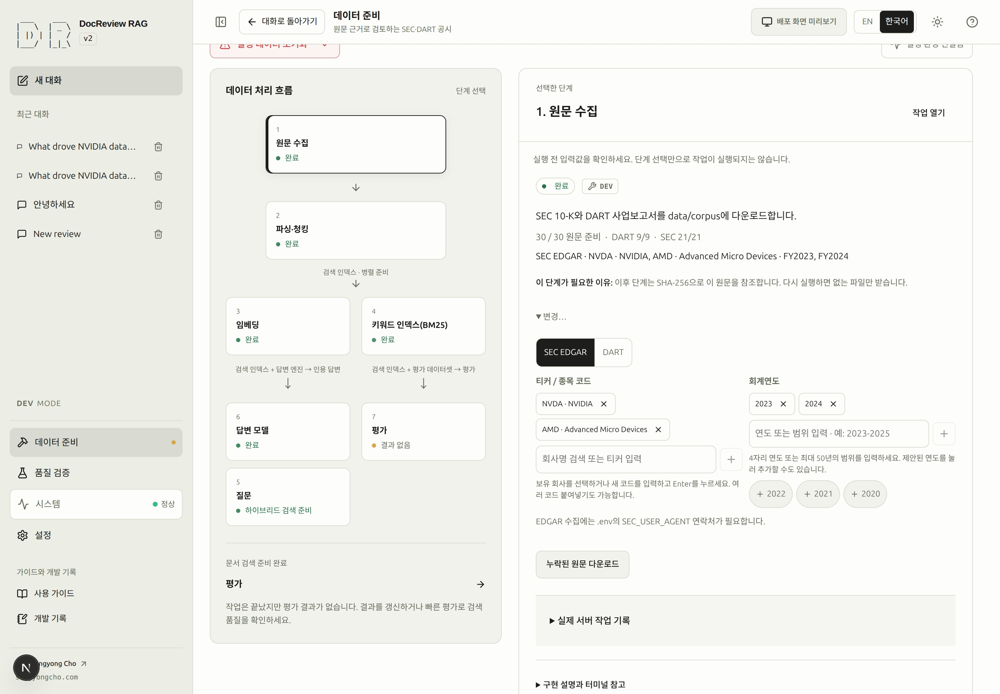

# SEC·DART 원문 수집

## 기본 수집 범위와 선택 항목

기본 선택은 **NVDA·AMD FY2019–2024**, **005930·000660 FY2022–2024**의 정확한
18개 회사·연도 쌍입니다. 파일 존재 여부와 별도로 유지됩니다.
`rag-schema recreate --sample`은 NVDA·AMD FY2023–2024를 선택하며 자동 다운로드하지 않습니다.
지원 회사 목록에서 회사를 고르고 연도를 추가하세요. 빈 선택을 포함한 편집 내용은 초기화
리비전이 바뀔 때까지 유지됩니다.

회사·연도 표는 다운로드 완료, 누락, 검증 실패를 구분합니다. 선택 변경은 준비 범위를 바꾸며
파일을 지우지 않습니다. **동기화**는 선택한 쌍의 누락·검증 실패 원문을 내려받고 정상 원문은
재사용합니다. 같은 연도의 서로 다른 공시는 접수번호로 구분해 유지합니다.

1단계는 다운로드와 현재 원문을 관리하고, 2단계는 선택한 원문 중 다운로드·검증을 마친
목록에서 시작합니다. 누락·변경·삭제된 선택은 명시적인 차단 사유로 남으며 파싱 대상에서
조용히 빠지지 않습니다. **원문 단계에서 선택 변경**으로 범위를 다시 정하세요.

### SCREENSHOT NEEDED

<!-- SCREENSHOT NEEDED: feature=company-year-inventory-selector; locale=ko; theme=light; capture=32-document-compact-grid-search-year-checkboxes-staged-pairs-and-sync; issue=131; preserve-existing-assets=true -->

**변경된 조작과 결과 상태의 스크린샷이 필요합니다. 기존 스크린샷은 변경하지 않았습니다.**

> [!DEV]
> 수집 입력 변경과 원문 다운로드는 개발 모드에서만 실행합니다. 공개 파이프라인은 살펴볼 수 있지만 수집 작업을 시작할 수는 없습니다.

수집은 보고서 원문을 내려받고 공통 `manifest.json`에 문서 식별 정보를 기록하는 단계입니다. 파싱과 DB 저장은
그다음에 수행합니다. 먼저 [문서 목록](documents.md#step-2)을 확인하고 이미 준비된 원문은 재사용하세요.

## 3. 출처·기업·회계연도 선택 {#step-3}

- **목표:** 준비할 보고서의 범위를 정합니다.
- **선행 조건:** [환경 확인](environment.md#step-1)을 마쳤고 부족한 보고서를 파악했습니다.
- **화면 경로:** 데이터 준비 → 파이프라인 → 원문 수집 → 회사·연도 표.
- **입력:** SEC EDGAR에서 `NVDA`, `2024`를 선택합니다. 한국 보고서는 DART에서 `005930`, `2024`를
  선택할 수 있습니다. 연도는 보고서의 회계연도이며 공시가 게시된 연도와 다를 수 있습니다.
- **주 동작:** 연도 칩이나 회사 체크박스로 선택하고, 없는 조합은 회사를 검색한 뒤 연도를 체크해 담습니다.
- **화면 변화:** 선택한 칩이 강조되며 **담길 예정**에는 선택한 누락 연도와 대기 중인 쌍이 표시됩니다.
- **완료 기준:** 출처·기업·연도가 의도한 보고서와 일치하고 잘못된 입력 초안이 남아 있지 않습니다.
- **실패와 복구:** 오류가 표시된 검색어를 수정하고 Enter로 반영한 뒤 **동기화**를 누르세요. 인증이나 보고서 조회 오류는
  [수집 문제 해결](troubleshooting.md)에서 확인합니다.
- **다음:** [누락 원문 다운로드](#step-4). 원문이 있으면 [파싱](indexing.md#step-5)으로 이동합니다.

회사 코드는 항상 표시됩니다. 직접 입력은 쉼표로 구분한 여러 코드와 최대 50년의 오름차순
연도 선택을 지원합니다. 파싱 단계는 선택한 회사·연도 범위와 정확한 문서 ID를 이어받습니다.

<!-- capture:04-sec-inputs -->

*이전의 분리된 회사·연도 입력 화면입니다. 새 선택표는 검증된 캡처가 필요하며, 이 이미지는 새 배치를 입증하지 않습니다.*

## 4. 누락 원문 다운로드 {#step-4}

- **목표:** 파싱에 필요한 원문 파일을 준비합니다.
- **선행 조건:** 3단계의 입력이 유효하고 [출처별 인증 설정](#sources)이 준비돼 있습니다.
- **화면 경로:** 데이터 준비 → 파이프라인 → 원문 수집의 선택 단계 실행 영역.
- **입력:** SEC·DART별 **담길 예정**을 확인합니다. 선택한 누락·검증 실패 원문을 요청합니다.
  인증 안내는 누락된 선택이 있는 출처에만 표시되며, 선택한 원문이 모두 정상이면 다운로드 버튼이 비활성화됩니다.
- **주 동작:** **동기화**.
- **화면 변화:** 대기 또는 실행 중인 작업이 생깁니다. 데이터 준비 → 작업에서 진행 상황과 실제 결과를 읽습니다.
  작업이 끝나면 준비 상태가 자동으로 갱신되므로 수동 새로고침은 필요하지 않습니다.
- **완료 기준:** 작업이 성공했고 반환된 처리 선택의 원문이 준비됐습니다. 다른 항목의 원문이
  부족하면 전체 단계는 여전히 미완료로 표시될 수 있습니다.
- **실패와 복구:** 작업 오류와 대상 문서를 확인한 뒤 재시도하세요. 실패·취소·재시작으로 인한 중단은
  서로 다른 상태이며 지원되는 상태에서만 재시도가 표시됩니다. [작업 진단](troubleshooting.md)을 참고하세요.
- **다음:** [파싱과 청크 생성](indexing.md#step-5).

SEC와 DART는 공통 `manifest.json`을 사용합니다. 선택한 출처·기업·회계연도가 수집 범위를
정합니다. 작업 결과의 `selection_id`는 실제로 수집한 원문을 명시하며, 같은 선택 ID로 DB 적재와
임베딩 준비를 진행합니다. 다른 카탈로그 항목은 그대로 보존되며 이 선택에 자동으로 포함되지
않습니다. [단일 공시 CLI 절차](cli.md#nvidia-한-건만-준비하기)도 같은 계약을 사용합니다.

## 출처별 준비 사항 {#sources}

| 출처 | 식별자 | 필요한 설정 | 공통 manifest |
|---|---|---|---|
| SEC EDGAR | `NVDA` 같은 티커 | 실명과 연락 가능한 이메일을 넣은 `SEC_USER_AGENT` | `manifest.json` |
| DART | `005930` 같은 6자리 종목 코드 | 유효한 `DART_API_KEY` | `manifest.json` |

인증 정보는 로컬 설정에 보관하세요. 스크린샷·요청 예제·Git에는 넣지 않습니다. 설정 적용이 필요하면
[환경 준비](environment.md)를 따릅니다. 이 문서를 읽는 동작은 수집이나 모델 호출을 실행하지 않습니다.

다운로드 원문은 DB 문서·청크·임베딩·공개 스냅샷과 별개입니다. 각 경계는
[구현 구조](architecture.md)에서 확인할 수 있습니다.

## 다운로드 상태와 현재 선택

원문 목록이 갱신돼도 직접 편집한 선택은 유지됩니다. **다운로드된 원문 모두 선택**으로
현재 디스크 집합을 명시적으로 반영할 수 있고, **선택 해제**는 파일을 보존합니다.
파싱·청킹의 **원문 단계에서 선택 변경**으로 돌아오세요.
`uv run python -m scripts.schema recreate`는 빈 상태로, `--sample`은 샘플 초안으로
시작하며 `--keep-sources`는 원문을 보존합니다. 초기화 범위 차이는 [CLI 안내](cli.md)를 확인하세요.

## 웹에서 현재 원문 삭제

1단계에서 다운로드된 원문을 선택하고 **선택한 원본 삭제**를 누르세요. 미리보기는 출처·회사·
회계연도·접수번호·문서 ID와 실제 파일 경로·크기를 표시합니다. 다른 목록이나 과거 작업이
참조해서 보존할 파일도 구분합니다. **원본 삭제 확인** 전에는 파일을 지우지 않습니다.
취소와 **선택 해제**는 원문과 기록된 입력을 보존합니다.

확인은 삭제 작업을 큐에 등록합니다. 삭제 완료 여부는 **작업**의 실제 결과로 확인하세요.
미리보기는 5분 뒤 만료되며 한 번만 사용할 수 있습니다. 파일·목록 변경, 만료 또는 서비스
재시작 뒤에는 새 미리보기가 필요합니다. 삭제 작업은 이전 승인으로 재시도하지 않습니다.
새 파싱에 쓰려면 삭제한 원문을 다시 다운로드해야 합니다. DB 문서·청크·임베딩·스냅샷과
과거 작업 입력은 보존되며 파생 데이터까지 연쇄 삭제하지 않습니다.

### SCREENSHOT NEEDED

<!-- SCREENSHOT NEEDED: feature=source-deletion; state=exact-target-preview-and-queued-result; locale=ko; theme=light; issue=200; preserve-existing-assets=true -->

## 현재 파일과 보존되는 입력

현재 원문은 `sec/<접수번호>/primary.html`, DART는 `dart/<접수번호>/primary.xml`과
`original.zip`의 고정 경로를 사용합니다. 원래 URL·파일명은 메타데이터에 보존됩니다.
반복 다운로드는 같은 현재 경로와 등록을 갱신합니다. 기존 복제본은 공시 식별과 실제 바이트가
일치하는 경우에만 정리하고, 내용이 다른 정상 복제본은 자동 선택하지 않습니다.
다른 목록과 과거 작업이 참조하는 입력은 보존하며 새 파싱 작업은 검증한 바이트를 `inputs/`에
고정한 뒤 큐에 등록합니다.

화면 갱신은 파일 존재·크기·수정 정보를 확인하며 바뀐 파일만 다시 검증합니다. 다운로드 완료와
파싱 선택 시에는 전체 바이트 검증을 유지합니다. 임시 파일과 파일시스템 저널을 거쳐 게시하고,
중간 실패는 이전 바이트를 복구합니다. 미완료 `.source-transaction`이 있으면 선택·삭제·초기화를
막습니다. 수집을 다시 실행하면 증거가 일치하는 트랜잭션을 복구하며, 외부 변경이나 손상된 복구
자료가 있으면 저널을 보존하고 확인을 요구합니다.

새로 시작은 관리하는 원문·고정 입력·manifest·선택 초안을 함께 초기화합니다. 무관한 파일은
보존하고 `--keep-sources`는 원문 집합을 유지합니다. DB 또는 정리 결과가 불확실하면 기존
초기화 저널을 보존합니다.
