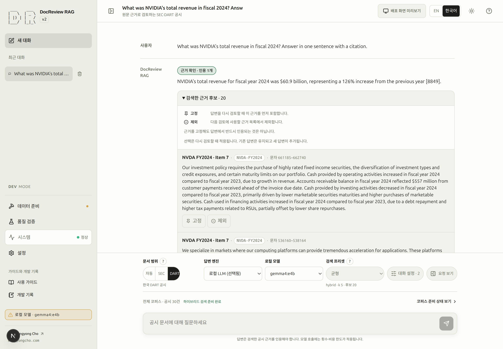

# 질문하고 인용 근거 확인하기

답변은 출처 결정·검색·근거 검토·모델 실행을 연결한 결과입니다. 근거가 있는 답변, 근거 부족
(`NOT_IN_DOCS`), 실행 오류는 서로 다른 결과입니다. 요청이 끝났다는 이유만으로 답변이 성공했다고
판단하지 말고 각 상태를 구분해 읽으세요.

## 9. 답변 엔진을 선택하고 첫 질문 보내기 {#step-9}

- **목표:** 의도한 보고서에서 주장과 인용을 확인할 수 있는 답변을 얻습니다.
- **선행 조건:** [8단계](retrieval.md#step-8)에서 관련 근거를 찾았고 답변 엔진과 범위 필터가 유효합니다.
  결과를 읽는 방법만 익히려면 기존 답변을 재사용할 수 있습니다.
- **화면 경로:** 새 대화 → 질문 위의 제어 영역 → 요청 보기.
- **입력:** SEC 범위, 사용 가능한 [답변 엔진](#engines), 균형 프리셋을 선택합니다. 코퍼스에 있으면
  NVIDIA·FY2024 필터를 고르고 전송할 요청을 확인합니다.
- **주 동작:** 아래 예제의 **질문 전송**.
- **화면 변화:** 서버가 보낸 실제 실행 단계가 표시되고 답변·근거 또는 명시적인 오류가 나타납니다.
  자동 범위의 확정 결과는 서버가 전달한 뒤에만 표시됩니다.
- **완료 기준:** 문서·연도가 맞고 인용 구절이 주장을 뒷받침하며 실행 오류가 없습니다.
  근거 확인 표시는 원문 검토를 대신하지 않습니다.
- **실패와 복구:** `NOT_IN_DOCS`와 모델 호출 실패·노드 오류·실행 한도 초과를 구분하세요.
  실행 트레이스를 열고 [실행 진단](runtime.md)과 [문제 해결](troubleshooting.md)을 확인합니다.
- **다음:** [설정과 근거 선택 조정](settings.md#step-10).

```text
What drove NVIDIA's data center revenue growth in FY2024? Cite evidence from the filing.
```

전송 시 임베딩·번역·답변 모델 비용이 발생할 수 있으며 답변 문구는 매번 같지 않습니다.
**요청 중지**는 실행 중인 요청을 중단합니다. 화면은 완료 단계를 가짜로 채우거나 남은 시간을
추정하지 않습니다. 앞 단계로 돌아가면 뒤 단계는 다시 대기할 수 있습니다.

<!-- capture:15-cited-answer -->



*기존에 저장된 NVIDIA FY2024 답변과 검색 근거입니다. 촬영을 위해 재실행하지 않았습니다. 검색 후보 수와 실제 인용 1건은 다르며 이전 근거 선택은 읽기 전용일 수 있습니다.*

## 답변 엔진 선택 {#engines}

제어 순서는 **문서 범위 → 답변 엔진·로컬 모델 → 검색 프리셋 → 대화 설정 → 요청 보기**입니다.
모바일에도 범위와 엔진 선택이 표시됩니다. 모델 사용 가능 여부와 코퍼스 준비는 별개의 확인입니다.
모델명이 표시됐다는 사실만으로 설치나 호출 가능성이 확인되는 것은 아닙니다.

> [!DEV]
> 답변 엔진·모델 변경과 로컬 서버 구성은 개발 모드 전용입니다. 일반 공개 질문은 정해진 운영 정책을 사용하며 이 조작을 필요로 하지 않습니다.

OpenAI는 설정된 답변 정책과 유효한 개발 키를 사용합니다. 현재 모델 ID는
[CLI 설정](cli.md#설치와-초기-설정)에서 확인하세요. 실행을 빠르게 보이게 하려고 모델이나 한도를 바꾸지 않습니다.

Ollama를 사용하려면 **설정 → 로컬 LLM**을 엽니다. 동작 중인 연결은 유지하고, 연결이 필요하면 **Default**를 선택해 **연결 진단 실행**으로 백엔드 연결과 답변 모델 준비 여부를 확인합니다. 해당 서버를 적용하려는 경우에만 **연결**을 누른 뒤 대화창에서 설치된 답변용 모델을 선택합니다. **서버 추가…**는 별도 서버의 이름과 주소를 등록할 때 쓰며 필수 단계가 아닙니다.

[macOS·Linux Ollama 안내](ollama.md#connect)에서 설치·네트워크 접근·복구를 설명합니다. 진단은 답변 생성이나 모델 로드를 실행하지 않습니다. 임베딩 전용 모델은 답변용이 아니며, 프로덕션 미리보기에서는 로컬 모델을 의도적으로 막을 수 있습니다. 설정 범위와 측정 상태는 [설정](settings.md#local-server), [실행 환경](runtime.md#local-models)에서 확인합니다.

## 범위·근거·요청 확인 {#inspection}

범위와 프리셋 옆 물음표는 마우스 올리기·키보드 포커스·터치·Escape를 지원합니다. 자동 범위는
사용자가 선택한 값과 서버가 실제로 결정한 출처·기업·회계연도·이유를 별도로 보존합니다.
확정 전에는 미확정 상태이며 브라우저가 결정을 추측해서 표시하지 않습니다.

**대화 설정**의 독립적인 편집기에서 필터·검색·근거·실행 한도를 조정합니다. 사용자 설정을
고르면 검색 영역이 바로 열립니다. 편집기를 닫은 뒤 주 제어 행의 별도 **요청 보기** 아이콘과
짧은 글자로 다음 요청을 읽기 전용으로 확인합니다.

요청 보기는 넓은 화면의 오른쪽 서랍, 좁은 화면의 전체 화면 대화상자로 열립니다.
독립적으로 스크롤하고 닫으면 포커스가 돌아옵니다. 검색·필터·엔진·프롬프트 구성·전송할 요청을
구분해 보여 줍니다. 실행 전 근거는 미확정이며 서버 적용값은 수집된 경우 해당 실행 결과에서 확인합니다.

**검색한 근거 후보**를 펼쳐 문서 식별자·연도·출처 링크·구절을 읽으세요. 후보 수와 인용 수는
서로 다른 수치입니다. 고정·제외는 [선택한 근거로 다시 검토](settings.md#step-10)할 때 적용하며
현재 답변을 다시 쓰지 않습니다.

**코퍼스 준비 상태 보기**로 준비 화면에 이동하고 **대화로 돌아가기**로 초안·설정·메시지·스크롤을
보존한 대화로 복귀합니다. [실행 성능 안내](runtime.md)는 실측 막대·반복 호출·미수집 값·이전 기록을 설명합니다.
