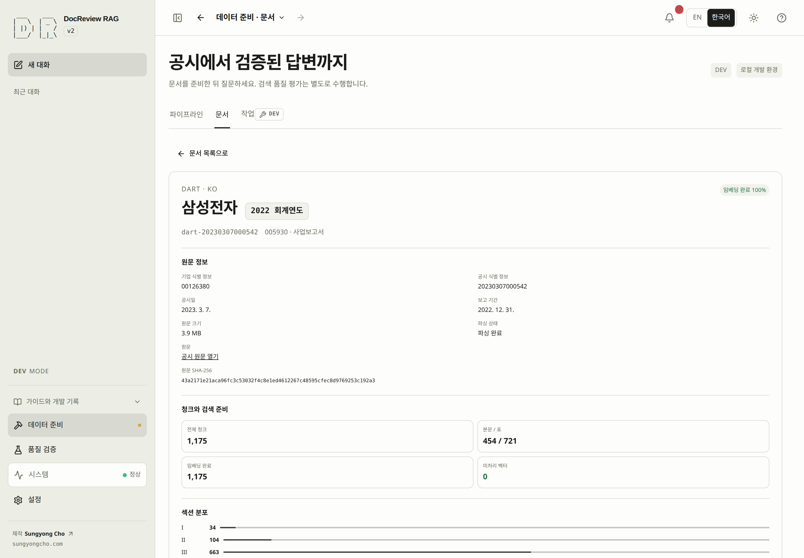

# 문서와 코퍼스 준비 상태

<!-- heading-alias: 포트폴리오-문서-목록 -->
## 포트폴리오 문서 목록 {#portfolio}

문서 화면에서 기업·회계연도에 해당하는 실제 공시 원문, 저장된 청크, 인덱스
준비 상태를 함께 확인합니다. 목록은 공시를 찾는 곳이고, 상세는 그 원문에 대해
어떤 준비가 실제로 끝났는지 확인하는 곳입니다.

PROD 문서 목록은 원문 수집과 동일한 고정 게시 포트폴리오 집합을 사용합니다. 문서를 열어 실제 청크 본문과 인용을 확인할 수 있습니다. 게시 목록에 없다고 DEV 원문이 삭제된 것은 아닙니다. 준비된 대상 문서 게시는 별도의 운영 작업입니다.

## 기존 코퍼스 확인하기 {#step-2}

> [!GOAL]
> 재사용할 수 있는 준비와 아직 필요한 첫 작업을 구분합니다.
>
> **준비** [실행 환경 확인](environment.md#step-1) · **완료** 의도한 원문과 빠진 준비를 파악했거나 목록이 비어 있음을 확인했습니다.

사이드바 **데이터 준비 → 문서**를 열거나, 대화의 코퍼스 상태 문구로 이동했다면 데이터 준비의 문서 탭을 선택합니다. 확인할 공시에 해당하는 문서 ID·기업·종목 코드로 검색하세요. `sec-0001045810-24-000029`는 문서 ID의 예시이며 모든 DB에 존재하는 값은 아닙니다. 기업과 회계연도는 실제 선택 가능한 값으로 목록을 좁히므로, 어떤 자료가 있는지 살펴보는 중이면 제한하지 않은 상태로 둡니다. 기존 문서가 없어도 괜찮습니다. 실제로 빈 목록임을 확인하는 것도 시작 상태를 파악하는 결과입니다.

1. 검색된 문서의 행이나 문서명을 선택합니다. 선택 전에는 목록이 전체 폭을 사용하며 첫 문서를 자동으로 선택하지 않습니다.
2. 상세에서 원문 식별 정보, 제공되는 원문 링크, 청크 수, 임베딩 정체성, 스냅샷 소속, 관련 작업을 읽습니다. 상세 상단에는 회사명과 **FY** 회계연도 배지가 크게 나오고, 그 아래에 고정 문서 ID·회사 코드·보고서 종류가 표시됩니다. 회사명이 없으면 식별자를 보여 주며 이름을 임의로 만들지 않습니다.
3. 아래 표에서 빠진 준비를 확인합니다. 임베딩 수가 양수라는 것만으로는 부족하므로 저장된 임베딩 정체성도 확인하고, 문서의 임베딩 비율이 완료여도 BM25 상태는 파이프라인에서 따로 확인합니다.
4. 문서가 없다면 로딩이 끝난 뒤 필터를 해제해 빈 상태를 확인하고 수집 단계로 이동합니다. 무관한 문서를 대신 선택할 필요는 없습니다. 결과가 없는 이유는 적용 중인 필터, 적재 문서 없음, 공개 모드의 게시 문서 없음일 수 있으므로 [공개 범위](#visibility)를 확인하고 관련 필터 칩을 제거하세요. 로딩 오류는 빈 목록이 아니므로 **다시 시도** 또는 **필터 다시 불러오기**를 사용하고, 계속 실패하면 [문제 해결](troubleshooting.md)을 따릅니다.

<!-- screenshot: document-detail -->

*상세 화면에서 원문 식별 정보와 저장된 청크·임베딩 수치를 확인한 뒤 아래에 안내되는 다음 준비 단계로 넘어가세요.*

| 확인할 내용 | 알 수 있는 것 | 빠졌을 때 이어갈 작업 |
|---|---|---|
| 기업·회계연도·원문·공시 식별 정보 | 의도한 실제 보고서인지. | 검색을 수정하거나 [수집 입력](acquisition.md#step-3)을 정합니다. |
| 전체 청크와 원문 인용 미리보기 | 파싱된 인용 가능 내용이 저장되었는지. | 청크가 없으면 [파싱과 청크](indexing.md#step-5)를 진행합니다. |
| 임베딩 수·누락 벡터·임베딩 정체성 | 벡터가 있는 범위와 생성한 제공자·모델·차원. | 현재 설정과 맞는지 [임베딩](indexing.md#step-6)을 확인합니다. |
| 파이프라인의 어휘 인덱스 상태 | BM25 준비 경로가 완료되었는지. | [BM25](indexing.md#step-7)를 확인합니다. |
| 스냅샷 소속 | 이 문서를 포함한 기록된 스냅샷. | [스냅샷 공개 범위와 재사용](snapshots.md)을 읽습니다. |

상세의 **다음 단계**는 관련 파이프라인 단계로 이동하고 **작업 열기**는 준비 작업 기록을 보여 줍니다. 이동만으로 작업을 시작하지 않으며, 이 확인을 위해 다른 기업·연도 자료를 삭제할 필요는 없습니다.

다음은 [3단계에서 출처·기업·회계연도 선택](acquisition.md#step-3)입니다. 해당 원문이 이미 있다면 같은 다운로드를 건너뛰고 첫 번째 미완료 [인덱스 준비](indexing.md) 단계부터 진행하세요. 두 검색 경로가 준비되었다면 [8단계: 검색](retrieval.md#step-8)으로 이동합니다.

## 검색과 필터 {#filters}

기본 도구 모음에는 검색·기업·회계연도와 **필터**가 있습니다. 필터를 펼치면
공시 출처·언어·보고서 유형·파싱 상태·임베딩·소속 스냅샷, 묶기와 정렬을 조절합니다.
이 조작은 현재 목록을 좁히며 원문 수집 입력을 바꾸지 않습니다.

적용한 필터는 제거 가능한 칩으로 표시됩니다. 하나를 제거하면 해당 조건이
풀리고, **필터 초기화**는 현재 필터를 모두 해제합니다. 선택한 문서가 나중에
바꾼 필터에서 제외되면 이를 명시적으로 알려 줍니다. 필터를 해제하거나 다른
문서를 선택하세요. 제외 안내가 원문 삭제를 의미하지는 않습니다.

기업명은 실제 원문 메타데이터를 사용합니다. 코드가 요청과 필터의 실제 값이며,
이름이 없거나 서로 충돌하면 코드만 보일 수 있습니다. 회계연도는 보고 대상
회계 기간이므로 제출일의 달력 연도와 다를 수 있습니다. 상세에서 보고 기간과
제출일을 함께 읽으세요.

## 목록·상세와 이전 작업으로 돌아가기 {#navigation}

화면이 충분히 넓으면 문서를 선택했을 때 분할 화면이 열리고, 좁은 화면에서는
상세가 목록을 대신합니다. **문서 목록으로**를 누르면 검색·필터·선택·목록
스크롤을 유지한 채 돌아옵니다. 탭 전환과 작업 영역 이동도 세션 안에서
관련 상태를 유지합니다. 준비 상태를 확인한 뒤 대화로 돌아갈 때는 명시적인
**이전**을 사용하세요.

<!-- details: split-view | 분할 화면 폭 조절 -->
실제 콘텐츠 영역이 1100 px 이상일 때 분할 화면이 열립니다. 목록 기본 폭은
360 px이고, 상세에 최소 560 px를 남기는 범위에서 320–600 px로 조절합니다.
구분선을 드래그하거나 포커스를 둔 뒤 방향키를 사용하세요. Shift는 더 크게
조절하고, Home·End는 가능한 최소·최대 폭으로 이동하며, 두 번 누르면 기본
폭으로 돌아갑니다. 문서와 작업의 폭은 따로 기억합니다.
<!-- /details -->

준비 관련 오류의 **이 부분을 살펴보세요**는 해당 파이프라인 단계로 이동합니다. 그곳에서 선행 조건과 필요한 터미널 작업을 확인한 뒤 문서 화면으로 돌아와 새로고침합니다. 이동만으로 인제스트·임베딩·인덱스 재구축을 실행하거나 실패한 요청을 완료로 바꾸지 않습니다.

## 개발 환경과 공개 범위 {#visibility}

> [!DEV]
> 게시하지 않은 공시와 관리자 메타데이터는 개발 모드에서만 조회합니다. 공개 목록과 상세는 준비 완료된 공개 스냅샷의 소속을 따릅니다.

개발 목록에는 게시하지 않은 문서도 나타날 수 있습니다. 공개 목록은 준비 완료된
공개 스냅샷에 속한 문서로 제한되며, 문서 수·기업 선택지·상세 정보에도 같은
공개 경계를 적용합니다.

따라서 공개 목록이 비어 있어도 운영자의 DB 전체가 비었다는 뜻은 아닙니다.
비공개 스냅샷이나 준비되지 않은 스냅샷은 그 문서를 공개하지 않습니다.
공개 사용자는 목록을 통해 문서 준비 작업이나 비공개 원문 메타데이터에 접근할
수 없습니다. 스냅샷 소속을 곧바로 공개 여부로 해석하기 전에
[스냅샷](snapshots.md)을 읽으세요.

시스템·파이프라인 요약은 현재 필터 목록보다 넓은 코퍼스를 설명할 수 있습니다.
SEC·DART·기업·연도별 검색 결과와 수치를 비교하기 전에 요약의 범위 표시를 읽으세요.
