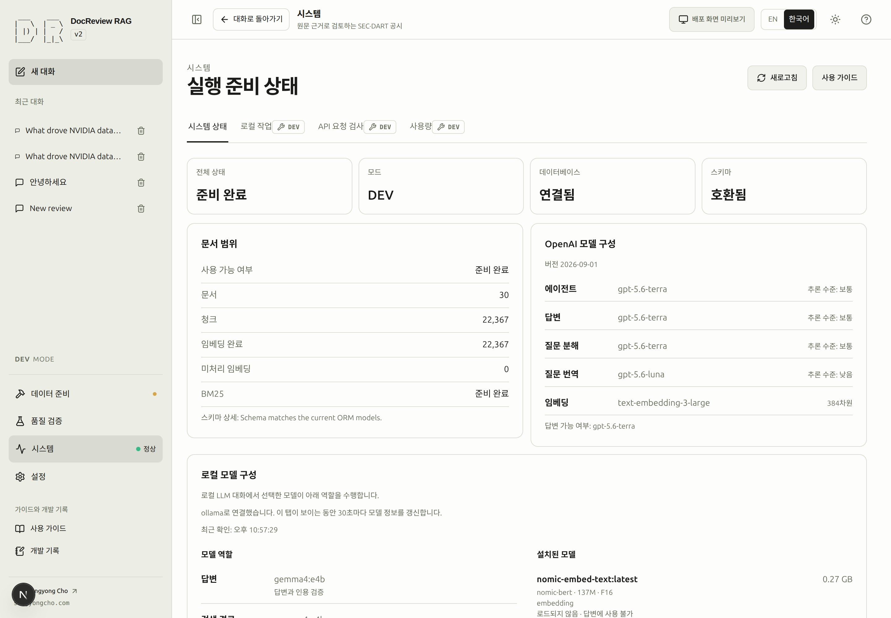
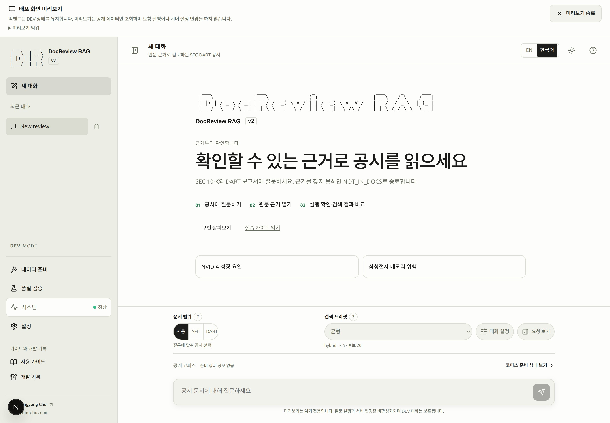

# 환경 준비

이 페이지는 GitHub에서 DocReview RAG를 clone한 뒤 로컬에서 처음부터 실행하는 사람을 위한 안내입니다. 아래 Part 1을 따라 서비스를 준비하고 데이터 준비 화면을 엽니다. 이미 실행 중인 앱을 바로 체험하려면 [Quick Start](quickstart.md)를 보세요.

## Part 1: 환경 준비 {#qs-setup}

### 선행 조건 {#prerequisites}

Bash 또는 Zsh, uv, Docker Engine·Compose 2.24.4+를 준비하세요.
웹의 Node/npm은 컨테이너에서 실행되므로 이 경로에서는 호스트에 별도로 설치하지 않습니다.

```bash
git clone https://github.com/sungyongcho/docreview-rag-agent.git
cd docreview-rag-agent
source ./rag-alias.sh
rag-help
rag-quickstart
```

source 한 번으로 설치와 현재 셸 활성화를 진행합니다. Y는 자동 등록을 저장하고 N은 이번 셸만 불러옵니다. 같은 터미널에서 바로 명령을 사용할 수 있으며 이후 변경은 `rag-alias update`로 반영합니다.

Helper는 저장소에 포함됩니다. `source`는 현재 터미널에 등록하며,
선택적인 [영구 등록 방법](cli.md)은 명령 안내를 참고하세요.
첫 실행은 `.env`가 없을 때만 생성합니다. 파일을 로컬에서 편집하고 `rag-quickstart`를 다시 실행하세요.

```dotenv
SEC_USER_AGENT=Your Real Name your-real-contact@example.org
DART_API_KEY=<your-own-dart-key>
OPENAI_API_KEY_LOCAL=<your-own-openai-development-key>
EMBEDDING_PROVIDER=openai
EMBEDDING_MODEL=text-embedding-3-large
```

예제 값을 실제 연락처·키로 바꾸세요. DEV는 `OPENAI_API_KEY_LOCAL`,
운영은 `OPENAI_API_KEY_PROD`만 읽습니다. 키를 문서 입력란에 넣거나 화면에 캡처하지 마세요.
저장소의 임베딩 차원은 384입니다. deterministic 임베딩은 이 실습의 완료 기준이 아닙니다.
SEC 연락처와 DART 키는 원문 수집에 필요하고, 임베딩 생성에는 OpenAI 비용이 발생합니다.
첫 실행 명령 자체는 수집·임베딩·답변 요청을 하지 않습니다.

빈 DB에만 스키마를 생성하고 기존 정상 DB는 보존합니다. 스키마가 맞지 않으면 자동 초기화하지
않고 원인을 안내합니다. 설정·도구 누락을 해결한 뒤 같은 명령을 재실행하세요.
설치 문제를 고치려고 `rag-fresh-start`를 실행하지 마세요.
표시된 주소(기본 `http://localhost:8000/docreview-rag-agent/`)를 엽니다.

설정 명령은 사전 요구사항 → 로컬 설정 → 프로젝트 서비스 상태·시작 → 스키마 준비 → DEV 서버 준비 확인의 다섯 단계를 표시합니다. `db`, `app`, `web` 각각의 중지·시작 중·비정상·실행 상태를 구분합니다. 헬스 체크가 없는 컨테이너가 실행 중이라는 사실만으로 서버 준비 완료를 선언하지 않습니다. 이미 정상 실행 중인 서비스도 Compose가 개발 설정을 적용하기 전에 표시합니다.

설정에서 중단되면 각 키의 `.env` 줄·shell 값·실제 적용 출처를 보여 주고 인증 정보는 숨깁니다.
`[f]`로 이번 실행의 잘못된 export를 제외하거나 `[e]`로 공개 임베딩 설정 두 개를 저장할 수
있습니다. 파일을 고친 뒤 `[r]`로 같은 단계에서 다시 확인하고, `[q]`로 취소합니다. 부모 셸은
바꾸지 않으므로 이후 실행에도 적용하려면 출력된 `unset KEY`를 부모 셸에서 실행하세요.
시작·readiness 실패 시 기존 읽기 전용 진단을 실행하고, 확인 후 볼륨을 보존하는
종료·빌드·시작 복구를 한 번 제안합니다.

### SCREENSHOT NEEDED
<!-- Feature: guided Quick Start configuration repair; locale=ko; plain ASCII/no-color; show a redacted shell-versus-file embedding conflict and successful resume without reinstalling dependencies. Preserve existing assets. -->

## 1. 실행 환경 열고 확인하기 {#step-1}

**목표:** 현재 환경에서 문서를 살펴보고 필요한 준비 작업을 할 수 있는지 확인합니다.

**선행 조건:** 위 설치를 완료했거나 호환되는 DB가 연결된 실행 중인 서비스가 있어야
합니다. 이 확인을 위해 원문 수집·임베딩·답변 요청을 실행할 필요는 없습니다.

**화면 경로:** 사이드바 **시스템 → 시스템 상태**. 페이지 제목은 **실행 준비 상태**입니다.
모드 표시를 읽고, 준비 과정을 실습하려면 개발 환경을 사용하세요.
공개 모드는 권한이 달라 일부 조작이 보이지 않을 수 있습니다.

**입력과 의미:** 상태를 읽는 단계이므로 질문이나 기업을 입력하지 않습니다.
서비스 주소가 의도한 환경인지 확인하세요. 화면이 같아 보여도 API·DB 주소가
다르면 다른 데이터를 사용하는 환경일 수 있습니다.

**주요 동작:** **새로고침**을 한 번 누르고 **확인 중…**이 끝날 때까지 기다립니다.

**화면 변화:** 상태 정보가 갱신됩니다. 시스템 메뉴나 연결 경고에서 API 상태를
읽고, 데이터베이스·스키마 항목을 확인하세요. 코퍼스 수치와 모델 정책은 같은
환경의 다른 준비 항목입니다.

| 항목 | 확인할 내용 | 이것만으로 알 수 없는 것 |
|---|---|---|
| API 상태 | 연결 실패·확인 중에 머물지 않고 서비스가 응답하는지. | 문서나 모델 호출의 준비 완료 여부. |
| 데이터베이스 | 의도한 DB에 연결되었는지. | 스키마 호환 여부. |
| 스키마 | 누락 테이블이나 스키마 불일치가 없는지. | 문서가 한 건이라도 존재하는지. |
| 모드와 권한 | 필요할 때 개발용 준비 조작을 사용할 수 있는지. | 공개 서비스에서 관리자 쓰기가 허용되는지. |
| 코퍼스 | 빈 상태·일부 준비 상태를 포함해 실제 수치가 수집되었는지. | 모든 벡터가 의도한 모델로 만들어졌는지. |
| 모델 가용성 | 선택한 엔진이 사용 가능하거나 빠진 조건이 설명되는지. | 모델 요청의 성공이나 답변 근거의 충분함. |

<!-- capture:01-system-status -->



*시스템 상태에서 실제 API·DB·스키마 상태, 코퍼스 준비, 모델 사용 가능 여부를 나누어 확인합니다. 개발 코퍼스에는 공시 30건이 있으며 준비 작업을 다시 실행하지 않았습니다.*

### SCREENSHOT NEEDED

<!-- SCREENSHOT NEEDED: feature=system-status-dev-badges; locale=ko; theme=light; capture=system-status-tab-showing-dev-badges-on-local-model-policy-and-local-runtime-panels; issue=79; preserve-existing-assets=true -->

**로컬 모델 구성과 로컬 실행 환경 패널의 DEV 배지 스크린샷이 필요합니다. 기존 스크린샷은 유지합니다.**

**완료 조건:** API가 응답하고 DB가 연결되며 스키마를 사용할 수 있습니다.
현재 환경에서 문서 준비를 허용하는지도 파악했습니다. 코퍼스가 비어 있어도 이
조건은 충족할 수 있으며, 기존 데이터 확인은 다음 단계에서 합니다.
알 수 없는 항목은 확인되지 않은 상태이므로 통과로 해석하지 않습니다.

**흔한 실패와 복구:** 페이지는 열리는데 API 확인이 실패하면 `rag-dev ps`와
`rag-dev logs --tail=80 app`을 확인하세요. [문제 해결](troubleshooting.md)에서
기록된 증상에 맞는 조치를 적용하고 다시 새로고침합니다. 새 DB라면 위의 스키마
준비를 따릅니다. 스키마 불일치가 있다고 기존 DB를 삭제하지 않습니다.

**다음:** 데이터 준비 화면을 열고 아래 개발용 준비 안내로 이어갑니다.

## 데이터 준비 화면을 열고 이어가기 {#open-build}

출력된 앱 주소를 열고 **데이터 준비 → 파이프라인**을 선택합니다. 준비 단계 그래프와 선택한 단계를 살펴볼 수 있는지 확인하세요. 데이터 준비 화면을 여는 것만으로 원문을 다운로드하거나 모델을 실행하지 않습니다.

**서비스 준비와 데이터 준비는 다릅니다.** [Quick Start — DEV ONLY](quickstart-dev.md#qs-web-1)에서 CLI 또는 Web을 선택해 환경 확인, 예제 보고서 두 건 수집, 파싱·청킹, 임베딩·BM25 준비, 질문 전 준비 확인을 이어갑니다. 이미 끝난 작업은 재사용하세요. 이후 [12단계 학습 경로](overview.md#learning-path)에서 질문·설정·평가로 이어집니다.

### SCREENSHOT NEEDED
<!-- Feature: fresh-clone environment setup handoff; locale=ko; light mode; show successful redacted service readiness and Build → Pipeline open before acquiring sources, with separate API/database/schema facts and the DEV Quick Start continuation. Preserve existing assets. -->

## 준비 단계가 막혔을 때 {#schema-recovery}

데이터 준비 화면은 DB 스키마와 원문 저장 경로의 쓰기 권한을 구분합니다. 스키마 불일치가 `data/` 쓰기 권한 부족을 뜻하지는 않습니다. **스키마 확인**으로 현재 상태를 다시 읽습니다. **터미널에서 실행 필요** 안내가 있으면 명령을 복사해 이 저장소의 터미널에서 실행한 뒤, 같은 단계로 돌아와 **상태 업데이트 확인**을 누르세요. 문제가 남아 있으면 계속 표시되며, 버튼을 누르는 것만으로 복구되지는 않습니다.

```bash
uv run python -m scripts.schema check
```

비어 있는 로컬 DB에만 다음 명령으로 스키마를 준비한 뒤 다시 확인합니다.

일반 Compose 시작은 DB health 확인 후 빈 DB 스키마를 자동 준비합니다. 이미지 진입점은 기존 DB를 변경 없이 검사하고, 불일치하면 API 실행을 차단합니다. dev·prod 미리보기·해당 이미지의 배포 Compose에 적용됩니다. 웹만 열리고 API가 차단됐다면 `rag-dev logs --tail 80 app`에서 진단과 로컬 `check`/`recover` 명령을 확인하세요. DB 없는 공개 예시 모드는 검사를 건너뜁니다. 원문 수집과 인덱싱은 여전히 별도 선행조건입니다.

DB만 따로 시작한 경우에는 빈 DB에 한해 다음 수동 준비도 가능합니다.

```bash
uv run python -m scripts.schema prepare
```

기존의 호환되지 않는 DB는 보존되며 준비 명령이 변경을 거부합니다. 이미지를 다시 빌드하거나 서비스를 재시작해도 호환되지 않는 DB 구조가 복구되지는 않습니다. 인덱싱 전 호환되거나 비어 있는 로컬 DB를 선택하세요. 로컬 DEV DB 내용을 버리기로 명시적으로 선택한 경우에만 CLI 안내의 `scripts.schema recreate` 경로를 검토하세요. 자동 초기화는 하지 않습니다. 서비스 중지나 실제 저장 권한 문제에는 해당 문제의 터미널 명령과 확인할 결과가 별도로 표시됩니다.

오류의 **이 단계 점검**으로 관련 파이프라인 단계에 이동합니다. DB·스키마 문제는 설치 안내로 연결합니다. 도착한 단계에서 현재 진단과 터미널 안내를 확인하며, 다른 오류 영역에는 원인과 이동 링크만 간단히 표시합니다.

### SCREENSHOT NEEDED

<!-- SCREENSHOT NEEDED: feature=schema-and-terminal-handoff-recheck; locale=ko; theme=light; capture=blocked-and-resolved-states; issue=17; preserve-existing-assets=true -->

**변경된 조작과 결과 상태의 스크린샷이 필요합니다. 기존 스크린샷은 변경하지 않았습니다.**


스키마가 호환되지 않으면 `.venv/bin/python -m scripts.schema check`로 진단하세요. Quickstart는 외부 `DATABASE_URL`이 아니라 로컬 `DB_PORT`를 사용합니다. 안전한 대상 선택 복구는 [#25](https://github.com/sungyongcho/docreview-rag-agent/issues/25)에서 다룹니다. 이 중단을 해결하려고 데이터베이스를 초기화하지 마세요.

## 실행 환경과 준비 작업 구분하기 {#environment-boundaries}

Ollama는 로컬 답변을 위한 선택 사항이며 DocReview 스택과 별도로 설치합니다. **설정 → 로컬 LLM**에서 **Default**를 선택하고 **연결 진단 실행**으로 확인한 뒤 필요한 연결 변경을 수행합니다. **서버 추가…**는 다른 주소를 사용할 때만 선택합니다. [macOS·Linux 설치 안내](ollama.md)에서 설치와 백엔드 접근을 설명하며 `rag-ollama-check`는 읽기 전용 진단입니다. 답변 모델이 없다는 사실만으로 API·DB·스키마가 고장 났다고 판단하지 않습니다.

개발 서비스는 소스 자동 반영과 문서 실시간 편집을 지원합니다. API 재시작은
실행 중인 작업을 중단할 수 있으므로 재시도 여부를 결정하기 전에 작업 기록을
확인하세요. 작업·실행 상태는 [실행 상태](runtime.md)에서 설명합니다.

> [!DEV]
> 배포 화면 미리보기는 개발 모드에서만 여는 확인 도구입니다. 백엔드는 DEV로 유지되며 운영자 권한을 추가하지 않습니다.

실행 중인 DEV 환경에서 상단의 **배포 화면 미리보기**를 누르면 백엔드는 DEV로 유지하면서 방문자 화면을 엽니다. 읽기 전용이므로 질문 실행과 서버 변경은 비활성화됩니다. 진행 중인 요청을 마치고 대화상자를 닫은 뒤 여세요. **미리보기 종료**는 보존된 DEV 대화·선택·스크롤 위치로 돌아갑니다. 별도의 임시 브라우저 상태를 사용하므로 기존 DEV 대화를 덮어쓰지 않습니다.

<!-- capture:28-production-preview -->



*분리된 공개 인터페이스 미리보기는 DEV 백엔드를 사용한다고 명시합니다. 비공개 대화 이력을 가져오지 않고 질문 실행·서버 변경을 차단하며 미리보기 종료는 보존된 DEV 작업으로 돌아갑니다.*

**미리보기 범위**를 펼치면 화면 확인과 실제 배포 이미지 검증의 차이를 볼 수 있습니다. 이 기능은 개발 번들에서 공개 인터페이스를 재사용합니다. 실제 운영 권한과 빌드 시 제외 항목은 운영 이미지에서 별도로 검증해야 합니다.

`rag-prod`는 권한이 다른 로컬 공개 화면 미리보기를 엽니다. 사이트를 외부에
게시하는 명령은 아닙니다. 개발 환경에서 로컬 모델 연결이 정상이어도 공개
모드에서 로컬 LLM이 허용되는 것은 아닙니다. 의도적으로 모드를 바꾸려면
[CLI 환경 명령](cli.md#dev와-prod-미리보기), 저장 연결은 [설정](settings.md)을 참고하세요.

준비 표시를 초록색으로 만들기 위해 파괴적 초기화를 사용하지 마세요.
새로고침은 상태를 읽으며 복구·적재·인덱스 생성·답변 모델 호출을 실행하지 않습니다.
