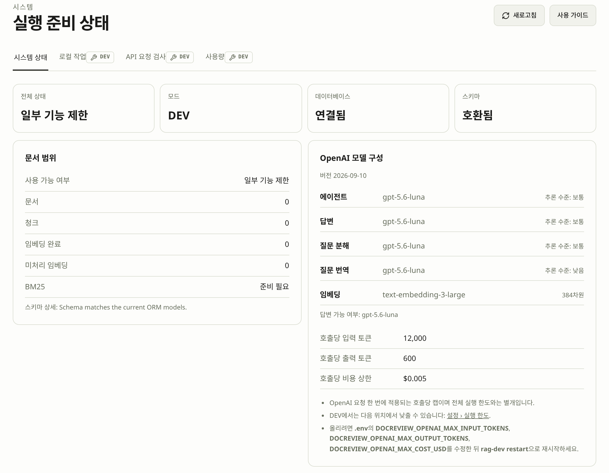

<!-- heading-alias: 환경-준비 -->
# 환경 준비 {#environment-setup}

저장소를 clone했는데 무엇부터 할지 모르겠다면 `source ./rag-alias.sh` 후
`rag-dev start`를 실행하세요. `rag-prod reset environment --local --all-modes`는 확인된 체크아웃 정리,
`rag-dev reset data --local`는 설정·볼륨을 보존하는 ORM 데이터·원문 초기화입니다.
모든 명령에 `--verbose` (`-vv`)를 붙일 수 있습니다. [CLI 안내](cli.md)를 참고하세요.

이 페이지는 GitHub에서 DocReview RAG를 clone한 뒤 로컬에서 처음부터 실행하는 사람을 위한 안내입니다. 아래 Part 1을 따라 서비스를 준비하고 데이터 준비 화면을 엽니다. 이미 실행 중인 앱을 바로 체험하려면 [Quick Start](quickstart.md)를 보세요.

## Part 1: 환경 준비 {#qs-setup}

### 선행 조건 {#prerequisites}

Bash 또는 Zsh, uv, Docker Engine·Compose 2.24.4+를 준비하세요.
웹의 Node/npm은 컨테이너에서 실행되므로 이 경로에서는 호스트에 별도로 설치하지 않습니다.

```bash
git clone https://github.com/sungyongcho/docreview-rag.git
cd docreview-rag
source ./rag-alias.sh
rag-help
rag-dev start
```

`source` 한 번으로 설치와 활성화를 진행합니다.

- **Y**: 자동 등록을 저장하고 로그인 셸로 재시작합니다. 배너에서 `rag-help` 입력을 안내합니다.
- **N**: 이번 셸에만 명령을 불러옵니다.
- 다시 `source`하면 버전과 등록된 정의를 비교해 `[already installed]` 또는 `[update required]`를 표시하며, 이후 변경은 `rag-alias update`로 반영합니다.

Helper는 저장소에 포함됩니다. `source`는 현재 터미널에 등록하며,
선택적인 [영구 등록 방법](cli.md#명령-등록과-도움말)은 명령 안내를 참고하세요.
첫 실행은 `.env`가 없을 때만 생성합니다. 파일을 로컬에서 편집하고 `rag-dev start`를 다시 실행하세요.

```dotenv
SEC_USER_AGENT=Your Real Name your-real-contact@example.com
DART_API_KEY=<your-own-dart-key>
OPENAI_API_KEY_LOCAL=<your-own-openai-development-key>
EMBEDDING_PROVIDER=openai
EMBEDDING_MODEL=text-embedding-3-large
```

예제 값을 실제 연락처·키로 바꾸세요. DEV는 `OPENAI_API_KEY_LOCAL`,
운영은 `OPENAI_API_KEY_PROD`만 읽습니다. 키를 문서 입력란에 넣거나 화면에 캡처하지 마세요.
저장소의 임베딩 차원은 384입니다. deterministic 임베딩은 이 실습의 완료 기준이 아닙니다.
SEC 연락처와 DART 키는 원문 수집에 필요하고, 임베딩 생성에는 OpenAI 비용이 발생합니다.
첫 실행 명령 자체는 수집·임베딩·답변 요청을 하지 않습니다.

빈 DB에만 스키마를 생성하고 기존 정상 DB는 보존합니다. 스키마가 맞지 않으면 자동 초기화하지
않고 원인을 안내합니다. 설정·도구 누락을 해결한 뒤 같은 명령을 재실행하세요.
설치 문제를 고치려고 `rag-dev reset data --local`를 실행하지 마세요.
표시된 주소(기본 `http://localhost:8000/docreview-rag/`)를 엽니다.

설정 명령은 사전 요구사항 → 로컬 설정 → 프로젝트 서비스 상태·시작 → 스키마 준비 → DEV 서버 준비 확인의 다섯 단계를 표시합니다. `db`, `app`, `web` 각각의 중지·시작 중·비정상·실행 상태를 구분합니다. 헬스 체크가 없는 컨테이너가 실행 중이라는 사실만으로 서버 준비 완료를 선언하지 않습니다. 이미 정상 실행 중인 서비스도 Compose가 개발 설정을 적용하기 전에 표시합니다.

<!-- details: setup-failure-recovery | 설정 또는 시작이 실패했을 때 명령이 제공하는 것 -->

설정에서 중단되면 각 키의 `.env` 줄·shell 값·실제 적용 출처를 보여 주고 인증 정보는 숨깁니다.
`[f]`로 이번 실행의 잘못된 export를 제외하거나 `[e]`로 공개 임베딩 설정 두 개를 저장할 수
있습니다. 파일을 고친 뒤 `[r]`로 같은 단계에서 다시 확인하고, `[q]`로 취소합니다. 부모 셸은
바꾸지 않으므로 이후 실행에도 적용하려면 출력된 `unset KEY`를 부모 셸에서 실행하세요.
시작·readiness 실패 시 기존 읽기 전용 진단을 실행하고, 확인 후 볼륨을 보존하는
종료·빌드·시작 복구를 한 번 제안합니다.

<!-- /details -->

## 실행 환경 열고 확인하기 {#step-1}

> [!GOAL]
> 현재 환경에서 문서를 살펴보고 필요한 준비 작업을 할 수 있는지 확인합니다.
>
> **준비** [Part 1: 환경 준비](#qs-setup) 또는 호환되는 DB가 연결된 실행 중인 서비스 · **완료** API가 응답하고 DB가 연결되며 스키마를 사용할 수 있습니다.

사이드바 **시스템 → 시스템 상태**를 엽니다. 페이지 제목은 **실행 준비 상태**입니다. 준비 과정을 실습하려면 개발 환경을 사용하세요. 모드 표시를 먼저 읽으세요. 공개 모드는 권한이 달라 일부 조작이 보이지 않을 수 있습니다.

이 확인은 읽기 전용이며 원문 수집·임베딩·답변 요청을 실행하지 않으므로 질문이나 기업을 입력하지 않습니다. 대신 서비스 주소가 의도한 환경인지 확인하세요. 화면이 같아 보여도 API·DB 주소가 다르면 다른 데이터를 사용하는 환경일 수 있습니다. 코퍼스 수치는 두 빌드 모두 표시되며 쓰기 가능 여부만 감춥니다.

1. **새로고침**을 한 번 누르고 **확인 중…**이 끝날 때까지 기다립니다. 상태 정보가 갱신되며, 시스템 메뉴나 연결 경고에서 API 상태를 읽습니다.
2. 데이터베이스·스키마 항목을 확인합니다. 코퍼스 수치와 모델 정책은 같은 환경의 다른 준비 항목입니다.
3. 완료 여부를 확인합니다. API가 응답하고 DB가 연결되며 스키마를 사용할 수 있으면 현재 환경에서 문서 준비를 허용하는지도 파악한 것입니다. 코퍼스가 비어 있어도 이 조건은 충족할 수 있으며, 기존 데이터 확인은 다음 단계에서 합니다. 알 수 없는 항목은 확인되지 않은 상태이므로 통과로 해석하지 않습니다.
4. 페이지는 열리는데 API 확인이 실패하면 `rag-dev status`와 `rag-dev logs --tail=80 app`을 확인하고, [문제 해결](troubleshooting.md)에서 기록된 증상에 맞는 조치를 적용한 뒤 다시 새로고침합니다. 새 DB라면 위의 스키마 준비를 따르고, 스키마 불일치가 있다고 기존 DB를 삭제하지 않습니다.

| 항목 | 확인할 내용 | 이것만으로 알 수 없는 것 |
|---|---|---|
| API 상태 | 연결 실패·확인 중에 머물지 않고 서비스가 응답하는지. | 문서나 모델 호출의 준비 완료 여부. |
| 데이터베이스 | 의도한 DB에 연결되었는지. | 스키마 호환 여부. |
| 스키마 | 누락 테이블이나 스키마 불일치가 없는지. | 문서가 한 건이라도 존재하는지. |
| 모드와 권한 | 필요할 때 개발용 준비 조작을 사용할 수 있는지. | 공개 서비스에서 관리자 쓰기가 허용되는지. |
| 코퍼스 | 빈 상태·일부 준비 상태를 포함해 실제 수치가 수집되었는지. | 모든 벡터가 의도한 모델로 만들어졌는지. |
| 모델 가용성 | 선택한 엔진이 사용 가능하거나 빠진 조건이 설명되는지. | 모델 요청의 성공이나 답변 근거의 충분함. |

<!-- screenshot: runtime-readiness-status -->



*1. 실행 준비 상태 · 2. 다음 조치*

데이터 준비 화면을 열고 아래 개발용 준비 안내로 이어갑니다.

## 데이터 준비 화면을 열고 이어가기 {#open-build}

출력된 앱 주소를 열고 **데이터 준비 → 파이프라인**을 선택합니다. 준비 단계 그래프와 선택한 단계를 살펴볼 수 있는지 확인하세요. 데이터 준비 화면을 여는 것만으로 원문을 다운로드하거나 모델을 실행하지 않습니다.

**서비스 준비와 데이터 준비는 다릅니다.** [Quick Start for DEV MODE](quickstart-dev.md#qs-web-1)에서 CLI 또는 Web을 선택해 환경 확인, 예제 보고서 두 건 수집, 파싱·청킹, 임베딩·BM25 준비, 질문 전 준비 확인을 이어갑니다. 이미 끝난 작업은 재사용하세요. 이후 [12단계 학습 경로](overview.md#learning-path)에서 질문·설정·평가로 이어집니다.

## 준비 단계가 막혔을 때 {#schema-recovery}

데이터 준비 화면은 DB 스키마와 원문 저장 경로의 쓰기 권한을 구분합니다. 스키마 불일치가 `data/` 쓰기 권한 부족을 뜻하지는 않습니다. **스키마 검사**로 현재 상태를 다시 읽습니다. **터미널에서 실행 필요** 안내가 있으면 명령을 복사해 이 저장소의 터미널에서 실행한 뒤, 같은 단계로 돌아와 **상태 업데이트 확인**을 누르세요. 문제가 남아 있으면 계속 표시되며, 버튼을 누르는 것만으로 복구되지는 않습니다.

```bash
uv run python -m scripts.schema check
```

일반 Compose 시작은 DB health 확인 후 빈 DB 스키마를 자동 준비합니다. 이미지 진입점은 기존 DB를 변경 없이 검사하고, 불일치하면 API 실행을 차단합니다. DEV·로컬 PROD 모드·해당 이미지의 배포 Compose에 적용됩니다. 웹만 열리고 API가 차단됐다면 `rag-dev logs --tail 80 app`에서 진단과 로컬 `check`/`recover` 명령을 확인하세요. DB 없는 공개 예시 모드는 검사를 건너뜁니다. 원문 수집과 인덱싱은 여전히 별도 선행조건입니다.

DB만 따로 시작한 경우에는 빈 DB에 한해 다음 수동 준비도 가능합니다.

```bash
uv run python -m scripts.schema prepare
```

기존의 호환되지 않는 DB는 보존되며 준비 명령이 변경을 거부합니다. 이미지를 다시 빌드하거나 서비스를 재시작해도 호환되지 않는 DB 구조가 복구되지는 않습니다. 인덱싱 전 호환되거나 비어 있는 로컬 DB를 선택하세요. 로컬 DEV DB 내용을 버리기로 명시적으로 선택한 경우에만 CLI 안내의 `scripts.schema recreate` 경로를 검토하세요. 자동 초기화는 하지 않습니다. 서비스 중지나 실제 저장 권한 문제에는 해당 문제의 터미널 명령과 확인할 결과가 별도로 표시됩니다.

<!-- heading-alias: 로컬-컨테이너-파일-소유권 -->
### 로컬 컨테이너 파일 소유권 {#local-container-file-ownership}

로컬 Compose는 이미지의 비루트 UID 10001을 유지하고 `HOST_GID`를 앱의 기본 그룹으로
사용합니다(기본값 1000, `rag-dev`는 실행한 호스트 그룹을 전달). 호스트의 `data/` 디렉터리는
해당 그룹의 쓰기를 허용해야 합니다. 기본 그룹이 1000이 아닌 호스트에서 Compose를 직접
실행한다면 `HOST_GID`를 `id -g` 값으로 지정하세요. 이 로컬 Compose 정책을 업데이트한 뒤에는
`rag-dev start`로 앱 컨테이너를 재생성해야 합니다. 소스 자동 반영만으로 기존 컨테이너의 기본
그룹이나 실행 명령이 바뀌지는 않습니다. [초기화 복구](cli.md)를 참고하세요.

<!-- details: container-file-ownership | 권한·umask·복구 상세 -->

기존 DB 초기화 절차를
거친 뒤 API 시작 시 `umask 0002`를 적용합니다. 새 원문·다운로드·평가 디렉터리는 그룹이
쓸 수 있고, 저장된 로컬 모델 설정은 호스트 그룹이 읽을 수 있는 0640 권한입니다.
이미지 기본 사용자와 배포 Compose는 바꾸지 않는 로컬 bind mount 공유 정책입니다.

예전에
컨테이너가 만든 파일의 기존 권한은 자동 변경되지 않습니다. 초기화 미리보기는 차단된 원문
경로에 필요한 관리자 권한 복구 명령을 출력합니다. 오래된 `data/local-settings` 또는
`data/eval_runs`에도 호스트 접근이 필요하면 소유자가 같은 범위 제한 ACL 복구를 해당
디렉터리에 적용해야 합니다. 소유권·ACL은 자동 변경하지 않습니다.

<!-- /details -->

오류의 **이 부분을 살펴보세요**로 관련 파이프라인 단계에 이동합니다. DB·스키마 문제는 설치 안내로 연결합니다. 도착한 단계에서 현재 진단과 터미널 안내를 확인하며, 다른 오류 영역에는 원인과 이동 링크만 간단히 표시합니다.

스키마가 호환되지 않으면 `.venv/bin/python -m scripts.schema check`로 진단하세요. Quickstart는 외부 `DATABASE_URL`이 아니라 로컬 `DB_PORT`를 사용합니다. 안전한 대상 선택 복구는 [#25](https://github.com/sungyongcho/docreview-rag/issues/25)에서 다룹니다. 이 중단을 해결하려고 데이터베이스를 초기화하지 마세요.

## 실행 환경과 준비 작업 구분하기 {#environment-boundaries}

Ollama는 로컬 답변을 위한 선택 사항이며 DocReview 스택과 별도로 설치합니다. **설정 → 로컬 LLM**에서 **Default**를 선택하고 **연결 진단 실행**으로 확인한 뒤 필요한 연결 변경을 수행합니다. **서버 추가…**는 다른 주소를 사용할 때만 선택합니다. [macOS·Linux 설치 안내](ollama.md)에서 설치와 백엔드 접근을 설명하며 `rag-dev doctor`는 읽기 전용 진단입니다. 답변 모델이 없다는 사실만으로 API·DB·스키마가 고장 났다고 판단하지 않습니다.

개발 서비스는 소스 자동 반영과 문서 실시간 편집을 지원합니다. API 재시작은
실행 중인 작업을 중단할 수 있으므로 재시도 여부를 결정하기 전에 작업 기록을
확인하세요. 작업·실행 상태는 [실행 상태](runtime.md)에서 설명합니다.

이번 릴리스는 DEV와 PROD를 각각의 실행 모드로 지원합니다. DEV 안의 **배포 화면 미리보기**는 [후속 이슈 #211](https://github.com/sungyongcho/docreview-rag/issues/211)로 미루며 이번 릴리스에서는 제공하지 않습니다.

`rag-prod start`는 공개 권한을 적용하는 독립된 로컬 PROD 모드를 시작합니다. 사이트를 외부에
게시하는 명령은 아닙니다. 개발 환경에서 로컬 모델 연결이 정상이어도 공개
모드에서 로컬 LLM이 허용되는 것은 아닙니다. 의도적으로 모드를 바꾸려면
[CLI 환경 명령](cli.md#dev와-prod-미리보기), 저장 연결은 [설정](settings.md)을 참고하세요.

준비된 로컬 포트폴리오는
`rag-prod start --local --ready --artifacts /path/to/public-bundle`로 시작합니다.
이미 PROD가 실행 중이면 `rag-prod prepare --local --artifacts /path/to/public-bundle`을
사용하고, 데이터를 변경하지 않고 검사하려면 `--check`를 추가하세요. 저장된 공개
데이터와 임베딩을 복원하며 답변 모델을 내려받는 것은 아닙니다. 원문 다운로드나
유료 임베딩 생성을 자동 실행하지 않습니다. PROD의 `prod_pg_data` 볼륨과
`data/local-prod/{corpus,eval-runs,runtime}` 파일은 DEV 저장소와 분리됩니다.
모드 전환은 각 DB를 보존하며 대화를 서로 복사하지 않습니다.
[번들 선택·검증 안내](cli.md#local-prod-data)를 참고하세요. 빈 로컬 PROD DB에서
문서 준비 필요 안내는 정상이며, 이를 해결하려고 DEV를 초기화하지 마세요.

준비 표시를 초록색으로 만들기 위해 파괴적 초기화를 사용하지 마세요.
새로고침은 상태를 읽으며 복구·적재·인덱스 생성·답변 모델 호출을 실행하지 않습니다.

## 운영 배포 {#production-deployment}

위 내용은 모두 내 기계에서 돌아갑니다. 공개 원본 서버는 2 OCPU·12 GB RAM의
Oracle Cloud A1 인스턴스이며 gomoku의 minimax 서비스와 공유합니다. DocReview는
호스트 `8880` 포트의 Caddy를, minimax는 기존 `8080` 포트를 사용하고 정적 화면은
Firebase Hosting에서 제공합니다. `deploy/cloudflare`의 DocReview 전용 Worker로
배포 책임을 분리합니다. 아래 절차는 전환과 이후 배포 방법이며 이미 완료했다는
근거가 아닙니다. Oracle 스크립트는 `deploy/oracle/`, Firebase 배포는
`scripts/deploy/firebase.sh`에 있습니다. `deploy/gcp/`는 별도 선택 가능한 배포
경로로 유지하며, 어느 배포도 이 로컬 튜토리얼을 따라 하는 것만으로 실행되지 않습니다.

```text
visitor ──HTTPS──> sungyongcho.com/docreview-rag/*
                          │  DocReview Worker (docreview-router)
            ┌─────────────┴──────────────┐
   /docreview-rag/*        /docreview-rag/api/*
            │                              │  plain HTTP
            ▼                              ▼
   Firebase Hosting             docreview-api.sungyongcho.com:8880
   static Next export           Oracle A1, shared with minimax :8080
   preserve /docreview-rag       firewall: tcp:8880 from Cloudflare IPv4 only
                                  host 8880 → Caddy :80
                                    allow-list + X-DocReview-Public: true
                                      └─> FastAPI ──> pgvector Postgres
                                  no operator API; administer in local DEV
```

TLS는 Cloudflare에서 끝납니다. 전용 Worker는
`sungyongcho.com/docreview-rag`와 `sungyongcho.com/docreview-rag/*`만 담당합니다.
Firebase 정적 경로의 접두사는 유지하고 API 요청의 `/docreview-rag/api`를 제거한 뒤
Oracle 원본으로 HTTP 전달합니다. 기존 원본 DNS 레코드는 해당 인스턴스를 가리켜야
하며 이 배포에서 DNS를 변경하지 않습니다. Oracle 공유 호스트 준비는 gomoku에
남고 DocReview는 자체 앱·Caddy·정적 화면·Worker를 배포합니다. Caddy는 공개 경로만
프록시하고 `X-DocReview-Public: true`를 붙이며, 외부에서 닿는 모든 API 포트 앞에
있어야 합니다. 프로덕션은 운영자 API를 노출하지 않으며 관리는 로컬 DEV에서 실행합니다.

### 요청 한도의 프록시 경계 {#public-request-boundary}

Caddy는 `X-Forwarded-For`를 직접 접속받은 주소인 `{remote_host}`로 덮어씁니다.
Python으로 전달하기 전에 `CF-Connecting-IP`, `CF-Connecting-IPv6`, `CF-Pseudo-IPv4`,
`True-Client-IP`, `X-Real-IP`, `Forwarded`를 제거하며, 방문자 원본 주소를 복원하는
`trusted_proxies`는 설정하지 않습니다. 의도한 경로에서는 접속 주소가 Worker 출구
IP이므로 같은 출구를 사용하는 방문자가 서버 요청 한도를 공유합니다. 이 IP는 우리
Worker의 인증 정보나 방문자 식별자가 아닙니다.

Caddy는 `POST /retrieve`, `/review`, `/review/stream`의 본문을 끝의 슬래시 유무와
관계없이 256 KiB로 제한하며, 초과 시 `413`을 반환합니다. 브라우저는 프록시 응답이
JSON이 아니어도 크기 초과를 안내합니다. 서버는 본문 해석 전에 요청 횟수를 제한하고
각 provider 호출 직전에 AI 비용을 별도로 예약합니다. 갱신할 때 기존 SQLite 장부
파일과 영구 볼륨을 유지하세요. 교체하면 기록된 사용량이 사라집니다.

배포는 별도 작업입니다. 이 정책을 배포하기 전에 실제 Caddy가 보는 접속 주소와
Cloudflare 전용 방화벽 경로를 확인하세요. Oracle 서브넷에 실제 연결된 보안 목록,
연결된 모든 네트워크 보안 그룹, 호스트 방화벽의 유효 규칙을 의도한 Cloudflare
주소 대역과 대조합니다. 연결되지 않은 보안 목록은 실제 접근 경로의 증거가 아닙니다.
전제가 다르면 배포를 보류하세요. 격리된 Caddy 테스트는 로컬 근거이며 운영 경로
검증이 아닙니다. Cloudflare의 방문자별 제한이 있다고 가정하지 않습니다. 공유 요청
한도 정책은 DocReview 경로를 gomoku에서 전용 Worker로 옮기는 작업과 별개입니다.
방문자 IP 전달 헤더 제거는 Python으로의 전달을 줄이는 조치이며 서비스 전체의
GDPR 면제나 준수 완료를 뜻하지 않습니다.

### 실행 순서 {#production-order}

1. 이 저장소의 `.env`에 `DEPLOY_ORACLE_HOST`, `DEPLOY_ORACLE_SSH_USER`와
   필요할 때 `DEPLOY_ORACLE_SSH_KEY` 또는 `DEPLOY_ORACLE_SSH_CONFIG`를
   설정합니다. 비밀이 아닌 호스트·원본 설정을 여기에 유지합니다.
   검증된 known-hosts 기록이 필요하며 SSH·SCP·rsync 모두 엄격한 호스트 키 검사를
   사용합니다. 선택한 SSH 설정은 세 전송 방식에 공통 적용됩니다. 백엔드 배포에는
   기존 운영 키 출처를 사용하고 Worker 배포에는 외부에서 제공한
   `CLOUDFLARE_ACCOUNT_ID` / `CLOUDFLARE_API_TOKEN`을 사용합니다. 라우팅
   책임을 옮긴다는 이유로 토큰을 복사하지 않습니다.
2. 위의 방화벽·Caddy 관측 주소 전제를 확인합니다.
   `bash deploy/oracle/deploy_backend.sh update`는 격리된 원격 `mktemp` 경로에서
   빌드하며 공유 파일에 `rsync --delete`를 실행하지 않고 앱과 Caddy를 함께
   갱신합니다. 첫 설치에는 검증된 공개 산출물 번들과 `DEPLOY_POSTGRES_PASSWORD`가
   별도로 필요하며, `first-install`은 영구 저장소가 비어 있을 때만 사용합니다.
   두 경로 모두 `deploy/gcp/docker-compose.deploy.yml`의 공통 Compose 계약을
   사용합니다.
   빌드 경로는 `DEPLOY_ORACLE_BUILD_DIR` 아래에 남겨 별도로 승인된 정리 때
   처리합니다. 실행 중인 Caddy 컨테이너가 앱 갱신 전에 설정을 검증하고 이후 다시
   불러오며, 실패한 배포 준비 파일과 롤백 기록은 복구를 위해 보존합니다.
3. `bash deploy/oracle/print_origin.sh`로 전용 Worker의 원본 설정값을 확인합니다.
   의도한 API 원본은 `http://docreview-api.sungyongcho.com:8880`이고 정적 원본은
   Firebase를 유지합니다. 인스턴스 주소가 바뀌면 기존 DNS 레코드를 확인합니다.
4. `npm --prefix deploy/cloudflare ci`로 설치한 뒤
   `npm --prefix deploy/cloudflare test`와
   `npm --prefix deploy/cloudflare run deploy:dry-run -- --bootstrap`을 실행합니다.
   최초 전환 때만 `npm --prefix deploy/cloudflare run deploy -- --bootstrap`으로
   경로와 workers.dev/미리보기 URL 없이 Worker를 만듭니다. 그 뒤 DocReview 경로
   두 개의 기존 ID만 공유 gomoku Worker에서 `docreview-router`로 옮기고 다른
   경로는 보존합니다. 전환 뒤 bootstrap을 다시 실행하면 전용 Worker의 경로를
   제거하므로 반복하지 않습니다. 전환을 확인한 뒤 이후 배포는
   `npm --prefix deploy/cloudflare run deploy:dry-run`과
   `npm --prefix deploy/cloudflare run deploy`를 사용합니다.
5. `FIREBASE_PROJECT_ID=<project-id> scripts/deploy/firebase.sh`는 공개 모드와
   API 접두사를 명시해 방문자 번들을 빌드·게시합니다. 배포 뒤 원본 상태, 정적 경로,
   API 경로와 SSE를 확인합니다.

`bash deploy/oracle/deploy_backend.sh rollback`은 이전 앱 이미지와 Caddy 설정을
한 쌍으로 복원합니다. 갱신과 롤백은 PostgreSQL·원문·평가 기록·기존 SQLite 요청/비용
장부를 유지하며 호스트 준비나 DB 복원을 다시 실행하지 않습니다. 로컬 검사 통과나
배포 명령 성공만으로 운영 비용 차단을 검증했다고 판단하지 않습니다.

GCP를 별도 배포 대상으로 선택하면 `deploy/gcp/deploy_all.sh`의
setup/VM/image/backend 단계와 `deploy/gcp/print_origin.sh`를 사용합니다.
이 경로는 Oracle 내부 빌드 대신 e2-medium VM과 Artifact Registry를 사용하며,
전용 Worker의 경로 소유권과 Firebase 정적 접두사는 바꾸지 않습니다.

### 월 비용 {#production-cost}

| 구성 요소 | 내용 | 비용 경계 |
|---|---|---|
| Oracle A1 | 2 OCPU·12 GB 공유 인스턴스에서 minimax와 DocReview 포트를 분리 | 계정에 할당된 Always Free 범위를 목표로 하되 실제 컴퓨트·저장소·네트워크 자격 확인 |
| Firebase Hosting | 기존 정적 내보내기 사이트 | 설정된 요금제의 제공량 이내 유지 |
| Cloudflare Worker | DocReview 전용 라우터 | 설정된 요금제의 제공량 이내 유지 |
| OpenAI | `DOCREVIEW_PUBLIC_DAILY_COST_USD`(배포 compose 파일에서 `0.30`)로 UTC 하루 단위 상한 | ≤ $0.30/day |

공유 호스트에서 minimax도 실행되므로 두 서비스에 필요한 자원을 남겨 두세요.
A1 내부의 앱 빌드는 운영 트래픽과 일시적으로 자원을 경쟁할 수 있습니다. 이 목표
구성이 인프라 비용 0을 보장한다고 보지 말고 측정된 자원 사용량과 계정 청구 상태를
확인하세요.
