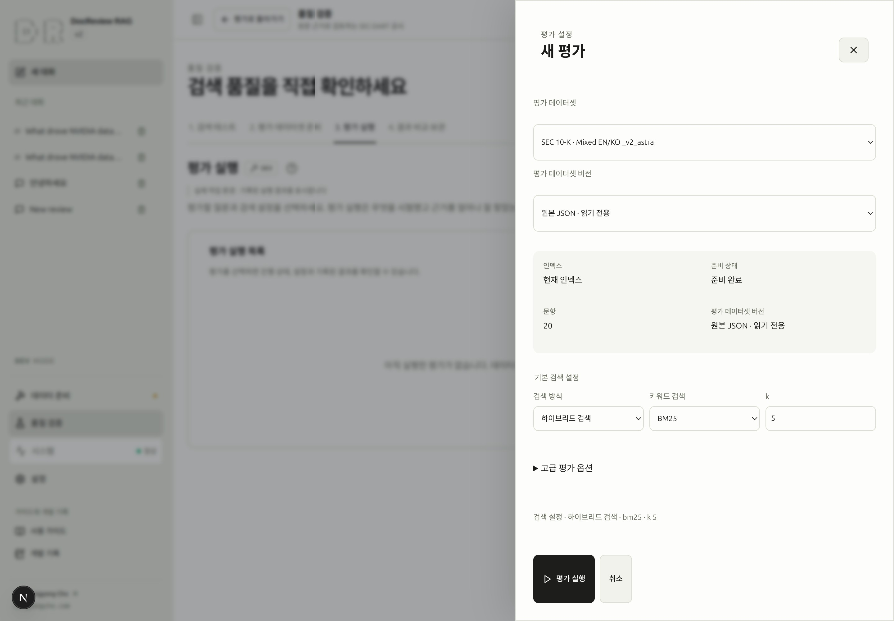
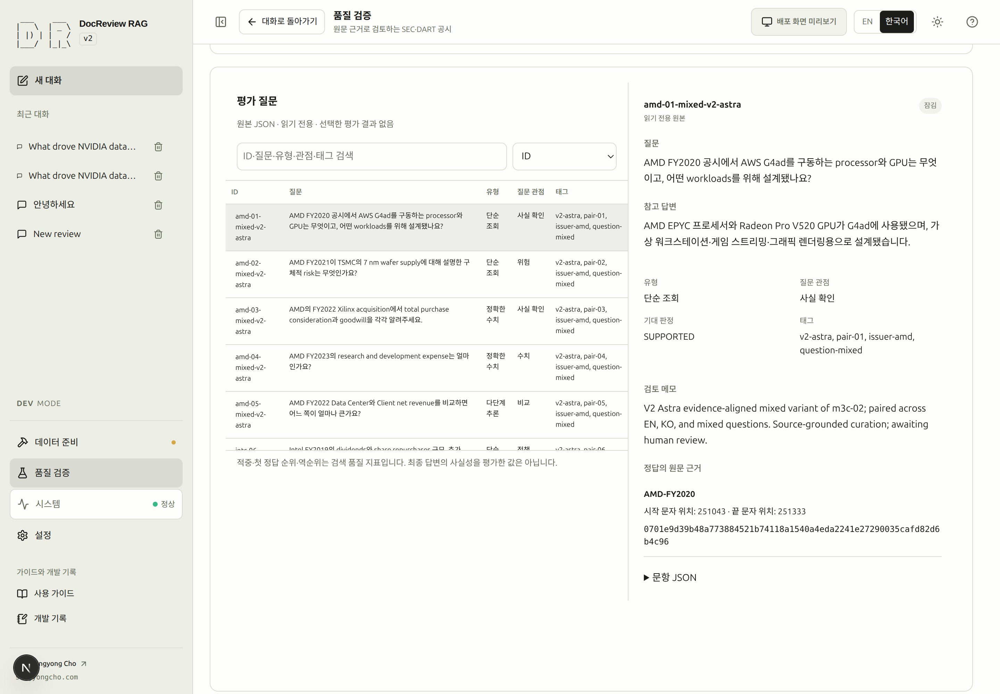

# 정답 근거로 검색 평가하기

> [!DEV]
> 실제 평가 작업 공간·Golden 원본 및 초안 도구·평가 작업은 개발 모드 전용입니다. 방문자는 별도로 공개된 스냅샷을 비교할 수 있습니다.

검색 평가는 평가 데이터셋에 지정된 근거를 검색 시스템이 찾는지 확인합니다. 데이터셋·검색 설정·진행 상황·결과를 기록합니다. 먼저 답변을 생성할 필요가 없으며, 검색 점수가 답변 모델의 사실성을 인증하는 것도 아닙니다.

## 11. 검색 평가 실행하기 {#step-11}

**목표:** 평가 데이터와 검색 조건을 이해할 수 있는 검색 결과 한 건을 기록합니다.

**선행 조건:** 평가 권한이 있는 로컬 개발 환경, 검색 가능한 인덱스, 선택할 suite에 필요한 공시 원문이 있어야 합니다. 실습 문서 한 건만 있는 DB로 여러 회사를 포함한 suite를 평가하면 충분하지 않습니다. 같은 조건의 평가가 이미 끝났다면 기존 결과를 재사용합니다.

**화면 경로:** **품질 검증 → 2. 평가 데이터셋 준비**, 이어서 **3. 평가 실행 → 새 평가**로 이동합니다.

| 입력 | 확인할 내용 |
|---|---|
| 평가 데이터셋 | 회사 범위와 질문 언어가 측정하려는 대상과 맞는지 봅니다. |
| 데이터셋 파일 | `.json` 파일명을 선택합니다. 기본 파일에만 `(기본 제공)`이 표시됩니다. |
| 핵심 검색 설정 | 검색 방식·키워드 순위 방식·`k`가 이번 실험을 정의합니다. |
| 고급 평가 옵션 → 실행 모드 | 처음에는 **빠른 평가 · 현재 인덱스**로 준비된 인덱스를 평가합니다. |

평가 데이터셋에서 질문 한 건과 그 원문 범위를 읽습니다. 새 평가를 열어 준비 상태와 문항 수를 확인합니다. **주요 동작:** **평가 실행**을 한 번 누릅니다. 질문 임베딩과 구성된 검색 과정에서 제공자 비용이 발생할 수 있습니다.

**보이는 변화:** 설정 창이 닫히고 평가 목록에 대기 작업이 추가됩니다. 행을 선택하면 제출 설정과 실제 진행 상황을 확인할 수 있습니다. 성공한 평가에는 결과 상세·기록된 설정·지표·문항별 순위가 표시됩니다. 결과가 없으면 아직 측정된 점수가 없는 상태입니다.

평가를 선택하면 해당 평가의 상세에 집중해 표시합니다. 목록을 잠시 숨긴 상세 화면을 작업 이력이 비었다는 상태로 표시하지 않습니다. 다른 작업은 평가 목록으로 돌아가 확인합니다.

**완료 조건:** 선택한 작업이 성공했고 결과 ID와 데이터셋이 맞으며, 적어도 한 문항의 hit/miss를 원문 근거와 대조했습니다. 다른 suite의 성공 작업을 방금 설정한 평가의 결과로 해석하지 않습니다.

**흔한 실패:** 원문을 사용할 수 없거나 문서가 준비되지 않았다는 안내입니다. 표시된 원문 오류를 읽고 [문서](documents.md)와 [인덱싱](indexing.md)을 확인하세요. 실패·중단 작업은 [평가 복구](troubleshooting.md#evaluation)를 확인한 뒤 다시 실행합니다.

**다음 단계:** [12. 결과 비교와 스냅샷 저장](snapshots.md#step-12).

### SCREENSHOT NEEDED

<!-- SCREENSHOT NEEDED: feature=focused-evaluation-detail; locale=ko; theme=light; capture=selected-evaluation-with-result-details-and-back-to-list-without-empty-history-message; issue=21; preserve-existing-assets=true -->

**평가 상세에 집중한 화면과 목록 복귀 상태의 스크린샷이 필요합니다. 기존 스크린샷은 유지합니다.**

<!-- capture:11-evaluation-inputs -->

*실제 혼합 언어 원본 데이터셋의 새 평가 설정입니다. 질문 20개와 준비된 현재 인덱스, Hybrid·BM25·k=5가 표시되며 평가 대기열 추가는 실행하지 않았습니다.*

## 골든셋 식별자와 실행 준비

저장소의 원본 질문은 **기본 제공 골든셋**, 명시적으로 저장한 수정본은 **사용자 골든셋**으로 선택합니다. 출처(SEC/DART), 검증 상태, 실행 준비를 따로 표시합니다. 현재 골든셋은 **검토 대기**이며, 수정본의 **형식·원문 검사 통과**는 사람의 정답 검증 완료를 뜻하지 않습니다.

준비 검사는 공시 식별자로 필요한 원문을 찾고 SHA-256과 정답 근거 구간을 검증한 뒤, 평가 답변의 문서 ID를 현재 수집 ID에 연결합니다. `sec-evaluation`·`dart-evaluation` 선택을 만들거나 정답을 바꾸거나 원문을 다운로드하지 않습니다. **원문 준비 필요**를 누르면 수집 단계로 이동합니다. 상세 목록은 회사명과 회계연도로 표시합니다.

빠른 평가는 각 정답 원문의 정확한 버전으로 생성된 청크와 선택한 검색 인덱스를 요구합니다. 매트릭스 평가는 호환 DB·쓰기 가능한 저장소·검증된 원문을 확인하고 자체 격리 인덱스를 생성합니다. 작업 등록 전에 같은 검사를 수행하고, 대기 후 실제 실행 직전에도 다시 확인합니다. 준비되지 않은 요청은 실패할 작업을 등록하는 대신 `evaluation_not_ready`로 차단합니다.

결과에는 골든셋 식별자·검토 상태와 검색 범위를 별도로 남깁니다. 빠른 평가는 해당 출처·원문 언어의 현재 인덱스를 검색합니다. 매트릭스는 해당 출처에 등록된 원문 전체를 임시 평가 범위로 사용하며 수집 manifest는 변경하지 않습니다. 검색 범위가 달라지면 근거 없음 문항의 타당성도 달라질 수 있으므로 검토가 필요합니다.

## 일곱 평가 데이터셋 고르기 {#suites}

Suite ID는 고정된 데이터셋 식별자입니다. `_v2_astra` 접미사는 제품 이름을 바꾸거나 실제 평가를 Astra 모델이 실행한다는 뜻이 아닙니다.

| Suite ID | 질문 언어 | 공시 원문 |
|---|---|---|
| `sec-en` | 영어 | 영어 SEC 공시 |
| `sec-ko` | 한국어 | 영어 SEC 공시 |
| `dart-en` | 영어 | 한국어 DART 공시 |
| `dart-ko` | 한국어 | 한국어 DART 공시 |
| `sec-en_v2_astra` | 영어 | 영어 SEC 공시 |
| `sec-ko_v2_astra` | 한국어 | 영어 SEC 공시 |
| `sec-mixed_v2_astra` | 한영 혼합 | 영어 SEC 공시 |

추가된 SEC suite 세 개는 각각 20문항입니다. 화면의 큐레이션·승인 상태를 확인하세요. 자동으로 구성된 데이터셋은 사람이 승인했다는 근거가 아닙니다. 질문 언어를 비교할 때는 원문 범위뿐 아니라 회사·회계연도·질문 범위 단서까지 살펴봅니다. 같은 근거를 공유한다고 질문 조건까지 같아지는 것은 아닙니다.

평가 데이터셋 화면·새 평가·평가 설정은 같은 suite 목록을 사용합니다. 저장한 기본값은 이후 작업의 시작값을 고르며 기존 결과는 바꾸지 않습니다.

## 원본 JSON과 편집용 초안 {#golden}

평가 화면과 파이프라인에서 같은 파일명 목록을 사용합니다. 파일명 아래의 작은 글씨로 출처·언어·문항 수를 확인하며, 기본 파일에는 `기본 제공` 배지가 표시됩니다. **원본 JSON 보기**로 선택한 파일의 내용을 펼칠 수 있습니다.

목록 옆의 **초안 만들기**에서 파일명을 정하고 선택한 파일을 복사하거나 빈 데이터셋으로 시작합니다. **문항 추가**, **초안 저장**, **형식·근거 검사** 순서로 작성합니다. 별도의 JSON 게시 단계는 없으며 기본 제공 파일을 덮어쓰지 않습니다. 자동 검사 통과는 사람의 품질 검토 완료를 뜻하지 않습니다.

파일은 `data/golden/`에서 관리합니다. 사용자 파일은 `format: docreview-golden-set`, `suite_id`, `registry`, `question_language`, 생성·수정 시각, `checked_sha256`, `cases`를 담습니다. DB 초기화와 `rag-start-fresh`에서도 기본·사용자 파일 모두 보존됩니다.

문항을 선택하면 같은 영역에 넓은 편집 화면이 열립니다. 상단과 저장 영역은 고정되고 입력 내용만 스크롤됩니다. **문항 목록**으로 돌아가면 검색·정렬·스크롤 위치가 복원됩니다. 미저장 상태로 이동하면 **초안 저장 후 이동 / 변경 버리고 이동 / 계속 편집** 중 선택합니다.

질문을 적고 원문에 근거가 있는지 선택합니다. 근거가 있으면 참고 답변과 원문 근거를 입력합니다. **문서에서 근거 선택**에서 문서와 청크를 검색하며, 선택한 청크의 문서 ID·SHA-256·문자 범위를 그대로 기록합니다. 파싱되지 않은 문서는 준비 단계로 이동합니다. 기존 답변·근거가 있을 때 근거 없음으로 전환하면 삭제 전에 확인합니다.

**초안 저장**은 미완성 문항도 저장합니다. 입력 완료, 형식·근거 검사 통과, 사람의 품질 검토는 별개입니다. 미완성 문항이 하나라도 있으면 전체 데이터셋 평가를 차단합니다. 타입 오류는 해당 필드 옆에 표시하며, 파일 충돌 시 입력을 유지하고 새로고침을 제공합니다. 분류·한글/영문 태그·검토 메모는 보조 영역, JSON과 근거 직접 입력은 기술 정보에 있습니다.

기본 제공 파일명에는 클릭되지 않는 회색 자물쇠가 표시됩니다. 편집하려면 초안을 만드세요. 평가 파라미터는 후보·순위 통합, BM25, 리랭킹·언어로 묶이며 작은 정보 아이콘에 마우스를 올리거나 키보드로 초점을 맞추면 설명을 볼 수 있습니다.

### SCREENSHOT NEEDED
<!-- Capture DEV, Korean: wide question editor with answerability unselected, fixed save bar, and source chunk picker; also show a narrow viewport. -->

<!-- capture:10-golden-question -->

*혼합 언어 SEC 평가 데이터셋에서 실제 원본 질문을 열었습니다. Canonical JSON은 읽기 전용이며 원본 열람과 초안 생성·편집은 별도 작업입니다.*

## 실행 모드와 지표 해석 {#metrics}

빠른 평가는 현재 인덱스를 사용합니다. **조합별 평가 · 격리된 문서**는 격리된 문서에서 청크 목표 크기와 검색 조합을 평가하므로 준비 작업과 실행량이 크게 늘어날 수 있습니다. 비교 실험으로 사용하기 전에 범위와 제공자 비용을 확인하세요.

| 결과 | 읽는 방법 |
|---|---|
| Hit / miss | 반환한 결과 범위 안에서 정답 근거를 찾았는지 봅니다. |
| 첫 정답 순위 | 정답 근거가 처음 등장한 위치입니다. 작을수록 앞에 있습니다. |
| 역순위 / MRR | 정답 근거가 앞에 나올수록 높은 값을 주는 순위 기반 지표입니다. |
| Recall@k / 적중률 | 명시된 반환 개수와 평가 문항 안에서 근거를 얼마나 찾았는지 봅니다. 같은 조건끼리 비교합니다. |
| 지연 시간 | 기록된 검색 시간입니다. 품질·실제 설정과 함께 판단합니다. |

평균 점수만 보지 말고 문항별 변화도 읽습니다. **선택 설정 적용**은 결과의 검색 설정을 대화에 적용하며 새 답변을 생성하지 않습니다. 결과와 검색 데이터를 보존하고 비교하는 방법은 [스냅샷](snapshots.md)에서 이어집니다.

## 검증 단계와 관리 탭

네 단계는 검색 테스트·데이터셋·평가 실행·비교·스냅샷입니다. 관리에는 프리셋만 있습니다. 다음 평가의 데이터셋·방식은 새 평가 창에서 명시적으로 저장하며, 스냅샷 비교는 기준·후보를 선택하지 않은 상태에서 시작합니다.

### SCREENSHOT NEEDED
<!-- Feature: Measure workflow and Manage groups, active presets and page help; locale=ko; theme=light; widths=1440,720; show numbered chips, divider, caption and DEV badge. Preserve existing assets. -->

## 데이터셋 파일로 실행 찾기

데이터셋 선택·평가 실행 목록·비교에서 같은 JSON 파일명을 사용합니다. 새 결과에는
실행 당시 파일명과 내용 해시가 기록됩니다. 예전 기록은 확인 가능한 카탈로그 식별자로만
파일명을 연결하며, 찾을 수 없는 이름은 파일 정보 없음으로 표시합니다. 데이터셋 카드의
파일명 아래에는 출처·질문 언어·문항 수를 표시합니다.

평가 목록은 데이터셋·상태·검색어로 필터링하고 최신순·오래된순·파일명순·실행 시간순으로
정렬할 수 있습니다. 결과에서 비교를 열면 데이터셋과 기준 실행이 먼저 선택됩니다.
비교 화면을 직접 열면 데이터셋부터 고르고, 해당 파일의 완료된 평가 두 개를 선택합니다.
선택 항목은 실행 당시 검색 설정과 시각이며 조합 평가도 각 결과의 실제 설정을 사용합니다.
파일을 바꾸면 기존 선택과 비교 결과가 초기화됩니다. 내용 해시가 다르면 변경 안내를
표시하고 동일 문항 집합으로 비교하지 않습니다. 완료된 평가가 두 개 미만이면 해당 파일의
평가 실행 목록으로 이동할 수 있습니다.

내부 결과 ID는 URL과 기록된 설정에만 유지합니다. 문항별 점수도 선택한 파일의 내용
해시와 일치하는 결과에 한해서 표시합니다.

### SCREENSHOT NEEDED
<!-- Capture DEV, Korean: file-filtered evaluation list and dataset-first comparison with matching recorded hashes; no visible #result labels. -->

**새 평가**의 **다음 평가 기본값으로 저장**은 선택한 데이터셋과 평가 방식만 기억합니다. **평가 기본값 초기화**도 현재 입력을 바꾸지 않고 다음 평가의 기본값만 초기화합니다. 두 버튼은 작업 실행이나 대화 검색 설정 변경을 하지 않습니다.

답변 가능 여부가 내부 판정을 결정합니다. 근거가 있으면 `SUPPORTED`, 근거가 없으면 `NOT_IN_DOCS`이며 원문 범위는 비웁니다. 미완성 입력도 저장할 수 있지만 준비 검사·작업 등록·실제 실행에는 엄격한 검증이 적용됩니다.
