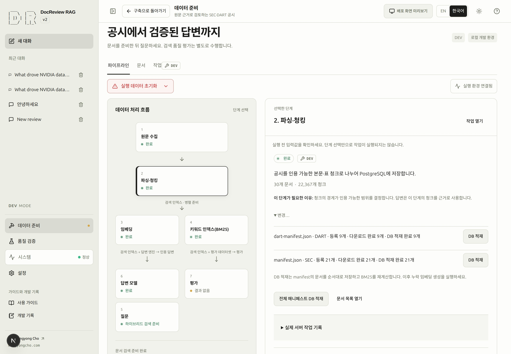
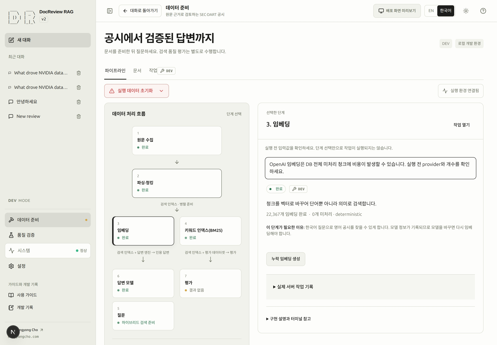
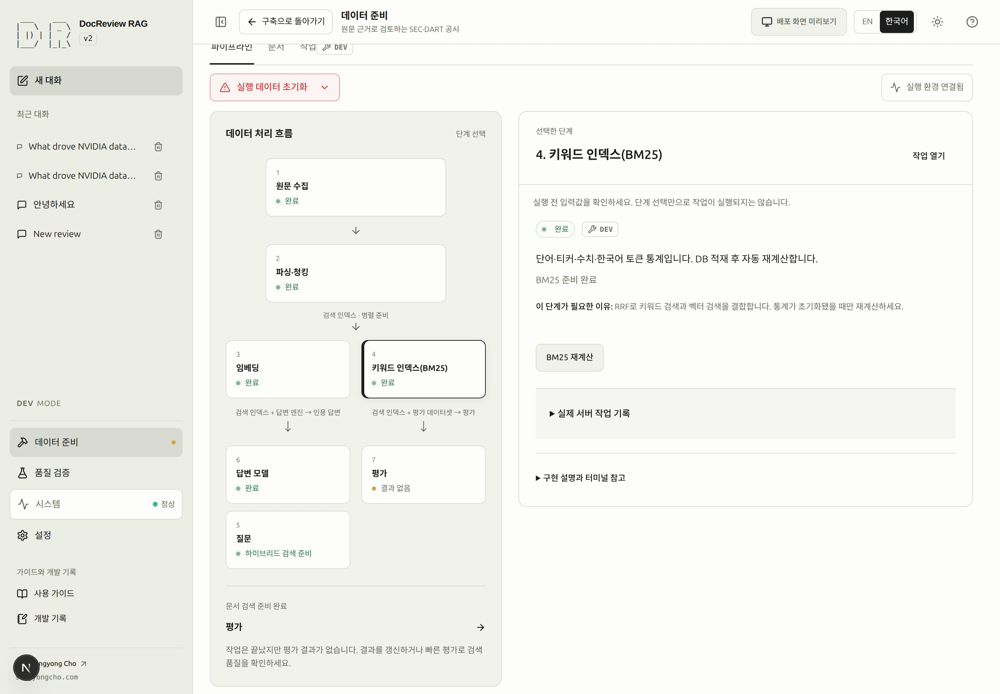

# 원문을 검색 가능한 근거로 준비하기

## 터미널 작업 후 같은 단계에서 계속하기

선행 작업이 터미널에서 필요하면 선택한 준비 단계에 진단 결과와 터미널 안내, 복사할 명령, 기대 결과가 표시됩니다. 해당 저장소의 터미널에서 실행한 뒤 같은 단계로 돌아와 **상태 업데이트 확인**을 누르세요. 실제 상태가 바뀐 것을 확인한 뒤 진행합니다. 이 버튼은 준비 명령을 실행하거나 완료 상태를 임의로 만들지 않습니다.

스키마 확인은 읽기 전용입니다. 빈 스키마 준비는 기존 DB를 보존하며 호환되지 않는 스키마를 변경하지 않습니다. 보관 처리하지 않은 과거 작업은 통합 작업 목록에 남지만 selection ID가 없는 이전 인제스트 요청은 재시도할 수 없습니다. 현재 manifest의 처리 선택에서 새 인제스트를 시작하세요.

터미널 안내는 작은 접기 패널로 표시합니다. 현재 단계를 막는 선행 조건일 때 펼쳐집니다. 인덱싱에 스키마 복구가 필요해도 원문 수집은 진행할 수 있습니다. 별도 조건은 환경 설정 점검을 열어 확인하세요. 회사·연도 추천 목록은 입력창 바로 아래에 열리고 안내 문구나 빠른 추가 버튼을 잠시 가릴 수 있습니다.

원문 수집·파싱과 청크 생성·임베딩·BM25·질문·답변 모델·평가의 모든 단계를 점검할 수 있습니다. 진단은 실행 준비됨·이미 완료·차단·실행/대기 중·미확인/확인 중을 구분합니다. 원문 부족은 원문 수집, 청크 부족은 파싱과 청크 생성, 인덱스나 답변 설정 부족은 해당 단계로 연결합니다. 미확인 응답은 성공이 아닙니다. **선행 단계 살펴보기**은 작업을 실행하지 않고 해당 단계를 열며, 필요한 터미널 안내와 재확인은 그 단계에서 진행합니다.

### SCREENSHOT NEEDED

<!-- SCREENSHOT NEEDED: feature=schema-and-terminal-handoff-recheck; locale=ko; theme=light; capture=blocked-and-resolved-states; issue=17; preserve-existing-assets=true -->

**변경된 조작과 결과 상태의 스크린샷이 필요합니다. 기존 스크린샷은 변경하지 않았습니다.**

> [!DEV]
> DB 적재·누락 임베딩 생성·BM25 재계산은 개발 모드 전용입니다. 기존 준비 상태를 읽어도 이 작업들이 실행되지는 않습니다.

파싱은 문서와 인용 가능한 청크를 만듭니다. 임베딩은 의미 검색에, BM25는 키워드 검색 통계에
사용합니다. 청크가 준비되면 두 인덱스 경로를 각각 준비할 수 있습니다. 연결 상태가 녹색이어도
인덱스가 현재 코퍼스와 일치한다는 뜻은 아닙니다.

## 5. 파싱과 청크 생성 {#step-5}

- **목표:** 명시적으로 선택한 보고서를 출처를 추적할 수 있는 청크로 DB에 저장합니다.
- **선행 조건:** DB·스키마가 호환되고 [수집 단계](acquisition.md#step-4)의 필요한 원문이 모두 있습니다.
- **화면 경로:** 데이터 준비 → 파이프라인 → 파싱·청킹 → 선택한 문서.
- **입력:** 원문 단계의 선택을 SEC·DART → 회사 → 연도 순으로 확인합니다. 헤더에 문서·준비·누락·회사·연도 수가 표시됩니다. 눈에 잘 띄는 **원문 단계에서 선택 변경** 버튼을 쓰거나 연도를 눌러 빼면 두 단계의 공통 선택에 반영됩니다.
- **주 동작:** **선택한 원문 파싱 및 청크 생성** 한 번으로 현재 선택 전체를 처리합니다. 기존 행별 적재는 **고급**에 있습니다.
- **화면 변화:** 작업에 진행 상황과 문서·청크 수가 기록되고 문서 목록에 해당 보고서가 나타납니다.
- **완료 기준:** 작업이 성공했고 예상한 문서 식별자와 양수의 청크 수를 확인했습니다.
- **실패와 복구:** 작업에서 파일 누락·스키마 오류를 읽고 선행 조건을 수정한 뒤 재시도합니다.
  원인을 모르는 상태에서 DB를 지우지 마세요. [문제 해결](troubleshooting.md)을 참고하세요.
- **다음:** [임베딩 준비](#step-6). 현재 모델의 임베딩이 준비돼 있으면 실행을 생략합니다.

각 DB 적재는 지정한 선택만 처리하며 공통 문서 목록을 복사하지 않습니다.
적재는 원문과 연결된 구조·청크를 저장합니다. 임베딩과 BM25는 Build 3·4단계에서 별도로
준비하며, 청크가 바뀌면 기존 BM25 통계가 무효화됩니다. 같은 DB에서 CLI로 마친 적재는 재사용합니다.

<!-- capture:05-manifest-ingest -->

*파싱·청킹에 공통 manifest의 처리 선택과 원문·적재 개수가 표시됩니다. 각 행에 개별 적재 버튼이 있으며 새 적재는 시작하지 않았습니다.*

## 6. 임베딩 준비 {#step-6}

- **목표:** 의도한 임베딩 모델이 만든 벡터를 준비합니다.
- **선행 조건:** 청크가 있고 선택한 임베딩 공급자의 설정과 연결이 준비돼 있습니다.
- **화면 경로:** 데이터 준비 → 파이프라인 → 임베딩.
- **입력:** 공급자·모델 식별 정보·차원·완료 수·미완료 수를 확인합니다. 실습의 의미 검색 경로는
  설정된 OpenAI 임베딩을 사용합니다. 결정적 테스트 벡터는 의미 검색 품질의 근거가 아닙니다.
  현재 정책은 [CLI 설정](cli.md#설치와-초기-설정)에서 확인합니다.
- **주 동작:** 필요한 범위와 비용을 확인한 뒤 **누락 임베딩 생성**.
- **화면 변화:** 작업에 생성 진행 상황이 표시됩니다. 완료 후 준비 상태를 새로 확인합니다.
- **완료 기준:** 임베딩이 현재 공급자·모델 식별 정보와 일치하고 미완료 수가 0입니다.
- **실패와 복구:** 공급자 실패·모델 불일치·연결 실패를 구분합니다.
  [실행 기록](runtime.md)과 [문제 해결](troubleshooting.md)의 진단을 확인한 뒤 재시도하세요.
- **다음:** [BM25 확인](#step-7).

누락 임베딩 생성은 DB 전체의 누락 또는 불일치 벡터를 처리합니다. 원문 수집에서 고른 기업·연도가
이 작업을 한 보고서로 제한하지 않습니다. OpenAI 호출은 비용이 발생할 수 있습니다. 스크린샷을
맞추거나 이미 준비된 상태를 다시 표시하려고 실행하지 마세요.

<!-- capture:06-embeddings -->

*개발 인덱스는 deterministic 임베딩과 미처리 청크 0개를 보고합니다. 이를 OpenAI 임베딩 준비나 의미 검색 품질의 근거로 해석하지 않습니다. DB 전체 적용 범위와 비용 안내, 명시적 누락 임베딩 생성 버튼을 확인합니다.*

## 7. BM25 준비 {#step-7}

- **목표:** 키워드 검색 통계가 현재 청크와 일치하도록 준비합니다.
- **선행 조건:** 청크가 있습니다. 이 준비 단계에는 임베딩이나 답변 모델이 필요하지 않습니다.
- **화면 경로:** 데이터 준비 → 파이프라인 → 키워드 인덱스(BM25).
- **입력:** 현재 통계와 준비 상태를 확인합니다. 이 재계산에는 기업 선택 입력이 없습니다.
- **주 동작:** 최초에는 **BM25 계산**, 이전 계산 기록이 있으면 **BM25 재계산**.
  파싱·청킹 후마다 실행합니다. 준비 완료 상태에서도 수동 재계산할 수 있습니다.
- **화면 변화:** 작업이 완료되고 BM25 준비 상태가 갱신됩니다.
- **완료 기준:** 별도의 BM25 작업이 성공했고 현재 코퍼스에 대한 BM25가 준비됐습니다.
- **실패와 복구:** DB·스키마 오류와 작업 결과를 확인합니다. [문제 해결](troubleshooting.md)을 참고하세요.
- **다음:** [검색 테스트](retrieval.md#step-8).

BM25 재계산은 답변 모델이나 OpenAI를 호출하지 않습니다. 하이브리드 검색에는 설정된 두 검색 경로가
필요합니다. 준비 상태 설명을 읽고 하이브리드 사용 가능과 벡터 검색만 사용 가능을 구분하세요.
검색 평가는 인덱스와 평가 데이터셋을 필요로 하며, 먼저 답변을 생성할 필요는 없습니다.

<!-- capture:07-bm25 -->

*현재 코퍼스의 BM25는 이미 준비돼 있습니다. 재계산 버튼은 사용할 수 있지만 실행하지 않았습니다.*

## 원문 단계의 선택 이어가기

회사·연도 요약은 각 항목을 한 번만 표시하며 문서 ID는 칩 상세 정보에 있습니다. 큰 선택은 출처별
회사 8개까지 표시하고 **모든 회사 보기**로 펼칩니다. 연도를 누르면 두 단계의 선택에서 함께 빠집니다.
누락 원문이 있으면 파싱 불가 사유가 표시되므로 원문 단계에서 먼저 다운로드하세요. 주 버튼에는 준비된
문서 수가 붙고 **문서 목록 열기**와 **전체 작업 보기**가 구분됩니다. 실행 중에는 주 버튼 대신 공용 작업
진행률과 가능한 경우 **취소**가 표시됩니다. **고급**의 수동 manifest 선택·행별 적재는 접기 영역에 남고
기본 선택 개수는 중복 표시하지 않습니다.

기본 경로는 **Build → Pipeline → 파싱 및 청크 생성 → 선택한 문서**입니다. 원문 단계에서 선택한 회사·회계연도와 다운로드한 문서가 자동으로 표시되며 두 번째 선택기는 없습니다. **선택한 원문 파싱 및 청크 생성** 한 번으로 해당 문서 전체를 처리합니다. 누락된 원문은 회사와 연도로 표시되며 **원문 단계에서 선택 변경**으로 돌아가 해결하세요.

작업은 정확한 원문 집합의 manifest/selection 참조를 기록하므로 초안을 바꾼 뒤에도 Jobs 기록과 재시도는 원래 범위를 유지합니다. 누락된 원문을 조용히 제외하지 않습니다. **고급**에는 기존 manifest 행별 적재와 선택 제어가 남습니다. 위의 기존 행별 적재 설명과 이미지는 고급 경로를 설명하며 새 기본 경로의 검증 증거가 아닙니다.

### SCREENSHOT NEEDED
<!-- Feature: issue 127 step 2 compact 32-document SEC/DART company/year summary, header totals and change-selection button, primary count badge, missing-source explanation, running shared progress with Cancel, collapsed Advanced; locale=ko; light mode; preserve existing assets. -->

## 작업 진행률과 평가 대기열 {#job-progress}

전체 진행률은 단계별 완료 비중이며 남은 시간의 추정치가 아닙니다.

단계 카드와 실행 중 배지는 서버가 보고한 전체 진행률을 표시합니다. 실행 패널은 전체 작업과
현재 단계의 막대·경과 시간을 각각 표시합니다. 전체 진행률은 작업 성공 후에만 100%가 됩니다.
세부 개수를 측정할 수 없는 스키마·문서 저장·BM25 단계는 실행 중 부정형 막대로 표시합니다.
현재 항목 개수는 서버가 보고했을 때만 나타나며, 과거 기록의 전체 진행률을 추측하지 않습니다.

누락된 각 인덱스의 준비 작업이 대기·실행 중이면 빠른 평가를 뒤에 등록할 수 있습니다.
토스트에는 기다리는 작업이, Jobs에는 대기 사유가 표시됩니다. 같은 평가가 이미 활성 상태이면
중복 안내와 **작업 열기** 버튼이 나타납니다. DB·스키마·쓰기 권한·인덱스 결손은 비활성 버튼
옆에 사유로 표시됩니다. BM25가 없으면 4단계를 실행해야 하며 평가 등록이 자동으로 계산하지 않습니다.

### SCREENSHOT NEEDED
<!-- Feature: explicit BM25 Compute/Recompute after ingest, overall plus current-stage progress with an indeterminate schema stage, and evaluation waiting/duplicate notices; locale=ko; light mode; preserve existing assets. -->

위의 기존 스크린샷은 BM25 분리와 새 진행률 표시 이전의 기록입니다.
