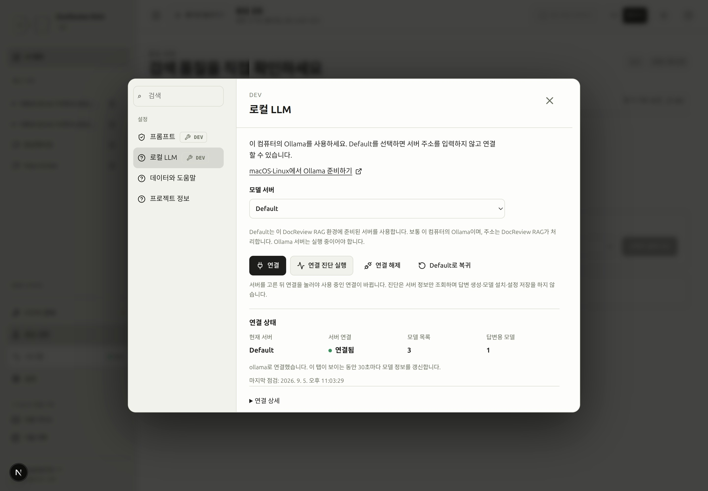
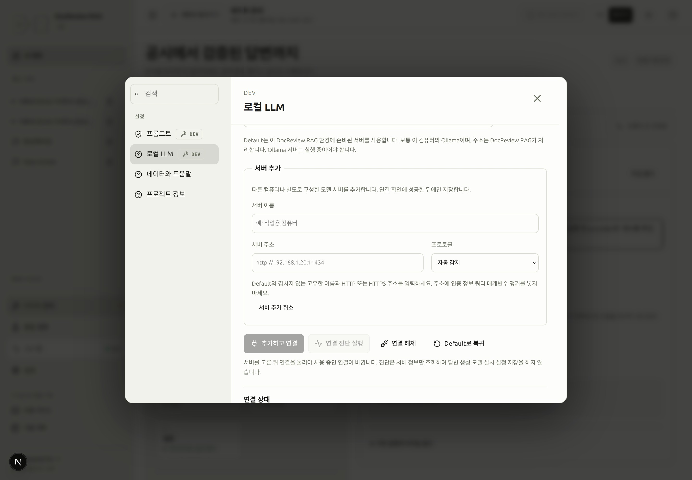
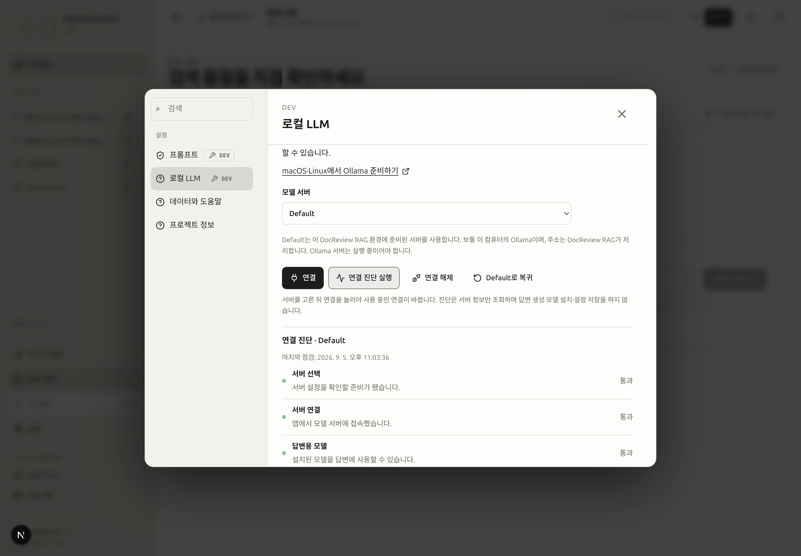

# macOS와 Linux에서 Ollama 준비하기

> [!DEV]
> DocReview에서 로컬 답변 서버를 연결·설정하는 기능은 개발 모드 전용입니다. 설치·서비스 명령은 해당 컴퓨터의 관리자가 실행합니다.

**설정 → 로컬 LLM**에서 답변 모델을 찾지 못하거나, 별도로 설치한 Ollama 서버를 연결할 때 읽는 안내입니다. 먼저 [환경 준비](environment.md#step-1)를 마칩니다. 준비된 DocReview 코퍼스는 그대로 사용하며, Ollama 설치 때문에 문서나 임베딩을 다시 만들 필요는 없습니다.

아래 명령은 필요한 작업을 확인한 뒤 직접 실행합니다. 안내를 열거나 읽는 동작만으로 소프트웨어 설치, 모델 다운로드, 서비스 변경, 모델 질문 전송이 실행되지는 않습니다.

## 기존 설치부터 확인하기 {#check}

Ollama를 실행할 컴퓨터의 터미널에서 확인합니다.

```bash
command -v ollama
curl --fail --silent --show-error --max-time 5 http://127.0.0.1:11434/api/tags
```

`models` 배열이 포함된 HTTP 응답을 받으면 로컬 API가 응답한 것입니다. 빈 배열은 목록에 모델이 없다는 뜻이며 서버 중단과 다릅니다. 응답하면 설치를 건너뛰고 [모델 선택](#models)으로 이동합니다. 기본 API 포트는 **11434**입니다. [Ollama API 안내](https://docs.ollama.com/api/introduction), [모델 목록 API](https://docs.ollama.com/api/tags).

## macOS 설치와 실행 {#macos}

현재 공식 요구 사항은 macOS 14 이상입니다. [공식 macOS 설치 안내](https://docs.ollama.com/macos)에서 설치 파일을 받고 DMG를 연 뒤, Ollama를 응용 프로그램 폴더로 옮겨 실행합니다. CLI 경로를 등록하는 안내가 나오면 내용을 확인하고 진행합니다.

```bash
open -a Ollama
ollama --version
```

[API 확인](#check)을 다시 실행합니다. 앱이 이미 11434 포트에서 동작한다면 `ollama serve`를 추가 실행하지 않습니다. 같은 주소를 두 프로세스가 동시에 사용할 수 없습니다. 앱이 시작되지 않으면 최근 서버 로그를 확인합니다.

```bash
tail -n 80 ~/.ollama/logs/server.log
```

로그 위치는 [공식 문제 해결 안내](https://docs.ollama.com/troubleshooting)에 있습니다. Mac의 모델명이나 프로세서 종류만으로 특정 실행이 CPU·GPU 중 어디에서 수행됐는지 단정하지 않습니다.

## Linux 설치와 실행 {#linux}

`ollama`가 없다면 [공식 Linux 설치 안내](https://docs.ollama.com/linux)의 설치 명령을 사용합니다. 이 명령은 소프트웨어를 설치하며 관리자 권한을 요청할 수 있습니다.

```bash
curl -fsSL https://ollama.com/install.sh | sh
```

systemd로 설치된 환경은 먼저 상태를 읽습니다.

```bash
systemctl status ollama --no-pager
```

설치된 서비스가 멈춰 있고 실행하려는 경우에만 시작합니다.

```bash
sudo systemctl start ollama
```

systemd 서비스 없이 설치했다면 터미널에서 `ollama serve`를 실행하고 그 터미널을 열어 둡니다. 서버 프로세스는 하나만 사용합니다. 다른 터미널에서 [API 확인](#check)을 반복합니다. 설치 스크립트가 맞지 않는 환경은 공식 문서의 수동 설치 절차를 참고합니다.

```bash
ollama serve
```

최근 서비스 로그는 설정을 바꾸지 않고 읽을 수 있습니다.

```bash
journalctl -u ollama -n 80 --no-pager
```

직접 실행한 서버의 로그는 해당 터미널에서 읽습니다. [Ollama 문제 해결](https://docs.ollama.com/troubleshooting).

## DocReview 백엔드에서 서버에 접근하기 {#network}

브라우저는 DocReview 백엔드에 요청하고, 백엔드가 Ollama에 연결합니다. 따라서 호스트 터미널의 확인만 성공했다고 백엔드 컨테이너 연결까지 확인된 것은 아닙니다.

| DocReview 백엔드 위치 | DocReview에서 사용하는 기본 서버 주소 |
| --- | --- |
| Ollama와 같은 컴퓨터의 직접 실행 프로세스 | `http://127.0.0.1:11434` |
| 저장소의 Docker 개발 스택, Ollama는 호스트에서 실행 | `http://host.docker.internal:11434` |
| 다른 컴퓨터 또는 별도 서버 | **서버 추가…**에서 백엔드가 접근할 주소 입력 |

**Default**를 그대로 선택하면 DocReview가 현재 환경의 주소를 결정합니다. 주소는 진단이 필요할 때 **연결 상세**에서만 확인합니다. 저장소의 Docker 설정에는 호스트 게이트웨이 매핑이 포함되며 컨테이너 안의 `127.0.0.1`은 그 컨테이너 자신입니다. 다른 서버를 의도적으로 연결할 때만 서버를 추가하며, Ollama 자동 감지에서는 `/api`나 `/v1`을 붙이지 않은 기본 주소를 입력합니다.

Ollama는 기본적으로 호스트의 루프백 주소에서만 요청을 받습니다. 백엔드 진단에서 컨테이너 접근 실패가 확인되면 수신 주소 변경이 필요할 수 있습니다. 아래 예제는 **모든 인터페이스**에서 수신하므로 허용할 클라이언트를 제한하는 신뢰된 네트워크에서만 사용합니다. 인증 없는 로컬 API를 인터넷에 직접 공개하지 않습니다. [Ollama 서버 설정](https://docs.ollama.com/faq), [API 인증 범위](https://docs.ollama.com/api/authentication).

### macOS 앱의 수신 주소 {#macos-bind}

실행 중인 Ollama 작업이 없는지 확인하고 앱 환경변수를 지정한 뒤, Ollama 앱을 종료하고 다시 엽니다.

```bash
launchctl setenv OLLAMA_HOST 0.0.0.0:11434
```

다른 터미널에서 환경변수만 바꿔도 이미 실행 중인 macOS 앱에 반영되지는 않습니다. [공식 macOS 환경변수 절차](https://docs.ollama.com/faq#setting-environment-variables-on-mac).

### Linux systemd의 수신 주소 {#linux-bind}

서비스 override를 열어 `[Service]` 아래에 설정을 추가합니다. 기존 항목은 보존합니다.

```bash
sudo systemctl edit ollama.service
```

```ini
[Service]
Environment="OLLAMA_HOST=0.0.0.0:11434"
```

실행 중인 Ollama 작업이 없는지 확인한 뒤 변경을 적용합니다.

```bash
sudo systemctl daemon-reload
sudo systemctl restart ollama.service
```

직접 실행한 서버는 해당 프로세스를 종료한 뒤 `OLLAMA_HOST=0.0.0.0:11434 ollama serve`로 시작합니다. 이후 호스트 API 확인과 DocReview 진단을 모두 반복합니다. [공식 Linux 환경변수 절차](https://docs.ollama.com/faq#setting-environment-variables-on-linux).

## 답변 모델 준비와 정보 확인 {#models}

설치된 모델을 먼저 확인합니다.

```bash
ollama ls
```

적합한 답변 모델이 이미 있다면 재사용합니다. 없다면 [공식 모델 목록](https://ollama.com/library)에서 로컬 채팅·텍스트 생성 모델의 정확한 태그를 선택하고 라이선스와 저장 공간을 확인합니다. 선택을 마친 경우에만 다운로드합니다.

```bash
# Replace this with the exact model tag you chose.
ollama pull 'MODEL_TAG_FROM_LIBRARY'
```

`pull`은 모델 파일을 내려받으며 시험 질문을 실행하지 않습니다. 네트워크와 저장 공간을 많이 사용할 수 있습니다. 클라우드 모델 항목이 보인다고 해당 모델 파일이 로컬에 설치된 것은 아닙니다. [Ollama CLI 안내](https://docs.ollama.com/cli).

텍스트 생성 없이 설치된 모델 정보를 확인합니다.

```bash
# Replace this with an exact name from ollama ls.
ollama show 'MODEL_NAME_FROM_LIST'
ollama ps
```

| 정보 | 의미 |
| --- | --- |
| 설치 크기 | 서버가 보고한 모델 파일 크기이며 실행 RAM 요구량과 다름 |
| 파라미터 수·양자화 | 서버가 제공하는 경우 표시하는 모델 메타데이터 |
| 최대 컨텍스트 | 모델 메타데이터의 한도이며 현재 실행의 할당 크기와 다름 |
| 로드된 컨텍스트 | 로드된 모델 API가 제공할 때만 확인할 수 있는 현재 할당 크기 |
| 답변 기능 | 서버가 DocReview에서 사용하는 답변 기능을 제공하는지 여부 |
| 로드되지 않음 | 설치된 모델의 정상 대기 상태이며 실패를 뜻하지 않음 |

`/api/show`는 모델 상세 정보, `/api/ps`는 현재 로드된 모델 정보를 제공합니다. 현재 DocReview 모델 목록은 최대·로드 컨텍스트 값을 수집하지 않으므로 Ollama 도구에서 확인합니다. 누락된 필드는 미확인으로 구분합니다. 컨텍스트 할당을 늘리면 일반적으로 메모리가 더 필요합니다. 이 안내는 선택한 모델·컨텍스트·예산을 바꾸지 않습니다. [모델 상세](https://docs.ollama.com/api-reference/show-model-details), [로드된 모델](https://docs.ollama.com/api/ps), [컨텍스트 길이](https://docs.ollama.com/context-length).

### 지원하는 로컬 구성 {#configurations}

DocReview는 모든 로컬 호출을 숨은 추론을 끈 채(`think: false`) 보냅니다. gemma4처럼 thinking을 지원하는 모델은 그렇지 않으면 출력 허용량 전체를 추론에 쓰고 빈 구조화 답변을 돌려줍니다. Ollama 창 크기(`num_ctx`)는 설정된 입력+출력 허용량이며 한 실행의 모든 호출에서 동일하게 유지됩니다. 요청한 창이 바뀌면 Ollama가 모델을 다시 로드하기 때문입니다(CPU 호스트에서 호출당 10–12초). grade의 근거 문장은 한 문장으로 제한됩니다. 2026-09-07에 Ollama 0.30.7, `gemma4:e4b`(8B, Q4_K_M, 9.6 GB), GPU 없는 Ryzen 7 8845HS, 채점 청크 5개, 근거 최대 12,000자로 측정했습니다.

| 실행 위치 | 프롬프트 평가 | 생성 | 기준 질문 | 권장 설정 |
| --- | --- | --- | --- | --- |
| CPU 전용(`size_vram` 0) | 캐시되지 않은 2.5k 토큰 grade 프롬프트 기준 80–95 tokens/s(약 30초); 반복되는 프롬프트 접두어는 캐시에서 처리 | 약 10 tokens/s(단독 측정 12–14) | 끝까지 36–103초: grade 19–68초, 검증 17–35초; 재시작 후 첫 호출은 모델 로드 10–20초 추가 | 측정한 예열 상태의 실행은 120초 안에 끝났으며, 300초는 콜드 로드의 여유를 늘리지만 완료를 보장하지 않음. `LOCAL_LLM_MAX_OUTPUT_TOKENS`는 600 유지(grade 150–300, 검증 140–160 필요). 측정한 사례에서 근거 8,000자는 같은 결과를 유지하며 입력 처리를 줄였음. k는 검증한 5 유지; 더 큰 후보 집합은 이 CPU에서 검증하지 않음. `LOCAL_LLM_TIMEOUT_S=300` 설정. |
| GPU 또는 혼합 | 미측정 | 미측정 | 미측정 | CPU 설정에서 시작해 측정 후 경과 시간을 낮춤 |

이 변경 전에는 같은 질문이 grade 단계에서 77–144초 뒤 `output_tokens: used=600 limit=600`과 잘못된 JSON 본문으로 실패했습니다. 600토큰은 숨은 추론이었습니다. README의 `ollama run MODEL ""` 사전 로드는 Ollama 기본 4,096토큰 창으로 모델을 올리므로 DocReview의 첫 호출이 설정된 창으로 다시 로드하는 것은 정상입니다. 남은 입력 허용량을 넘길 것으로 추정되는 프롬프트는 호출 전에 거절됩니다([실행 한도](runtime.md#limits) 참고).

## DocReview에서 연결하기 {#connect}

**설정 → 로컬 LLM**의 서버 선택기를 엽니다. **Default**는 현재 DocReview 환경에서 주소를 가져옵니다. **서버 추가…**를 선택하면 서버 이름·별도 주소·프로토콜 입력이 나타납니다. 이름은 나중에 연결 대상을 구분하기 위한 표시명입니다.

<!-- capture:13-local-model -->



*설정 → 로컬 LLM. Default가 주소를 자동 처리하고 실제 설치 모델 3개와 답변용 모델 1개를 구분합니다. 연결 상세에서만 주소를 확인할 수 있습니다.*

**연결 진단 실행**을 먼저 선택합니다. 진단 제목에 검사한 대상이 표시되며 사용 중인 연결은 바뀌지 않습니다. 백엔드 연결 결과와 답변 모델 상태를 확인하고 **연결 상세**에서 사용 중인 주소·기본 주소를 읽습니다. 선택한 서버를 적용하려는 경우에만 기존 항목은 **연결**, 새 서버는 **추가하고 연결**을 실행합니다. 탐색이나 저장이 실패하면 이전에 동작하던 설정을 보존합니다. 답변 서버 연결은 임베딩 공급자를 변경하지 않습니다.

<!-- capture:25-add-server -->



*서버 추가에서 이름·주소·프로토콜 입력을 엽니다. 제출하지 않은 초안이므로 추가하고 연결 버튼은 비활성화돼 있고 기존 Default 연결은 유지됩니다.*

**연결 해제**는 로컬 답변을 비활성화합니다. **Default로 복귀**는 기본 서버를 검사한 뒤 전환하며 추가한 서버 목록을 유지합니다. 검사·저장에 실패하면 현재 동작하던 연결을 보존합니다.

대화창으로 돌아가 답변 엔진 선택기에서 설치된 모델을 선택합니다. 연결 확인은 작성 중인 질문을 전송하지 않습니다. 질문할 준비가 되면 [답변](answers.md#engines)과 [요청 설정](settings.md#step-10)을 이어갑니다.

## 읽기 전용 진단 실행하기 {#diagnostics}

[프로젝트 명령 등록](cli.md#명령-등록과-도움말)을 마친 뒤 실행합니다.

```bash
rag-ollama-check
rag-ollama-check --web-url http://localhost:8000
rag-ollama-check --details
rag-ollama-check --setup
```

첫 명령은 설정된 웹 주소를 사용합니다. 다른 프런트엔드 주소를 쓰는 경우에만 `--web-url`을 지정하며 여기에 Ollama 주소를 넣지 않습니다. `--details`는 호스트·컨테이너·수신 주소의 추가 근거를 보여 줍니다. `--setup`은 수동 설치 안내만 출력합니다. 진단은 Ollama 설치, 설정 변경, 모델 다운로드·로드, 답변 생성을 실행하지 않습니다.

설치를 반복하기보다 실패한 구간을 구분합니다.

| 증상 | 확인할 근거 | 복구와 재확인 |
| --- | --- | --- |
| 호스트 API가 응답하지 않음 | 앱·서비스 상태와 서버 로그 | 의도한 서버를 시작하고 `/api/tags` 재확인 |
| 호스트는 성공하고 백엔드는 실패 | 백엔드 결과·수신 주소·호스트 게이트웨이·방화벽 | 접근 가능한 주소나 승인한 수신 설정을 교정한 뒤 재진단 |
| 백엔드는 연결됐지만 답변 모델 없음 | 설치 목록과 보고된 기능 | 적합한 모델을 선택·설치한 뒤 다시 탐색 |
| 설치됐지만 로드되지 않음 | 설치 목록에는 있고 로드 목록은 비어 있음 | 정상 대기이며 별도 예열은 필요하지 않음 |
| 운영 모드에서 로컬 연결 차단 | 실행 모드와 권한 진단 | 개발 환경에서 사용하며 공개 권한을 우회하지 않음 |
| 연결 저장 실패 | 저장 오류와 이전 활성 설정 | 동작하던 설정을 유지하고 보고된 원인 해결 후 명시적으로 재시도 |
| 연결 후 답변 실행 실패 | Run trace와 기록된 실패 유형 | [실행 문제 해결](troubleshooting.md#execution) 확인. 연결 성공은 답변 품질 검증이 아님 |

로그와 실제 실행 측정은 [실행과 측정](runtime.md#local-models)에서 이어갑니다. 진단 명령의 상세 정의는 [CLI 안내](cli.md#로컬-모델-연결-진단)에 있습니다.

`rag-ollama-check`와 달리 `.venv/bin/python -m scripts.diagnostics.local_grade --api-url http://127.0.0.1:8001`은 모델을 로드하고 실행합니다. `/retrieve`로 워크플로의 grade 프롬프트를 만들어 thinking 켬/끔과 출력 상한별로 구조화 출력 스키마와 함께 Ollama를 호출하고, 프롬프트 토큰·초당 토큰·숨은 추론 길이·JSON 유효성을 보고합니다. 격리된 스택에서만 실행하며 운영 모드에서는 거부합니다. [지원하는 로컬 구성](#configurations) 표는 이 스크립트로 얻었습니다.

<!-- capture:24-connection-diagnostics -->



*Default의 실제 읽기 전용 진단입니다. 서버 선택·접속·답변용 모델 확인이 통과했으며 설정이나 모델 상태를 바꾸지 않았습니다.*


### 선택 사항인 CPU 시작 프리셋 {#cpu-starting-preset}

선택한 모델과 하드웨어에 맞게 입력·출력 토큰과 근거 크기를 조절하세요. 앱의 전체 실행 기본값은 **입력 60,000토큰·출력 4,000토큰·120초**로 유지됩니다. **설정 및 미리보기 → 고급 → 실행 한도**에서 **로컬 CPU 시작 설정**을 직접 선택하면 현재 대화에 **입력 24,000토큰·출력 2,000토큰·300초·6단계·근거 8,000자**를 적용합니다. 설정을 여는 것만으로는 값이 바뀌지 않으며, 새 대화 기본값 저장은 별도 동작입니다.

이 값은 선택 가능한 출발점이며 완료 보장이 아닙니다. 확인한 Ryzen 7 8845HS 호스트는 8코어·16스레드이고 사용 가능한 전체 메모리는 약 45 GiB입니다. 출력 128토큰으로 제한한 `gemma4:e4b` CPU 점검에서 **생성 속도만 10.3토큰/초**로 측정했으며, 공시 질문의 성공적인 답변을 입증한 것은 아닙니다. 입력 처리·검색·모델 로딩·반복 호출에도 시간이 듭니다. 다음 실제 실행의 시간 기록을 확인한 뒤 다시 조절하세요.

전체 실행 예산은 여러 호출에서 누적됩니다. 서버의 로컬 호출별 기본 한도는 여전히 **입력 12,000·출력 600토큰**이며 대화 예산을 높여도 이 한도는 늘지 않습니다. Ollama `num_ctx`는 할당한 컨텍스트 창으로, 보통 공급자 입력·출력 허용량의 합에서 정해지며 전체 실행의 누적 예산과 다릅니다. [변경 가능한 로컬 설정](#editable-options)을 참고하세요.

### 전송 전 느린 CPU 경고 {#cpu-warning}

로컬 Ollama 모델을 선택했을 때, 현재 로드된 모델이 CPU 전용이며 최근 **15분** 안의 실행에서 생성 속도가 **15 tokens/s 미만**으로 측정되면 입력창에 **느린 로컬 CPU 모델** 안내가 표시됩니다. 이 안내 기준은 위의 CPU 구성에서 측정된 10–14 tokens/s를 포함하며, 전체 실행 시간을 예측하는 값은 아닙니다. 생성 속도는 해당 모델 호출들의 `eval_count` 합계를 `eval_duration_ms` 합계의 초 단위 값으로 나눈 것으로, 모델 로딩과 입력 처리 시간은 제외합니다.

인라인 안내에는 측정 속도와 현재 출력·시간 한도가 표시되며, 동작 버튼은 설정 편집기를 엽니다. 추천값은 생성 예상 시간에 30% 여유를 더해 최대 600초까지 시간을 늘리고, 필요하면 출력 한도를 줄입니다. 검색·프롬프트 처리 시간이 추가되고 실제 모델 한도는 더 낮을 수 있으므로 완료 보장은 아닙니다. 경고의 **설정에서 추천 한도 확인**은 **고급 → 실행 한도**로 이동할 뿐 값을 바꾸거나 전송하지 않습니다. 그 화면에서 변경 전후 값을 확인하고 **추천 한도 적용**을 눌러 반영하세요. **근거**도 편집기로 이동한 뒤 감소량을 적용합니다. 적용한 값은 현재 대화에만 반영되며 질문 전송·기본값 저장은 자동으로 실행되지 않습니다. 원래 값으로 전송할 수도 있습니다. **실행 한도**, **근거**는 해당 고급 설정으로 이동합니다.

백엔드 재시작이나 서버 변경 직후의 첫 실행에는 측정값이 없어 속도 경고가 나오지 않습니다. 측정값은 활성 백엔드 메모리에만 보관되며 서버와 모델 digest별로 구분합니다. 시간이 오래됐거나 모델 변경·언로드, 배치·시간 정보 미수집 상태이면 경고하지 않습니다. GPU나 혼합 배치도 이 CPU 경고의 대상이 아닙니다. 측정값을 얻으려고 벤치마크나 모델 로드를 시작하지 않으며, 로컬 실행 후와 일반 상태 조회 때 정보를 갱신합니다.

### SCREENSHOT NEEDED
<!-- Feature: slow CPU composer warning with measured speed and Run limits/Evidence actions; locale=ko; theme=light; state=selected loaded CPU Ollama model below 15 tok/s with a recent real measurement; preserve existing assets. -->

## 로컬 Ollama에서 수정할 수 있는 설정 {#editable-options}

| 설정 | DocReview에서 조정하는 위치 |
| --- | --- |
| 검색 프리셋·필터·근거 크기·전체 실행 한도 | 설정 및 미리보기. 답변 엔진이 로컬 LLM이어도 적용됩니다. |
| 서버 주소·프로토콜·사용할 모델 | 설정 → 로컬 LLM 및 대화의 모델 선택 |
| 로컬 모델 호출의 입력·출력 상한 | 서버 설정 `LOCAL_LLM_MAX_INPUT_TOKENS`(기본 12000), `LOCAL_LLM_MAX_OUTPUT_TOKENS`(기본 600). 대화 전체 실행 한도와 별개입니다. |
| 로컬 HTTP 타임아웃 | 서버 설정 `LOCAL_LLM_TIMEOUT_S`. 대화의 실행 시간을 늘려도 HTTP 타임아웃은 늘어나지 않습니다. |
| Ollama `num_predict` | 실제 모델 출력 허용량으로 전송됩니다. 대화의 출력 한도를 높여도 서버 모델 상한을 넘지는 못합니다. |
| Ollama `num_ctx` | 설정된 컨텍스트 창을 명시적으로 전송합니다. 일반적으로 로컬 입력+출력 상한이며 한 실행의 호출들 사이에서 유지합니다. |
| `temperature` / `think` | 현재 DocReview가 `0` / `false`로 전송합니다. 이 두 값을 바꾸는 UI는 없습니다. |

서버 설정을 바꾸려면 백엔드를 시작하는 환경의 해당 비밀이 아닌 설정값을 편집한 뒤, 변경된 환경으로 백엔드를 다시 생성하거나 재시작해야 합니다. 브라우저 설정이나 별도의 `ollama run /set` 세션이 DocReview의 API 요청값까지 바꾼다고 가정하지 마세요. 실제 질문 실행 후 **실행 상세 → 서버 설정**에서 설정값과 실효 한도를 확인하세요. Ollama 자체는 더 많은 생성 옵션을 지원하지만, DocReview에서 새 옵션을 노출하려면 별도의 API/UI 변경이 필요합니다. 공식 [채팅 API](https://docs.ollama.com/api/chat)와 [컨텍스트 창 FAQ](https://docs.ollama.com/faq)를 참고하세요.
