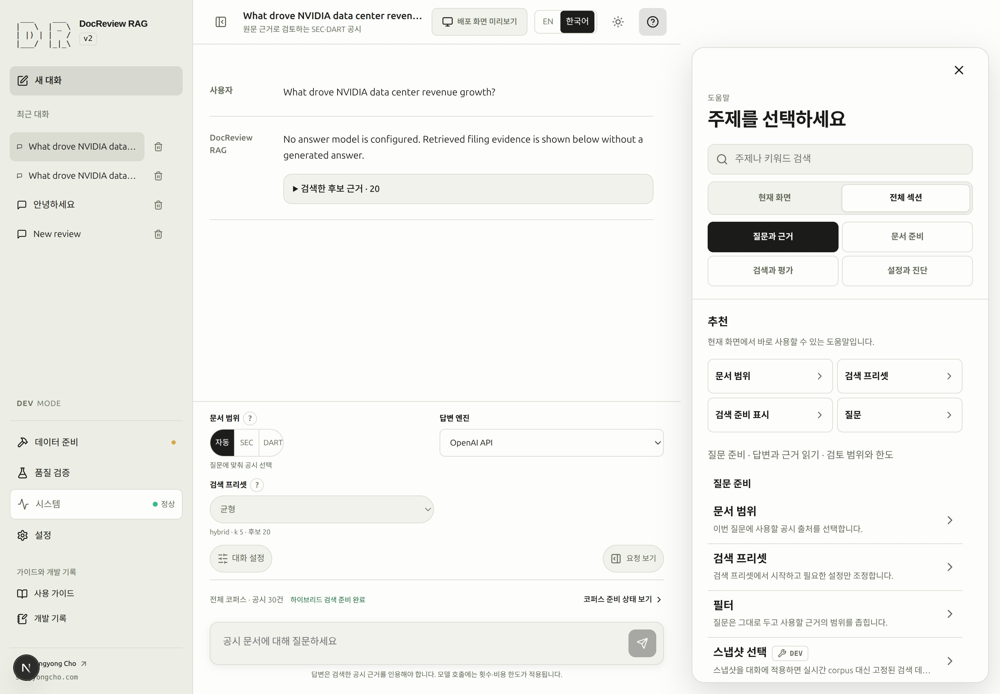
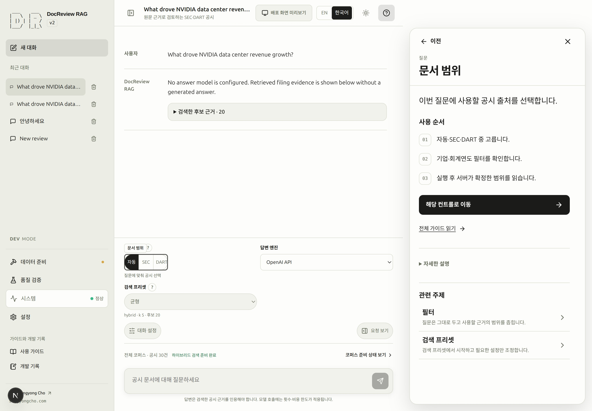
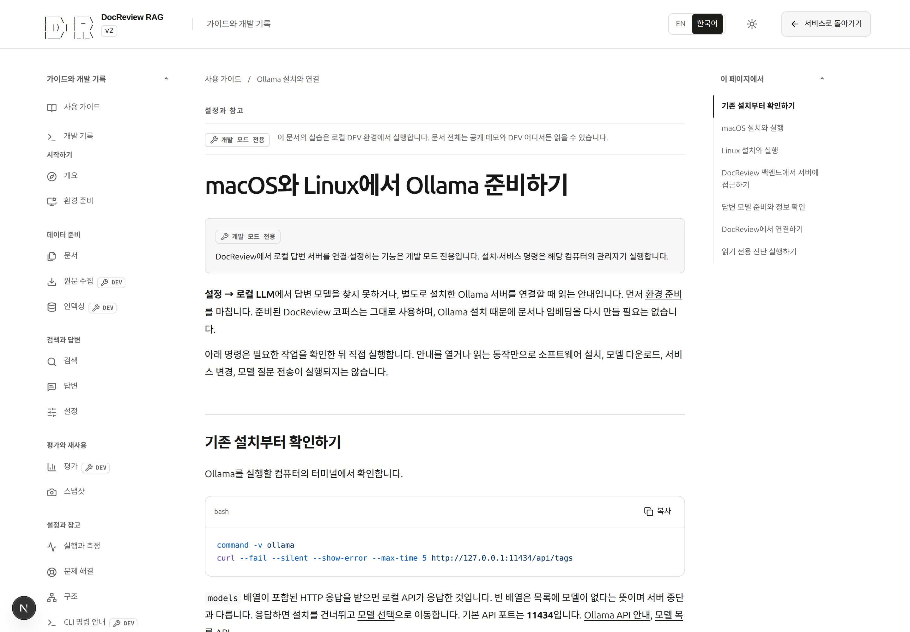

# DocReview RAG 사용 안내

바로 체험하려면 [Quick Start](quickstart.md)를 여세요. 저장소를 clone하고 로컬 환경을 처음부터 준비한다면 [환경 준비](environment.md#qs-setup)에서 시작하세요.

모든 문서 페이지는 DEV와 배포 환경에서 함께 제공되며, DEV 표시는 해당 작업을 실행할 수 있는 환경만 안내합니다.

DocReview RAG v2는 SEC·DART 공시를 검색 근거와 원문 인용으로 읽고,
검색 평가로 결과를 확인하는 도구입니다. 처음에는 범위가 작은 질문과 식별 가능한
공시 한 건으로 시작하세요. 답변이 끝났다는 사실과 원문이 그 내용을 뒷받침한다는
사실은 따로 확인해야 합니다.

이 안내서는 실제 화면을 기준으로 원문 수집, 파싱, 인덱스 준비, 검색, 답변, 평가를
나누어 설명합니다. 같은 환경에서 이미 완료한 준비를 확인하고 이어서 사용할 수
있습니다.

## 시작할 곳 {#start}

| 현재 상태 | 시작할 곳 | 재사용할 것 |
|---|---|---|
| 로컬에 준비된 문서가 있음 | [문서](documents.md#step-2)를 확인하고, 빠진 준비는 [Quick Start — DEV ONLY](quickstart-dev.md)에서 이어갑니다. | 다운로드한 원문, 파싱된 청크, 설정과 일치하는 임베딩, 준비된 BM25 인덱스. |
| 새 clone 또는 빈 로컬 DB | [환경 준비](environment.md#qs-setup)를 완료한 뒤 [Quick Start — DEV ONLY](quickstart-dev.md)로 이어갑니다. | 식별 정보와 매니페스트 범위가 일치하는 기존 원문 파일. |
| 실행 중인 공개 서비스에 접속함 | [Quick Start](quickstart.md)에서 질문·근거 확인과 공개 문서·[스냅샷](snapshots.md) 탐색을 진행합니다. | 공개된 코퍼스만 사용하며, 관리자 준비 작업은 개발 환경이 필요합니다. |

필터 결과가 없거나 공개 문서가 없다는 이유만으로 DB 전체가 비었다고 판단하지
마세요. [문서 공개 범위](documents.md#visibility)에서 각 상태의 차이를 설명합니다.
준비 상태가 확인되지 않았으면 준비 완료로 해석하지 않습니다.

CLI와 웹은 같은 DB·원문 디렉터리·실제 설정을 사용할 때 결과를 공유합니다.
다운로드·적재·인덱스 생성·모델 호출을 다시 시작하기 전에 기존 결과를 확인하세요.
CLI에서 직접 실행한 작업은 웹 대기열을 거치지 않아 작업 목록에 없을 수 있습니다.

### SCREENSHOT NEEDED
<!-- Feature: guide entry routing and portfolio navigation; locale=ko; light mode; Overview shows the two reader paths and navigation begins Overview, Environment setup, Quick Start, Quick Start — DEV ONLY, with the wrench only on the last entry. Preserve existing assets. -->

## 열두 단계 학습 경로 {#learning-path}

전체 로컬 학습 경로입니다. 내비게이션은 사용법을 준비 작업보다 먼저 보여 주지만, 단계 번호는 실행 순서를 유지합니다. [Part 1: 환경 준비](environment.md#qs-setup)부터 시작하고 Part 2에서는 [DEV 준비 안내](quickstart-dev.md)와 사용법 문서로 이어가세요. 다음 방문에는 완료한 작업을 건너뜁니다.

<!-- tutorial-steps -->

임베딩과 BM25는 병렬 준비 경로입니다. 번호는 두 상태를 따로 확인하기 위한 순서이며,
BM25 준비에 답변 생성은 필요하지 않습니다. 검색 평가의 선행 조건은 적절한 검색
인덱스와 평가 데이터셋이고, **답변을 먼저 생성할 필요는 없습니다**.
검색 준비를 확인한 뒤 바로 11단계로 이동해도 됩니다.

## 작업에 맞는 화면 찾기 {#workspaces}

> [!DEV]
> 코퍼스 준비·데이터셋 편집·실제 평가 실행·로컬 모델 설정은 개발 모드 전용입니다. 공개 문서 열람과 게시된 스냅샷 탐색은 사용할 수 있습니다.

| 화면 | 하는 일 |
|---|---|
| 대화 | 질문, 답변 엔진 선택, 요청 확인, 인용, 실행 기록 확인. |
| 데이터 준비 → 파이프라인 | 준비 단계의 의존 관계와 선택 단계의 입력·실행 버튼 확인. 노드 선택만으로 실행하지 않습니다. |
| 데이터 준비 → 문서 | 원문 식별 정보, 검색 필터, 청크, 저장된 임베딩 정체성, 관련 작업 확인. |
| 데이터 준비 → 작업 | 대기 중인 작업, 진행, 결과, 오류와 지원되는 후속 작업 확인. |
| 품질 검증 | 검색 시험, 평가 데이터셋, 평가 실행, 스냅샷 비교. |
| 시스템 → 시스템 상태 | API 연결, DB·스키마, 코퍼스 준비, 모델 가용성을 각각 확인. |

대화의 코퍼스 상태 문구로 데이터 준비에 이동했다면 **뒤로**로 질문과
보존된 상태에 돌아옵니다. 요청 조절은 [설정](settings.md), 측정된 실행 기록의
해석은 [실행 상태](runtime.md)를 참고하세요.

<!-- capture:02-pipeline -->

*파이프라인은 의존 관계 그래프와 선택한 단계의 실행 영역을 함께 보여 줍니다. 임베딩과 BM25는 병렬 준비 경로이며, 평가에는 인덱스와 데이터셋이 필요하고 생성된 답변은 필요하지 않습니다.*

## 도움말과 문서 사용하기 {#help}

**도움말**은 홈과 주제 상세의 두 화면으로 구성됩니다. 홈에서는 현재 보이는 조작의 **추천** 주제가 먼저 나옵니다. **질문과 근거**, **문서 준비**, **검색과 평가**, **설정과 진단**의 네 그룹을 선택하면 같은 홈 화면의 주제 목록이 바뀝니다. 작은 묶음 제목 아래의 주제 행을 한 번 누르면 상세가 열립니다.

<!-- capture:21-context-help -->

*도움말 홈의 추천과 네 가지 작업 필터에서 주제를 바로 엽니다. 중간 분류 화면이나 화면 전체의 번호 배지가 없습니다.*

상세에서는 짧은 요약과 세 단계의 **사용 순서**를 먼저 읽습니다. **자세한 설명**을 펼치면 전체 설명을 볼 수 있고, **전체 가이드 읽기**는 관련 문서를 새 탭으로 엽니다. **이전**을 한 번 누르면 검색어·그룹·범위·스크롤 위치를 보존한 홈으로 돌아갑니다. 선택한 주제의 조작 항목이 화면에 보일 때만 테두리로 표시합니다. 홈을 열었다고 앱 전체에 번호 표시가 생기지는 않습니다.

<!-- capture:26-help-topic -->

*주제를 한 번 누르면 핵심 의미·세 단계 사용 순서·실제 컨트롤 이동·전체 가이드를 봅니다. 뒤로 한 번으로 홈에 돌아가며 선택한 컨트롤 하나만 강조합니다.*

**도움말 검색**은 표시 언어와 관계없이 한국어·영어를 받습니다. **현재 화면 / 전체 섹션**으로 검색 범위를 고르며 제목 일치가 본문 일치보다 먼저 나옵니다. 검색은 로컬에서 처리하고 모델을 호출하지 않습니다. 이동 버튼은 보이는 조작에 포커스를 두거나 해당 화면·편집기 영역을 엽니다. 설명된 작업을 실행하거나 설정값을 바꾸는 동작은 아닙니다. 다른 대화상자가 열려 있다면 닫은 뒤 도움말을 사용하세요.

문서 메뉴는 안내를 주제별로 묶고, 이전·다음 링크는 학습 경로를 이어 줍니다.
언어를 전환해도 같은 문서를 유지합니다. 코드 카드의 복사는 코드 원문을 복사하며,
넓은 표는 가로로 스크롤할 수 있습니다. 기존 원문·질문·답변·모델명·실제 로그는
작성된 언어를 그대로 유지합니다.

<!-- capture:29-documentation-menu -->

*문서 메뉴는 하나의 등록 정보에서 15개 안내, 그룹 탐색, 주제별 아이콘을 구성합니다. Ollama 안내에는 macOS·Linux 설치와 읽기 전용 연결 진단이 있습니다.*

실패가 생기면 [문제 해결](troubleshooting.md)에서 증상을 구분하고 기록된 근거를
읽은 뒤 맞는 조치를 적용하고 결과를 확인하세요. 구현 구조는
[아키텍처](architecture.md), 자세한 명령과 실행 환경은 [CLI 참고](cli.md)에서 다룹니다.

앱을 체험하려면 [Quick Start](quickstart.md), 새 clone을 실행하려면 [환경 준비](environment.md#qs-setup)로 이어가세요.

### 뒤로·앞으로와 위치 복원

상단의 현재 화면·탭·대화 제목 양옆에 **뒤로**와 **앞으로**가 표시됩니다. 두 버튼은
항상 보이며 기록의 처음과 끝에서는 비활성화됩니다. 제목을 누르면 **방문 기록**에서
이전 또는 이후 위치로 바로 이동할 수 있습니다. 방향키·Home/End·Enter로 조작하고
Escape나 바깥 클릭으로 닫습니다. 좁은 화면에서는 아래쪽 시트로 표시됩니다.

앱 버튼과 브라우저 뒤로·앞으로는 같은 기록을 사용합니다. 뒤로 간 뒤 새 위치를
선택하면 앞으로 기록을 비웁니다. 복귀할 때 기존 조작 상태·대화 초안·포커스·스크롤을
복원하며, 저장하지 않은 평가 질문이 있으면 이동 전에 확인합니다.

URL은 화면·탭·선택한 준비 단계나 평가 결과·로컬 대화 ID를 기록하며 새로고침하면
그 위치로 돌아옵니다. 해당 브라우저에 대화 ID가 없으면 가장 최근 저장 대화로
이동합니다. 메시지 본문과 작성 중인 질문은 URL에 넣지 않습니다. 언어·테마 매개변수,
앱 기본 경로와 튜토리얼 링크는 유지됩니다.

### SCREENSHOT NEEDED

<!-- Feature: bidirectional header navigation and history list; locale=ko; light mode; show Back/current location/Forward with the current list entry marked, including narrow-screen sheet. Preserve existing assets. -->

## 브라우저 저장소 {#browser-storage}

PROD의 대화·기본값·필터·프리셋·언어/테마·도움말 설정은 이 브라우저와 origin에만 저장됩니다. 동기화되지 않으며 사이트 데이터나 비공개 세션을 지우면 사라질 수 있습니다. **설정 → 데이터와 도움말 → 브라우저 저장소**에서 용량을 확인하고 삭제 전에 백업을 내보내거나 가져오세요. 첫 방문의 ⚠️ 안내는 [전체 저장 항목·복구·삭제 설명](settings.md#browser-storage)으로 연결됩니다. DEV와 메모리 기반 배포 미리보기는 기존 동작을 유지합니다.
