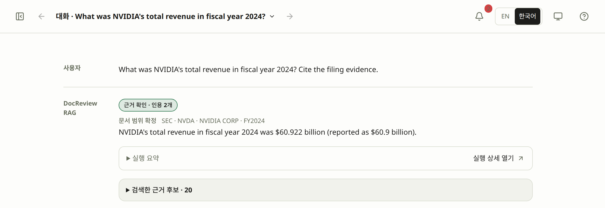

# DocReview RAG 사용 안내

SEC·DART 공시에 질문하고 원문 근거와 검색 결과를 확인하세요. 공개 서비스는 로컬 설치 없이 체험할 수 있습니다.

## 무엇을 먼저 해볼까요? {#start}

<!-- guide-features -->

- **[기업 공시에 질문하기](quickstart.md#qs-app-2)**

  공시를 골라 질문하고, 답변과 실행 요약을 확인하세요.

  [대화 화면 열기 →](/docreview-rag/?view=review)

  [Quick Start](quickstart.md)

- **[답변의 원문 근거 확인하기](answers.md#inspection)**

  인용 원문을 열어 주장과 회사·연도가 맞는지 확인하세요.

  [공시 목록 열기 →](/docreview-rag/?view=build&tab=documents)

  [답변 확인 방법](answers.md) · [문서 안내](documents.md)

- **[검색 결과 비교하기](snapshots.md#comparison)**

  공개 스냅샷을 비교해 검색이 찾거나 놓친 근거를 살펴보세요.

  [비교 화면 열기 →](/docreview-rag/?view=measure&tab=compare)

  [스냅샷 안내](snapshots.md) · [검색 방식 이해하기](retrieval.md)

## 내 컴퓨터에서 실행하려면 {#local-start}

17개 가이드는 어디서든 읽을 수 있습니다. DEV 표시가 있는 작업은 개발 환경이 필요합니다. 현재 상태에 맞게 시작하세요.

<!-- guide-local-paths -->

- **[새 clone에서 시작하기](environment.md#qs-setup)**

  환경 설정 후 [Quick Start for DEV MODE](quickstart-dev.md)에서 예제 공시 두 건을 준비하세요.

- **[기존 자료로 이어서 진행하기](documents.md#step-2)**

  원문·청크·호환 임베딩·BM25를 확인하고, 빠진 [준비 단계](quickstart-dev.md)만 실행하세요.

공개 자료는 NVIDIA·AMD FY2019–FY2024, 삼성전자·SK하이닉스 FY2022–FY2024의 공시 18건입니다. 새 DEV 설치에는 이 코퍼스가 없으며, 기본 선택은 준비할 범위만 나타냅니다.

빈 목록이 곧 빈 DB는 아닙니다. 다시 준비하기 전에 필터와 [문서 공개 범위](documents.md#visibility)를 확인하세요.

CLI와 Web은 DB·원문 디렉터리·설정이 같으면 결과를 공유합니다. 코퍼스 helper는 데이터 준비 작업을 제출하지만, 대기열 밖의 도구는 작업 기록이 없을 수 있습니다. 다운로드·적재·인덱스 생성·유료 호출 전에 기존 결과를 확인하세요.

## 전체 흐름을 세 단계로 이해하기 {#learning-path}

아래 12개 단계는 실제 준비·실행 순서입니다. 각 단계에서 선행 조건과 결과를 확인하고, 완료한 작업은 건너뛰세요. 서비스 체험만 원하면 위의 작업부터 시작하세요.

<!-- tutorial-steps -->

청크에서 임베딩과 BM25 인덱스를 만듭니다. 하이브리드 검색은 둘 다, 벡터 검색은 호환 임베딩, 키워드 검색은 BM25가 필요합니다. 정답 근거가 있는 데이터셋을 준비하면 답변 생성 전에도 검색을 평가할 수 있습니다.

## 작업에 맞는 화면 찾기 {#workspaces}

| 화면 | 작업과 결과 |
|---|---|
| 대화 | 질문하고 실행을 지켜보며, 인용과 검색 후보로 답변을 검증합니다. |
| 데이터 준비 → 파이프라인 | 의존 관계를 확인하고 DEV에서 빠진 단계를 실행합니다. 노드 선택은 화면만 엽니다. |
| 데이터 준비 → 문서 | 공시 정보·청크·임베딩 준비 상태를 확인합니다. |
| 데이터 준비 → 작업 | 진행·완료·오류를 확인하고 필요한 작업을 재시도합니다. |
| 품질 검증 | DEV에서는 검색·평가를 실행하고, PROD에서는 공개 스냅샷을 비교합니다. |
| 시스템 → 시스템 상태 | API·DB·스키마·코퍼스·모델 상태로 문제의 원인을 좁힙니다. |

코퍼스 준비, 데이터셋 편집, 실제 평가 실행, 로컬 모델 설정은 DEV가 필요합니다. 공개 방문자는 공개 대상 문서와 스냅샷을 읽고 허용량 안에서 설정된 OpenAI 답변 서비스를 사용할 수 있습니다. 요청의 선택 사항은 [설정](settings.md), 실행 기록의 의미는 [실행 상태](runtime.md)에서 설명합니다.

## 도움말과 문서 사용하기 {#help}

1. 현재 조작의 뜻이 궁금하면 **도움말**을 엽니다. 추천 주제는 현재 화면을 반영하며, 한국어·영어 검색을 현재 화면 또는 전체 섹션에 적용할 수 있습니다.
2. 주제를 열어 요약과 **사용 순서**를 읽습니다. **이 컨트롤로 이동**은 해당 조작에 포커스를 두거나 소속 화면으로 이동하며, 그 작업을 실행하지는 않습니다.
3. 전체 작업 순서와 선행 조건, 결과의 의미가 필요하면 **전체 가이드 읽기**를 선택합니다. 도움말의 **이전**은 이전 검색·필터·스크롤 위치를 복원합니다.

문서 메뉴는 17개 가이드의 읽기 순서를 유지합니다. 이전·다음 링크로 이어가고 언어를 바꿔도 같은 문서를 읽습니다. 코드 카드에서는 원래 명령을 복사하며, 넓은 표는 가로로 스크롤할 수 있습니다. 원문·질문·답변·모델명·로그는 작성된 언어를 유지합니다.

실패가 생기면 [문제 해결](troubleshooting.md)에서 기록된 증상에 맞는 확인 항목을 찾으세요. 구현 배경은 [아키텍처](architecture.md), 터미널이 필요한 작업은 [CLI 안내](cli.md)를 참고합니다.

<!-- heading-alias: 이전앞으로와-위치-복원 -->
### 이전·앞으로와 위치 복원 {#navigation}

상단의 **이전**과 **앞으로**로 대화와 확인 화면 사이를 오갈 수 있습니다. 현재 위치를 누르면 **방문 기록**에서 항목을 고릅니다. 방향키·Home/End·Enter·Escape로 조작할 수 있으며 좁은 화면에서는 아래쪽 시트로 열립니다.

앱 이동과 브라우저 방문 기록은 같은 순서를 사용합니다. 돌아오면 유지 중인 조작 상태·대화 초안·포커스·스크롤을 복원합니다. 뒤로 간 뒤 새 위치로 이동하면 앞으로 경로가 바뀌며, 저장하지 않은 평가 질문에서 나갈 때는 여전히 확인을 요청합니다.

URL은 화면·탭·선택한 준비 단계나 평가 결과·로컬 대화를 식별하고, 새로고침하면 그 위치를 복원합니다. 이 브라우저에 없는 대화라면 가장 최근 저장 대화로 돌아갑니다. 메시지 본문과 작성 중인 질문은 URL에 포함하지 않습니다.

<!-- screenshot: manual-navigation-and-task-return -->

*1. 복원된 질문과 답변 · 2. 유지된 대화 문맥*

## 브라우저 저장소 {#browser-storage}

PROD의 대화·기본값·필터·프리셋·언어/테마·도움말 설정은 이 브라우저와 origin에 저장되며 동기화되지 않습니다. 사이트 데이터를 지우기 전에 **설정 → 데이터와 도움말 → 브라우저 저장소**에서 백업을 내보내세요. [저장소 안내](settings.md#browser-storage)는 저장 항목·가져오기·삭제 범위를 설명합니다. DEV는 자체 저장 동작을 유지합니다.

<!-- heading-alias: 공용-openai-사용-한도 -->
## 공개 실행 요청 수와 AI 비용 한도 {#allowance}

공개 화면은 **이 브라우저의 남은 실행 요청**, **여러 방문자가 공유하는 서버 요청 한도**, **전체 AI 비용 한도**를 구분합니다. 브라우저와 서버는 각각 분당 10회·최근 24시간 동안 50회의 실행 요청을 허용하며, 브라우저도 서버에서 불러온 공개 정책을 사용합니다. 정책을 불러오지 못하면 기존 재시도 버튼으로 다시 확인한 뒤 전송하세요. 브라우저 기본값으로 대신 실행하지 않습니다. 서버의 잔여 횟수는 공유 용량이며 브라우저 자체 잔여량을 덮어쓰지 않습니다. 브라우저 잔여 횟수와 재시도 시간은 작성창·검색 테스트·한도 화면에서 확인합니다.

대화 전송, 선택 근거로 다시 실행, 검색 테스트는 같은 브라우저 한도를 사용합니다. 스트리밍을 포함해 전송 직전에 요청 한 번을 기록합니다. 로컬에서 차단되거나 전송 전에 취소된 요청은 차감하지 않습니다. 전송 이후 오류·취소는 환급하거나 자동 재시도하지 않습니다. 브라우저 한도에 걸리면 입력을 유지하고 다시 전송할 수 있는 시간을 표시합니다. 시각 기록의 보관과 탭 간 반영은 [브라우저 저장소](settings.md#browser-storage)를 참고하세요.

서버는 공개 `POST /retrieve`, `/review`, `/review/stream`을 끝의 슬래시 유무와 관계없이 본문 해석·실행 전에 별도로 집계합니다. 허용 후 검증 실패·취소·AI 미호출도 포함하므로 키워드 전용 검색 역시 요청 한 번을 사용합니다. 이미 요청 한도에 걸린 요청은 추가 차감하거나 대기 시간을 늘리지 않습니다. 저장 결과·정적 페이지와 그 밖의 GET 조회는 실행 요청을 차감하지 않습니다.

같은 Worker 출구 IP를 거치는 방문자는 서버 요청 한도를 공유하며, 한 방문자가 공유 한도를 모두 소진할 수도 있습니다. 출구 IP는 고정된 방문자 식별자나 우리 Worker의 인증 정보가 아닙니다. 이 정책은 방문자별 공정 배분이나 분산 트래픽 방어를 보장하지 않습니다. 요청 한도는 각 기록이 60초·24시간을 지날 때 복구되며 자정 초기화가 아닙니다.

전체 출구 IP에는 별도로 UTC 하루 $0.10의 AI 비용 한도와 모델 호출당 $0.005의 상한을 적용합니다. 답변과 질문 임베딩은 각 provider 호출 직전에 비용을 예약하고, 호출 결과가 모호한 실패에서는 예약을 환급하지 않습니다. 일일 비용 한도는 UTC 자정에 초기화됩니다. 텍스트 모델은 `gpt-5.6-luna`이고, 의미 검색은 `text-embedding-3-large`의 384차원 임베딩을 사용합니다. **사용 한도와 가용성**은 용량을 표시하며 계정 청구서나 보장된 답변 횟수를 뜻하지 않습니다.

기존 `data/runtime/public-ai-limits.sqlite3` 장부는 같은 영구 볼륨에서 앱을 재시작해도 요청 기록과 비용 예약을 유지합니다. 한 호스트의 여러 프로세스를 조정하며 독립된 여러 호스트를 조정하지는 않습니다. 응답 시작 전 장부 오류는 요청을 차단하고 `503`을 반환합니다. SSE 시작 뒤 비용 장부에 오류가 나면 이미 보낸 HTTP `200`을 바꿀 수 없으므로 `allowance_unavailable` 오류와 `done` 이벤트로 스트림을 마치고 다음 provider 호출을 차단합니다. [한도 문제 해결](troubleshooting.md#public-limits)과 [배포 경계](environment.md#production-deployment)를 참고하세요.

### SCREENSHOT NEEDED
<!-- Feature: public request and cost limits. State: PROD conversation and Limits & availability showing distinct browser remaining requests, shared server remaining requests, and global AI cost, plus a browser-limited draft with retry time. Locale: ko, light mode. Expected evidence: real UI states showing the three separate limits and preserved input; no existing screenshot proves these changes. -->
