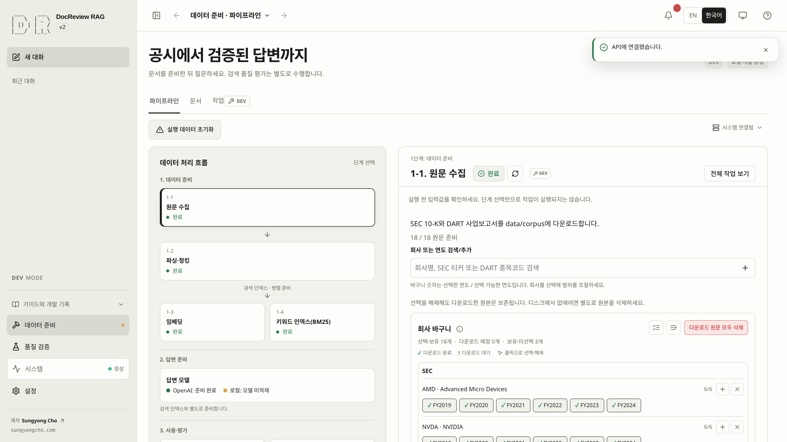

# Quick Start for DEV MODE

저장소를 clone했는데 무엇부터 할지 모르겠다면 `source ./rag-alias.sh` 후
`rag-start-quick`를 실행하세요. `rag-start-fresh`는 확인된 체크아웃 정리,
`rag-reset`는 설정·볼륨을 보존하는 ORM 데이터·원문 초기화입니다.
모든 명령에 `--verbose` (`-vv`)를 붙일 수 있습니다. [CLI 안내](cli.md)를 참고하세요.

실행 중인 로컬 DEV 환경에서 원문과 검색 인덱스를 준비하는 안내입니다. 먼저 [환경 준비](environment.md#qs-setup)를 완료하고 데이터 준비 화면을 여세요. 다운로드한 원문·DB 행·청크·임베딩이 있다고 가정하지 않습니다. 저장소의 manifest만으로 원문이 디스크에 있다는 뜻은 아닙니다.

CLI 또는 Web에서 같은 7단계 준비를 진행합니다. 탭 전환은 작업을 실행하지 않습니다. 서비스 준비와 데이터 준비를 구분하고, 같은 환경에서 이미 완료한 작업은 재사용하세요.

<!-- quickstart-cli -->

## CLI {#qs-cli}

clone한 저장소에서 명령을 실행하고, 실행 확인에 응답하며, 각 작업이 성공한 뒤 다음 명령으로 넘어가세요. 작업이 실패하면 Jobs 또는 `rag-corpus status`에서 실제 오류를 확인하고 인증·누락 원문·provider 설정을 고친 뒤 다시 실행하세요. [문제 해결](troubleshooting.md)을 참고하세요.

### 1. 빈 환경 확인 {#qs-cli-1}

```bash
rag-corpus inspect
rag-corpus readiness
```

API 응답·DB 연결·호환 스키마·쓰기 권한이 확인됩니다. 실제 빈 실습 DB는 문서와 청크가 0개입니다.

### 2. NVIDIA SEC FY2024 다운로드 {#qs-cli-2}

```bash
rag-corpus acquire_edgar --identifier NVDA --year 2024
rag-corpus status
```

NVIDIA FY2024 보고서 1개가 준비되고 작업 결과에 `manifest.json`과 선택 ID `sec-08b5f645cc174083`가 표시됩니다. 이 선택은 해당 보고서 하나를 가리킵니다.

### 3. 삼성전자 DART FY2024 다운로드 {#qs-cli-3}

```bash
rag-corpus acquire_dart --identifier 005930 --year 2024
rag-corpus status
```

삼성전자 FY2024 보고서 1개가 준비되고 `manifest.json`과 선택 ID `dart-1a4f24de25a92617`가 표시됩니다. 회계연도 2024의 사업보고서는 보통 2025년에 제출됩니다.

일반 초기 시작에서는 NVIDIA·AMD FY2019–FY2024와 삼성전자·SK하이닉스 FY2022–FY2024, 정확히 18개 회사·연도 쌍이 선택됩니다. 다운로드 예정도 선택에 포함되며 원문 보유 상태와 별도로 유지됩니다. 직접 수정하거나 모두 해제한 선택은 새로고침 뒤에도 유지되고 다음 서버 초기화 때 새 기본값을 적용합니다. 회사 입력은 검증된 목록(NVDA, AMD, INTC, MU, 005930, 000660, 035420)으로 제한되며 기본 네 회사가 지원 목록 전체는 아닙니다.

### 4. 두 보고서 파싱·청킹·저장 {#qs-cli-4}

```bash
rag-corpus inspect
rag-corpus ingest_manifest --manifest manifest.json --selection sec-08b5f645cc174083 --expected-documents 1
rag-corpus status
rag-corpus ingest_manifest --manifest manifest.json --selection dart-1a4f24de25a92617 --expected-documents 1
rag-corpus status
```

두 선택 범위의 수집 작업이 모두 성공하고 두 보고서에 청크가 생깁니다. 청크 수를 고정된 예제 숫자에 맞추지 말고 실제 청크와 원문 식별 정보를 확인하세요.

### 5. OpenAI 임베딩 생성 {#qs-cli-5}

```bash
rag-corpus inspect
rag-corpus backfill_embeddings
rag-corpus status
```

작업 성공, pending_embeddings 0, 두 보고서의 임베딩 완료를 확인합니다. 모델은 설정한 OpenAI 모델이어야 하며 차원 수만 같다고 같은 모델인 것은 아닙니다.

### 6. BM25 인덱스 생성 {#qs-cli-6}

```bash
rag-corpus rebuild_bm25
rag-corpus status
```

작업 성공·진행률 완료·bm25_ready true를 확인합니다. 다운로드나 임베딩 성공만으로 BM25 준비가 끝나지는 않습니다.

### 7. 질문 전 준비 완료 확인 {#qs-cli-7}

```bash
rag-corpus inspect
rag-corpus readiness
```

데이터·검색 인덱스 준비가 완료됐습니다. 모델 설정을 확인했지만 답변 호출·답변 품질은 아직 검증하지 않은 상태입니다.

<!-- quickstart-web -->

## Web {#qs-web}

각 화면의 안내에 따라 작업하고, 실행 확인에 응답하며, 각 작업이 성공한 뒤 다음으로 넘어가세요. 작업이 실패하면 Jobs 또는 `rag-corpus status`에서 실제 오류를 확인하고 인증·누락 원문·provider 설정을 고친 뒤 다시 실행하세요. [문제 해결](troubleshooting.md)을 참고하세요.

### 1. 빈 환경 확인 {#qs-web-1}

**System → System status**에서 **새로고침**을 누릅니다. DEV, DB 연결, 호환 스키마, OpenAI 임베딩 설정을 확인하세요. 처음에는 문서·청크가 없는 것이 정상입니다.

API 응답·DB 연결·호환 스키마·쓰기 권한이 확인됩니다. 실제 빈 실습 DB는 문서와 청크가 0개입니다.

### 2. NVIDIA SEC FY2024 다운로드 {#qs-web-2}

**데이터 준비 → 파이프라인 → 원문 수집**을 열고 **선택 해제**로 이번 실습의 범위를 좁힙니다. **회사 또는 연도 검색/추가**에서 `NVDA`를 검색해 NVIDIA를 선택한 뒤 `2024`를 체크하세요. 준비된 원문은 즉시 선택되고 누락된 원문은 **담길 예정**에 표시됩니다. 의도한 조합만 대기 목록에 있는지 확인하고 **동기화**를 누른 뒤 **Build → Jobs**에서 성공을 기다립니다.

NVIDIA FY2024 보고서 1개가 준비되고 작업 결과에 `manifest.json`과 선택 ID `sec-08b5f645cc174083`가 표시됩니다. 이 선택은 해당 보고서 하나를 가리킵니다.

### 3. 삼성전자 DART FY2024 다운로드 {#qs-web-3}

**원문 수집**으로 돌아가 다운로드된 NVIDIA 조합은 선택된 상태로 유지합니다. **회사 변경**을 누르고 **회사 또는 연도 검색/추가**에서 `005930`을 선택한 뒤 `2024`를 체크하세요. **담길 예정**에 누락된 삼성전자 조합만 있는지 확인하고 **동기화**를 누른 뒤 **Jobs**에서 DART 작업의 성공을 기다립니다. 준비된 원문은 다시 다운로드하지 않습니다.

DART는 먼저 기업 고유번호 목록을 내려받습니다. 이 API는 응답이 느릴 수 있습니다. Jobs의 바이트 진행량을 확인하고, 실행 중에는 다운로드를 중복 제출하지 마세요.

삼성전자 FY2024 보고서 1개가 준비되고 `manifest.json`과 선택 ID `dart-1a4f24de25a92617`가 표시됩니다. 회계연도 2024의 사업보고서는 보통 2025년에 제출됩니다.

일반 초기 시작에서는 NVIDIA·AMD FY2019–FY2024와 삼성전자·SK하이닉스 FY2022–FY2024, 정확히 18개 회사·연도 쌍이 선택됩니다. 다운로드 예정도 선택에 포함되며 원문 보유 상태와 별도로 유지됩니다. 직접 수정하거나 모두 해제한 선택은 새로고침 뒤에도 유지되고 다음 서버 초기화 때 새 기본값을 적용합니다. 회사 입력은 검증된 목록(NVDA, AMD, INTC, MU, 005930, 000660, 035420)으로 제한되며 기본 네 회사가 지원 목록 전체는 아닙니다.

### 4. 두 보고서 파싱·청킹·저장 {#qs-web-4}

**다운로드가 완료되면 준비 상태가 자동으로 갱신됩니다.** **파싱·청킹**을 열고 **선택한 문서**에 의도한 두 보고서의 원문이 준비됐는지 확인한 뒤 **선택한 원문 파싱 및 청크 생성**을 한 번 누릅니다. 적재 작업이 성공할 때까지 기다리세요. 이 단계에서 다운로드한 연도를 해제하고 다시 선택할 수 있으며 해제한 항목도 계속 표시됩니다. 1단계에서 수집한 공시만 이 흐름의 대상입니다. 같은 바이트의 중복 원문은 검증 후 선택하고, 서로 다른 원문이 충돌하면 manifest 확인 안내와 함께 파싱을 차단합니다.

공통 목록에는 다른 보고서도 있을 수 있습니다. 이 실습의 완료 여부는 선택한 보고서와 원문 수를 기준으로 확인합니다.

두 선택 범위의 수집 작업이 모두 성공하고 두 보고서에 청크가 생깁니다. 청크 수를 고정된 예제 숫자에 맞추지 말고 실제 청크와 원문 식별 정보를 확인하세요.

### 5. OpenAI 임베딩 생성 {#qs-web-5}

**임베딩** 단계를 선택하고 OpenAI provider와 대기 청크 수를 확인합니다. 비용 안내를 확인한 뒤 임베딩 작업을 실행하고 **Jobs**에서 성공을 기다립니다. 이 작업은 DB 전체의 대기 청크를 처리합니다.

작업 성공, pending_embeddings 0, 두 보고서의 임베딩 완료를 확인합니다. 모델은 설정한 OpenAI 모델이어야 하며 차원 수만 같다고 같은 모델인 것은 아닙니다.

### 6. BM25 인덱스 생성 {#qs-web-6}

**BM25** 단계를 선택하고 재구축 작업을 실행합니다. **Jobs**에서 성공을 확인하세요. 파싱된 텍스트를 검색 가능하게 만드는 단계이며 답변은 생성하지 않습니다.

작업 성공·진행률 완료·bm25_ready true를 확인합니다. 다운로드나 임베딩 성공만으로 BM25 준비가 끝나지는 않습니다.

### 7. 질문 전 준비 완료 확인 {#qs-web-7}

**System status**와 **Build → Documents**에서 두 보고서의 청크·임베딩 완료·BM25 준비 상태를 확인합니다. OpenAI 답변 엔진이 설정됐는지 확인하되 아직 질문을 보내지 마세요.

데이터·검색 인덱스 준비가 완료됐습니다. 모델 설정을 확인했지만 답변 호출·답변 품질은 아직 검증하지 않은 상태입니다.


<!-- quickstart-end -->

## 다음 튜토리얼로 {#qs-next}

[다음: 검색 테스트와 근거 확인](retrieval.md#step-8)

Quick Start에서는 질문·답변을 실행하지 않았습니다. 다음 문서에서 검색 근거를 확인한 뒤 [첫 답변](answers.md#step-9)으로 이어집니다.

파싱은 문서와 청크를 저장하며 BM25를 계산하지 않습니다. Build 4단계에서 처음에는
**BM25 계산**, 이전 계산 기록이 있으면 **BM25 재계산**을 실행하세요. 청크 변경 후 이 작업을
명시적으로 완료해야 균형/하이브리드 질문을 보낼 수 있습니다. 임베딩 미처리 수도 0이어야 합니다.
