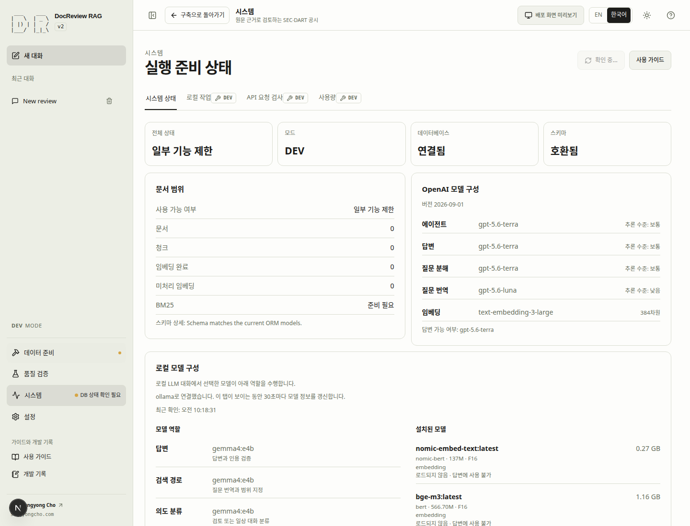
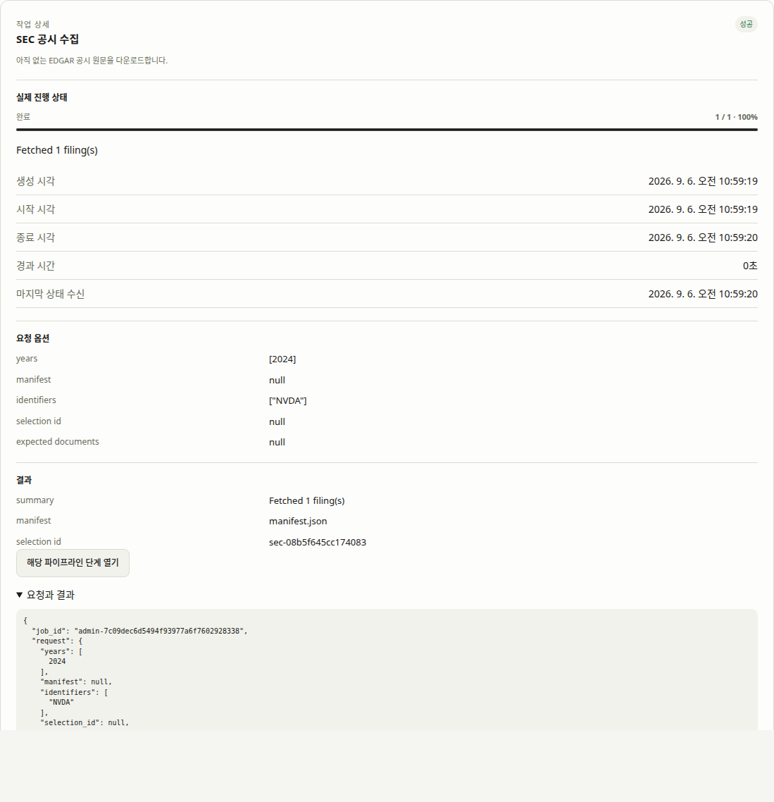
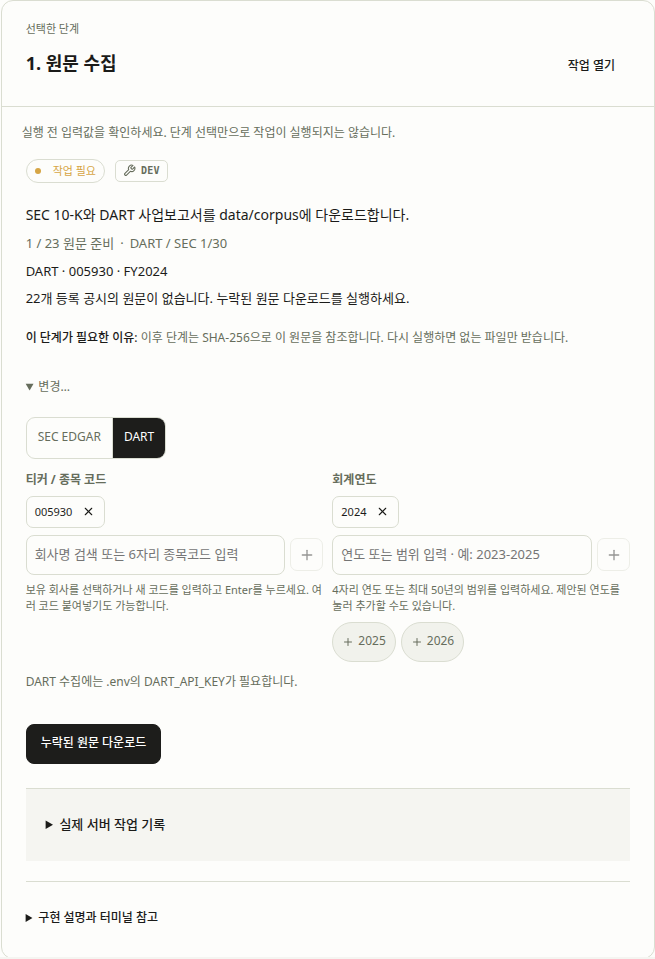
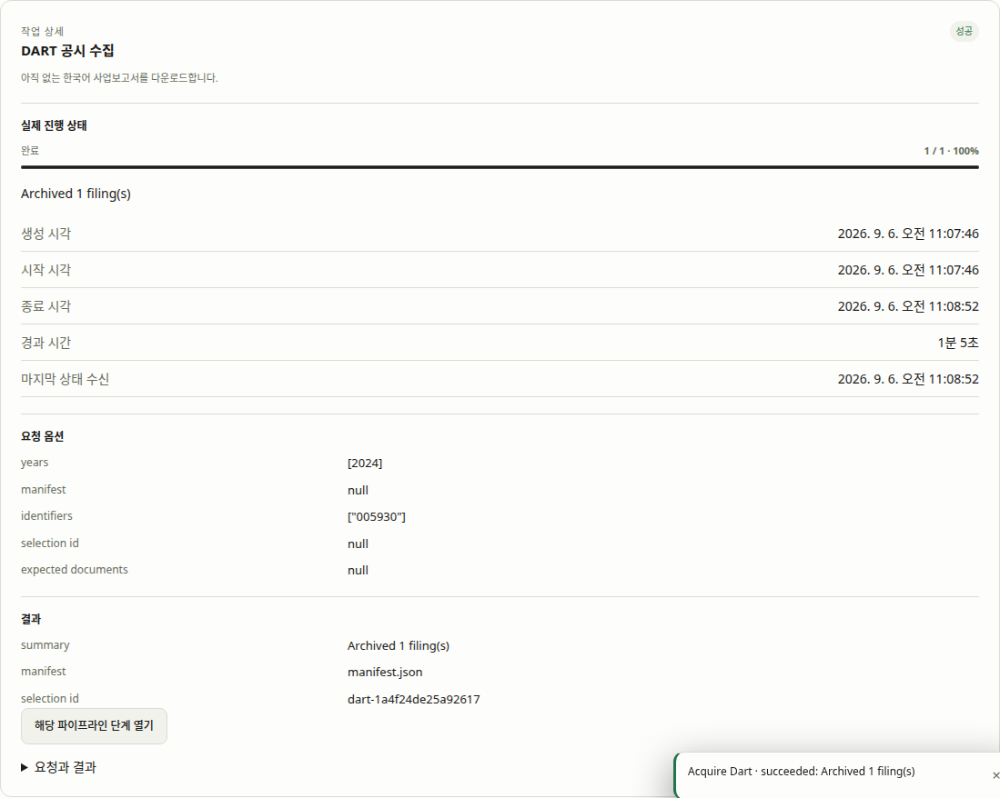
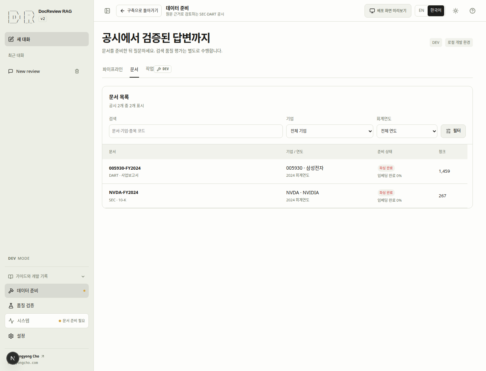
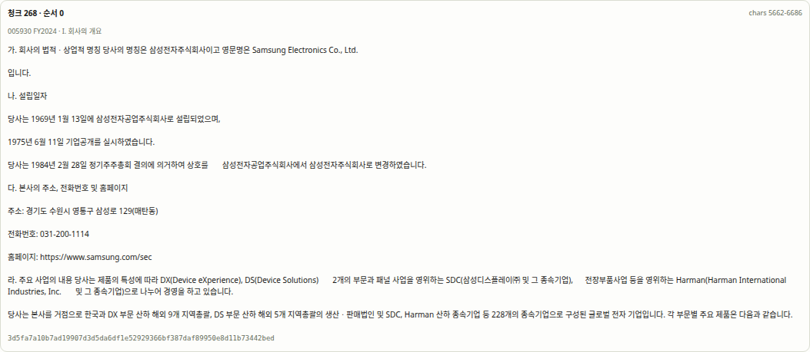
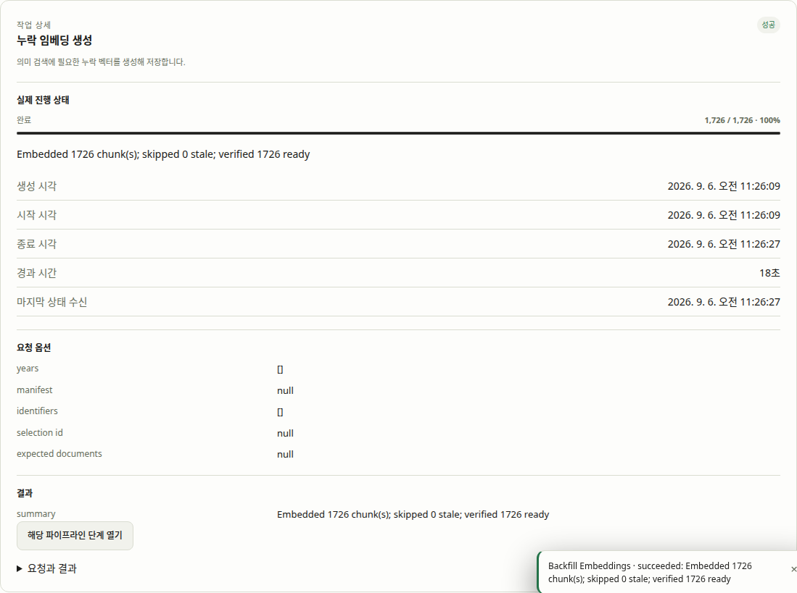
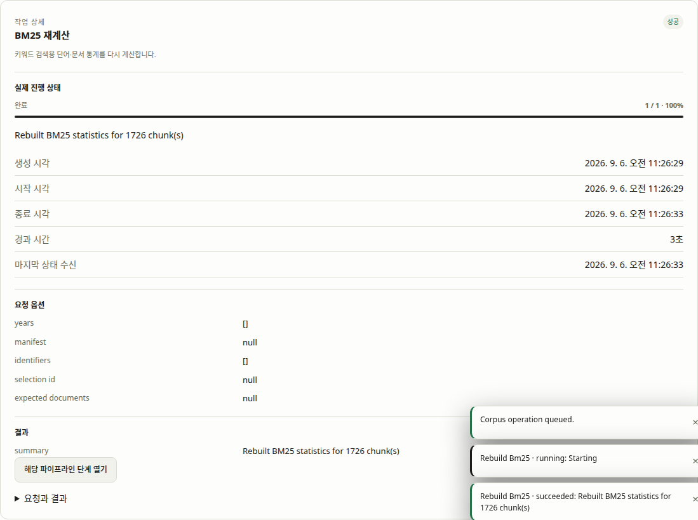
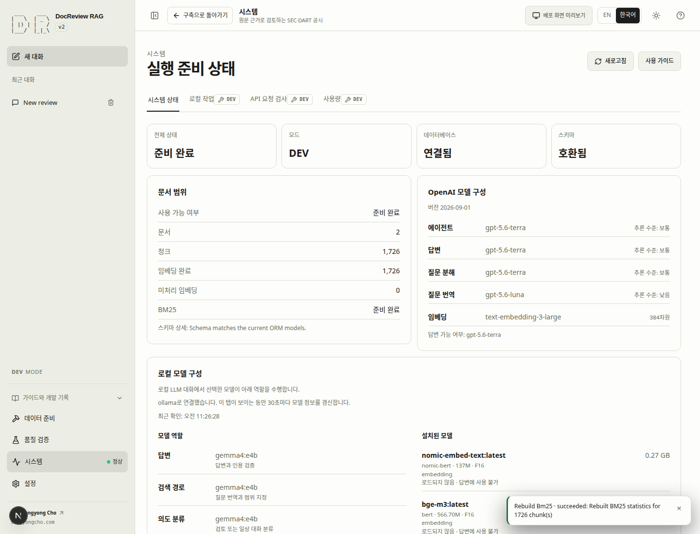
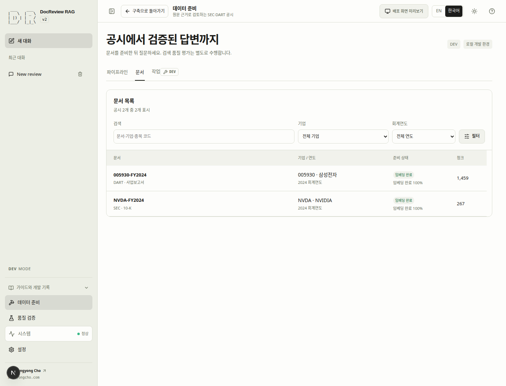

# Quick Start

새 clone에서 첫 검색을 준비합니다. SEC/DART 원문, DB 데이터, 청크, 임베딩, 개인 설정은
없는 상태에서 시작합니다. Git에 있는 manifest와 파싱 프로필은 자료 목록과 처리 규칙이며,
manifest에 항목이 있다고 원문까지 내려받은 것은 아닙니다.

## 공통 준비 {#qs-setup}

Bash 또는 Zsh, uv, Docker Engine·Compose 2.24.4+를 준비하세요.
웹의 Node/npm은 컨테이너에서 실행되므로 이 경로에서는 호스트에 별도로 설치하지 않습니다.

```bash
git clone https://github.com/sungyongcho/docreview-rag-agent.git
cd docreview-rag-agent
source ./rag-alias.sh
rag-help
rag-quickstart
```

source 한 번으로 설치와 현재 셸 활성화를 진행합니다. Y는 자동 등록을 저장하고 N은 이번 셸만 불러옵니다. 같은 터미널에서 바로 명령을 사용할 수 있으며 이후 변경은 `rag-alias update`로 반영합니다.

Helper는 저장소에 포함됩니다. `source`는 현재 터미널에 등록하며,
선택적인 [영구 등록 방법](cli.md)은 명령 안내를 참고하세요.
첫 실행은 `.env`가 없을 때만 생성합니다. 파일을 로컬에서 편집하고 `rag-quickstart`를 다시 실행하세요.

```dotenv
SEC_USER_AGENT=Your Real Name your-real-contact@example.org
DART_API_KEY=<your-own-dart-key>
OPENAI_API_KEY_LOCAL=<your-own-openai-development-key>
EMBEDDING_PROVIDER=openai
EMBEDDING_MODEL=text-embedding-3-large
```

예제 값을 실제 연락처·키로 바꾸세요. DEV는 `OPENAI_API_KEY_LOCAL`,
운영은 `OPENAI_API_KEY_PROD`만 읽습니다. 키를 문서 입력란에 넣거나 화면에 캡처하지 마세요.
저장소의 임베딩 차원은 384입니다. deterministic 임베딩은 이 실습의 완료 기준이 아닙니다.
SEC 연락처와 DART 키는 원문 수집에 필요하고, 임베딩 생성에는 OpenAI 비용이 발생합니다.
첫 실행 명령 자체는 수집·임베딩·답변 요청을 하지 않습니다.

빈 DB에만 스키마를 생성하고 기존 정상 DB는 보존합니다. 스키마가 맞지 않으면 자동 초기화하지
않고 원인을 안내합니다. 설정·도구 누락을 해결한 뒤 같은 명령을 재실행하세요.
설치 문제를 고치려고 `rag-fresh-start`를 실행하지 마세요.
표시된 주소(기본 `http://localhost:8000/docreview-rag-agent/`)를 엽니다.

**서비스 준비와 데이터 준비는 별개입니다.** 아래 두 방식은 동일한 일곱 단계를 수행합니다.
하나를 골라 따라 하세요. 탭 전환은 작업을 실행하지 않습니다. 공개 사이트에서 문서를 읽어도
실제 Web 실습은 자신이 실행한 DEV 환경에서 진행합니다.

설정 명령은 사전 요구사항 → 로컬 설정 → 프로젝트 서비스 상태·시작 → 스키마 준비 → DEV 서버 준비 확인의 다섯 단계를 표시합니다. `db`, `app`, `web` 각각의 중지·시작 중·비정상·실행 상태를 구분합니다. 헬스 체크가 없는 컨테이너가 실행 중이라는 사실만으로 서버 준비 완료를 선언하지 않습니다. 이미 정상 실행 중인 서비스도 Compose가 개발 설정을 적용하기 전에 표시합니다.

설정에서 중단되면 출력된 `.env` 경로를 로컬에서 편집하고 충돌하는 셸 환경변수를 수정하거나 해제한 뒤 `rag-quickstart` 또는 `bash scripts/stack/quickstart.sh`를 다시 실행하세요. 해당 실행은 서비스를 시작하지 않았으며 기존 서비스는 그대로 유지됩니다. 시작 실패는 `rag-dev ps -a`와 `rag-dev logs --tail 50`으로 확인하고 재시도하세요.

스키마가 호환되지 않으면 `.venv/bin/python -m scripts.schema check`로 진단하세요. Quickstart는 외부 `DATABASE_URL`이 아니라 로컬 `DB_PORT`를 사용합니다. 안전한 대상 선택 복구는 [#25](https://github.com/sungyongcho/docreview-rag-agent/issues/25)에서 다룹니다. 이 중단을 해결하려고 데이터베이스를 초기화하지 마세요.

준비 확인이 성공하면 출력된 앱 또는 언어별 튜토리얼 URL을 여세요. 아래 CLI/Web 중 하나를 선택하고 1단계부터 시작한 다음 두 보고서를 수집하세요.

<!-- quickstart-cli -->

## CLI {#qs-cli}

### 1. 빈 환경 확인 {#qs-cli-1}

clone한 저장소에서 실행합니다. 실행 확인에 응답하고 각 작업이 성공한 뒤 다음 명령으로 넘어가세요.

```bash
rag-corpus inspect
rag-corpus readiness
```

**완료 기준:** API 응답·DB 연결·호환 스키마·쓰기 권한이 확인됩니다. 실제 빈 실습 DB는 문서와 청크가 0개입니다.

**막혔다면:** Jobs 또는 `rag-corpus status`에서 실제 오류를 확인하세요. 인증·누락 원문·provider 설정을 고친 뒤 다시 실행합니다. [문제 해결](troubleshooting.md)을 참고하세요.

### 2. NVIDIA SEC FY2024 다운로드 {#qs-cli-2}

clone한 저장소에서 실행합니다. 실행 확인에 응답하고 각 작업이 성공한 뒤 다음 명령으로 넘어가세요.

```bash
rag-corpus acquire_edgar --identifier NVDA --year 2024
rag-corpus status
```

**완료 기준:** NVIDIA FY2024 보고서 1개가 준비되고 작업 결과에 `manifest.json`과 선택 ID `sec-08b5f645cc174083`가 표시됩니다. 이 선택은 해당 보고서 하나를 가리킵니다.

**막혔다면:** Jobs 또는 `rag-corpus status`에서 실제 오류를 확인하세요. 인증·누락 원문·provider 설정을 고친 뒤 다시 실행합니다. [문제 해결](troubleshooting.md)을 참고하세요.

### 3. 삼성전자 DART FY2024 다운로드 {#qs-cli-3}

clone한 저장소에서 실행합니다. 실행 확인에 응답하고 각 작업이 성공한 뒤 다음 명령으로 넘어가세요.

```bash
rag-corpus acquire_dart --identifier 005930 --year 2024
rag-corpus status
```

**완료 기준:** 삼성전자 FY2024 보고서 1개가 준비되고 `manifest.json`과 선택 ID `dart-1a4f24de25a92617`가 표시됩니다. 회계연도 2024의 사업보고서는 보통 2025년에 제출됩니다.

**막혔다면:** Jobs 또는 `rag-corpus status`에서 실제 오류를 확인하세요. 인증·누락 원문·provider 설정을 고친 뒤 다시 실행합니다. [문제 해결](troubleshooting.md)을 참고하세요.

### 4. 두 보고서 파싱·청킹·저장 {#qs-cli-4}

clone한 저장소에서 실행합니다. 실행 확인에 응답하고 각 작업이 성공한 뒤 다음 명령으로 넘어가세요.

```bash
rag-corpus inspect
rag-corpus ingest_manifest --manifest manifest.json --selection sec-08b5f645cc174083 --expected-documents 1
rag-corpus status
rag-corpus ingest_manifest --manifest manifest.json --selection dart-1a4f24de25a92617 --expected-documents 1
rag-corpus status
```

**완료 기준:** 두 선택 범위의 수집 작업이 모두 성공하고 두 보고서에 청크가 생깁니다. 청크 수를 고정된 예제 숫자에 맞추지 말고 실제 청크와 원문 식별 정보를 확인하세요.

**막혔다면:** Jobs 또는 `rag-corpus status`에서 실제 오류를 확인하세요. 인증·누락 원문·provider 설정을 고친 뒤 다시 실행합니다. [문제 해결](troubleshooting.md)을 참고하세요.

### 5. OpenAI 임베딩 생성 {#qs-cli-5}

clone한 저장소에서 실행합니다. 실행 확인에 응답하고 각 작업이 성공한 뒤 다음 명령으로 넘어가세요.

```bash
rag-corpus inspect
rag-corpus backfill_embeddings
rag-corpus status
```

**완료 기준:** 작업 성공, pending_embeddings 0, 두 보고서의 임베딩 완료를 확인합니다. 모델은 설정한 OpenAI 모델이어야 하며 차원 수만 같다고 같은 모델인 것은 아닙니다.

**막혔다면:** Jobs 또는 `rag-corpus status`에서 실제 오류를 확인하세요. 인증·누락 원문·provider 설정을 고친 뒤 다시 실행합니다. [문제 해결](troubleshooting.md)을 참고하세요.

### 6. BM25 인덱스 생성 {#qs-cli-6}

clone한 저장소에서 실행합니다. 실행 확인에 응답하고 각 작업이 성공한 뒤 다음 명령으로 넘어가세요.

```bash
rag-corpus rebuild_bm25
rag-corpus status
```

**완료 기준:** 작업 성공·진행률 완료·bm25_ready true를 확인합니다. 다운로드나 임베딩 성공만으로 BM25 준비가 끝나지는 않습니다.

**막혔다면:** Jobs 또는 `rag-corpus status`에서 실제 오류를 확인하세요. 인증·누락 원문·provider 설정을 고친 뒤 다시 실행합니다. [문제 해결](troubleshooting.md)을 참고하세요.

### 7. 질문 전 준비 완료 확인 {#qs-cli-7}

clone한 저장소에서 실행합니다. 실행 확인에 응답하고 각 작업이 성공한 뒤 다음 명령으로 넘어가세요.

```bash
rag-corpus inspect
rag-corpus readiness
```

**완료 기준:** 데이터·검색 인덱스 준비가 완료됐습니다. 모델 설정을 확인했지만 답변 호출·답변 품질은 아직 검증하지 않은 상태입니다.

**막혔다면:** Jobs 또는 `rag-corpus status`에서 실제 오류를 확인하세요. 인증·누락 원문·provider 설정을 고친 뒤 다시 실행합니다. [문제 해결](troubleshooting.md)을 참고하세요.

<!-- quickstart-web -->

## Web {#qs-web}

### 1. 빈 환경 확인 {#qs-web-1}

**System → System status**에서 **새로고침**을 누릅니다. DEV, DB 연결, 호환 스키마, OpenAI 임베딩 설정을 확인하세요. 처음에는 문서·청크가 없는 것이 정상입니다.

<!-- capture:quickstart-01-ko -->



*호환 스키마와 문서·청크 0개를 확인한 새 DEV 환경.*

**완료 기준:** API 응답·DB 연결·호환 스키마·쓰기 권한이 확인됩니다. 실제 빈 실습 DB는 문서와 청크가 0개입니다.

**막혔다면:** Jobs 또는 `rag-corpus status`에서 실제 오류를 확인하세요. 인증·누락 원문·provider 설정을 고친 뒤 다시 실행합니다. [문제 해결](troubleshooting.md)을 참고하세요.

### 2. NVIDIA SEC FY2024 다운로드 {#qs-web-2}

**데이터 준비 → 파이프라인 → 원문 수집 → 변경…**에서 **SEC EDGAR**를 선택합니다. 회사는 `NVDA`, 회계연도는 `2024`만 남기고 **누락된 원문 다운로드**를 누릅니다. **Build → Jobs**에서 성공할 때까지 기다리세요.

<!-- capture:quickstart-02-ko -->



*실제 NVDA FY2024 수집이 성공하고 원문 선택이 기록된 상태.*

**완료 기준:** NVIDIA FY2024 보고서 1개가 준비되고 작업 결과에 `manifest.json`과 선택 ID `sec-08b5f645cc174083`가 표시됩니다. 이 선택은 해당 보고서 하나를 가리킵니다.

**막혔다면:** Jobs 또는 `rag-corpus status`에서 실제 오류를 확인하세요. 인증·누락 원문·provider 설정을 고친 뒤 다시 실행합니다. [문제 해결](troubleshooting.md)을 참고하세요.

### 3. 삼성전자 DART FY2024 다운로드 {#qs-web-3}

**Filings → 변경…**로 돌아가 **DART**, `005930`, `2024`를 선택하고 **누락된 원문 다운로드**를 누릅니다. **Jobs**에서 DART 작업의 성공을 확인하세요.

DART는 먼저 기업 고유번호 목록을 내려받습니다. 이 API는 응답이 느릴 수 있습니다. Jobs의 바이트 진행량을 확인하고, 실행 중에는 다운로드를 중복 제출하지 마세요.

<!-- capture:quickstart-03-ko -->



*다운로드 전에 삼성전자 005930과 회계연도 2024를 선택한 상태.*



*삼성전자 FY2024 수집이 성공하고 원문 선택이 기록된 상태.*

**완료 기준:** 삼성전자 FY2024 보고서 1개가 준비되고 `manifest.json`과 선택 ID `dart-1a4f24de25a92617`가 표시됩니다. 회계연도 2024의 사업보고서는 보통 2025년에 제출됩니다.

**막혔다면:** Jobs 또는 `rag-corpus status`에서 실제 오류를 확인하세요. 인증·누락 원문·provider 설정을 고친 뒤 다시 실행합니다. [문제 해결](troubleshooting.md)을 참고하세요.

### 4. 두 보고서 파싱·청킹·저장 {#qs-web-4}

다운로드가 완료되면 준비 상태가 자동으로 갱신됩니다. 파싱·인덱싱 단계에서 `manifest.json`의 NVIDIA 선택 `sec-08b5f645cc174083`와 삼성전자 선택 `dart-1a4f24de25a92617`를 확인합니다. 각 선택에 보고서 한 개와 원문 한 개가 준비됐는지 확인하고, 선택별 수집 작업을 하나씩 실행합니다. 앞 작업이 성공한 뒤 다음 작업을 시작합니다.

공통 목록에는 다른 보고서도 있을 수 있습니다. 이 실습의 완료 여부는 선택한 보고서와 원문 수를 기준으로 확인합니다.

<!-- capture:quickstart-04-ko -->



*두 보고서의 파싱과 청킹이 완료됐으며 임베딩은 아직 실행하지 않은 상태.*



*삼성전자 원문 청크의 실제 텍스트·문자 오프셋·SHA-256을 확인한 화면.*

**완료 기준:** 두 선택 범위의 수집 작업이 모두 성공하고 두 보고서에 청크가 생깁니다. 청크 수를 고정된 예제 숫자에 맞추지 말고 실제 청크와 원문 식별 정보를 확인하세요.

**막혔다면:** Jobs 또는 `rag-corpus status`에서 실제 오류를 확인하세요. 인증·누락 원문·provider 설정을 고친 뒤 다시 실행합니다. [문제 해결](troubleshooting.md)을 참고하세요.

### 5. OpenAI 임베딩 생성 {#qs-web-5}

**임베딩** 단계를 선택하고 OpenAI provider와 대기 청크 수를 확인합니다. 비용 안내를 확인한 뒤 임베딩 작업을 실행하고 **Jobs**에서 성공을 기다립니다. 이 작업은 DB 전체의 대기 청크를 처리합니다.

<!-- capture:quickstart-05-ko -->



**완료 기준:** 작업 성공, pending_embeddings 0, 두 보고서의 임베딩 완료를 확인합니다. 모델은 설정한 OpenAI 모델이어야 하며 차원 수만 같다고 같은 모델인 것은 아닙니다.

**막혔다면:** Jobs 또는 `rag-corpus status`에서 실제 오류를 확인하세요. 인증·누락 원문·provider 설정을 고친 뒤 다시 실행합니다. [문제 해결](troubleshooting.md)을 참고하세요.

### 6. BM25 인덱스 생성 {#qs-web-6}

**BM25** 단계를 선택하고 재구축 작업을 실행합니다. **Jobs**에서 성공을 확인하세요. 파싱된 텍스트를 검색 가능하게 만드는 단계이며 답변은 생성하지 않습니다.

<!-- capture:quickstart-06-ko -->



*두 보고서에서 파싱된 전체 청크에 대한 BM25 재구축이 성공한 상태. 임베딩 생성과 독립적인 인덱스입니다.*

**완료 기준:** 작업 성공·진행률 완료·bm25_ready true를 확인합니다. 다운로드나 임베딩 성공만으로 BM25 준비가 끝나지는 않습니다.

**막혔다면:** Jobs 또는 `rag-corpus status`에서 실제 오류를 확인하세요. 인증·누락 원문·provider 설정을 고친 뒤 다시 실행합니다. [문제 해결](troubleshooting.md)을 참고하세요.

### 7. 질문 전 준비 완료 확인 {#qs-web-7}

**System status**와 **Build → Documents**에서 두 보고서의 청크·임베딩 완료·BM25 준비 상태를 확인합니다. OpenAI 답변 엔진이 설정됐는지 확인하되 아직 질문을 보내지 마세요.

<!-- capture:quickstart-07-ko -->





**완료 기준:** 데이터·검색 인덱스 준비가 완료됐습니다. 모델 설정을 확인했지만 답변 호출·답변 품질은 아직 검증하지 않은 상태입니다.

**막혔다면:** Jobs 또는 `rag-corpus status`에서 실제 오류를 확인하세요. 인증·누락 원문·provider 설정을 고친 뒤 다시 실행합니다. [문제 해결](troubleshooting.md)을 참고하세요.

<!-- quickstart-end -->

## 다음 튜토리얼로 {#qs-next}

[다음: 검색 테스트와 근거 확인](retrieval.md#step-8)

Quick Start에서는 질문·답변을 실행하지 않았습니다. 다음 문서에서 검색 근거를 확인한 뒤 [첫 답변](answers.md#step-9)으로 이어집니다.
