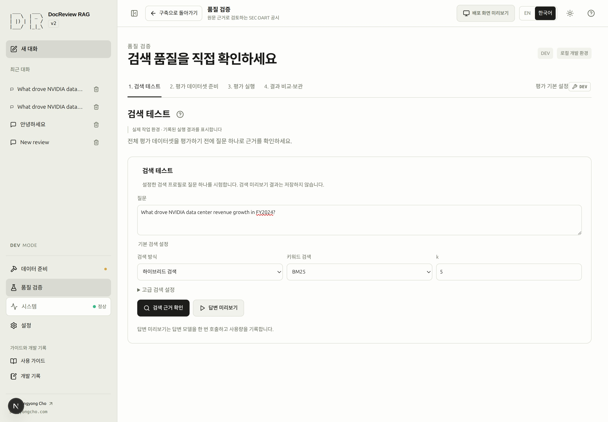
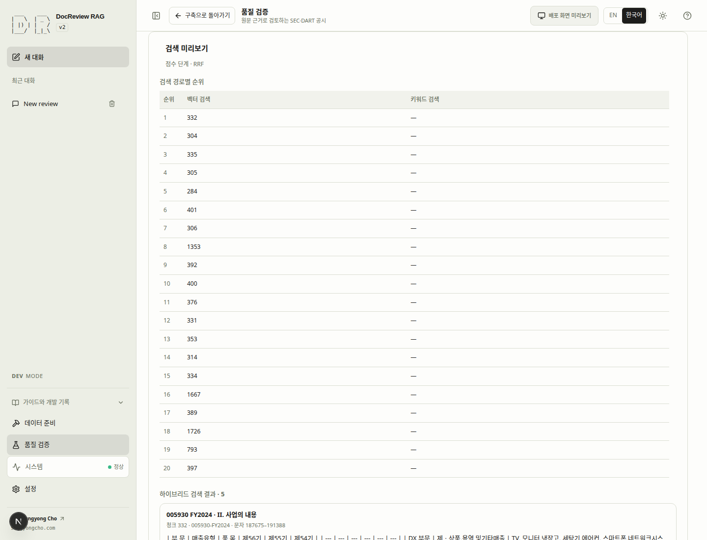

# 답변 전에 검색 근거 확인하기

검색은 후보 구절·순위·문서 식별 정보를 반환합니다. 검색됐다는 사실만으로 답변이 옳아지는 것은
아닙니다. 검색 설정을 판단하기 전에 유망한 구절을 보고서 원문과 함께 읽으세요.

## 8. 검색 테스트와 원문 확인 {#step-8}

> [!DEV]
> 검색 시험은 공개 화면에서도 공개 `/retrieve` 엔드포인트를 통해 서버 상한(`k` ≤ 10, `candidate_k` ≤ 50, `max_context_chars` ≤ 12000) 안의 사용자 검색 설정으로 실행됩니다. 답변 미리보기는 개발 모드 전용이며 일반 공개 대화 요청에는 별도의 운영 정책이 적용됩니다.

- **목표:** 준비된 인덱스에서 구체적인 질문에 필요한 근거를 찾는지 확인합니다.
- **선행 조건:** 보고서에 청크가 있고 선택한 검색 경로가 준비돼 있습니다.
  필요하면 [인덱스 준비](indexing.md)를 먼저 마칩니다.
- **화면 경로:** 품질 검증 → 검색 테스트.
- **입력:** 아래 질문을 넣고 처음에는 Hybrid, BM25, `k=5`, 리랭커 없음을 선택합니다.
- **주 동작:** **검색 근거 확인**.
- **화면 변화:** 처음의 전체 너비 입력 영역에 실행 후 실제 결과가 나타납니다.
  경로별 순위·문서 ID·구절·최종 순위로 어떤 근거가 선택됐는지 확인합니다.
- **완료 기준:** 관련 구절과 원문을 읽고 기업·회계연도가 맞으며 실제로 질문에 답하는 내용인지 확인했습니다.
  높은 점수만으로는 충분하지 않습니다.
- **실패와 복구:** 결과가 없거나 무관하면 문서 준비 상태와 범위를 먼저 확인합니다.
  [검색 문제 해결](troubleshooting.md)과 [설정 안내](settings.md)를 읽고 질문이나 검색 설정을 조정하세요.
- **다음:** [첫 질문](answers.md#step-9), 또는 바로 [검색 평가](evaluation.md#step-11)로 이동합니다.

```text
What drove NVIDIA data center revenue growth in fiscal 2024?
```

코퍼스 임베딩이 준비돼 있어도 OpenAI 질문 임베딩에는 비용이 발생할 수 있습니다.
**답변 미리보기**는 모델 사용량과 실행 기록을 남기는 별도 답변 동작입니다. 검색 결과를 보기 위해
누를 필요는 없습니다. 검색 미리보기는 평가 결과를 저장하거나 대화의 검색 설정을 바꾸지 않습니다.

<!-- capture:09-retrieval-inputs -->



*NVIDIA FY2024 질문과 Hybrid·BM25·k=5를 지정한 검색 시험의 실행 전 화면입니다. 검색과 답변 미리보기는 각각 명시적으로 실행합니다.*


예시: `삼성전자 2024년 매출`을 검색하면 준비된 코퍼스에서 삼성전자 FY2024 근거 다섯 개를 확인할 수 있습니다. 결과에는 원문 오프셋과 SHA-256이 유지됩니다. 검색만 실행하며 답변을 생성하지 않습니다.



## 순위 정보 읽기 {#rankings}

| 확인할 정보 | 읽는 방법 |
|---|---|
| 문서와 회계연도 | 의도한 보고서인지 확인하고 회계연도와 달력 연도를 구분합니다. |
| 구절과 원문 | 앞뒤 문맥에서 수치와 조건을 확인합니다. |
| 경로별 순위 | 설정된 검색 경로 중 어디에서 해당 구절을 찾았는지 봅니다. |
| 최종 순위 | 서로 다른 경로의 원점수를 직접 비교하기보다 융합·재정렬 결과를 읽습니다. |
| 결과 없음 | 범위·인덱스·실제 원문을 확인합니다. 없는 결과에서 지표를 만들지 않습니다. |

CLI에는 `--doc-id`로 문서를 한정하는 기능이 있지만 검색 테스트 화면에는 같은 입력이 없습니다.
범위와 DB의 다른 문서가 다르면 순위도 달라질 수 있습니다. 터미널에서 범위를 좁혀 확인하려면
[임베딩·검색 명령](cli.md#embedding과-검색)을 참고하세요.

반복적인 품질 측정은 [평가](evaluation.md)에서 수행합니다. 검색 테스트는 질문 하나를 탐색하는
요청이고, 평가는 정답 원문이 지정된 데이터셋 전체를 대상으로 검색 품질을 측정합니다.
