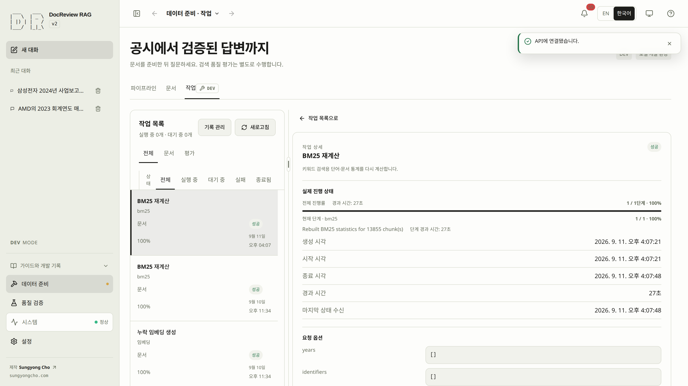
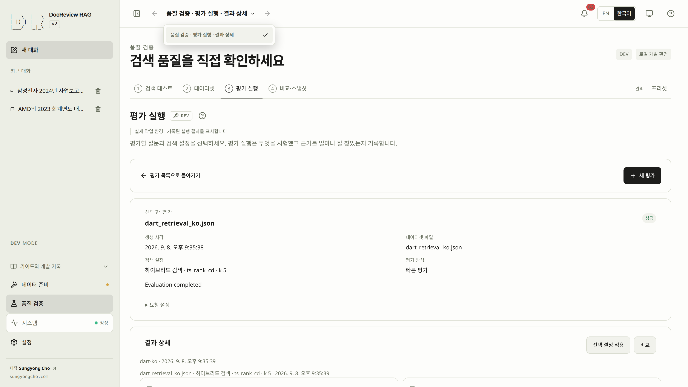
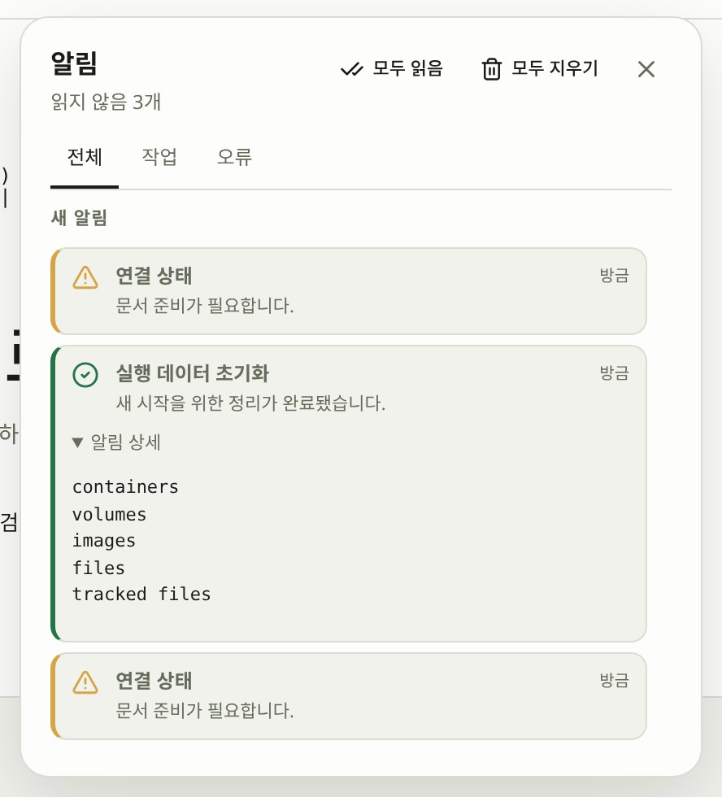

# 실행 상태와 측정값 읽기

**시스템 → 시스템 상태**는 서비스 선행 조건을, **데이터 준비 → 작업**은 백그라운드 작업을, 대화의 **실행 요약·실행 성능·실행 트레이스**는 개별 검토를 설명합니다. API 정상만으로 벡터 준비·답변 모델 동작·평가 성공까지 확인되는 것은 아닙니다.

## 상태와 작업의 흐름 {#states}

> [!DEV]
> 코퍼스·평가 작업의 시작·취소·재시도는 개발 모드 전용입니다. 공개 검토 결과를 읽는 동작과 관리자 작업을 구분합니다.

| 상태 | 의미와 다음 동작 |
|---|---|
| `queued` | 접수되어 기다리는 상태입니다. 대기 순서와 요청 범위를 확인합니다. |
| `running` | 실제 작업 중입니다. 진행을 읽고 지원되는 경우에만 취소합니다. |
| `succeeded` | 작업이 성공했습니다. 문서·인덱스·평가 결과 등 실제 산출물도 확인합니다. |
| `failed` | 실행에 실패했습니다. 오류와 이미 완료된 범위를 읽은 뒤 재시도합니다. |
| `cancelled` | 취소로 끝났습니다. 실패와 구분하며 자동 재시도 동작이 없습니다. |
| `interrupted` | 애플리케이션 재시작으로 잘렸습니다. 자동으로 이어받지 않습니다. |

서버가 지원하는 실패·중단 작업에는 **새 작업으로 재시도**가 표시됩니다. 재시도는 새 작업을 만들며 이전에 처리한 부분이 모두 생략된다고 보장하지 않습니다. 특히 임베딩 비용이 발생하기 전에 범위를 확인하세요. 같은 DB를 대상으로 직접 실행한 CLI 작업은 문서 상태에 반영되지만 웹 작업 기록이 없을 수 있습니다.

선택한 과거 작업은 실제 대상·진행·결과를 보여 주며 안내를 위해 새로 실행한 작업이 아닙니다.

<!-- details: status-visuals | 상태 색상과 동작 읽기 -->
초록 완료 표시는 확인된 준비·완료 상태에 사용합니다. 맥박 효과나 회전 표시는 실제 실행, 빨강은 실패, 노랑은 부족한 선행 조건, 중립 표시는 미확인·미수집 상태입니다. 동작 줄이기 설정에서는 반복 애니메이션을 멈추고 상태 글자는 유지합니다.
<!-- /details -->

<!-- screenshot: jobs-status-and-retry -->



## 실행 요약과 실제 시간 {#timings}

완료되거나 실패한 답변의 **실행 요약**에서 실제로 도달한 단계를 확인합니다. Auto에서는 사용자가 고른 Auto를 유지하면서 서버가 반환한 registry·회사·연도·판단 이유를 따로 표시합니다. 라우팅이 확정되기 전에는 대기 상태이며 브라우저가 질문만 보고 결정을 확정하지 않습니다.

답변의 **실행 상세 → 성능**을 엽니다. **실행 성능**은 브라우저가 측정한 요청 시간과 서버 실행 시간을 나눕니다. ASCII 막대는 해당 결과에서 가장 오래 걸린 측정 단계에 상대적인 길이입니다. 경과 시간의 비교이며 진행률이나 완료 예상 시간이 아닙니다. 반복 단계와 재시도를 포함해 단계·모델 호출을 기록된 순서대로 보여 줍니다.

| 측정값 | 해석 |
|---|---|
| 미수집 | 사용할 측정값이 없습니다. 0이나 한 번 시도한 것으로 해석하지 않습니다. |
| `0ms` | 측정된 0의 시간입니다. |
| `<1ms` | 0보다 크고 1밀리초보다 짧은 시간입니다. |
| 호출 / 시도 | 수집된 호출 수와 제공자 시도 수입니다. 재시도로 서로 다를 수 있고, 시작 전에 거절된 호출은 시도 0으로 셉니다. |
| 로딩·입력 처리·생성 | 로컬 제공자가 반환했을 때 각각의 시간이 표시됩니다. |
| 초당 토큰 | 생성 토큰 수와 생성 시간이 모두 있을 때만 계산합니다. |

막대 옆의 접근 가능한 표에서 정확한 값을 확인합니다. 주변 설명을 번역해도 원래 노드 ID·모델 이름·로그는 유지됩니다. 저장된 실행은 원래 ID, 반복·제공자 요청 횟수, 토큰 수, 경과 시간을 기록합니다.

<!-- details: missing-telemetry | 미수집·누락 측정값 -->
실제 근거가 없는 CPU/GPU 배치는 미수집 상태입니다. 시간이 길다는 사실만으로 하드웨어 병목을 단정할 수 없습니다. 실패한 요청은 브라우저 요청 시간만 수집하고 라우팅·단계 시간·모델 호출은 미수집으로 명시될 수 있습니다. 과거 저장 결과에 측정 정보가 없다고 반드시 손상된 기록은 아닙니다.
<!-- /details -->

<!-- screenshot: execution-performance-and-run-trace -->



## 실행 한도와 제공자 한도 구분 {#limits}

> [!DEV]
> 실행 예산 변경은 개발 모드 전용입니다. 접근 가능한 결과의 실패 필드와 수집된 시간은 계속 읽을 수 있습니다.

기본 대화 예산은 반복 6회·입력 60,000토큰·출력 4,000토큰·**실제 경과 시간 120초**입니다. 모델 호출과 재시도 전체에 누적됩니다. 기존 대화는 다른 값을 저장할 수 있으므로 제출한 프로필을 확인하세요.

실패 필드로 수정 위치를 구분합니다.

- `budget_exceeded`: `resource`, `limit`, `observed`, `blocked_node`를 읽습니다.
- `provider_failure`: `status`, `attempts`, `details`, `node`를 읽습니다. `budget`에 `projected_input_tokens`가 있으면 추정한 프롬프트가 남은 입력 허용량에 맞지 않아 호출을 시작하기 전에 거절한 것입니다. 아무것도 전송하지 않았으므로 기록에는 추정치만 남고 요청 수와 사용량은 0입니다. 첫 응답 뒤의 복구 프롬프트가 거절된 경우에는 그 1건만 요청으로 남습니다. **대화 설정 → 근거**의 최대 컨텍스트를 낮추거나 `budget_source`가 가리키는 입력 한도를 올리세요.
- `node_error`: `error_type`, `message`, `node`를 읽습니다.

실행 예산은 **대화 설정 → 실행 한도**에서 조정합니다. 프롬프트·근거 크기는 **대화 설정 → 근거**에 있으며 별도 설정입니다. 제공자 시간 초과나 인증 오류는 실행 토큰 한도를 높여 해결하지 않습니다. OpenAI 호출 한 번에는 [OpenAI 호출당 캡](settings.md#openai-call-caps)의 서버 상한이 따로 적용되며, 실행 한도와 그 캡 중 작은 값이 쓰입니다. 공개 요청 속도·금액 한도도 다른 경계이며 시스템의 한도 화면에 표시됩니다. [실행 문제 해결](troubleshooting.md#execution)을 참고하세요.

<!-- details: trace-api | 트레이스와 API 조회 -->
**실행 상세 → 트레이스**에서 기록된 run ID와 실패 필드를 확인합니다. API 조회는 `GET /runs/{run_id}`, `GET /runs/{run_id}/traces`이며 실행 목록 route는 없습니다. 선택적 스트림 단계 측정은 `X-DocReview-Telemetry: stages` 헤더를 사용합니다. 헤더 없는 기존 클라이언트는 기본 이벤트 계약을 유지합니다.
<!-- /details -->

## 로컬 모델에서 확인할 사실 {#local-models}

> [!DEV]
> 로컬 서버 구성과 모델 선택 조작은 개발 모드 전용입니다. 공개 요청은 운영 설정을 사용하며 로컬 서버 제어를 노출하지 않습니다.

**시스템 → 시스템 상태**는 역할별 설정과 설치 모델을 구분합니다. **로컬 모델 구성**과 **로컬 실행 환경** 패널은 개발 모드에서만 존재하므로 **DEV** 배지가 붙습니다. **설정 → 로컬 LLM**에는 **Default**, 저장된 서버, **서버 추가…**가 있습니다. **연결 진단 실행**으로 후보를 확인하고 명시적으로 연결한 뒤, 대화에서 답변 엔진과 검색된 모델을 선택합니다. 연결 저장만으로 엔진이 자동 전환되지는 않습니다.

새 주소 검색이나 저장에 실패하면 기존에 동작하던 연결을 보존합니다. 표시된 주소·모델 기능 오류를 해결한 뒤 다시 시도하세요. 상태 요청에 답하는 서버도 실제 생성에는 실패할 수 있습니다. 답변 엔진을 바꿔도 corpus에 저장된 임베딩 식별자가 대체되지는 않습니다.

설치·로드·답변 가능 여부는 서로 다른 사실입니다. 설치된 모델이 로드되지 않은 상태는 정상 대기일 수 있으며, 목록을 확인하지 못한 경우는 0개가 아니라 미확인입니다. DocReview는 서버가 반환한 메타데이터만 표시하고 최대·로드 컨텍스트를 수집하거나 모델명으로 실행 하드웨어를 추정하지 않습니다. 개별 모델 확인은 [Ollama 안내](ollama.md#models)를 참고하세요. 읽기 전용 연결 진단은 `rag-dev doctor`, 옵션 정의는 [CLI 참고](cli.md#로컬-모델-연결-진단)에 있습니다.

## 로컬 작업 {#operations}

> [!DEV]
> 로컬 작업 탭은 `rag-dev`로 시작한 로컬 오퍼레이터가 이 빌드에 설정된 경우에만 나타납니다. 방문자에게는 보이지 않습니다.

**시스템 → 로컬 작업**은 등록된 로컬 명령을 유형별로 묶은 카드로 보여 줍니다. **점검**은 상태를 읽고(Git status), **검증**은 파일을 바꾸지 않는 lint·테스트·타입 검사·프로덕션 빌드를 실행하며, **서비스**는 PostgreSQL과 앱을 시작·중지하거나 빈 스키마를 준비합니다. 그룹 안에서는 읽기 전용 명령이 먼저, 확인을 요구하는 명령이 마지막에 오고 각 헤더에 **확인 필요** 배지가 붙습니다. 카드 위의 **전체 · 점검 · 검증 · 서비스** 필터로 보기를 좁힐 수 있으며 선택은 브라우저별로 기억됩니다. **실행**은 한 번에 한 명령만 시작하고, **최근 실행**이 출력을 보여 주며 실행 중에는 **취소**를 제공합니다.

**명령 대상** 필터로 각 유형 안에서 **Python**, **웹**, **데이터베이스**, **앱** 대상을 좁힙니다. **모든 대상**은 전체 대상을 표시하며, 유형 필터와 함께 적용되고 선택은 브라우저에 따로 저장됩니다. 앱은 저장소 상태와 앱 서비스 작업, 데이터베이스는 PostgreSQL 검사와 스키마 작업을 포함합니다. 대상 배지는 명령 registry에서 가져오며 이름으로 추측하지 않습니다. 구버전 오퍼레이터가 대상 필드를 보내지 않으면 **대상 정보 없음**으로 표시합니다. 필터 선택은 명령을 실행하지 않습니다.

## 보존하며 종료하고 다시 시작하기 {#resume}

> [!DEV]
> 아래 명령은 운영자의 로컬 스택을 종료·시작합니다. 방문자는 배포된 앱을 사용하며 서버 서비스를 관리하지 않습니다.

일반 종료는 DB 볼륨과 파일을 보존합니다.

```bash
rag-dev compose down
```

다음에 저장소 루트에서 새 터미널을 열면 다음과 같이 실행합니다.

```bash
source ./rag-alias.sh
rag-dev start
```

이미 실행 중인 서비스는 재사용합니다. 시스템을 새로 고치고 문서·작업을 확인한 다음 저장한 대화로 돌아갑니다. 필요한 결과가 있으면 다운로드·적재·임베딩·평가를 반복하지 않습니다. 중단된 작업은 자동 재개하지 않으므로 상태를 읽고 재시도 여부를 결정하세요.

저장한 대화와 프로필은 해당 브라우저에 남습니다. 페이지 안에서 작업 화면을 옮기면 열린 편집기·선택·스크롤을 보존하지만, 미완성 질문 초안이 새로고침이나 브라우저 데이터 삭제 후에도 남는다는 뜻은 아닙니다. 일반 종료에 [실행 데이터 초기화](troubleshooting.md#reset)는 필요하지 않습니다. **데이터와 도움말**은 브라우저 대화·설정 초기화와 서버 문서·작업 기록을 구분하며, 일반 종료에는 정리나 초기화 작업이 필요하지 않습니다.

DEV 안의 **배포 화면 미리보기**는 [후속 이슈 #211](https://github.com/sungyongcho/docreview-rag/issues/211)로 미뤄 이번 릴리스에서는 제공하지 않습니다. [실행 환경 구분](environment.md#environment-boundaries)을 참고합니다.

<!-- heading-alias: 기록된-공급자-사용량 -->
## 기록된 공급자 사용량 {#provider-usage}

개발 모드의 **시스템 → 사용량**에서 기록된 리뷰 호출과 임베딩 보충 작업을 확인합니다. 공급자·로컬/외부 실행·키 슬롯 이름별 그룹 안에 모델·역할별 요청 수, 토큰, 비용과 소계가 표시됩니다. 키 값은 노출하지 않습니다. 상단 합계는 같은 행의 합이며 최근 리뷰 실행 시각도 유지합니다. 과거 trace는 기록된 API URL로 공급자를 분류하지만 당시 키 슬롯은 현재 설정으로 추측하지 않고 **알 수 없음**으로 표시합니다.

새 리뷰 기록에는 답변·근거 평가·검증뿐 아니라 분류와 라우팅 호출도 포함됩니다. 완전한 호출별 기록을 우선 사용하고, 이전 trace는 누락된 근거를 보완하되 같은 호출을 중복 집계하지 않습니다. OpenAI 임베딩 보충 작업은 API 배치 응답의 실제 토큰과 고정된 단가의 추정 비용을 벡터 검증·저장 전에 기록합니다. 뒤에서 작업이 실패하거나 취소되어도 앞선 사용량은 유지됩니다. CLI의 직접 보충 경로도 보관된 종료 상태 `embedding_usage` 기록을 남깁니다. 이는 사용량 근거이며 실행하거나 재시도할 수 없습니다. 작업 기록 보관은 사용량을 유지하지만 명시적으로 ledger를 삭제하면 해당 사용량 근거도 없어집니다.

로컬 임베딩 토큰은 공급자 보고값이 아닌 토크나이저 추정치로 별도 표시하며 로컬 API 비용은 0입니다. 토큰·비용 근거가 없는 응답은 **미보고** 또는 **불완전한 추정치**로 표시하고 외부 호출을 무료라고 단정하지 않습니다. 알 수 없는 양은 수치 합계에서 제외합니다. 요청 수는 관찰한 SDK 호출 기준이며 SDK 내부 재시도나 backfill 밖의 질의 전용 임베딩을 소급해 복원하지 않습니다. 이 화면은 공급자 청구서가 아니라 로컬 기록이며 열기만 해서는 모델을 호출하지 않습니다.

직접 승인한 임베딩 보충 작업 뒤 이 화면에 다시 들어와 임베딩 모델·공급자·키 슬롯·역할을 확인하세요. 공급자 응답 뒤 저장이 실패하면 기록 완료로 숨기지 않고 작업 실패를 알립니다. 재호출에는 비용이 들 수 있으므로 오류를 먼저 확인하세요. 사용량 메타데이터는 기존 Run request-context와 OperatorJob result JSONB에 저장하므로 스키마 초기화나 새 ORM 열이 필요하지 않습니다.

## 알림 센터 {#notification-center}

상단 바의 언어·테마 선택 옆 종 모양 버튼을 여세요. 배지는 읽지 않은 알림 수입니다. 패널은 **진행 중**(실행 중인 코퍼스 작업), **새 알림**(읽지 않음), 접힌 **지난 알림 · N** 영역으로 나뉘며, 읽음으로 표시한 알림은 흐려지는 대신 지난 알림으로 이동합니다. 최근 알림 100개가 이 브라우저에 남으며, 패널을 닫거나 토스트 표시 시간이 끝나도 삭제되지 않습니다. 토스트의 닫기 버튼은 해당 알림을 읽음으로 표시합니다. **모두 읽음**은 기록을 보존하며 **삭제**와 **모두 지우기**는 알림 기록만 지웁니다. 대화·원문 파일·작업 결과는 삭제하지 않습니다.

알림을 누르면 읽음으로 표시하고 관련 작업·평가 결과·대화·설정 항목·시스템 상태로 이동합니다. 이동 대상이 없는 알림은 읽음 상태만 바뀝니다. Escape는 패널을 닫고 종 버튼으로 초점을 돌려주며, 방향키는 알림 사이를 이동합니다. 긴 메시지는 원문을 버리지 않고 펼쳐 볼 수 있습니다. 오류는 오류 그림과 강조색으로 구분하며 서버가 원인·파일·복구 동작을 제공하면 **오류 상세**에서 확인할 수 있습니다. 서버가 보낸 문구는 그대로 보존합니다.

<!-- details: notification-behavior | 토스트와 알림 동작 -->
임시 토스트는 상단 바 아래 오른쪽에 떠서 페이드로 나타났다 사라지며 본문을 밀어내지 않습니다. 최대 3개까지 표시되고 마우스를 올리거나 초점을 두면 타이머가 멈춥니다. 대기·실행 중인 작업은 알림을 조용히 갱신하므로 진행 상황은 상단 바 상태 표시와 작업 센터가 담당하고, 완료·실패·취소된 작업만 토스트를 띄웁니다. 한 작업의 상태는 같은 알림에서 갱신하고 별개의 성공 작업은 각자 기록합니다. 반복된 동일 오류는 횟수로 합칩니다. 기존 확인 창과 표시 중인 결과 카드가 해당 사건의 주 화면이며 같은 배너는 억제합니다. 모달이 열리면 알림 패널은 접힙니다. **시스템 → 로컬 작업**의 선택적 데스크톱 작업 알림도 같은 작업 알림을 사용합니다. 알림을 누르는 것은 이동만 수행하며 재시도·초기화·새 모델 요청을 실행하지 않습니다.

실제 연결 상태 변화, 로컬 모델 연결과 느린 CPU 측정, 프리셋 내용 변경, 비교 결과, 확인 가능한 초기화·새 시작 실행 기록도 알립니다. 프리셋 내용이 그대로인 조회나 저장소 전환 중의 임시 로딩 상태는 알림을 만들지 않습니다. 새 시작 기록은 실행된 정리 결과이며 모든 서비스의 준비 완료를 보증하지 않습니다. 계속하기 전에 시스템 상태를 확인하세요.
<!-- /details -->

<!-- screenshot: notification-center -->



*1. 알림 목록 · 2. 상세*
