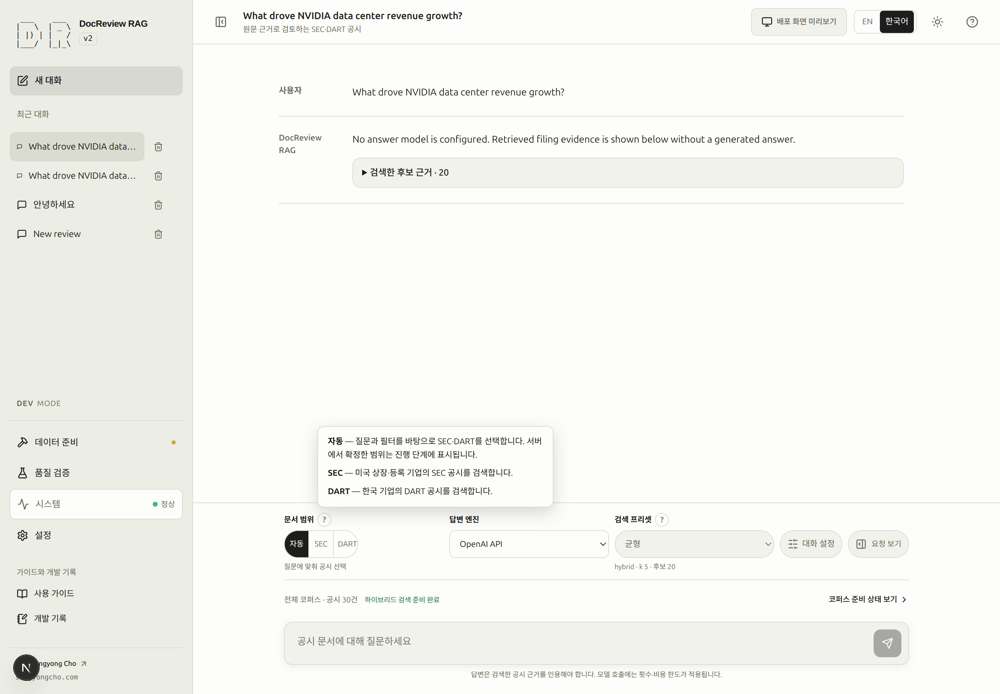
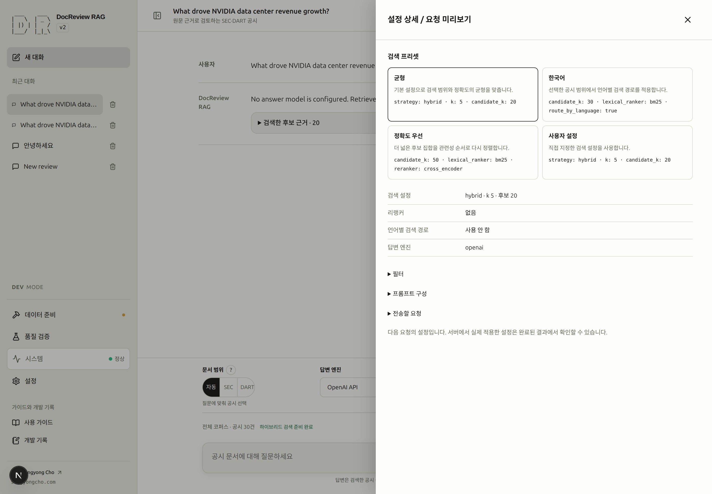
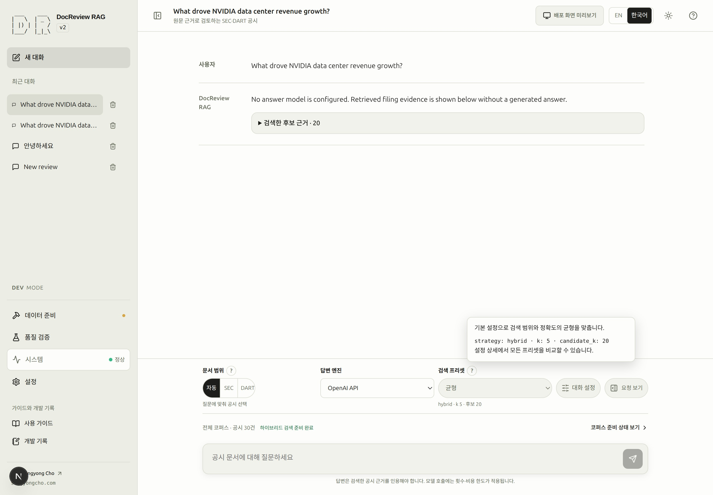
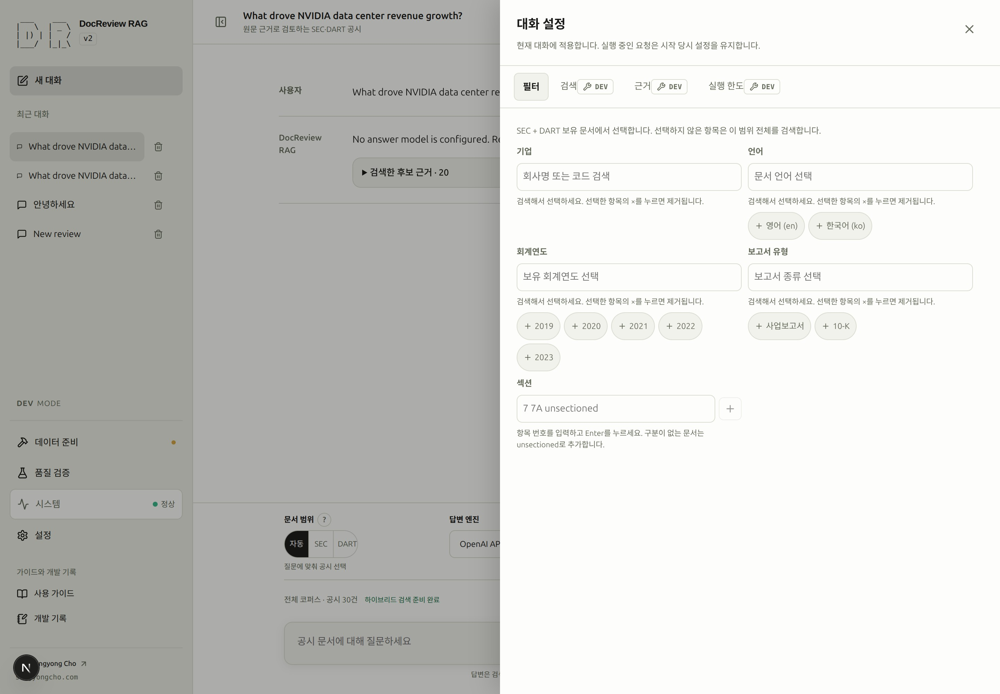

# 다음 요청의 설정

대화 설정은 어디에서 검색할지, 근거를 어떤 순서로 고를지, 검토에 얼마나 많은 작업을 허용할지 정합니다. 현재 대화에 속한 값이며, 설정을 바꿔도 기존 답변이나 이미 실행 중인 요청의 제출값은 바뀌지 않습니다.

입력창의 주 제어 행은 **문서 범위 → 답변 엔진·로컬 모델 → 검색 프리셋 → 설정 및 미리보기** 순서입니다. 마지막 버튼 하나에서 **기본**, **고급**(DEV), **미리보기**를 전환합니다. 보기를 바꿔도 설정값은 유지됩니다. 아래 보조 행의 문서 준비 상태는 선택한 SEC/DART 부분집합이 아닌 전체 코퍼스를 설명합니다.

<!-- capture:18-scope-presets -->

*문서 범위 도움말이 실제 조작 옆에서 Auto·SEC·DART를 설명합니다. 사용자가 선택한 범위와 서버가 확정한 실제 라우팅 결과를 구분합니다.*

## 10. 필터·프리셋과 근거 선택 조정하기 {#step-10}

**목표:** 설정 하나를 의도적으로 바꾸고 언제 적용되는지 확인합니다.

**선행 조건:** 기존 대화와 질문에 필요한 문서가 준비되어 있어야 합니다. 저장된 답변이 있으면 근거 선택을 함께 살펴볼 수 있지만, 설정을 바꾸기 위해 새 답변부터 생성할 필요는 없습니다.

**화면 경로:** 대화 → 질문 위의 **검색 프리셋**입니다. **설정 및 미리보기 → 기본**에서 문서 필터와 현재 실행 한도 요약을 확인합니다.

| 입력 | 이번 단계에서의 의미 |
|---|---|
| 문서 범위 | SEC 질문이면 SEC, DART 질문이면 DART를 고릅니다. Auto는 서버가 범위를 판단합니다. |
| 회사·회계연도 | 실제 선택지에 있는 값을 고릅니다. NVDA와 2024 문서가 있다면 해당 값을 사용할 수 있습니다. 비워 둔 항목은 제한하지 않습니다. |
| 검색 프리셋 | 정확도 우선을 골라 더 넓은 후보 범위와 재정렬 설정을 확인합니다. 좋은 답변을 보장하는 옵션은 아니므로 결과로 비교해야 합니다. |

**주요 동작:** **정확도 우선**을 선택하고 **설정 및 미리보기 → 미리보기**에서 다음 질문에 적용할 설정을 확인합니다. 기존 답변과 실행 중인 요청은 제출 당시 값을 유지합니다.

**보이는 변화:** 프리셋 선택이 바뀌고 설명에 `candidate_k: 50`, `reranker: cross_encoder`가 표시됩니다. 질문과 이전 답변은 그대로입니다. 미리보기는 다음 요청을 설명하며 실제 근거는 실행을 시작한 뒤 결정됩니다.

**완료 조건:** 문서 범위·필터·엔진·프리셋을 설명할 수 있고, 필터에 잘못 입력한 임시 값이 남아 있지 않습니다. 선택 가능한 근거가 있는 답변에서는 아래의 고정·제외 의미를 확인합니다. 새 모델 호출을 원할 때만 재검토합니다.

**흔한 실패:** 입력한 회사가 현재 문서 범위에 없거나, 범위를 바꾼 뒤 기존 선택과 충돌합니다. 경고를 확인하고 입력을 고치거나 해당 선택을 명시적으로 제거한 뒤 미리보기를 다시 확인하세요. [필터 문제 해결](troubleshooting.md#retrieval)을 참고합니다.

**다음 단계:** [11. 검색 평가하기](evaluation.md#step-11). 검색 평가는 인덱스 준비 직후에도 시작할 수 있으며, 답변 생성이 선행 조건은 아닙니다.

### SCREENSHOT NEEDED

<!-- Settings and preview: Basic, Advanced and Preview tabs; light mode; ko; show preserved values and integrated navigation. Existing asset below is historical. -->

<!-- capture:19-request-inspector -->

*이전 설정·요청 보기 배치의 과거 캡처입니다. 현재 동작은 위의 기본 / 고급 / 미리보기 안내를 따르세요.*

## 프리셋의 실제 설정값 {#presets}

> [!DEV]
> 프리셋을 서버 파일로 저장하는 것은 개발 모드 전용입니다. 공개 화면은 균형·한국어·정확도 우선 프리셋을 유지하고, 서버 상한(`k` ≤ 10, `candidate_k` ≤ 50, `max_context_chars` ≤ 12000) 안의 사용자 검색값을 허용하며, 사용자 프리셋은 이 브라우저에 저장합니다.

다음 값은 현재 프리셋 정의에 따른 것입니다. 기본 프리셋 세 개는 모두 하이브리드 검색을 사용하며 `k=5`개 결과를 반환합니다.

| 프리셋 | 후보 수 | 키워드 순위 방식 | 재정렬 | 언어별 라우팅 |
|---|---:|---|---|---|
| 균형 | 20 | `ts_rank_cd` | 없음 | 꺼짐 |
| 한국어 | 30 | BM25 | 없음 | 켜짐 |
| 정확도 우선 | 50 | BM25 | Cross encoder | 꺼짐 |
| 사용자 설정 | 저장된 값 | 저장된 값 | 저장된 값 | 저장된 값 |

균형은 기본 검색값이며, 한국어는 공시 범위를 DART로 강제하지 않고 언어별 검색 경로를 적용합니다. 정확도 우선은 더 넓은 후보를 재정렬합니다. DEV에서 **프리셋 관리…**를 선택하면 **품질 검증 → 검색 프리셋**으로 이동합니다. 기본 제공 행을 펼쳐 **복사하여 편집**하거나 현재 검색 설정을 저장하세요. DEV에서 이름을 붙인 프리셋은 `data/presets/`의 JSON 파일로 저장되고 입력창의 선택 목록에 나타납니다. PROD의 프리셋 관리는 브라우저에 저장합니다. 저장·편집만으로 기존 대화가 바뀌지 않으며, 대화에서 선택할 때 검색값만 복사됩니다. 저장한 프리셋과 일치하지 않는 값은 사용자 설정으로 표시됩니다. 대화의 고급 보기에서도 검색값을 직접 조정할 수 있습니다.

<!-- capture:30-preset-help -->

*실제 조작 옆에서 선택된 Balanced 프리셋의 정의를 설명합니다. 프리셋별 적용값은 설정 및 미리보기 → 미리보기에서도 비교할 수 있으며 도움말을 열어도 검토가 실행되지는 않습니다.*

`k`는 반환할 결과 수이고 `candidate_k`는 최종 선택 전에 다룰 후보 수입니다. RRF는 검색 경로별 순위를 합치며 BM25 매개변수는 키워드 점수에 영향을 줍니다. 재정렬은 공시 원문을 바꾸지 않고 결과 순서를 조정합니다. [검색 결과 살펴보기](retrieval.md)에서 실제 변화를 확인한 뒤 품질 개선 여부를 판단하세요.

## 범위별 필터와 입력 중인 값 {#filters}

**설정 및 미리보기**는 데스크톱에서 오른쪽 서랍, 모바일에서 전체 화면 대화상자로 열립니다. **기본**에는 프리셋·필터·한도 요약과 기본값과 다른 설정 수가 표시됩니다. **고급**에는 검색·근거·실행 한도, 추가 지침 및 명시적인 기본값 복원이 있습니다. **미리보기**는 다음 질문과 실제 설정을 읽기 쉬운 항목 및 펼칠 수 있는 요청 JSON으로 보여줍니다. 실행 상세에도 **미리보기** 탭이 있으며, **서버 설정**은 선택한 과거 실행의 기록을 계속 표시합니다. 공개 화면에는 고급 편집이 나타나지 않으며, **품질 검증 → 검색 프리셋**에서 브라우저 프리셋을 관리합니다. 대화에 적용은 서버 권한을 따릅니다. Escape로 닫으면 열었던 버튼으로 포커스가 돌아옵니다.

### SCREENSHOT NEEDED

<!-- Settings and preview: Basic, Advanced and Preview tabs; light mode; ko; show preserved values and integrated navigation. Existing asset below is historical. -->

<!-- capture:27-review-settings -->

*이전 설정·요청 보기 배치의 과거 캡처입니다. 현재 동작은 위의 기본 / 고급 / 미리보기 안내를 따르세요.*

회사·언어·보고서 종류·회계연도 선택지는 선택한 범위의 전체 사용 가능 문서에서 가져옵니다. 문서 첫 페이지의 일부 행만으로 목록을 만들지 않습니다. 공개 환경에서는 공개 문서 목록을 사용합니다.

선택한 값은 제거 가능한 칩으로 나타납니다. 현재 범위와 맞지 않는 기존 선택도 직접 제거할 때까지 표시합니다. 잘못된 임시 입력은 필터 편집기가 열려 있는 동안 전송을 막습니다. 안내문에 적힌 것처럼 편집기 탭을 바꾸거나 닫으면 미완성 입력은 버리고 확정된 선택은 유지합니다. 작업 화면 이동과 뒤로 가기는 확정한 설정과 질문을 보존합니다. 배경의 조작 항목을 사용하기 전에는 편집기를 닫습니다.

범위와 프리셋 옆 **?**는 마우스를 올리거나 키보드 포커스·터치로 열고 Escape로 닫을 수 있습니다. 입력창 위 코퍼스 상태 문구로 데이터 준비 화면에 갔다가 **뒤로**로 초안에 복귀합니다. 요청 미리보기는 독립적으로 스크롤되며 닫기와 Escape를 지원합니다.

## 근거 고정·제외와 다시 검토 {#evidence}

- **고정**은 다음 근거 검토에서 먼저 포함할 근거를 지정합니다. 답변의 실제 인용을 보장하지 않습니다.
- **제외**는 다음 검토의 근거 집합에서 해당 근거를 뺍니다.
- 선택만 하면 표시와 개수만 바뀝니다. 현재 답변은 수정되지 않습니다.
- **선택한 근거로 다시 검토**는 새 검토를 요청하고 새 결과를 추가합니다. 제공자 비용이 발생할 수 있습니다.

선택한 고정·제외를 다시 누르면 해제합니다. 두 버튼은 카드 헤더에 있어 카드를 접은 채로도 누를 수 있고 페이지를 넘겨도 선택이 유지되며, 고정한 카드는 목록이 표시될 때 펼친 상태로 시작합니다. 같은 청크를 동시에 고정하고 제외할 수는 없습니다. 검색 후보 수와 실제 인용 수는 서로 다른 값입니다. 사용할 수 있는 선택 토큰이 없는 과거 저장 결과는 버튼을 사용할 수 없는 이유를 설명합니다. 근거를 바꾸려면 새 검색 결과가 필요합니다.

## 근거 크기와 실행 한도 {#budgets}

> [!DEV]
> 대화 서랍에서 검색·근거·실행 한도를 편집하는 것은 개발 모드 전용입니다. 공개 사용자는 허용된 범위·프리셋·필터와 함께 서버 공개 상한 안의 사용자 프리셋을 사용할 수 있습니다.

**설정 및 미리보기 → 고급 → 근거**의 대화 이력 수·최대 근거 문자 수는 프롬프트 내용을, 추가 검색 배수와 문서별 최대 근거 수는 근거 선택을 조정합니다. **실행 한도**에서는 반복·입력 토큰·출력 토큰·실제 경과 시간의 전체 실행 한도를 정합니다. 이 한도는 답변 엔진이 OpenAI든 로컬이든 질문 하나의 전체 실행에 똑같이 적용됩니다. 기본 120초는 시간 한도이며 토큰 예산이 아닙니다. 실패 때문에 값을 바꾸기 전 [실행 한도 읽기](runtime.md#limits)를 확인하세요.

CPU 전용 로컬 모델은 선택 사항인 [CPU 시작 프리셋과 하드웨어 안내](ollama.md#cpu-starting-preset)를 참고하세요. 기존 기본값은 유지되며, 프리셋을 직접 적용한 뒤 다음 실행의 시간 기록을 확인합니다.

### OpenAI 호출당 캡 {#openai-call-caps}

OpenAI 호출 한 번에는 서버 캡도 적용됩니다. `.env`의 `DOCREVIEW_OPENAI_MAX_INPUT_TOKENS`(기본 12,000), `DOCREVIEW_OPENAI_MAX_OUTPUT_TOKENS`(기본 600), `DOCREVIEW_OPENAI_MAX_COST_USD`(기본 0.04)가 **상한**입니다. 실행 한도를 상한보다 높여도 상한은 올라가지 않고, 호출마다 더 작은 값이 적용됩니다. **시스템 → 시스템 상태**의 **OpenAI 모델 정책**에 현재 적용되는 캡이 표시되고, **설정 → 실행 한도**의 **OpenAI 호출당 캡**에도 같은 값이 나옵니다.

DEV에서는 이 편집기가 더 낮은 작업값을 서버의 `data/local-settings/openai-limits.json`에 저장하고, **상한으로 복원**은 그 파일을 삭제합니다. 웹에서는 상한을 넘길 수 없습니다. 상한을 올리려면 `.env`의 키를 수정하고 `rag-dev down` / `rag-dev up`으로 재시작하세요. 공개 PROD는 항상 상한을 사용하며 파일을 읽지 않습니다.

### SCREENSHOT NEEDED
<!-- Feature: OpenAI per-call caps block under Settings → Run limits; locale=ko; theme=light; state=DEV with ceiling facts, three editable inputs bounded by the ceiling and the .env guidance; preserve existing assets. -->

## 기본값과 권한 {#defaults}

> [!DEV]
> 실험 기본값 저장과 프롬프트 정책 편집은 개발 모드 전용입니다. **설정 → 프롬프트**와 **설정 → 실행 한도**는 공개 화면에도 읽기 전용 페이지로 남습니다. 가드 문구와 최종 프롬프트 미리보기는 볼 수 있고, **추가 운영자 지침**과 저장 버튼은 이 조작이 개발 모드 전용이라는 안내와 소스 저장소 링크가 있는 말풍선으로 잠깁니다. 브라우저 언어와 허용된 대화 선택은 별도 기능입니다.

**품질 검증 → 평가 설정**에서 실험 기본값과 새 대화의 검색 프리셋을 저장합니다. 기존 대화와 기록된 결과의 설정은 바뀌지 않습니다. 전역 **설정 → 프롬프트**는 현재 대화의 프롬프트 정책을 다루며, 로컬 서버 연결은 **로컬 LLM**에서 별도로 관리합니다.

공개 환경에서는 허용된 범위·프리셋·필터와 읽기 전용 프롬프트·실행 한도 페이지를 사용할 수 있고 개발 전용 편집과 로컬 모델 구성은 제한됩니다. 저장된 개발 프로필이 현재 배포와 호환되지 않으면 그 상태를 명시적으로 안내하며 다른 실험값으로 조용히 바꾸지 않습니다.

## 로컬 서버 선택 {#local-server}

> [!DEV]
> 로컬 모델 서버 추가·연결·해제·진단은 개발 모드 전용입니다. 이 안내는 공개 문서에서도 읽을 수 있습니다.

**설정 → 로컬 LLM**의 **Default**는 현재 DocReview 환경에 준비된 주소를 사용합니다. 서버를 선택하기만 해서는 사용 중인 연결이 바뀌지 않습니다. **연결 진단 실행**은 선택한 대상을 검사하며 설정 저장, 모델 다운로드·로드, 답변 생성을 실행하지 않습니다. 진단 대상 이름과 확인 시간을 읽고, 현재 설정은 **연결 상태**에서 확인합니다.

기존 항목은 **연결**로 적용합니다. **서버 추가…**에서 이름·접근 가능한 주소·프로토콜을 입력하고 **추가하고 연결**을 누르면 검사에 성공한 경우에만 새 항목이 저장됩니다. 연결이나 저장에 실패하면 기존에 동작하던 설정을 보존합니다. **Default로 복귀**도 기본 서버를 검사한 뒤 전환하며 추가한 서버 목록을 유지합니다. **연결 해제**는 로컬 답변을 명시적으로 비활성화합니다.

이 화면의 [Ollama 설치 안내](ollama.md)는 새 탭으로 열립니다. macOS·Linux 설치, Docker 접근, 모델 준비, 읽기 전용 `rag-ollama-check` 진단을 설명합니다. 서버를 연결해도 대화의 엔진이나 코퍼스 임베딩 공급자가 바뀌지는 않습니다.

## 공급자 변경 후 사용량 확인

**시스템 → 사용량**은 기록된 모델·역할을 공급자, 로컬/외부 실행, 키 슬롯 이름별로 묶습니다. 키 값은 표시하지 않습니다. 과거 키 슬롯은 알 수 없음으로 남으며 공급자는 현재 설정이 아니라 당시 호출 기록을 따릅니다. 보고된 토큰, 토크나이저 추정치, 미보고 사용량을 구분하고 같은 행으로 소계를 계산합니다. 로컬 API 비용은 0입니다. backfill 범위와 실패 이후 기록, 로컬 추정치의 한계는 [기록된 공급자 사용량](runtime.md#기록된-공급자-사용량)을 확인하세요. 화면을 여는 동작은 모델 호출이나 데이터 초기화를 실행하지 않습니다.

### SCREENSHOT NEEDED
<!-- Feature: provider and credential usage groups after a settings change; locale=ko; theme=light; show role and reported/estimated usage distinction; preserve existing assets. -->

### 저장한 실행 기본값

**설정 → 실행 한도**에서 기본 실행 한도와 근거 크기를 편집하고 명시적으로 저장합니다. 시스템 상태에는 요약과 편집 화면 링크가 있습니다. 기존 대화는 자신의 값을 유지하며 기본 보기에는 저장한 기본값과 다른 설정 수가 표시됩니다. 대화의 **설정 기본값 복원**은 저장한 검색·추가 지침·근거·한도를 복사하고 문서 필터는 유지합니다. 기본값 편집기의 **한도 기본값 복원**은 앱 최초 값을 준비하며, 이후 새 대화에 쓰려면 저장 버튼을 눌러야 합니다.

### SCREENSHOT NEEDED
<!-- Default limits editor and System status summary; ko; light mode; show saved values and a conversation override. Preserve existing assets. -->

기업·언어·회계연도·보고서 유형·섹션은 검색 입력과 목록 펼치기 버튼을 함께 제공합니다. 섹션 목록은 실제 범위 내 문서에서 조회하며 직접 입력도 유지됩니다. 프리셋 미리보기는 행 전체를 눌러 펼치는 세로 목록이고, JSON은 기존 코드 블록 배경과 고정폭 글꼴을 유지합니다.

## 브라우저 저장소 {#browser-storage}

실제 배포된 **PROD** 화면의 대화와 사용자 설정은 이 브라우저의 `localStorage`에 origin(프로토콜·호스트·포트)별로 저장됩니다. 다른 브라우저나 기기로 동기화되지 않으며 브라우저의 사이트 데이터를 지우면 삭제됩니다. 질문 실행에 필요한 질문·설정은 API로 전송되지만 사용자 설정을 보관하는 서버 저장소는 없습니다.

저장 항목은 대화와 문서 필터·근거/실행 한도·프롬프트, 현재 대화, 새 대화의 프로필·프롬프트·실행 한도 기본값, 제공되는 이름 있는 검색 프리셋, 실험 기본값, 언어·테마, 온보딩·도움말·저장 안내 확인 여부, 데스크톱 작업 알림, Operations 필터, 문서/작업 패널 폭입니다. 저장된 값이 있어도 서버 권한상 사용할 수 없는 설정이 활성화되지는 않습니다. 대화 보관 한도는 30개, 대화별 메시지 100개로 유지됩니다.

**설정 → 데이터와 도움말 → 브라우저 저장소**에서 추정 용량과 **항목별 저장 용량**을 확인합니다. 경고는 보수적인 4 MiB 추정치를 기준으로 표시되며 실제 origin 한도는 브라우저와 다른 사이트 데이터에 따라 달라집니다. **브라우저 설정 내보내기**는 대화·프롬프트가 포함된 버전 있는 JSON 파일을 만듭니다. 백업을 안전하게 보관하세요. **브라우저 설정 가져오기**는 파일 전체를 검증한 뒤 기존 DocReview 데이터를 교체할지 묻습니다. 진행 중인 요청을 먼저 마치세요. 다른 웹사이트의 저장 항목은 보존합니다.

**대화 삭제**는 대화만, **저장된 기본값 초기화**는 기본값을 지웁니다. 전체 로컬 데이터를 지우려면 브라우저의 사이트 데이터 기능을 사용하세요. 서버의 공시 원문이나 PostgreSQL 자료는 삭제되지 않습니다. 브라우저 변경이나 삭제 전에 백업을 내보내고 확인하세요.

유효한 이전 버전은 PROD에서 한 번 변환합니다. 읽을 수 없거나 미래 버전인 데이터는 내보내기의 복구 항목에 보존하고 안내와 함께 안전한 기본값을 사용합니다. 용량 부족·비공개 모드·저장 차단 시 현재 탭에서는 변경 사항을 사용할 수 있지만 영구 저장되지 않았다는 안내가 표시됩니다. 닫기 전에 내보내세요. 비공개 창을 닫으면 해당 데이터가 사라질 수 있습니다.

PROD 첫 방문에 **⚠️ 설정과 대화는 이 브라우저에만 저장됩니다** 안내가 표시됩니다. **확인**은 닫은 상태를 기억하고, **데이터와 도움말 → 브라우저 저장소**의 ⚠️ 버튼은 안내를 다시 엽니다. **자세히**는 이 절로 이동합니다. DEV는 기존 저장 동작을 유지하며 **배포 화면 미리보기**도 격리된 메모리 저장을 사용합니다.

### SCREENSHOT NEEDED
<!-- Feature: PROD browser-storage notice, Data & help per-key usage, export/import confirmation and reminder; locale=ko; light mode; show real deployed state. Preserve existing assets. -->

기본값 편집기와 **대화 설정 → 고급 → 실행 한도**는 프리셋 행, 한도·근거 입력, 안내 블록을 공유합니다. 데스크톱에서는 두 열, 720px 이하에서는 한 열로 표시하며 저장 결과는 저장·복원 버튼 옆에 표시됩니다. 작성 영역의 기본 한도 링크와 시스템 상태 요약은 **설정 → 실행 한도**를 열고, CPU 권장 안내는 현재 대화의 한도 편집을 엽니다.

### SCREENSHOT NEEDED
<!-- Feature: Run limits category, shared conversation limits and System summary; locale=ko; theme=light; widths=1440,720; show aligned units, hints, save feedback and keyboard focus. -->

### 검색 프리셋 파일과 JSON 편집

**품질 검증 → 검색 프리셋**을 여세요. DEV에서는 기존 런타임 데이터와 Compose 데이터 마운트를 사용하는 `data/presets/<id>.json`에 저장합니다. 기본 파일 세 개(`balanced`, `korean`, `accuracy`)를 서버와 웹이 함께 사용하며 수정하려면 복사해야 합니다. 사용자 프리셋 파일은 Git에서 제외됩니다. 화면에 표시된 선택기는 3초마다 가벼운 버전 확인을 공유하고, 서버는 메타데이터 변경이 안정된 뒤 바뀐 파일만 다시 읽습니다. 손상된 파일은 파일명과 오류를 표시하며 다른 프리셋은 계속 사용할 수 있습니다. 파일을 고치면 재시작 없이 반영됩니다.

**현재 검색 설정을 프리셋으로 저장** 또는 **새 프리셋 등록하기**(균형 기본값)를 선택하세요. 하나의 편집기에서 이름, 설명, 검색 필드를 수정하거나 **JSON** 모드에서 직접 편집하고 오류를 확인하며 JSON을 복사할 수 있습니다. JSON 파일을 가져오면 새 복사본으로 편집합니다. 저장한 행의 **프리셋 JSON 내보내기**로 파일을 내려받습니다. 각 저장한 행에서 대화에 적용, 복사, 편집, 삭제 확인을 사용할 수 있습니다. 저장·삭제는 기존 대화의 설정을 변경하지 않습니다. 대화에 적용은 현재 서버의 사용자 정의 검색 권한을 따릅니다.

PROD에서는 버전이 지정된 브라우저 설정 모듈로 저장하며 파일 API를 노출하지 않습니다. 브라우저 설정 내보내기·가져오기에 프리셋도 포함됩니다. **배포 화면 미리보기**에서는 메모리 전용이며 저장되지 않는다는 안내와 함께 저장·등록 등 쓰기 버튼을 비활성화합니다. 실제 배포 화면에서는 해당 브라우저에 저장합니다.

### SCREENSHOT NEEDED
<!-- Retrieval presets: actual light-mode DEV file rows, JSON editor with validation error, and production-preview notice; locale ko. Capture after implementation. -->

### 새 대화 검색 기본값

대화 설정의 기본 프리셋 영역 또는 고급 검색에서 **새 대화 검색 기본값으로 저장**과 **새 대화 검색 기본값 초기화**를 사용할 수 있습니다. 이후 새로 생성하는 대화의 검색 프리셋만 바꾸며 기존 대화·프롬프트·필터·실행 한도 기본값은 유지합니다. 평가 기본값은 새 평가 창에서 관리하며 스냅샷 비교 대상은 전역 기본값으로 저장하지 않습니다.

문항 변경·설정 초기화·백업 가져오기·운영 명령의 확인창은 앱 내부에 표시됩니다. 취소 또는 Escape는 현재 상태를 유지하며 계속을 누르면 해당 작업을 진행합니다. 탭 닫기 경고와 알림 권한 요청은 브라우저가 직접 표시합니다.
