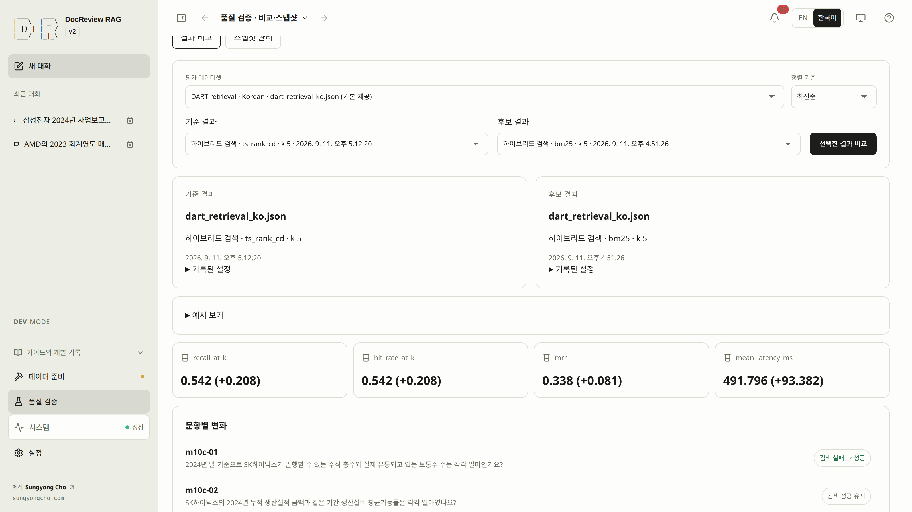
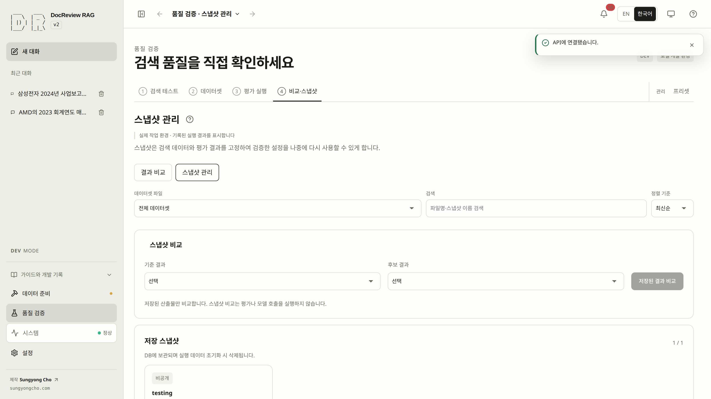

# 결과를 비교하고 검색 데이터 보관하기

평가 결과는 측정값과 설정을 기록합니다. 스냅샷은 선택한 평가 결과와 검색 데이터를 함께 보존해 확인한 구성을 나중에 다시 사용할 수 있게 합니다. 저장된 스냅샷 비교는 기존 산출물을 읽으며 평가나 모델 제공자 호출을 새로 실행하지 않습니다.

호환되는 게시 결과를 선택해 기록된 지표와 문항별 변화를 비교합니다. 저장 자료만 읽으며 검색·평가·모델을 재실행하지 않습니다. 페이지 안에서 동일 비교를 재사용하고 문항 목록은 페이지로 나눕니다. 공개 파일 조회와 비교 응답은 크기를 제한하며 초과하면 명시적인 오류를 표시합니다.

## 대화형 공개 비교

**예시로 체험하기**를 누르면 기존 3문항 중 2개와 3개가 적중하는 설명 사례를 엽니다. 같은 비교 화면에서 기준을 반대로 바꾸고 문항을 검색하며 순위 변화를 펼쳐봅니다. 설명용 자료이며 실제 평가가 아닙니다. 실험 파라미터를 바꿔도 점수를 만들거나 바꾸지 않습니다. 실제 조회 실패·자료 없음 상태를 예시로 자동 대체하지 않습니다.

## 12. 결과를 비교하고 적합한 스냅샷 저장하기 {#step-12}

> [!GOAL]
> 평가 결과 두 건을 비교하고 나중에 다시 쓸 수 있게 이름 붙인 스냅샷으로 저장합니다.
>
> **준비** 현재 인덱스와 원문이 일치하는 성공한 **빠른 평가 · 현재 인덱스** 결과 · **완료** 호환성과 이름이 기록된 저장 스냅샷

> [!DEV]
> 비공개 평가 결과 비교와 새 스냅샷 저장은 개발 모드 전용입니다. 방문자에게 게시된 스냅샷 비교는 별도의 공개 기능입니다.

근거와 실험 조건을 보고 결과를 선택한 뒤 나중에 사용할 수 있게 보관합니다. 현재 인덱스와 원문 corpus가 일치하는 성공한 **빠른 평가 · 현재 인덱스** 결과가 한 건 이상 있어야 합니다. 비교에는 서로 다른 결과 두 개가 필요합니다. 한 건뿐이라면 그 결과를 읽고 비교할 수 없는 상태를 그대로 받아들이며 지표를 임의로 만들지 않습니다. 화면을 채우기 위해 유료 평가를 추가하지 않습니다.

1. **품질 검증 → 4. 비교·스냅샷 → 결과 비교**를 열고 기준과 후보를 선택합니다. **선택한 결과 비교** 전에 메타데이터를 읽습니다.

| 입력 | 의미 |
|---|---|
| 기준 | 개선의 출발점으로 삼을 결과입니다. |
| 후보 | 기준과 비교할 다른 결과입니다. |
| 데이터셋·버전 | 점수의 바탕이 되는 질문과 정답 근거를 식별합니다. |
| 스냅샷 이름 | `SEC hybrid k5 baseline`처럼 알아볼 수 있는 이름입니다. 이름만으로 호환성을 판단하지 않습니다. |

2. 지표와 함께 달라진 문항·지연 시간을 확인합니다.
3. **3. 평가 실행**으로 돌아가 적합한 결과를 선택하고 **결과 상세**를 엽니다.
4. 이름을 입력하고 **결과를 스냅샷으로 저장**합니다. 저장만으로는 게시되지 않습니다.

스냅샷 생성 알림이 나옵니다. **4. 비교·스냅샷 → 스냅샷 관리**에서 이름·문서 수·suite·결과 ID를 확인합니다. 처음에는 비공개입니다. 권한이 있다면 **대화에 적용**으로 스냅샷을 선택할 수 있으며 질문을 전송하지 않습니다.

저장된 식별 정보가 의도한 결과와 맞고 저장 스냅샷 목록에서 확인할 수 있으며 비교 한계를 이해했으면 완료입니다. 평가 이후 원문 corpus가 바뀌었거나 조합별 평가 결과를 현재 인덱스용 검색 스냅샷으로 저장하려는 경우에는 오류를 읽고 일치하는 빠른 평가 결과를 고르거나 의도한 현재 corpus를 평가합니다. [평가·스냅샷 복구](troubleshooting.md#evaluation)를 참고하세요.

이어서 [보존하며 종료하고 다시 시작하기](runtime.md#resume)를 보거나, [답변](answers.md)으로 돌아가 다음 요청 전 적용된 스냅샷을 확인합니다.

## 지표 차이보다 실험 조건부터 읽기 {#comparison}

결과 비교에는 같은 데이터셋의 서로 다른 결과가 필요합니다. 스냅샷 비교에서는 데이터셋이나 정답 식별자가 다른 경우에도 제한된 비교의 이유를 안내합니다. **직접 비교 가능 / 제한적인 비교** 상태와 경고가 지표 표 앞에 표시됩니다.

스냅샷의 직접 비교 가능 여부는 suite와 정답 식별자를 검사합니다. 특정 설정의 효과라고 해석하기 전에는 corpus·임베딩 식별자·검색 설정·`k`도 직접 확인해야 합니다. 같은 데이터셋 이름만으로 통제된 실험이 되지는 않습니다.

| 확인할 항목 | 중요한 이유 |
|---|---|
| Suite와 정답 버전·해시 | 질문이나 정답 원문 범위가 바뀌면 점수가 측정하는 대상도 달라집니다. |
| Corpus 식별자와 문서 수 | 검색 대상이 늘거나 바뀌어서 근거를 더 잘 찾았을 수 있습니다. |
| 임베딩 제공자·모델·차원 | 벡터 식별자는 저장 데이터가 지원하는 검색 구성을 정합니다. |
| 검색 방식·`k`·후보 수·재정렬 | 반환 근거와 작업량이 늘면 품질과 지연 시간 모두 달라질 수 있습니다. |
| 문항별 변화 | 평균 향상 뒤에 중요한 퇴보가 숨어 있을 수 있습니다. |

제한된 비교에서 계산할 수 없는 지표 차이는 `n/a`로 표시합니다. 공통 문항 수와 양쪽 질문을 읽으세요. 공통 문항이 없으면 같은 문항을 기준으로 비교할 근거가 없습니다. 접힌 예시는 설명용이라고 명시되어 있으며 실제 실행 결과가 아닙니다.

## 저장과 적용의 범위 {#save}

저장은 기존 결과에 현재 문서·청크·벡터·키워드 인덱스 데이터를 연결합니다. 서버는 평가에 기록된 원문 fingerprint와 현재 인덱스가 일치하는지 확인합니다. 필요한 식별자는 현재 인덱스를 사용한 빠른 평가에 있습니다. 정답 리비전을 연결할 때는 게시된 버전이어야 하고 평가의 정답 해시와도 맞아야 합니다.

결과 상세의 **선택 설정 적용**은 검색 설정을 적용합니다. 저장 스냅샷의 **대화에 적용**은 보관한 검색 구성과 스냅샷 선택을 적용합니다. 둘 다 대화를 준비하며 검토를 실행하지 않습니다. 요청 미리보기로 다음 요청을 확인하고, 실제 corpus로 돌아가려면 스냅샷 칩을 의도적으로 해제하세요.

스냅샷은 애플리케이션 전체나 브라우저 대화·인증 정보를 백업하는 기능은 아닙니다. 원문과 일반 백업은 필요한 보존 정책에 따라 별도로 관리하세요.

## 비공개 저장과 공개 범위 {#visibility}

> [!DEV]
> 게시·숨기기는 스냅샷 공개 상태를 바꾸며 개발 모드 전용입니다. 게시된 스냅샷과 소속 문서를 읽는 동작은 공개 상태를 바꾸지 않습니다.

결과를 스냅샷으로 저장하면 비공개로 생성됩니다. **게시**와 **숨기기**는 별도의 운영자 동작입니다. 게시하면 준비된 스냅샷과 해당 조건을 충족하는 문서 목록을 방문자가 읽을 수 있으며, 숨기면 그 스냅샷이 공개 목록에서 빠집니다.

공개 문서 목록·필터 선택지·개수·상세는 준비된 공개 스냅샷 소속과 정확한 원문 식별자를 기준으로 합니다. 한 스냅샷을 숨겨도 다른 공개 스냅샷에 속한 문서는 계속 공개될 수 있습니다. 회사 메타데이터도 같은 공개 범위를 따라야 합니다. 개발 DB에 문서가 많아도 게시된 스냅샷이 없으면 공개 문서 목록이 비어 있는 것이 정상입니다.

공개 여부를 바꾸기 전에 범위를 확인하세요. 로컬 평가를 마치고 실험을 저장하거나 결과를 읽는 데 스냅샷 게시가 필요하지는 않습니다.

## 스냅샷 관리

**비교·스냅샷**에서 **결과 비교**와 **스냅샷 관리**를 구분합니다. 평가 결과끼리 비교할 때는 스냅샷을 만들 필요가 없습니다. 관리 목록에서는 이름, 데이터셋 파일, 기록된 검색 설정, 기준 평가, 문서 수, 생성 시각을 확인합니다. 목록 위에서 두 스냅샷을 선택해 저장된 결과를 비교하고, 각 항목을 펼쳐 기록된 설정을 확인할 수 있습니다. **대화에 적용**은 검색 상태를 선택할 뿐 질문을 전송하지 않습니다.

평가 결과 하나에는 스냅샷 하나만 연결됩니다. 저장 후 결과 화면은 **저장된 스냅샷 보기**를 표시하며 재요청도 이름·공개 상태를 바꾸지 않고 기존 스냅샷을 반환합니다. 스냅샷은 DB에 보관되며 실행 데이터 초기화 시 삭제됩니다. 독립된 백업 파일이 아니며, 골든셋 JSON 파일의 보존 정책과 구분됩니다. 삭제·이름 변경은 추가하지 않습니다.

스냅샷 관리도 평가 실행 목록과 같은 데이터셋 파일명을 사용합니다. 파일 필터와 파일명·스냅샷 이름 검색, 생성 시각·파일명·이름 정렬을 제공합니다. 기준 평가 보기는 숫자 대신 문구로 표시하며 정확한 원본 결과에 연결됩니다. 내부 ID는 펼친 상세 정보에서 확인할 수 있습니다.

