# 첫 공시부터 인용 답변까지

NVIDIA 공시를 직접 준비하고, 검색 근거를 읽은 뒤 원문을 인용하는 첫 답변까지 확인합니다.
이 가이드는 로컬 개발 환경에서 **화면에 값을 입력하고 실행 결과를 확인하는 순서**로 구성했습니다.
ASCII 텍스트 로고에 표시된 화면 버전은 v2입니다.

`rag-dev`로 준비한 데이터와 실행 상태는 같은 환경의 대시보드에서도 확인할 수 있습니다.
완료한 작업은 화면에서 상태를 확인하고 다음 단계로 이어가면 됩니다. 원문 수집과 DB 적재는
별개이며, 한쪽에서 끝낸 작업을 CLI와 웹에서 두 번 실행할 필요는 없습니다.

기본 경로는 **OpenAI embedding·답변**입니다. 원문 수집과 DB 적재에는 OpenAI 호출이 없고,
embedding부터 유료 호출이 시작됩니다. 질문과 평가도 비용이 발생할 수 있습니다.
아래 이미지는 2026-09-05의 로컬 서비스에서 직접 캡처한 화면입니다. 한국어 화면을 한영 문서가
함께 사용하며, 웹에서 이미지를 누르면 원본 크기로 열립니다. 기존 문서 30건과 실행 기록을
재사용한 환경이므로 처음 시작하는 DB의 숫자와 다를 수 있습니다. 특히 촬영 환경의 embedding은
`deterministic`입니다. 화면의 완료 표시를 OpenAI 준비 완료나 의미 검색 품질로 해석하지 말고,
이 가이드의 OpenAI 설정과 각 단계의 **화면 확인**을 기준으로 진행하세요.

## 1. 실습 환경 열기

**목적:** 실행 가능한 개발 환경에서 시작합니다.

처음 사용하는 경우 [설치와 초기 설정](cli.md#설치와-초기-설정),
[초기 schema 준비](cli.md#초기-schema-준비)를 먼저 완료합니다. 도구 설치·키 입력·빈 DB의
schema 준비만 터미널에서 진행하고, 문서 수집과 DB 적재는 다음 단계에서 웹으로 실행합니다.
이미 사용하던 DB는 삭제하지 않고 재사용합니다.

현재 터미널에 [프로젝트 명령을 등록](cli.md#명령-등록과-도움말)한 뒤 서비스를 엽니다.

```bash
rag-dev up --build -d
```

[DocReview RAG 열기](http://localhost:8000/docreview-rag-agent/)로 접속합니다.
`APP_PORT`를 바꿨다면 주소의 8000도 바꿉니다. 별도 3000번 화면을 선택할 필요는 없습니다.
이미 열어 두었다면 다시 시작하지 않습니다.

**화면에서 할 일:** 하단의 DEV 모드를 확인하고 시스템 → **시스템 상태**를 엽니다.
API·DB와 schema 상태를 확인한 뒤 **데이터 준비** → **파이프라인**으로 이동합니다.
OpenAI 답변 엔진이 사용 가능한지도 확인합니다.

**화면 확인:** DEV 표시와 API·DB 상태가 보이고 schema 연결 오류가 없어야 합니다.
연결만 정상이라고 문서·embedding까지 준비됐다는 뜻은 아닙니다.

**완료 조건:** 개발 서비스와 schema가 준비되면 현재 데이터를 확인합니다.
연결이 실패하면 [진단 안내](cli.md#문제가-생겼을-때)를 따릅니다.

파이프라인은 의존 관계 그래프와 선택 단계의 실행 패널을 한 화면에 배치합니다. 접힌 런타임 요약을
펼치면 연결·schema 세부 상태를 확인할 수 있습니다. 노드를 누르면 실행 패널에 목적·입력·버튼·실제 작업 이벤트가
나타납니다. 노드 선택만으로 작업은 실행되지 않습니다. 하이브리드 검색은 임베딩과 BM25의 준비 상태를
함께 사용합니다. 미준비 항목이 있으면 실제로 사용할 수 있는 검색 경로를 확인하세요. 평가에는
평가 데이터셋도 필요합니다. 이 그래프의 준비 상태와 질문별 실행 진행은 별개입니다. 실행 기록과 CLI 참고
명령도 별도로 표시됩니다. 완료 단계의 초록 표시등은 천천히 깜박이고 실패 단계는 빨간색으로 표시합니다.
동작 줄이기 설정에서는 애니메이션을 멈춥니다. 색상과 함께 실제 상태 문구를 읽으세요.

한국어·EN 버튼으로 화면과 문서 언어를 바꿀 수 있습니다. 저장된 질문·답변·공시·로그는 번역하거나
변경하지 않습니다. 코드 카드의 복사는 장식과 언어 라벨을 빼고 코드 원문만 복사합니다.

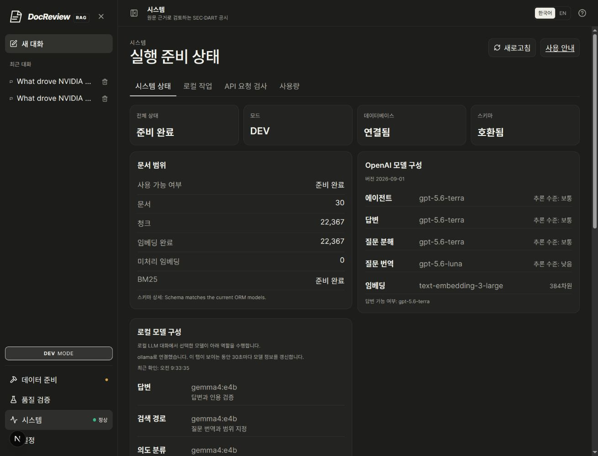

*시스템 → 시스템 상태. 연결과 schema를 먼저 확인합니다. 모델 정책에 적힌 모델명과 저장된 벡터의 정체성은 별개입니다.*

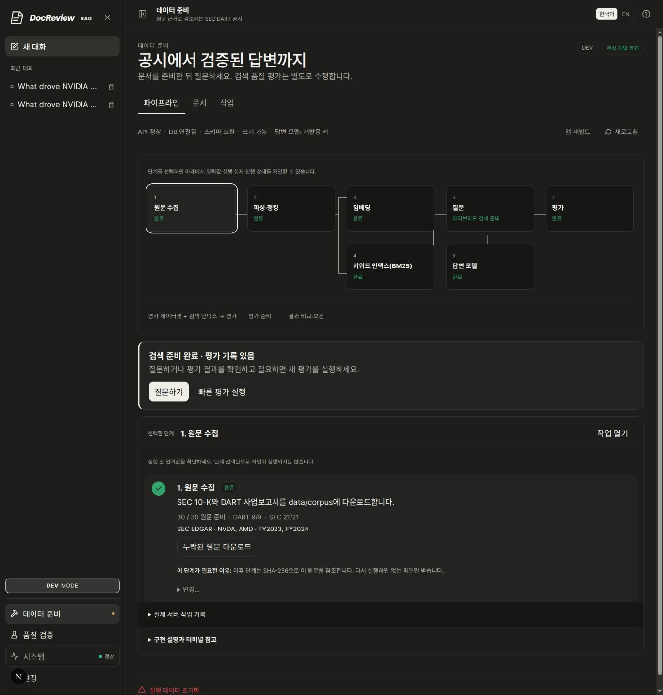

*데이터 준비 → 파이프라인. 노드 선택은 아래 실행 패널을 여는 동작입니다. 완료한 기존 작업을 다시 실행할 필요는 없습니다.*

## 2. 이미 준비된 데이터 확인하기

**목적:** 기존 결과를 재사용하고 필요한 작업만 실행합니다.

**화면에서 할 일:** 데이터 준비 → 파이프라인에서 **새로고침**을 누릅니다. 문서·청크·embedding 수와
pending, provider, BM25 상태를 읽습니다. 데이터 준비 → **문서**에서 `NVDA-FY2024`가 있는지
확인합니다. 답변 대상은 2024-01-28에 끝난 회계연도의 보고서입니다.

문서와 작업은 먼저 전체 목록을 보여 줍니다. 행을 선택하면 상세를 엽니다. 실제 콘텐츠 영역이
1100px보다 좁으면 상세 화면으로 전환되며, 문서 목록으로 또는 작업 목록으로 돌아가면 필터·선택·스크롤
위치가 유지됩니다. 넓은 화면에서는 구분선을 드래그하거나 포커스를 두고 방향키로 조절합니다. Shift를
함께 누르면 크게 조절하고 더블클릭하면 기본값으로 돌아갑니다. 목록 기본 너비는 360px이며, 상세에
최소 560px를 남기는 범위에서 320~600px로 조절하고 선택한 너비를 기억합니다. 회사는 실제 manifest의
코드와 이름을 함께 표시합니다. 공개 문서 목록은 게시된 스냅샷에 포함된 문서만 보여 줍니다.

**화면 확인:** 문서 식별자와 청크 수를 확인합니다. 다른 회사·연도가 함께 있어도 삭제할 필요는 없습니다.
대상 원문·문서·현재 OpenAI embedding이 모두 준비돼 있다면 3~5단계를 반복하지 않고
검색 확인으로 이동합니다. 벡터 개수만 보고 현재 모델로 준비됐다고 판단하지 않습니다.

**완료 조건:** 무엇이 준비됐고 무엇이 남았는지 확인하면 필요한 단계부터 진행합니다.
CLI로 DB 적재한 결과도 같은 DB라면 이 화면에서 확인할 수 있습니다. CLI 작업 자체는 웹
작업 큐를 거치지 않아 작업 목록에는 없을 수 있습니다.

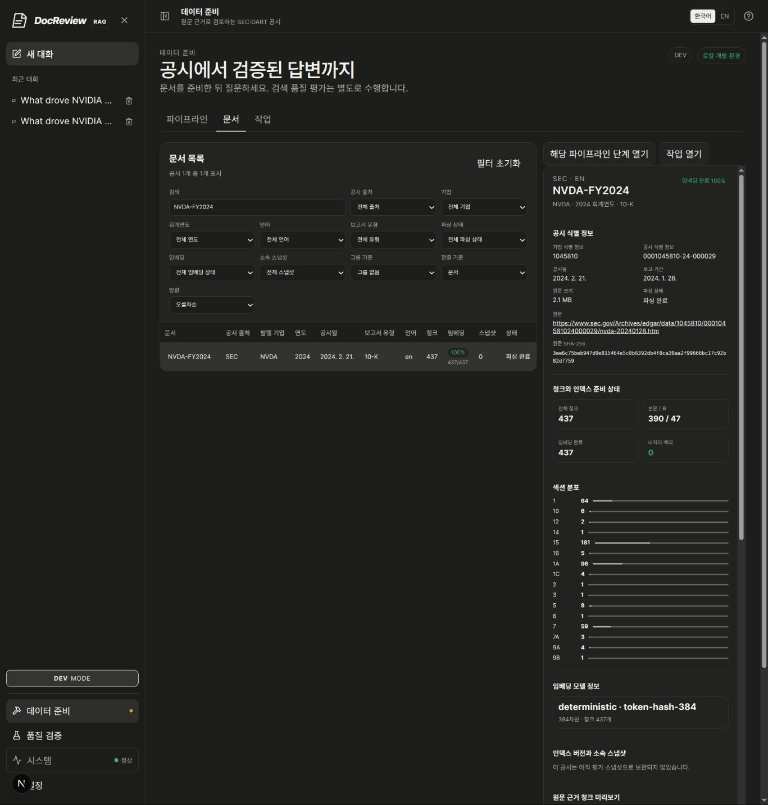

*문서 검색에 NVDA-FY2024를 넣고 행을 누릅니다. 촬영된 437개 벡터의 정체성은 deterministic이며 OpenAI 실습 준비 여부는 5단계에서 따로 확인합니다.*

## 3. NVIDIA 원문 수집하기

**목적:** SEC에서 실제 공시 원문을 받습니다. 이 단계는 아직 DB 적재가 아닙니다.

**화면에서 할 일:** 데이터 준비 → 파이프라인 → **원문 수집**을 선택하고 실행 패널에 펼쳐진 `변경…` 입력란에 아래 값을 입력합니다.

| 입력 | 값 |
|---|---|
| 공시 출처 | SEC EDGAR |
| Tickers / stock codes | `NVDA` |
| Fiscal years | `2024` |

회사명이나 코드로 보유 회사를 검색해 선택하거나 새 티커를 입력하고 Enter를 누릅니다. DART는
6자리 종목코드를 입력합니다. 연도도 선택한 칩으로 표시되며 개별 삭제할 수 있습니다. `2023-2025`처럼
범위를 입력할 수도 있지만 이 실습에서는 NVDA와 2024만 남깁니다.

**누락된 원문 다운로드**를 누릅니다. 데이터 준비 → **작업**에서 작업 상태와 메시지를 확인하고,
`succeeded`가 되면 파이프라인으로 돌아와 새로고침합니다. `.env`에는 실제 SEC 연락처가 필요합니다.

**처리 범위:** 웹은 기본 `manifest.json`을 사용합니다. 연도 입력은 발견할 범위를 지정하며,
그 manifest에 이미 들어 있는 NVDA의 다른 연도 원문도 미다운로드 상태라면 함께 받을 수 있습니다.
따라서 `2024` 입력을 다운로드 한 건 제한으로 해석하지 않습니다. 정확히 FY2024 한 건만 받으려면
[CLI의 한 건 수집 예제](cli.md#nvidia-한-건만-준비하기)를 사용하고 여기서는 결과만 확인합니다.

**화면 확인:** 작업의 성공 메시지와 받은 보고서 수, 파이프라인의 원문 준비 상태를 확인합니다.
기본 manifest에 다른 회사의 미수집 원문이 남아 있으면 원문 수집 전체가 완료로 표시되지 않을 수 있습니다.

**완료 조건:** 다음 단계에서 DB 적재할 manifest의 원문이 모두 존재해야 합니다.
CLI 수집도 원문과 manifest를 준비하는 같은 단계이며 DB 저장은 다음 DB 적재가 담당합니다.

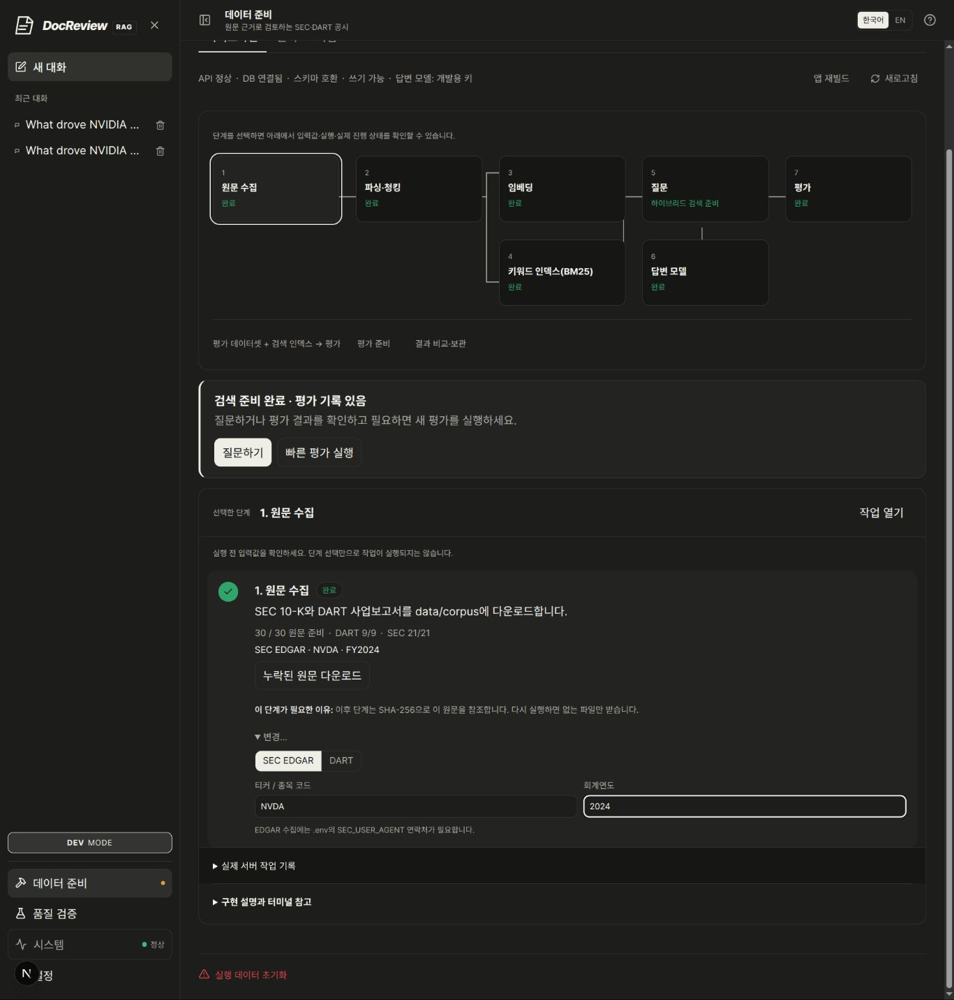

*원문 수집 → 변경…. 입력값을 구성한 화면이며 촬영을 위해 다운로드를 실행하지 않았습니다.*

## 4. 원문을 문서와 청크로 저장하기

**목적:** 받은 원문을 파싱·청킹하고 DB에 저장합니다.

**실행 전:** 개발 서비스와 schema가 정상이어야 합니다. DB 적재할 manifest의 목록과 원문 수를
먼저 확인합니다. 기본 `manifest.json`에는 NVDA 외 기업도 들어 있으므로, NVDA만 받은 상태에서
그 전체를 DB 적재하지 않습니다.

기본 실습에서는 [한 건 manifest 준비](cli.md#nvidia-한-건만-준비하기)의 짧은 Python 코드로
`tutorial-manifest.json`을 만듭니다. 이 코드는 목록만 추출하며 원문 다운로드나 DB 적재를
실행하지 않습니다. 웹에서 원문을 이미 받았다면 해당 절의 다운로드 명령은 건너뜁니다.

**화면에서 할 일:** 파이프라인에서 **새로고침**한 뒤 **파싱·청킹** → `변경…`를 엽니다.
`tutorial-manifest.json` 행의 문서 수와 원문 준비 수를 확인하고 그 행의 **DB 적재**를 누릅니다.
**전체 매니페스트 DB 적재**는 유효한 manifest 전체를 처리하므로 이 한 건 실습에서는 사용하지 않습니다.

데이터 준비 → **작업**에서 `succeeded`를 확인하고 **문서**를 엽니다.

**화면 확인:** `NVDA-FY2024`와 0보다 큰 청크 수가 보여야 합니다. 성공 메시지의 문서 수는
선택한 manifest 범위이고, 전체 DB에는 기존 문서가 함께 남을 수 있습니다.

**완료 조건:** 문서·청크가 저장되면 embedding을 준비합니다. DB 적재는 BM25 통계도 재계산하지만
OpenAI embedding까지 채우지는 않습니다. CLI의 `app.cli ingest --manifest …`도 이 저장 단계를
수행하며, CLI에서 완료했다면 DB 적재를 다시 누르지 않습니다.

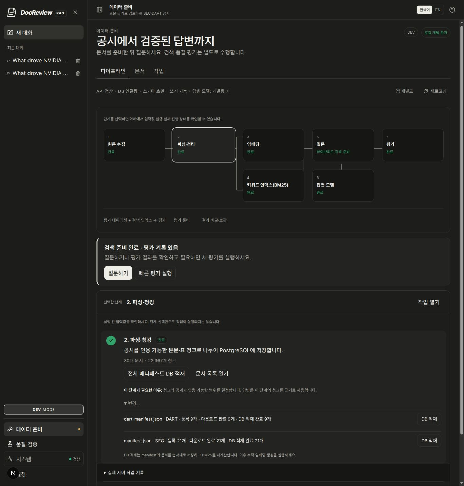

*파싱·청킹 → 변경…. 이 환경에는 기본 manifest 두 개가 있습니다. 한 건 실습에서는 tutorial-manifest.json을 만든 뒤 같은 위치의 해당 행을 선택합니다. 전체 매니페스트 DB 적재와 구분하세요.*

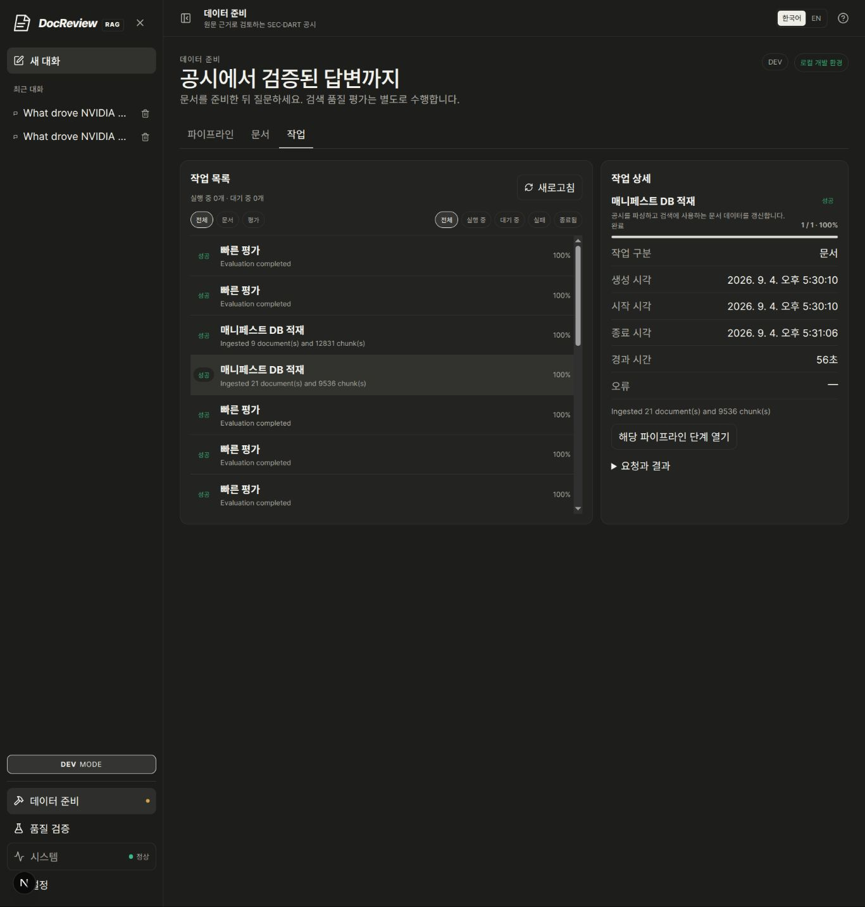

*작업 목록에서 기존 SEC 21건 DB 적재를 선택한 예입니다. 실습의 한 건 작업과 처리 규모가 다릅니다. 성공 여부와 실제 결과 메시지를 함께 읽습니다.*

## 5. Embedding과 BM25 준비하기

**목적:** 의미 검색과 키워드 검색을 사용할 수 있게 만듭니다.

**실행 전 — OpenAI 유료 호출:** `.env`의 provider가 `openai`이고 개발용 키가 유효해야 합니다.
현재 설정의 embedding은 `text-embedding-3-large`·384차원입니다. 파이프라인에서 provider와
pending 수를 먼저 확인합니다. 이 작업은 **DB 전체의 누락·불일치 embedding**을 처리하며
선택한 문서 한 건으로 제한되지 않습니다. 이미 준비됐다면 건너뜁니다.

**화면에서 할 일:** 데이터 준비 → 파이프라인 → **누락 임베딩 생성**을 누릅니다.
작업의 `succeeded`를 확인하고 파이프라인을 새로고침해 pending이 0인지 확인합니다.

이어서 `Lexical index (BM25)`를 봅니다. 이미 ready이면 재사용합니다. 미준비 상태일 때만
**BM25 재계산**을 누르고 성공 후 새로고침합니다. BM25 통계 재계산은 OpenAI를 호출하지 않습니다.

**화면 확인:** 현재 provider의 준비된 embedding 수, pending 0, BM25 ready가 보여야 합니다.
정상 연결과 검색 준비는 별개이고, 이 상태도 품질 평가 완료를 뜻하지는 않습니다.

**완료 조건:** 현재 OpenAI embedding과 BM25가 준비되면 검색을 확인합니다.
CLI의 `retrieve --provider openai --embed-missing …`도 embedding을 채우지만 이어서 검색까지
수행합니다. 웹 Backfill 버튼은 embedding 작업만 수행합니다.

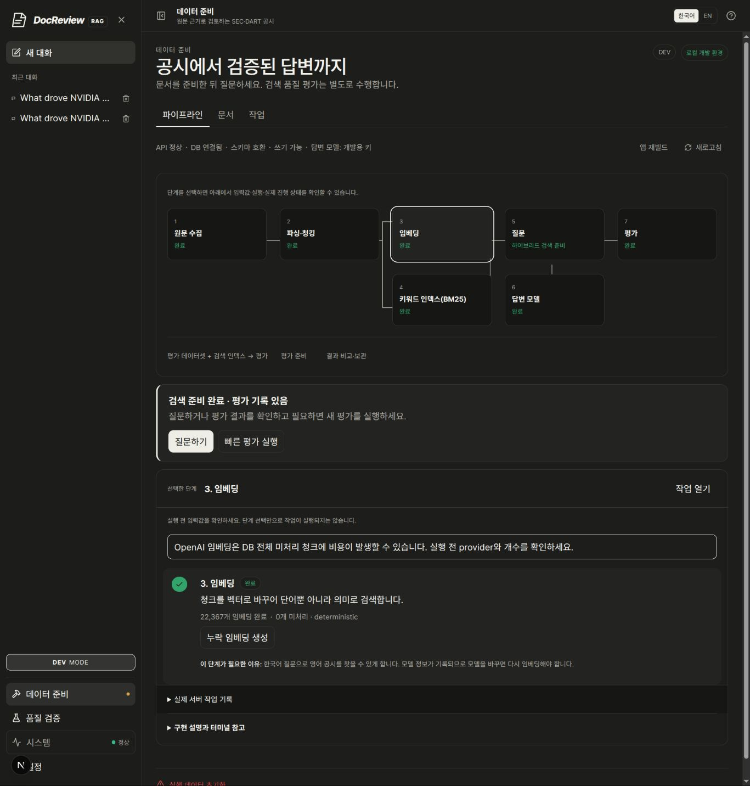

*촬영 환경은 deterministic·미처리 0입니다. 이 값을 OpenAI 준비 완료로 보지 않습니다. OpenAI 설정을 반영한 뒤 현재 provider와 미처리 수를 확인하고 필요한 경우에만 실행합니다.*

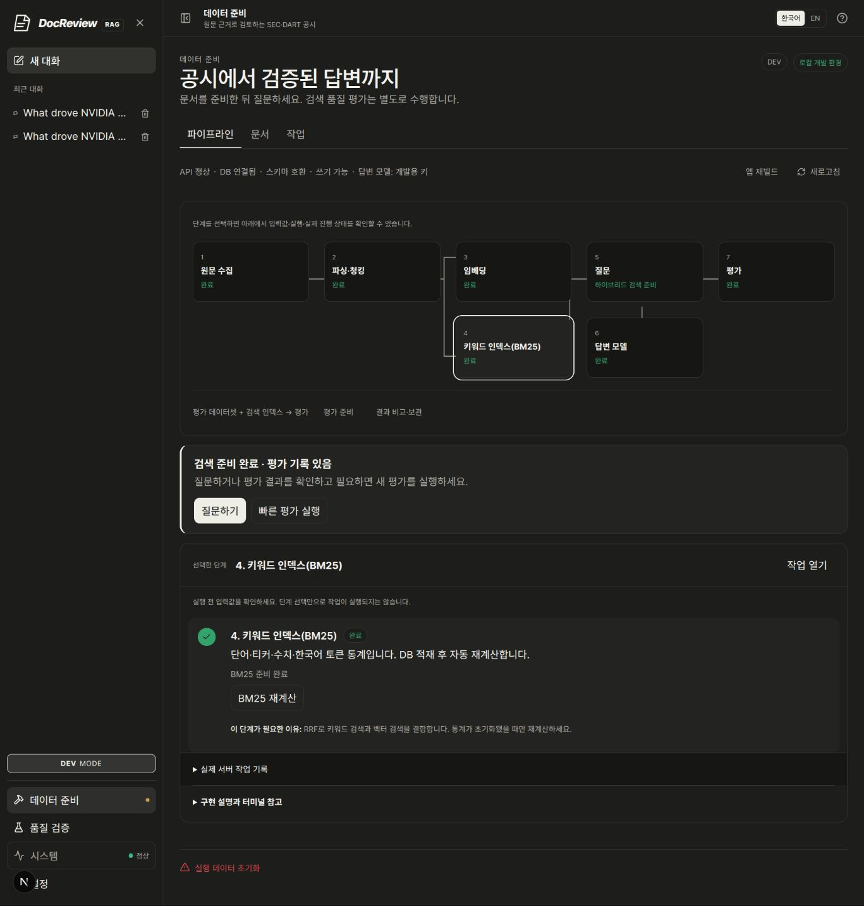

*키워드 인덱스(BM25) 노드에서 준비 상태를 확인합니다. 준비 완료라면 재계산을 반복하지 않습니다.*

## 6. 답변 전에 검색 근거 읽기

**목적:** 답변 모델을 호출하기 전에 관련 공시가 검색되는지 확인합니다.

**화면에서 할 일:** 품질 검증 → **검색 테스트**를 엽니다. Question에 다음 질문을 입력합니다.

```text
What drove NVIDIA data center revenue growth in fiscal 2024?
```

검색 설정에서 검색 방식 **하이브리드 검색**, 어휘 순위 방식 **BM25**, `k` **5**, 리랭킹 **없음**을
선택하고 **검색 근거 확인**을 누릅니다. **OpenAI 질의 embedding 비용이 발생합니다.**
검색 준비를 다시 수행할 필요는 없습니다.

**화면 확인:** Component rankings와 검색 결과에서 문서 식별자, 발췌, 순위를 확인합니다.
NVIDIA 데이터센터 매출 증가와 관련된 원문이 실제로 검색되는지 읽습니다.

**완료 조건:** 질문에 관련된 근거를 찾으면 대화창으로 이동합니다. 이 화면의
**답변 미리보기**는 별도 답변 모델 호출이므로 검색만 확인할 때는 누르지 않습니다.

CLI의 `app.cli retrieve`도 검색 근거를 반환합니다. 다만 검색 테스트에는 CLI의 `--doc-id`와
같은 문서 필터 입력이 없고 화면의 profile을 사용하므로, 기존 문서와 설정에 따라 결과가 달라질 수 있습니다.

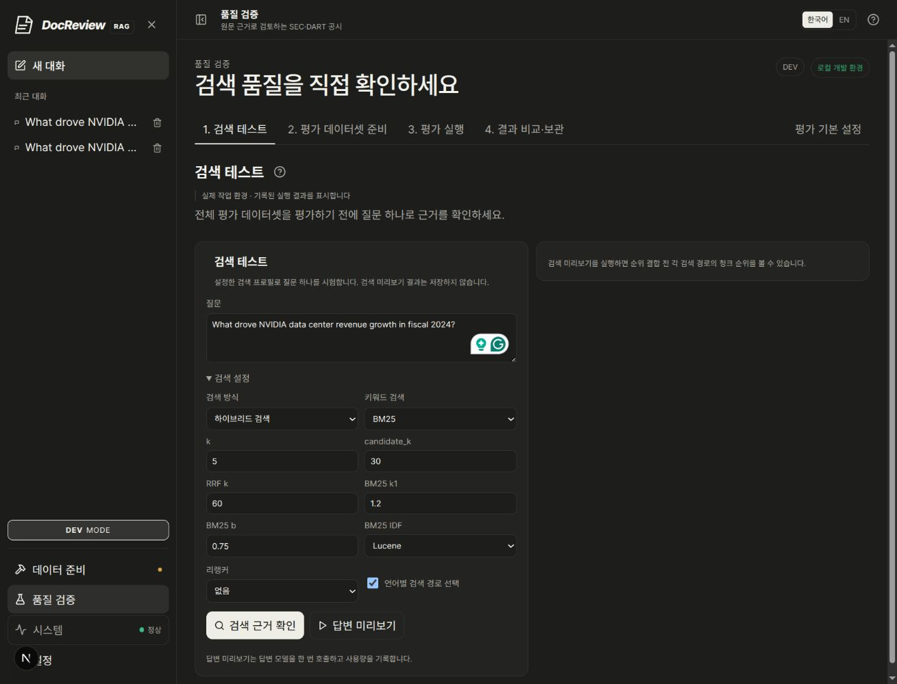

*검색 테스트의 실행 전 입력 화면입니다. 오른쪽은 결과를 아직 실행하지 않은 상태입니다. 검색 근거 확인과 답변 미리보기는 별도 동작입니다.*

## 7. 답변 설정과 첫 질문

**목적:** 원하는 공시 범위로 질문하고 실제 인용 답변을 확인합니다.

**화면에서 할 일:** 대화창으로 돌아가 새 대화를 엽니다. 입력창 위 답변 엔진을 **OpenAI**로
확인하고 문서 범위·필터에서 SEC와 NVIDIA FY2024 범위를 설정합니다. 현재 저장소의 OpenAI
답변 모델은 `gpt-5.6-terra`입니다. 다음 질문을 전송합니다.

```text
NVIDIA FY2024의 데이터센터 매출은 무엇 때문에 증가했나요? 해당 공시의 근거를 인용해 주세요.
```

전송 전에 **설정 상세 / 요청 미리보기**를 누릅니다. 데스크톱에서는 오른쪽 패널, 모바일에서는
전체 화면 대화상자로 열립니다. 여기서 균형·한국어·정확도·사용자 지정 프리셋을 비교합니다.
표시된 차이는 실제 적용될 검색 설정에서 계산됩니다. 필터·프롬프트 구성·요청 payload도 확인할 수 있습니다.
검색 근거는 실행을 시작한 뒤 선택되므로 미리보기에는 아직 없습니다. 완료한 결과에서는 수집된 경우
서버가 실제 적용한 설정을 확인할 수 있습니다. 공시 범위와 프리셋 옆 ? 도움말은 마우스를 올리거나
키보드로 포커스를 두거나 터치해 읽습니다. 사용자 지정을 선택하면 검색 설정 편집기가 열립니다.
대화 필터는 선택한 SEC/DART 범위의 실제 회사·언어·보고서 유형·회계연도를 제안합니다. 선택하지 않은
항목은 제한하지 않습니다. 자동 범위에서는 진행 화면의 **서버가 확정한 검색 범위**를 보고 실제로 선택된
공시 출처·회사 코드·연도를 확인하세요. 서버 이벤트가 오기 전에는 범위가 확정된 것으로 표시하지 않습니다.

**질문 전송은 embedding·번역·답변 등 유료 호출을 시작할 수 있습니다.** 실행 중에는 이번 요청이
끝날 때까지 기다립니다. 답변 문구는 매번 같지 않습니다.

**화면 확인:** 답변과 인용 카드를 열어 문서 식별자·보고연도·원문 발췌를 확인합니다.
`SUPPORTED` 표시만 보지 말고 매출 증가 원인이 실제 발췌문에 있는지 읽습니다.
**실행 요약**에서는 다음 다섯 단계의 실제 진행을 확인합니다.

| 단계 | 확인하는 일 |
|---|---|
| 1. 질문 의도 확인 | 질문 의도와 공시 범위를 결정합니다. |
| 2. 근거 검색 | 준비된 문서에서 후보 근거를 가져옵니다. |
| 3. 관련 근거 선택 | 후보가 질문을 뒷받침하는지 평가합니다. |
| 4. 답변·인용 검증 | 답변의 주장과 인용을 원문에 대조합니다. |
| 5. 결과 준비 | 검증된 결과를 전달합니다. |

초록색 완료 표시는 서버 이벤트로 실제 수행이 확인된 단계에만 붙습니다. 서버 응답 전에는 대기하며,
실행하지 않은 단계는 완료로 채우지 않습니다. 이전 단계로 되돌아가면 뒤 단계 표시는 다시 대기 상태가 됩니다.
일상 대화는 검색 단계 목록을 사용하지 않습니다. **요청 중단**은 현재 요청을 중단하고,
**실행 트레이스**는 실행 ID·사용량·실패 종류를 보여줍니다. 실행 완료와 근거가 충분하다는 판정은 별개입니다.

**실행 성능**은 브라우저 요청 시간과 서버 실행 시간을 구분하고, 기록된 단계별 시간·모델 호출·시도 횟수·
provider 토큰 수를 보여 줍니다. 로컬 provider가 시간을 반환하면 모델 로딩·입력 처리·생성 시간과
초당 생성 토큰 수도 따로 표시합니다. CPU/GPU 배치를 비롯해 수집하지 못한 값은 **미수집**으로
남깁니다. 실제 이벤트로 현재 단계와 경과 시간을 표시하며, 예상 완료 시간은 만들지 않습니다.
이전 저장 기록에는 새 측정값이 없을 수 있습니다. 이 가이드에서는 Gemma를 실제 호출해 성능을 측정하지 않았습니다.

**완료 조건:** NVIDIA 근거가 답변을 뒷받침하고 실행 실패가 없으면 첫 실습 완료입니다.
`NOT_IN_DOCS`는 문서 근거가 부족하다는 결과이고, 연결·provider 실패와는 다릅니다.
CLI 검색 결과는 답변 생성 완료를 뜻하지 않습니다.

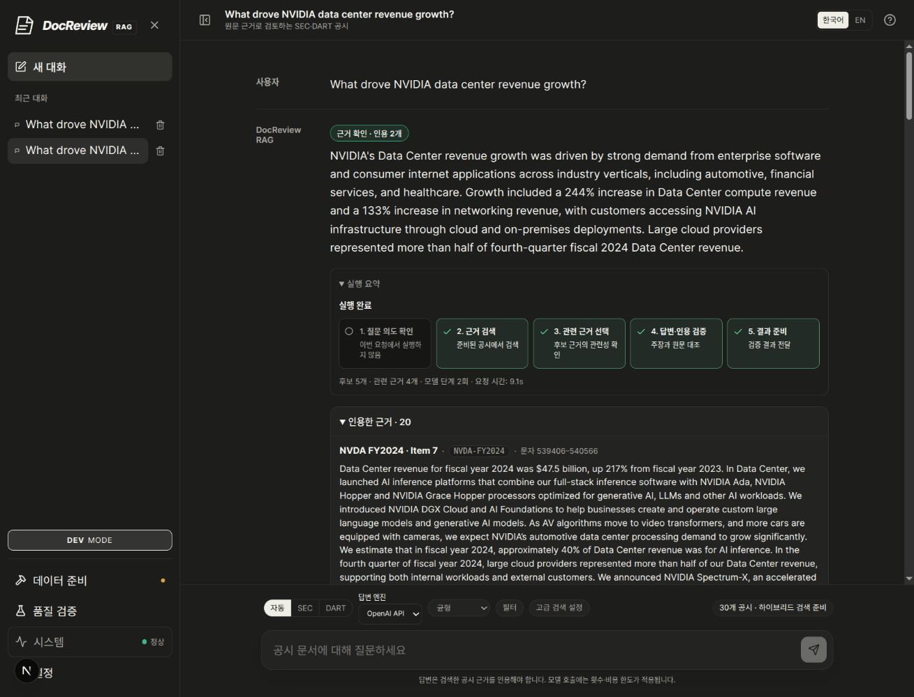

*기존 영어 질문의 실제 저장된 답변을 열었습니다. 이 실습의 새 질문을 전송한 결과는 아니며, 답변 문구·인용 범위는 질문과 설정에 따라 달라집니다. 문서 ID와 연도·원문을 직접 대조하세요. 실행 요약은 이 기록에서 실제 수행된 단계만 초록색으로 표시합니다.*

## 8. 설정을 바꾸며 확인하기

### Ollama로 답변 엔진 바꾸기

**목적:** 검색 준비를 유지하면서 로컬 모델의 답변을 확인합니다.

**실행 전:** Ollama는 별도로 실행하는 서버입니다. [로컬 모델 진단](cli.md#로컬-모델-연결-진단)으로
접속 가능 여부를 먼저 확인합니다. 검색 embedding은 계속 OpenAI이므로 완전한 무료·오프라인 경로가 아닙니다.

**화면에서 할 일:** 설정 → **로컬 LLM**에서 서버 주소를 확인하고 **연결 및 저장**을
누릅니다. Docker 앱에서 같은 PC의 Ollama에 연결하는 기본 주소는 `http://host.docker.internal:11434`입니다.
Ollama 주소에 `/v1`을 붙이지 않습니다. 연결 후 대화창에서 답변 엔진을 **로컬 LLM**으로
바꾸고 발견된 답변용 Local model을 선택합니다.

**화면 확인:** 연결 상태·발견된 모델·선택한 엔진을 확인합니다. 엔진은 연결 저장만으로 자동 전환되지 않습니다.
동일 질문을 보내 인용을 비교합니다. 연결 성공이 답변 품질을 보장하지는 않습니다.

**완료 조건:** 실제 인용까지 확인합니다. 연결 해제는 비활성 상태를 저장하고,
기본 설정으로 복원은 초기 주소를 다시 사용합니다. 자세한 차이는
[연결 설정 정리](cli.md#로컬-연결-설정-초기화-또는-삭제)에 있습니다.

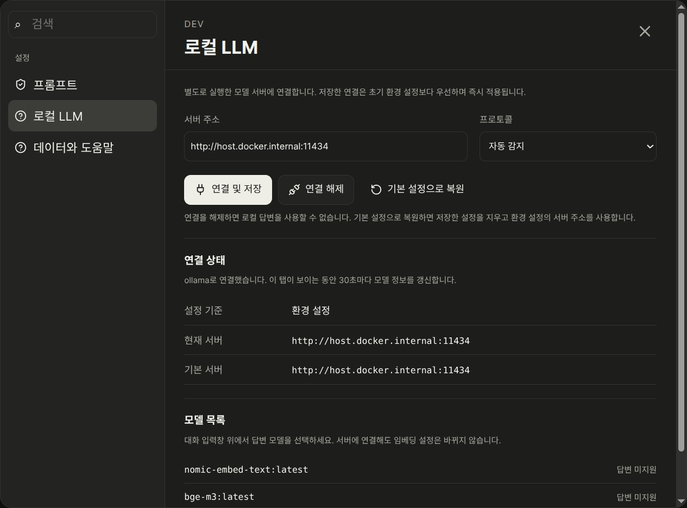

*설정 → 로컬 LLM. 연결 상태를 읽은 화면이며 연결 저장값을 변경하지 않았습니다. 임베딩 전용 모델은 답변에 사용 불가로 구분됩니다.*

### DART 보고서 추가하기

**목적:** 한국어 사업보고서로 검색 범위를 넓힙니다.

**실행 전:** `.env`에 실제 `DART_API_KEY`를 넣고 `rag-dev up -d`로 앱 설정을 반영합니다.
기존 DART 데이터가 준비돼 있다면 재사용합니다.

**화면에서 할 일:** 데이터 준비 → 파이프라인 → 원문 수집 → `변경…`에서 공시 출처 **DART**,
Tickers / stock codes `005930`, Fiscal years `2024`를 입력하고 **누락된 원문 다운로드**를
누릅니다. 성공 후 새로고침하고 파싱·청킹 → `변경…`에서 `dart-manifest.json` 행의
문서·원문 수를 확인한 뒤 **DB 적재**를 실행합니다. 이 행은 기존 항목을 포함한 manifest 전체를 처리합니다.

**화면 확인:** 작업의 성공과 문서의 삼성전자 FY2024를 확인합니다. 이후 pending을 확인해
필요한 **유료** 누락 임베딩 생성을 수행하고 BM25 상태를 확인합니다.

**완료 조건:** 대상 문서와 검색 준비가 완료되면 회사·연도를 명시한 한국어 질문으로 인용을 확인합니다.
CLI에서도 DART 수집 후 매니페스트 DB 적재, embedding 준비 순서는 같습니다.

### 빠른 평가 실행하기

**목적:** 현재 검색 인덱스를 정답 근거가 있는 질문 묶음으로 평가합니다.

품질 검증은 **1. 검색 테스트 → 2. 평가 데이터셋 준비 → 3. 평가 실행 → 4. 결과 비교·보관** 순서입니다.
질문 하나의 근거를 먼저 읽고, 정답 범위를 확인한 뒤 같은 조건으로 평가·비교합니다.
Recall@k·적중률·MRR은 검색 품질 지표입니다. 최종 답변의 사실성을 증명하는 점수가 아닙니다.

**실행 전:** 품질 검증 → **평가 데이터셋 준비**에서 선택할 suite의 질문과 원문 준비 상태를 확인합니다.
한 건만 준비한 DB로 다른 회사까지 포함한 suite의 전체 품질을 판단하지 않습니다.
필요한 원문·청크·embedding이 준비된 suite에만 실행합니다.

**화면에서 할 일:** 품질 검증 → **평가 실행**에서 먼저 평가 목록을 봅니다. **새 평가**를 누르면
열리는 설정 창에서 suite·리비전을 고르고, 고급 평가 옵션의 **빠른 평가 · 현재 인덱스**를 선택한 뒤
**평가 실행**을 누릅니다. 대기 작업이 목록에 추가되면 행을 열어 실제 진행과 설정을 확인합니다.
질문 embedding 등 **유료 호출이 발생할 수 있습니다.** `succeeded`가 되면 결과 상세의 지표와 문항을 봅니다.
결과 상세에서 스냅샷 이름을 입력하고 **결과를 스냅샷으로 저장**하면 현재 검색 데이터와 결과를 보관합니다.
저장한 스냅샷을 공개하는 게시는 별도 동작입니다.

**화면 확인:** 선택한 suite, 성공한 결과, hit/miss와 근거 순위를 확인합니다.

**완료 조건:** 평가 범위가 corpus와 일치하고 결과를 읽었으면 **결과 비교·보관**으로 이동합니다.
기준과 후보를 선택하면 같은 suite·정답 버전·corpus·k 조건에서 검색 지표 차이를 확인할 수 있습니다.
`예시 보기`는 설명용이며 실제 실행 결과가 아닙니다. 스냅샷은 현재 검색 데이터와 평가 결과를 고정해
나중에 다시 쓰는 기능입니다. 평가 기본 설정은 다음 새 평가에 적용되고 기존 결과를 바꾸지 않습니다.

새 SEC suite는 `sec-en_v2_astra`, `sec-ko_v2_astra`, `sec-mixed_v2_astra`입니다. 각 20문항을
같은 원문 근거를 영어·한국어·한영 혼합 질문으로 확인할 수 있습니다. 언어별 성능을 비교할 때는
질문에 명시된 회사·회계연도·범위까지 같은지 확인하세요. 범위 단서가 다르면 언어만의 효과로 해석할 수 없습니다. 모두 자동 큐레이션 상태이며 사람의
승인을 받았다는 뜻은 아닙니다. 질문 행을 누르면 상세를 읽을 수 있습니다. **원본 JSON · 읽기 전용**은
canonical 데이터 확인용이며 편집기가 아닙니다. 질문을 바꾸려면 편집용 초안을 만들어 저장·검증·게시합니다.
게시된 리비전은 수정할 수 없으며, 리비전 선택으로 원본 JSON이 편집 가능해지지 않습니다. 실행하지 않은 평가는 완료로 표시하지 않습니다.

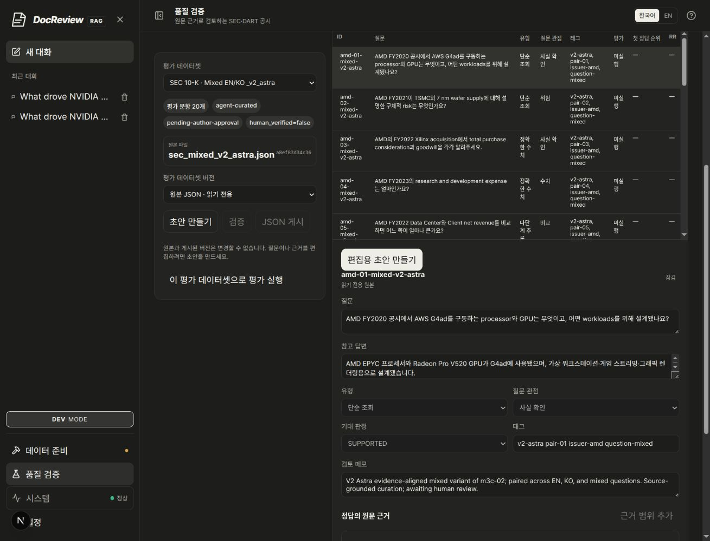

*평가 데이터셋 준비에서 질문 행을 누르면 질문·참고 답변·분류를 읽을 수 있습니다. 편집은 초안 만들기부터 시작하며, 촬영 중 초안을 생성하거나 게시하지 않았습니다.*

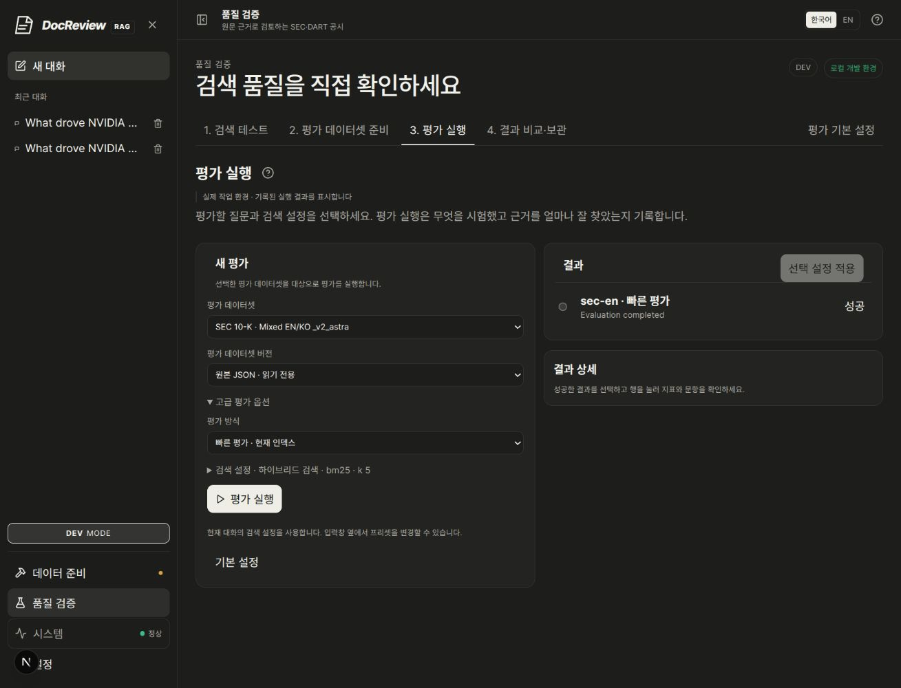

*평가 목록에서 새 평가를 열어 실행 전 설정을 확인합니다. 기존 결과가 보이더라도 방금 선택한 suite의 평가를 실행했다는 뜻은 아닙니다.*

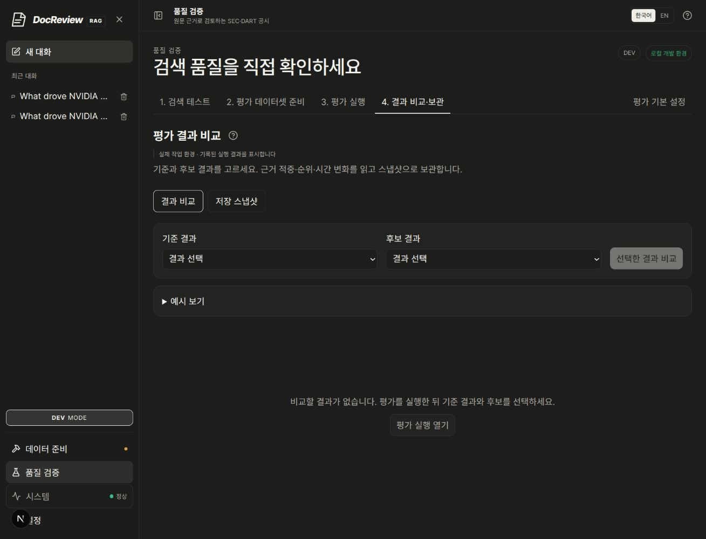

*결과 비교는 비교 가능한 서로 다른 결과 두 개가 필요합니다. 촬영 시에는 결과가 하나뿐이므로 비교를 실행하지 않았고, 설명용 예시를 실제 결과로 섞지 않았습니다.*

### 필요한 도움말 찾기

도움말의 **전체 도움말 검색**에서 키워드를 입력하고 필요하면 **도움말 섹션**으로 범위를 좁힙니다.
**추천**에는 현재 화면에서 보이는 조작 항목의 도움말이 나옵니다. 다른 작업 화면의 검색 결과에서는
해당 화면으로 이동할 수 있습니다. 도움말 검색은 로컬 내용을 조회하며 답변 모델을 호출하지 않습니다.

## 9. 종료하고 다음 실습으로 이어가기

**목적:** 결과를 보존한 채 서비스를 종료합니다.

```bash
rag-dev down
```

**화면 확인:** 다음에 `rag-dev up -d`로 다시 열면 문서와 브라우저 대화가 남아 있어야 합니다.
준비된 원문과 embedding을 다시 만들지 않습니다. 필요하다면
[로컬 prod 미리보기](cli.md#dev와-prod-미리보기)를 확인합니다.

삭제는 필수 단계가 아닙니다. [종료와 선택적 데이터 삭제](cli.md#종료와-선택적-데이터-삭제)에서
브라우저 대화, DB 볼륨, 원문, 연결 설정의 범위를 각각 확인합니다.

**완료 조건:** 실습 결과와 막힌 단계를 정리해 피드백을 남깁니다. 화면이나 동작이 바뀌면 해당 캡처와 설명을 함께 갱신합니다. 키나 개인 정보가 화면에 드러나지 않게 확인하세요.

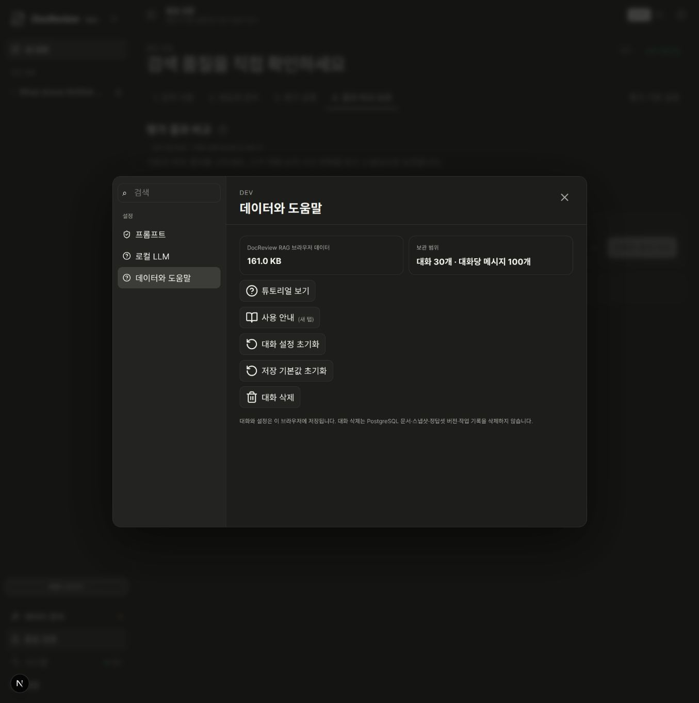

*데이터와 도움말의 대화 삭제는 브라우저 대화 범위입니다. DB·원문·연결 설정의 삭제와 구분하며 촬영 중에는 삭제 버튼을 누르지 않았습니다.*

## 전체 초기화가 필요할 때

파이프라인 헤더 왼쪽 위의 빨간 **실행 데이터 초기화** 버튼과 펼침 화살표를 엽니다. 로컬 dev의
인증된 작업 서비스가 있어야 합니다. 사용 가능 여부는 삭제 미리보기와 같은 파일·실행 중 작업 조건을
점검하며 **마지막 점검** 시각을 보여 줍니다. 차단되면 진단·경로·권한 상세와 필요한 수동 조치 명령을
확인합니다. 점검만으로 파일 소유권이나 권한을 바꾸지 않습니다. 표시된 ACL 명령도 소유자와 필요한
범위를 확인한 뒤 직접 적용하고, 원인을 해결한 후 다시 점검합니다.

실행 중인 작업을 먼저 끝내고 **실행 데이터 전체 삭제**를 누르면 마지막 삭제 질문을 엽니다.
미리보기에 실제 DB 볼륨·테이블·파일과 보존 대상을 표시합니다. **취소**로 닫으면 삭제하지 않습니다.
**자동 백업하지 않으며 복구할 수 없습니다.** `WIPE <프로젝트명>`을 정확히 입력하고 마지막 버튼을
눌러야 실행합니다. DB·원문·평가 산출물·저장 연결을 삭제한 뒤 브라우저의 DocReview 데이터도
비우고 다시 시작합니다. 코드·키·.env·문서·이미지·manifest/golden/profile 원본은 보존합니다.
대상이 바뀌거나 외부 DB이면 실행을 거부합니다. 실패 시 완료된 단계와 남은 단계를 먼저 확인하세요.
실습을 시작하기 위해 이 기능을 실행할 필요는 없습니다.

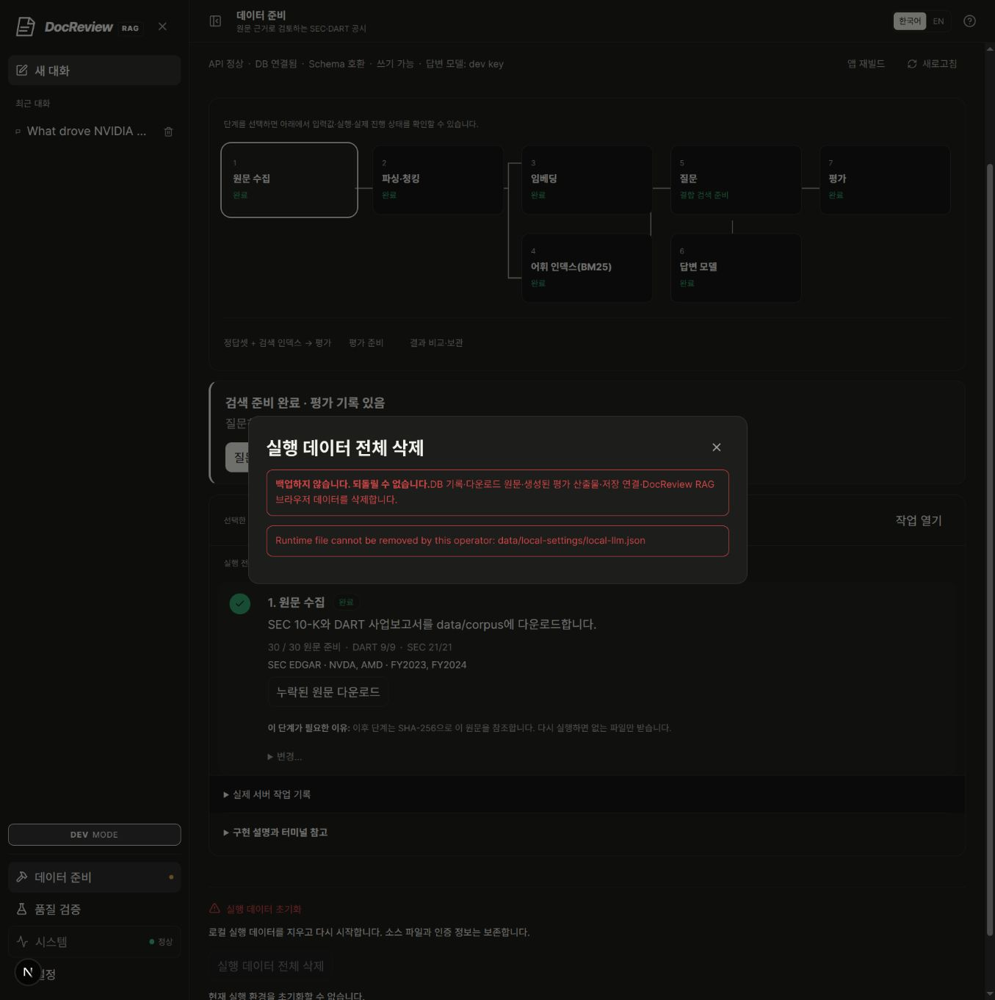

*삭제 전 미리보기에서 local-llm.json을 operator가 제거할 수 없어 차단된 실제 사례입니다. 이런 경우 확인 문구 입력 단계로 넘어가지 않습니다. 파일 소유권·권한을 먼저 점검하며, 촬영 중 권한 변경이나 삭제는 하지 않았습니다.*
