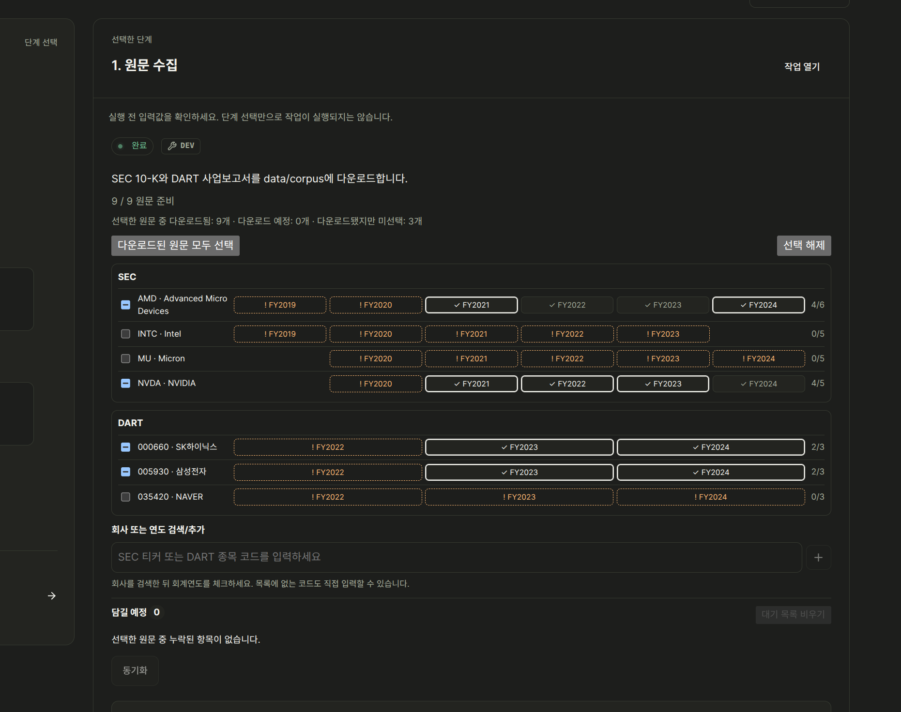
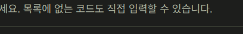
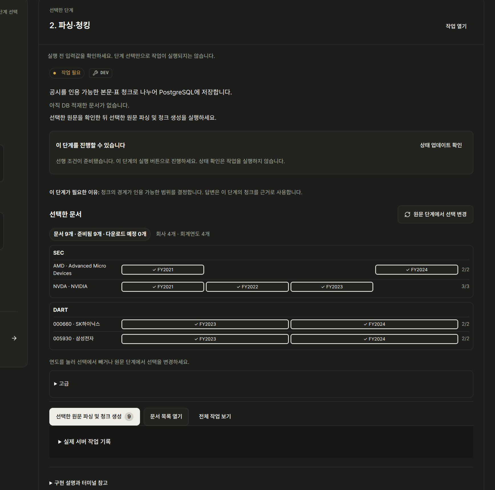
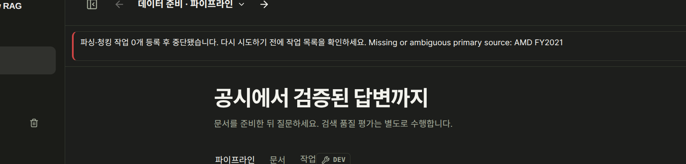
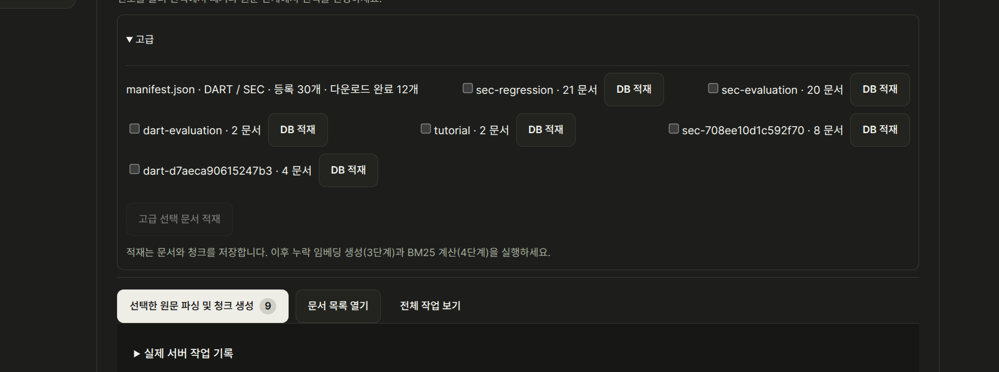

# Issue #191: user-supplied screenshots

Source: user report received 2026-09-08; Korean locale, dark theme. These are unedited user captures, not fresh moderator reproductions. The exact running bundle SHA is unknown. Related source inspection used `ce0993a4aa7df81fe949739791ad35bbcdb100ea`.

## Image 1

Build step 1 after manual selection: source availability, companies and fiscal years.

## Image 2

Company search guidance invites codes outside the supported list.

## Image 3

Build step 2 shows the selected documents and remove-only year controls.

## Image 4

Parsing stops after zero queued jobs: Missing or ambiguous primary source: AMD FY2021.

## Image 5

The Advanced section exposes manifest/evaluation/tutorial ingestion selections.

