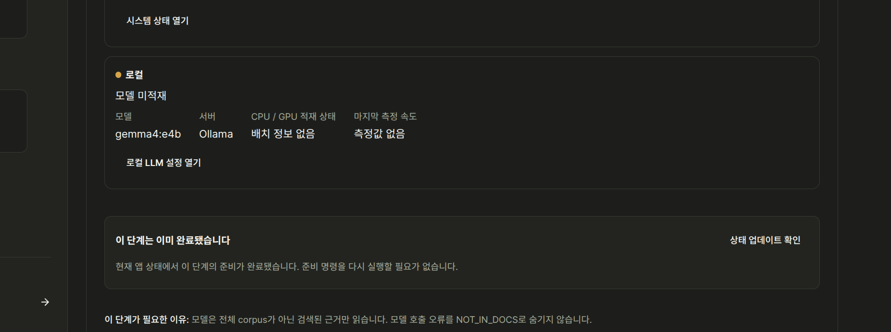
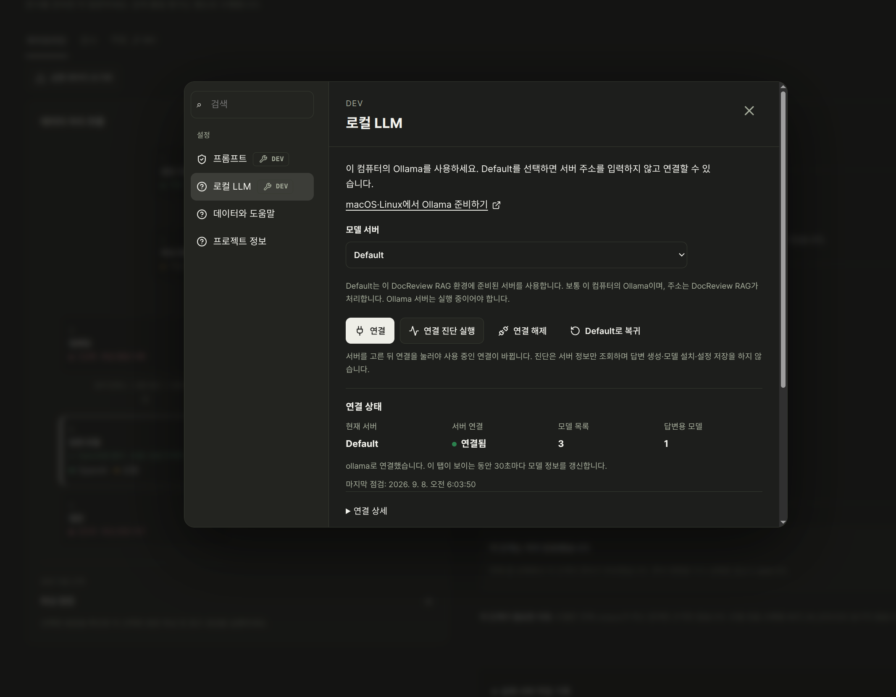
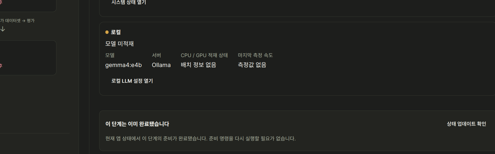

# Issue #192: user-supplied screenshots

Source: user report received 2026-09-08; Korean locale, dark theme. These are unedited user captures, not fresh moderator reproductions. The exact running bundle SHA is unknown. Related source inspection used `ce0993a4aa7df81fe949739791ad35bbcdb100ea`.

## Image 6

Build shows gemma4:e4b unloaded, unknown placement and no speed measurement.

## Image 7

Local LLM settings show Default connected, three detected models and one answer model.

## Image 8

The unloaded local-model row appears alongside the overall completed-stage notice.

